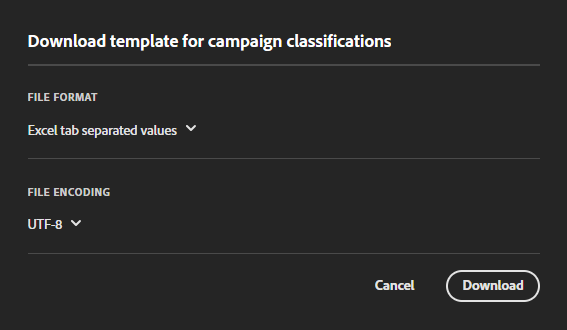

# Impostazioni del set di classificazione

Configura un set di classificazione, carica o scarica dati.

>[!NOTE]
>
>Questa funzione sarà disponibile per tutti i clienti che hanno eseguito la migrazione delle suite di rapporti alla nuova architettura Classificazioni. Per ulteriori informazioni, contatta l’Assistenza clienti Adobe o il tuo Account Manager.

**[!UICONTROL Components]** > **[!UICONTROL Classification sets]** > **[!UICONTROL Sets]** > Fai clic sul nome del set di classificazione desiderato

Quando si modifica un set di classificazione, sono disponibili due schede: **[!UICONTROL Schema]** e **[!UICONTROL Settings]**.

## Impostazioni

I seguenti campi sono disponibili nella scheda [!UICONTROL Settings] e possono essere modificati:

* **[!UICONTROL Name]**: nome del set di classificazione.
* **[!UICONTROL Description]**: descrizione del set di classificazione.
* **[!UICONTROL Owner name]**: nome del proprietario.
* **[!UICONTROL Owner email]**: indirizzo e-mail del proprietario.
* **[!UICONTROL Notify of issues]**: elenco di indirizzi e-mail delimitati da virgole a cui vengono notificati i problemi relativi a questo set di classificazione.
* **[!UICONTROL Tags]**: aggiungi uno o più tag ai set di classificazione selezionati, per organizzarli o raggrupparli in modo da facilitarne l’individuazione in futuro.

Altri campi sono disponibili a scopo informativo e non possono essere modificati:

* **[!UICONTROL Type]**: tipo di classificazione tra [!UICONTROL Primary] e [!UICONTROL Lookup]. Generalmente vengono utilizzate le classificazioni principali.
* **[!UICONTROL Subscriptions]**: suite di rapporti e variabile a cui si applica il set di classificazione. Al momento è supportata una sola suite di rapporti per un determinato set di classificazione; il supporto per più suite di rapporti è pianificato.

## Schema

Visualizza le dimensioni di classificazione attualmente configurate per l’abbonamento. Sono disponibili i seguenti pulsanti:

* **[!UICONTROL Upload]**: carica manualmente i dati di classificazione per una o più dimensioni di classificazione. Sono supportati i file JSON, CSV, TSV e TAB. Il caricamento di un file valido mostra un’anteprima della tabella dei dati da classificare.
   * **[!UICONTROL File encoding]**: seleziona il file encoding corretto utilizzando questo menu a discesa. Le opzioni valide includono [!UICONTROL UTF-8] e [!UICONTROL Latin1].
   * **[!UICONTROL List delimiter]**: seleziona il delimitatore elenco corretto. Se utilizzi un file scaricato o un file modello, assicurati che il [!UICONTROL List delimiter] qui corrisponda al [!UICONTROL List delimiter] di quando il file è stato scaricato.
   * **[!UICONTROL Apply]**: salva i dati di classificazione caricati nel set di classificazione.

   

* **[!UICONTROL Download]**: scarica i valori chiave e le relative colonne di classificazione.
   * **[!UICONTROL Rows]**: numero massimo di righe da includere nel file di download.
   * **[!UICONTROL Download rows received between]**: selettore data calendario che consente di filtrare i valori chiave in base a quando vengono visualizzati nel rapporto. Se un valore chiave non è stato compreso in questo intervallo di date, non viene visualizzato nel file scaricato.
   * **[!UICONTROL Data returned]**: elenco a discesa che consente di filtrare i valori chiave inclusi nel file scaricato in base ai dati di classificazione associati.
      * **[!UICONTROL All classified values]**: include righe in cui i dati di classificazione sono inclusi in almeno una colonna.
      * **[!UICONTROL All unclassified values]**: include righe in cui mancano i dati di classificazione in almeno una colonna.
   * **[!UICONTROL File format]**: elenco a discesa che determina il formato del file di download. Le opzioni includono [!UICONTROL JSON], [!UICONTROL Comma separated values] e [!UICONTROL Excel tab separated values].
   * **[!UICONTROL File encoding]**: elenco a discesa che determina la codifica del file. Le opzioni includono [!UICONTROL UTF-8] e [!UICONTROL Latin1]. Si consiglia UTF-8.
   * **[!UICONTROL List delimiters]**: elenco a discesa che determina il delimitatore di elenco che separa le colonne di classificazione su ogni riga.

   

* **[!UICONTROL Template]**: scarica un file modello. Questo file è simile al pulsante [!UICONTROL Download], ma non contiene dati di classificazione o valori chiave.
   * **[!UICONTROL File format]**: elenco a discesa che determina il formato del file modello. Le opzioni includono [!UICONTROL Comma separated values] e [!UICONTROL Excel tab separated values].
   * **[!UICONTROL File encoding]**: elenco a discesa che determina la codifica del file. Le opzioni includono [!UICONTROL UTF-8] e [!UICONTROL Latin1]. Si consiglia UTF-8.
   * **[!UICONTROL List delimiters]**: elenco a discesa che determina il delimitatore di elenco che separa le colonne di classificazione su ogni riga.
* **[!UICONTROL Job history]**: collegamento per [Gestione processo](job-manager.md), che mostra i processi solo per questo set di classificazione.

   
