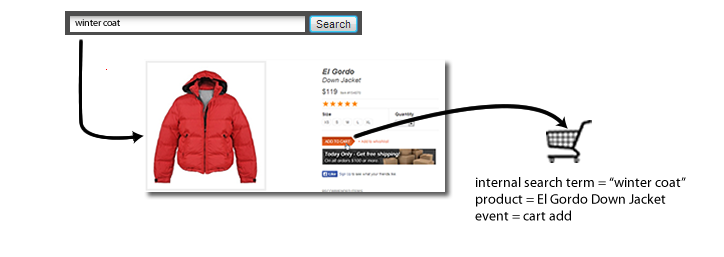

# eVar (Merchandising)

*Questa pagina della guida descrive il funzionamento delle eVar di merchandising come una dimensione. Per informazioni su come implementare le eVar di merchandising, vedi[eVar](/help/implement/vars/page-vars/evar.md)nella guida utente Implementa.*

Quando si misurano il successo di campagne esterne o termini di ricerca esterna, in genere si desidera che un singolo valore riceva credito per qualsiasi evento di successo che si verifica. Ad esempio, se un cliente fa clic su un collegamento in una campagna e-mail per visitare il sito Web, tutti gli acquisti effettuati di conseguenza devono essere accreditati su tale campagna.

Che dire degli eventi guidati dalla ricerca interna o dalla navigazione per categoria quando un cliente cerca più elementi? Ad esempio, un cliente cerca nel sito `"goggles"`, quindi aggiunge un paio al carrello:


Prima del checkout, il cliente cerca `"winter coat"`, quindi aggiunge una giacca giù al carrello:



Al termine dell&#39;acquisto, il visitatore disporrà di una ricerca interna `"winter coat"` accreditata con l&#39;acquisto di un paio di occhiali (supponendo che l&#39;eVar utilizzi l&#39;allocazione predefinita &quot;Più recente&quot;). Buono per `"winter coat"`, ma cattivo per le decisioni di marketing:

| Termine di ricerca interno | Ricavi |
|---|---|
| cappotto invernale | $157 |

## Come le variabili merchandising risolvono il problema

Le eVar di merchandising consentono di assegnare il valore corrente di un eVar a un prodotto al momento in cui si verifica un evento di successo. Questo valore rimane legato a tale prodotto, anche se successivamente vengono impostati uno o più nuovi valori per tale eVar.

Se per l&#39;eVar nell&#39;esempio precedente è attivato il merchandising, il termine di ricerca `"goggles"` è legato agli occhialini della neve e il termine di ricerca `"winter coat"` è legato alla giacca in giù. Le eVar di merchandising allocano le entrate a livello di prodotto, in modo che ogni termine riceva credito per l&#39;importo delle entrate per il prodotto a cui era associato il termine:

| Termine di ricerca interno | Ricavi |
|---|---|
| cappotto invernale | $119 |
| occhiali | $38 |

Consulta eVar di [merchandising](/help/implement/vars/page-vars/evar-merchandising.md) per le istruzioni di implementazione.

## Istanze sulle variabili merchandising

La metrica [Istanze](../metrics/instances.md) non è consigliata per l&#39;uso sulle variabili merchandising.

* Per le variabili merchandising che utilizzano la sintassi del prodotto, le istanze non vengono incrementate.
* Per le variabili merchandising che utilizzano la sintassi della variabile di conversione, le istanze vengono conteggiate ogni volta che viene impostata l&#39;eVar. Tuttavia, viene attribuito all’elemento della dimensione `"None"` a meno che non si verifichino tutte le seguenti situazioni sullo stesso hit:
   * L&#39;eVar di merchandising è impostato con un valore.
   * La `products` variabile viene definita con un valore.
   * È impostato un evento di binding.

```js
// This merchandising eVar uses conversion variable syntax, and counts an instance.
// However, if the binding event and products variable are not both set, the instance attributes to "None".
s.eVar1 = "Tower defense";

// This merchandising eVar uses product syntax, and does not count an instance.
s.products = "Games;Wizard tower;;;;eVar2=Tower defense";
```

Poiché la maggior parte dei casi d&#39;uso per la sintassi della variabile di conversione richiedono l&#39;eVar e la variabile products per hit diversi, l&#39;uso della metrica &#39;Istanze&#39; non è realistico.
