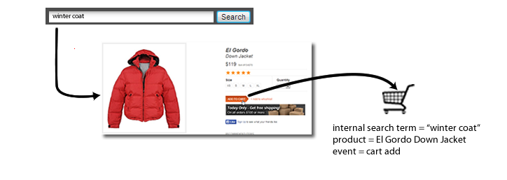

# eVar (merchandising)

>[!BEGINSHADEBOX]

*Questa pagina della guida descrive il funzionamento delle eVar di merchandising come [dimensione](overview.md). Per informazioni su come implementare le eVar di merchandising, vedi [eVar (variabile di merchandising)](/help/implement/vars/page-vars/evar-merchandising.md) nella guida utente per l&#39;implementazione.*

>[!ENDSHADEBOX]

Un’eVar di merchandising funziona come un eVar standard, con la differenza che ogni prodotto ne ha una propria copia. Persistenza, allocazione e scadenza funzionano tutte allo stesso modo, ma separatamente per ogni prodotto. Un eVar standard contiene un valore persistente per visitatore che riceve credito per ogni evento di successo. Un’eVar di merchandising detiene un valore persistente per prodotto e a tale valore viene attribuito il merito per gli eventi di successo di quel prodotto:

* Prodotto A → `eVar1` = `value A`
* Prodotto B → `eVar1` = `value B`

Il valore di ogni prodotto può essere impostato o modificato solo sugli hit che includono quel prodotto. Una volta impostato, il valore persiste fino alla scadenza e riceve credito solo per gli eventi di successo di quel prodotto. La modifica del valore del prodotto A non ha alcun effetto sul prodotto B.

Le eVar di merchandising funzionano solo con la variabile [`products`](/help/implement/vars/page-vars/products.md). Un valore eVar di merchandising non associato a un prodotto non riceve alcun credito. Gli eventi di successo sugli hit senza prodotti sono attribuiti a `"None"` per ogni eVar di merchandising.

>[!TIP]
>
>Per associare valori persistenti a una dimensione diversa dai prodotti, provare a utilizzare [[!UICONTROL Binding dimensions]](https://experienceleague.adobe.com/it/docs/analytics-platform/using/cja-dataviews/component-settings/persistence#binding-dimension) in Customer Journey Analytics.

## Perché utilizzare le eVar di merchandising

Mantenere un valore separato per ciascun prodotto è importante quando un singolo valore non dovrebbe ricevere credito per tutto ciò che un visitatore acquista. Un eVar standard funziona bene per campagne esterne o termini di ricerca esterni, dove un valore dovrebbe ricevere credito per eventuali eventi di successo che si verificano. Ad esempio, se un cliente fa clic su un collegamento in una campagna e-mail per visitare il tuo sito web, tutti gli acquisti effettuati come risultato devono essere accreditati a tale campagna.

La ricerca interna e la navigazione per categoria sono diverse, in quanto un visitatore spesso le utilizza per trovare diversi prodotti, ciascuno in un modo diverso. Ad esempio, un cliente cerca nel tuo sito `"goggles"`, quindi aggiunge una coppia al carrello:


Prima del pagamento, il cliente cerca `"winter coat"`, quindi aggiunge una piumina al carrello:



Al termine dell&#39;acquisto, il termine di ricerca interna `"winter coat"` riceve credito per l&#39;intero ordine, compresi gli occhiali, in quanto si tratta del valore più recente di eVar (l&#39;allocazione predefinita di [!UICONTROL Most Recent (Last)]). Il termine di ricerca `"goggles"` non riceve alcun credito, anche se ha portato a una parte dell&#39;acquisto:

| Termine di ricerca interno | Ricavi |
| --- | --- |
| cappotto invernale | $157 |

## Come risolvere il problema con le eVar di merchandising

Se il merchandising è abilitato per l&#39;eVar nell&#39;esempio precedente, il termine di ricerca `"goggles"` è associato agli occhiali da neve e il termine di ricerca `"winter coat"` è associato al piumino. Le eVar di merchandising allocano i ricavi a livello di prodotto, in modo che a ogni termine venga attribuito l’importo dei ricavi per il prodotto a cui è associato il termine:

| Termine di ricerca interno | Ricavi |
| --- | --- |
| cappotto invernale | $119 |
| occhiali | $38 |

## Funzionamento del binding e dell’allocazione

Le eVar di merchandising si basano su tre concetti:

* **Binding**: associazione tra un prodotto e un valore eVar. Ogni prodotto mantiene il proprio binding per ogni eVar di merchandising. Come un valore eVar standard, un binding persiste sugli hit successivi fino alla scadenza. Ad esempio, un valore associato a un prodotto in una pagina di prodotto riceve comunque un credito quando il prodotto viene acquistato in una pagina successiva, senza impostare nuovamente il valore. Il modo in cui un valore raggiunge il prodotto dipende dalla sintassi di eVar, descritta di seguito.
* **Allocazione**: l&#39;impostazione [!UICONTROL Allocation] determina cosa accade quando un nuovo valore tenta di eseguire l&#39;associazione a un prodotto **già associato**. L’allocazione viene valutata separatamente per ciascun prodotto, pertanto i valori eVar di merchandising associati a prodotti diversi non sono mai in concorrenza tra loro.
  * **[!UICONTROL Original Value (First)]**: il binding esistente viene mantenuto. Il nuovo valore viene ignorato per il prodotto fino alla scadenza dell&#39;associazione.
  * **[!UICONTROL Most Recent (Last)]**: il prodotto si basa nuovamente sul nuovo valore.
* **Scadenza**: l&#39;impostazione [!UICONTROL Expire After] determina quando terminano le associazioni. Il binding di ogni prodotto ha una propria scadenza, conteggiata a partire da quando il prodotto è stato associato. Ad esempio, con una scadenza di [!UICONTROL Week], se il prodotto A è associato il lunedì e il prodotto B è associato il mercoledì, il binding del prodotto A scade il lunedì successivo e il binding del prodotto B scade il mercoledì successivo. Alla scadenza di un binding, il prodotto non ha più un valore per tale eVar, come accade invece per un eVar standard, quando scade. Gli eventi di successo per quel prodotto vengono attribuiti a `"None"` fino a quando il prodotto non viene nuovamente associato.

Ogni eVar di merchandising utilizza una delle due sintassi impostate nell&#39;impostazione [!UICONTROL Merchandising] nelle [impostazioni suite di rapporti](/help/admin/tools/manage-rs/edit-settings/conversion-var-admin/conversion-var-admin.md). La sintassi determina il modo in cui un valore raggiunge un prodotto:

* **[Sintassi prodotto](#product-syntax)**: il valore viene impostato direttamente su ciascun prodotto nella variabile `products` e viene associato a tale prodotto nell&#39;hit.
* **[Sintassi della variabile di conversione](#conversion-variable-syntax)**: il valore è impostato nell&#39;eVar stesso e persiste come un valore eVar standard. Si associa ai prodotti nello stesso hit o in un hit successivo che contiene un evento di binding.

Entrambe le sintassi utilizzano lo stesso comportamento di associazione, allocazione e scadenza descritto sopra. Si differenziano nei seguenti modi:

| | Sintassi del prodotto | Sintassi per variabile di conversione |
| --- | --- | --- |
| Dove è impostato il valore | Su ciascun prodotto, nella variabile [`products`](/help/implement/vars/page-vars/products.md) | Nello stesso [`eVar`](/help/implement/vars/page-vars/evar-merchandising.md), nello stesso modo di un eVar standard |
| Quando si verifica l&#39;associazione | Su qualsiasi hit in cui il valore è impostato sul prodotto | Sugli hit che contengono sia prodotti che un evento di binding configurato |
| Valori per hit | Ogni prodotto può avere un valore diverso | Ogni prodotto nell’hit di binding riceve lo stesso valore |
| Impegno di implementazione | Superiore | Inferiore |

## Sintassi del prodotto

Con la sintassi prodotto, il valore eVar viene impostato su ciascun prodotto nella variabile `products`. Nella stringa `products`, il valore dopo l&#39;ultimo punto e virgola di un prodotto è il relativo eVar di merchandising. Vedere [Implementare utilizzando la sintassi di prodotto](/help/implement/vars/page-vars/evar-merchandising.md#implement-using-product-syntax) per la sintassi completa.

Il valore si lega direttamente a quel prodotto su quell’hit. Eventi di binding non utilizzati. Gli hit successivi che includono il prodotto, come l’aggiunta a un carrello o l’acquisto, non devono ripetere il valore. Poiché ogni prodotto ha un proprio valore, la sintassi del prodotto è l&#39;unica opzione quando i prodotti nello **stesso hit** richiedono **diversi** valori.

+++Esempio: lo stesso prodotto riceve due valori

| Hit | `products` | `events` |
| --- | --- | --- |
| 1 | `;12345;;;;eVar1=internal keyword search` | |
| 2 | `;12345;;;;eVar1=internal campaign` | |
| 3 | `;12345;1;50` | `purchase` |

* **[!UICONTROL Original Value (First)]**: hit 2 ignorato per il prodotto `12345`. L&#39;acquisto è accreditato a `internal keyword search`.
* **[!UICONTROL Most Recent (Last)]**: Hit 2 ridefinisce il prodotto `12345`. L&#39;acquisto è accreditato a `internal campaign`.

+++

+++Esempio: due prodotti ricevono valori diversi

| Hit | `products` | `events` |
| --- | --- | --- |
| 1 | `;productA;;;;eVar1=value A` | |
| 2 | `;productB;;;;eVar1=value B` | |
| 3 | `;productA;1;50,;productB;1;30` | `purchase` |

Ogni prodotto mantiene il proprio binding, pertanto l’impostazione di allocazione non ha alcun effetto in questo esempio. `value A` riceve credito per i ricavi del prodotto A e `value B` riceve credito per i ricavi del prodotto B. Entrambi i valori ricevono un ordine, perché l’ordine contiene un prodotto associato a ciascun valore.

+++

+++Esempio: prodotti con lo stesso ID e valori diversi

Un visitatore acquista una t-shirt blu media e una t-shirt rossa grande, entrambe con l’ID prodotto principale `tshirt123`, mentre `eVar10` acquisisce SKU secondari:

```js
s.events = "purchase";
s.products = ";tshirt123;1;20;;eVar10=tshirt123-m-blue,;tshirt123;1;20;;eVar10=tshirt123-l-red";
```

A ogni SKU figlio viene assegnato il merito per la propria istanza di `tshirt123`.

+++

Il compromesso è che la sintassi del prodotto richiede la stringa completa del valore su ciascun prodotto ogni volta che deve verificarsi l’associazione. Per i metodi di ricerca dei prodotti, che in genere utilizzano più eVar contemporaneamente, la stringa si presenta così:

```js
s.products = ";sandal123;;;;eVar2=sandals|eVar1=internal keyword search|eVar3=non-internal campaign|eVar4=non-browse|eVar5=non-cross-sell";
```

Il merito di un metodo di ricerca dovrebbe essere attribuito solo dopo che il visitatore ha interagito con un prodotto, pertanto questa stringa viene in genere impostata sulla pagina dei dettagli del prodotto o sull’aggiunta al carrello, non sulla pagina dei risultati della ricerca. Per farlo, gli sviluppatori devono:

* Trasferisci i dettagli del metodo di ricerca dalla pagina del metodo di ricerca alla pagina dei dettagli del prodotto, oppure rendili disponibili quando un’aggiunta al carrello viene attivata da una pagina dei risultati.
* Assemblare la stringa `products` completa senza errori di sintassi.

La sintassi per la variabile di conversione evita entrambi i requisiti.

## Sintassi per variabile di conversione

Con la sintassi per le variabili di conversione, il valore viene impostato nell’eVar stessa:

```js
s.eVar1 = "internal keyword search";
```

EVar funge da *area di gestione temporanea*. Un valore impostato in eVar viene mantenuto finché un evento di binding non lo associa ai prodotti su un hit. Il binding si verifica in due fasi:

1. **Staging**: quando eVar è impostato, il suo valore persiste negli hit successivi fino alla scadenza. Questo valore persistente è la colonna `post_evar` in [feed di dati](/help/export/analytics-data-feed/data-feed-overview.md). Per le eVar di merchandising che utilizzano la sintassi per le variabili di conversione, il valore aggiunto **riflette sempre il valore inviato** più recente, indipendentemente dall&#39;impostazione [!UICONTROL Allocation]. Ogni nuovo valore sostituisce il valore precedentemente posizionato nell’area intermedia.
1. **Binding**: quando un hit contiene sia prodotti che un [!UICONTROL Merchandising Binding Event] configurato, il valore di staging viene associato a ogni prodotto in tale hit. Se un prodotto è già associato, [!UICONTROL Allocation] determina se il nuovo valore sostituisce l&#39;associazione esistente. I prodotti già associati mantengono il proprio valore con [!UICONTROL Original Value (First)] o riassociano con [!UICONTROL Most Recent (Last)].

Se eVar, la variabile `products` e un evento di binding sono impostati tutti sullo stesso hit, la gestione temporanea e l&#39;associazione avvengono contemporaneamente. Il nuovo valore si lega immediatamente ai prodotti di quell’hit.

Se si imposta eVar insieme a un prodotto senza un evento di binding, il valore non viene associato a tale prodotto. Un valore in staging non riceve alcun credito finché non viene associato a un prodotto.

### Quali operazioni eseguono gli eventi di binding

Un evento di binding è il trigger che comunica ad Adobe di associare il valore aggiunto nell’area intermedia ai prodotti nell’hit.

* Gli eventi di binding possono essere eventi di successo standard o personalizzati, il codice di tracciamento ([!UICONTROL Campaign Event]) o eVar. Le proprietà non hanno alcun effetto sul binding.
* È possibile configurare più eventi di associazione, ad esempio [!UICONTROL Product View Event], [!UICONTROL Cart Add Event] e [!UICONTROL Purchase Event]. Se uno di questi eventi si trova su un hit con prodotti, il valore nella fase di staging viene associato a ogni prodotto di tale hit.
* Per impostazione predefinita ([!UICONTROL All]), l&#39;associazione si verifica ogni volta che un altro evento o eVar si trova sullo stesso hit di un prodotto. [!UICONTROL All] viene utilizzato se non è selezionato esplicitamente alcun evento di binding. Con [!UICONTROL All], l&#39;impostazione di eVar su un hit che include prodotti attiva sempre l&#39;associazione su tale hit. Un valore posizionato nell’area intermedia di un hit precedente si associa all’hit successivo che include prodotti e qualsiasi altro evento o eVar.

+++Esempio: associazione con un evento di associazione

Prendi in considerazione i seguenti hit:

```js
// Hit 1
s.eVar1 = "internal keyword search";
s.eVar2 = "sandals";

// Hit 2
s.products = ";sandal123";
s.events = "prodView";
```

Se `prodView` è un evento di binding per entrambe le eVar, l&#39;hit 2 associa `internal keyword search` (`eVar1`) e `sandals` (`eVar2`) a `sandal123`. Se un eVar non elenca `prodView` come evento di binding, non si verifica alcun binding per tale eVar.

+++

+++Esempio: l’allocazione viene valutata per prodotto

| Hit | `eVar1` | `products` | `events` |
| --- | --- | --- | --- |
| 1 | `value A` | | |
| 2 | | `;productA,;productB` | Evento di binding |
| 3 | `value B` | | |
| 4 | | `;productA` | Evento di binding |
| 5 | | `;productA;1;50,;productB;1;30` | `purchase` |

Dopo l&#39;hit 3, il valore di staging (`post_evar1`) è `value B` con una delle impostazioni di allocazione.

* **[!UICONTROL Original Value (First)]**: l&#39;hit 4 viene ignorato per il prodotto A, perché il prodotto A è già associato. Entrambi i prodotti rimangono associati a `value A`, che riceve tutto il credito di acquisto.
* **[!UICONTROL Most Recent (Last)]**: con un hit 4 il prodotto A viene rilegato a `value B`. Il prodotto B non è incluso nell&#39;hit 4, pertanto rimane associato a `value A`. Il credito per l&#39;acquisto del prodotto A va a `value B` e il credito per l&#39;acquisto del prodotto B va a `value A`.

Con un solo tentativo di binding, ad esempio gli hit 1, 2 e 5 da soli, entrambe le impostazioni producono lo stesso risultato. L’allocazione è importante solo quando un prodotto già associato riceve un altro tentativo di associazione.

+++

## Best practice: metodi di ricerca dei prodotti

La maggior parte dei siti di vendita al dettaglio trae vantaggio dal tracciamento dei seguenti metodi di ricerca dei prodotti, ciascuno come eVar di merchandising:

* Parole chiave di ricerca interna (ad esempio, `eVar2`)
* Codici di tracciamento delle campagne interne (ad esempio, `eVar3`)
* Categorie di merchandising o navigazione (ad esempio, `eVar4`)
* Collegamenti di cross-selling (ad esempio, `eVar5`)
* EVar, un metodo generale di ricerca dei prodotti che confronta tutti i metodi, inclusi i metodi quali i collegamenti esterni alle pagine dei prodotti (ad esempio, `eVar1`)

Quando un visitatore utilizza un metodo, imposta le altre eVar del metodo di ricerca su un valore &quot;non-&quot;. In caso contrario, il valore precedente di un metodo inutilizzato potrebbe ricevere il merito per un prodotto trovato tramite un altro metodo. Ad esempio, nella pagina dei risultati di una ricerca interna per &quot;sandals&quot;:

```js
s.eVar1 = "internal keyword search";
s.eVar2 = "sandals";
s.eVar3 = "non-internal campaign";
s.eVar4 = "non-browse";
s.eVar5 = "non-cross-sell";
```

Con la sintassi per le variabili di conversione, gli sviluppatori possono impostare solo valori semplici, ad esempio un termine di ricerca in una prop, e la logica nella tua implementazione può compilare le eVar di merchandising. Non è necessario trasmettere nulla tra le pagine o incorporarlo nella stringa `products`. La variabile `products` è ancora obbligatoria per gli hit in cui si verifica l&#39;associazione.

Per le eVar del metodo di ricerca dei prodotti, Adobe consiglia le seguenti impostazioni:

| Impostazione | Valore |
| --- | --- |
| [!UICONTROL Allocation] | [!UICONTROL Original Value (First)] |
| [!UICONTROL Expire After] | Per quanto tempo i prodotti rimangono nel carrello prima della rimozione automatica, ad esempio 14 o 30 giorni utilizzando [!UICONTROL Custom]. Se il carrello non ha limiti, utilizzare [!UICONTROL Purchase]. |
| [!UICONTROL Type] | [!UICONTROL Text String] |
| [!UICONTROL Enable Merchandising] | [!UICONTROL Enabled] |
| [!UICONTROL Merchandising] | [!UICONTROL Conversion Variable Syntax] |
| [!UICONTROL Merchandising Binding Event] | [!UICONTROL Product View Event], [!UICONTROL Cart Add Event] e [!UICONTROL Purchase Event] |

Per una descrizione di ciascuna impostazione, vedere [Variabili di conversione](/help/admin/tools/manage-rs/edit-settings/conversion-var-admin/conversion-var-admin.md) nella guida per l&#39;amministratore.

+++Perché il valore originale (primo) invece del più recente (ultimo)

I visitatori spesso trovano di nuovo un prodotto che hanno già visualizzato o aggiunto al carrello. Ad esempio:

1. Un visitatore cerca i &quot;sandali&quot; e aggiunge `sandal123` al carrello dalla pagina dei risultati. Il prodotto è associato a `internal keyword search`.
1. Tre giorni dopo, il visitatore passa a **Donne > Scarpe > Sandali** (`eVar1` = `browse`), visualizza di nuovo `sandal123` e quindi lo acquista.

Con [!UICONTROL Most Recent (Last)], la visualizzazione del prodotto nel passaggio 2 rinvia `sandal123` a `browse`, che riceve il credito per l&#39;acquisto. Il metodo che ha trovato originariamente il prodotto non riceve alcun risultato.

Con [!UICONTROL Original Value (First)], il tentativo di associazione nel passaggio 2 viene ignorato e `internal keyword search` mantiene il credito.

Se il visitatore non acquista mai il prodotto, la scadenza rimuove il binding e il metodo di risultato successivo può essere associato al prodotto. Per questo motivo [!UICONTROL Expire After] deve corrispondere alla durata di permanenza di un prodotto nel carrello.

+++

## Istanze sulle eVar di merchandising

La metrica predefinita [Istanze](../metrics/instances.md) non è consigliata per l&#39;utilizzo su variabili merchandising.

* Per le variabili di merchandising con sintassi di prodotto, le istanze non vengono affatto incrementate.
* Per le variabili di merchandising con sintassi per variabili di conversione, le istanze vengono conteggiate ogni volta che si imposta eVar. Tuttavia, l&#39;istanza attribuisce all&#39;elemento dimensione `"None"` a meno che tutte le seguenti situazioni non si verifichino sullo stesso hit:
  * L’eVar di merchandising è impostata con un valore.
  * La variabile `products` è definita con un valore.
  * È impostato un evento di binding.

Poiché la maggior parte dei casi d’uso per la sintassi delle variabili di conversione richiede la variabile eVar e products per hit diversi, la metrica Istanze predefinita non è realistica da utilizzare.

Per contare le istanze per ogni valore inviato con sintassi della variabile di conversione, applica il **Ultimo contatto** [modello di attribuzione](/help/analyze/analysis-workspace/attribution/overview.md) alla metrica Istanze. I modelli di attribuzione utilizzano i valori inviati su ogni hit, non i valori di staging o le associazioni di prodotti. L’intervallo di lookback non ha importanza, perché Last Touch attribuisce ogni valore all’hit in cui è stato inviato, indipendentemente dall’impostazione di allocazione di eVar.


