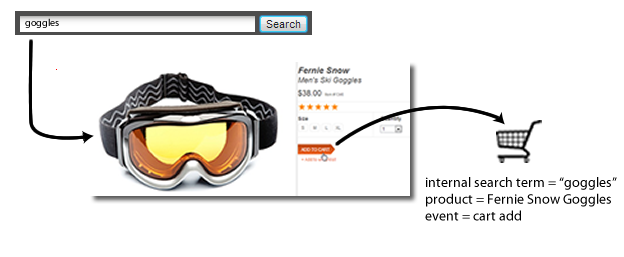

# eVar (merchandising)

*Questa pagina della guida descrive il funzionamento delle eVar di merchandising come [dimensione](overview.md). Per informazioni su come implementare le eVar di merchandising, vedi [eVar (variabile di merchandising)](/help/implement/vars/page-vars/evar-merchandising.md) nella guida utente per l&#39;implementazione.*

Per una discussione dettagliata sul funzionamento delle eVar di merchandising, consulta [eVar di merchandising e metodi di ricerca dei prodotti](https://experienceleague.adobe.com/docs/analytics/admin/admin-tools/conversion-variables/merchandising-evars.html?lang=it).

Quando si misura il successo di campagne esterne o dei termini di ricerca esterni, in genere si desidera che a un singolo valore venga attribuito il merito per eventuali eventi di successo che si verificano. Ad esempio, se un cliente fa clic su un collegamento in una campagna e-mail per visitare il tuo sito web, tutti gli acquisti effettuati come risultato devono essere accreditati a tale campagna.

Cosa succede quando un cliente cerca più elementi per eventi guidati dalla ricerca interna o dalla navigazione per categorie? Ad esempio, un cliente cerca nel tuo sito `"goggles"`, quindi aggiunge una coppia al carrello:



Prima del pagamento, il cliente cerca `"winter coat"`, quindi aggiunge una piumina al carrello:


Quando il visitatore completa questo acquisto, viene effettuata una ricerca interna per `"winter coat"` accreditata dell&#39;acquisto di una coppia di occhiali (supponendo che l&#39;eVar utilizzi l&#39;allocazione predefinita &quot;Più recente&quot;). Buono per `"winter coat"`, ma cattivo per le decisioni di marketing:

| Termine di ricerca interno | Ricavi |
|---|---|
| cappotto invernale | $ 157 |

## Come le variabili di merchandising risolvono questo problema

Le eVar di merchandising consentono di assegnare il valore corrente di un eVar a un prodotto nel momento in cui si verifica un evento di successo. Questo valore rimane legato a quel prodotto, anche se uno o più nuovi valori vengono successivamente impostati per quel particolare eVar.

Se nell&#39;eVar precedente è stato abilitato il merchandising, il termine di ricerca `"goggles"` è associato agli occhiali da neve e il termine di ricerca `"winter coat"` è associato al piumino. Le eVar di merchandising allocano i ricavi a livello di prodotto, pertanto a ogni termine viene attribuito il merito per l’importo dei ricavi per il prodotto a cui è stato associato il termine:

| Termine di ricerca interno | Ricavi |
|---|---|
| cappotto invernale | $ 119 |
| occhiali | $ 38 |

Per istruzioni sull&#39;implementazione, consulta [eVar per merchandising](/help/implement/vars/page-vars/evar-merchandising.md).

## Istanze sulle variabili merchandising

La metrica [Istanze](../metrics/instances.md) non è consigliata per l&#39;utilizzo su variabili merchandising.

* Per le variabili di merchandising con sintassi di prodotto, le istanze non vengono affatto incrementate.
* Per le variabili di merchandising che utilizzano la sintassi per le variabili di conversione, le istanze vengono conteggiate ogni volta che viene impostato l’eVar. Tuttavia, attribuisce all&#39;elemento dimensione `"None"` a meno che tutte le seguenti condizioni non si verifichino sullo stesso hit:
   * L’eVar di merchandising è impostato con un valore.
   * La variabile `products` è definita con un valore.
   * È impostato un evento di binding.

```js
// This merchandising eVar uses conversion variable syntax, and counts an instance.
// However, if the binding event and products variable are not both set, the instance attributes to "None".
s.eVar1 = "Tower defense";

// This merchandising eVar uses product syntax, and does not count an instance.
s.products = "Games;Wizard tower;;;;eVar2=Tower defense";
```

Poiché la maggior parte dei casi d’uso della sintassi per le variabili di conversione richiedono la variabile eVar e products per hit diversi, l’utilizzo della metrica &quot;Istanze&quot; non è realistico.
