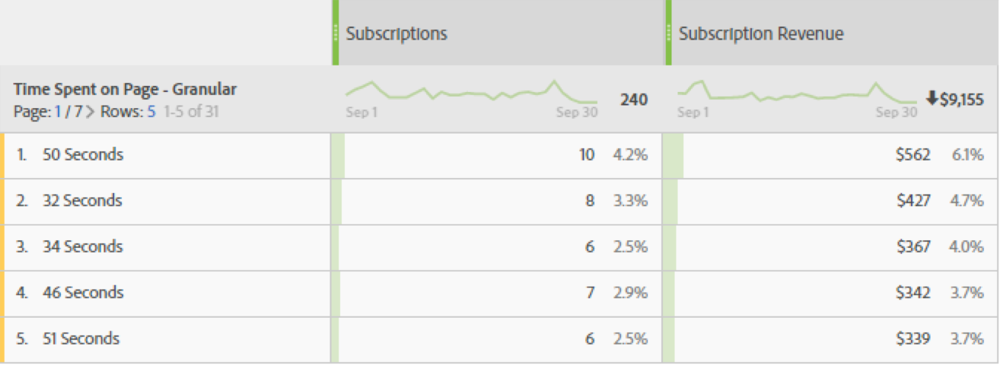

# Tempo trascorso sulla pagina

La dimensione &quot;Tempo trascorso sulla pagina&quot; registra il tempo trascorso sulla pagina da un visitatore. Per misurare il calcolo viene utilizzato il seguente passaggio:

1. Per un determinato hit, osservate la marca temporale.
2. Confronta questo hit con la marca temporale dell’hit successivo nella visita. Conteggio degli hit di tracciamento delle visualizzazioni delle pagine e dei collegamenti.
3. Il tempo trascorso tra questi due hit contribuisce al tempo trascorso.

Questa dimensione è preziosa per comprendere quanto tempo i visitatori interagiscono con una determinata metrica sul sito.

>[!TIP]
>
>Il tempo trascorso non viene misurato per l’ultimo hit della visita, in quanto non esiste una richiesta immagine successiva per misurare il tempo trascorso. Questo concetto si applica anche alle visite costituite da un singolo hit (un rimbalzo).

Questa dimensione è basata sugli hit, il che significa che il valore è diverso per ogni hit. Confronta questa dimensione con il [tempo trascorso per visita](time-spent-per-visit.md), che è una dimensione basata sulle visite. Un tempo maggiore impiegato indica che un visitatore è rimasto più a lungo su una pagina (hit).

## Compilare questa dimensione con i dati

Questa dimensione funziona automaticamente per tutte le implementazioni. Se una suite di rapporti contiene dati, questa dimensione funziona.

## Elementi dimensione

Esistono più dimensioni per il tempo trascorso sulla pagina:

* **Tempo trascorso sulla pagina - allungato**: Il tempo trascorso è intasato. Gli elementi dimensione sono compresi tra `"Less than 15 seconds"` e `"More than 30 minutes"`. Il tempo tra le visualizzazioni di pagina generalmente non dura più di 30 minuti; tuttavia, il tempo tra le visualizzazioni di pagina può superare i 30 minuti se si utilizzano hit con marca temporale o origini dati.
* **Tempo trascorso sulla pagina - granulare**: Ogni numero di secondi è un elemento di dimensione univoco.

Consultate Panoramica sul [tempo trascorso](../metrics/time-spent.md) per informazioni più generali sul tempo trascorso.
