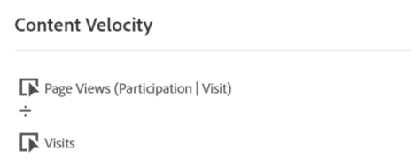
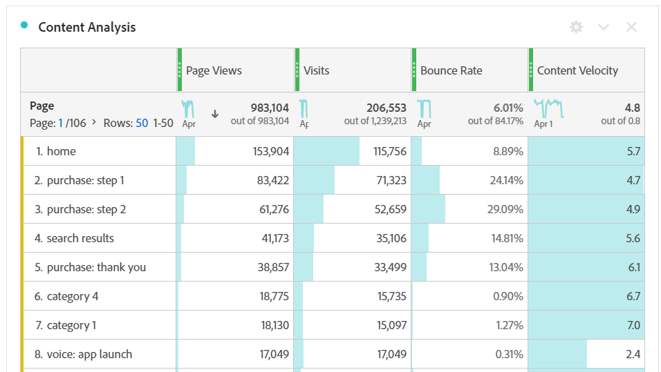

# Velocità dei contenuti

La metrica calcolata &quot;Content Velocity&quot; (Velocità del contenuto) consente di misurare in che modo una dimensione (in genere [[!UICONTROL Page]](/help/components/dimensions/page.md)) contribuisce a far sì che gli utenti dedichino tempo al sito web o all’app.

Questa metrica utilizza [Attribuzione di partecipazione](/help/analyze/analysis-workspace/attribution/models.md) nella metrica [Visualizzazioni pagina](page-views.md) come parte del calcolo. Con la partecipazione Visita, ogni volta che viene visualizzata una pagina, anche tutte le pagine che sono state precedentemente visitate durante la stessa visita ricevono il merito per la visualizzazione della pagina. Questa formula in genere significa che più una pagina viene visitata durante una visita, maggiore è il credito ricevuto. (Vedi [Visualizzazioni pagina (partecipazione) | Visita ) o &#39;Partecipazione alla visita&#39;](#page-views-participation--visit-or-visit-participation) per ulteriori informazioni.)

## Calcolo

&#39;Content Velocity&#39; è una [metrica](overview.md) calcolata predefinita e utilizza la formula `Page views (Visit participation)` divisa per `Visits`.

## Utilizzi comuni

[!UICONTROL Content Velocity] viene comunemente utilizzato nell&#39;analisi dei contenuti insieme ad altre metriche chiave come [!UICONTROL Page Views], [!UICONTROL Visits] e [!UICONTROL Bounce Rate].

## Esempio

L’esempio seguente suddivide le 2 parti di Content Velocity (Velocità del contenuto): &quot;Page Views (Participation | Visita)&quot; e &quot;Visite&quot;.

### Visualizzazioni pagina (partecipazione) | Visita) o &quot;Partecipazione alla visita&quot;

Considera il seguente esempio di come la partecipazione alla visita influisce sull’attribuzione:

In un sito web, un utente visita le pagine seguenti in questo ordine:

* Pagina A
* Pagina B
* Pagina C
* Pagina D

Nell’esempio precedente, la pagina A riceverebbe il merito per 4 hit, la pagina B per 3 hit, la pagina C per 2 hit e la pagina D per 1 hit.

L’esempio seguente illustra lo stesso principio, ma con alcune pagine visitate più di una volta.

* Pagina A
* Pagina B
* Pagina C
* Pagina B
* Pagina D
* Pagina A

Nell’esempio precedente, alla pagina A verrebbero attribuiti 7 hit, alla pagina B 8 hit, alla pagina C 4 hit e alla pagina D 2 hit.

### Visite

Una volta calcolata la partecipazione alla visita, il risultato viene diviso per il numero di visite.
