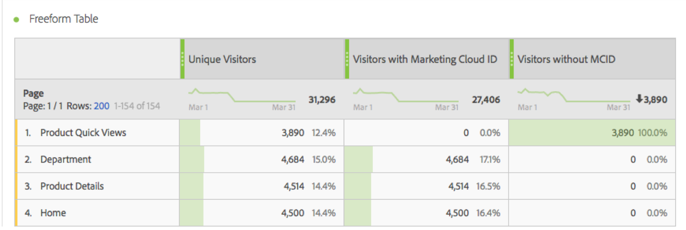

# Visitatori con Experience Cloud ID

La metrica &#39;Visitatori con ID Experience Cloud&#39; [metric](overview.md) mostra il numero di visitatori univoci identificati da Adobe tramite il servizio [Experience Cloud ID](https://experienceleague.adobe.com/docs/id-service/using/home.html?lang=it). Questa metrica è utile da confrontare con la metrica [Visitatori univoci](unique-visitors.md) per assicurarsi che la maggior parte dei visitatori del sito utilizzi il servizio ID. Se una grande parte dei visitatori non utilizza i cookie del servizio ID, può indicare un problema all&#39;interno dell&#39;implementazione.

>[!NOTE]
>
>Questa metrica è particolarmente importante per il debug se si utilizzano più servizi CX Enterprise, come Adobe Target o Adobe Audience Manager. I segmenti condivisi tra i prodotti aziendali CX non includono i visitatori senza un Experience Cloud ID.

## Come è calcolata questa metrica

Questa metrica si basa sulla metrica [Visitatori univoci](unique-visitors.md), tranne per il fatto che include solo gli individui identificati utilizzando la stringa di query `mid` (basata sul cookie [`s_ecid`](https://experienceleague.adobe.com/docs/core-services/interface/ec-cookies/cookies-analytics.html?lang=it)).

## Debug della configurazione dell’Experience Cloud ID

La metrica &quot;Visitatori con Experience Cloud ID&quot; può essere utile per risolvere problemi relativi alle integrazioni CX Enterprise o per identificare aree del sito in cui non è stato implementato il servizio ID.

Trascina &quot;Visitatori con Experience Cloud ID&quot; accanto a Visitatori univoci per confrontarli:

In questo esempio, tieni presente che ogni pagina ha lo stesso numero di &quot;Visitatori univoci&quot; di &quot;Visitatori con un Experience Cloud ID&quot;. Tuttavia, il numero totale di Visitatori univoci è maggiore del numero totale di Visitatori con Experience Cloud ID. Puoi creare una [metrica calcolata](../calculated-metrics/cm-overview.md) per individuare le pagine che non impostano il servizio ID. Puoi utilizzare la seguente definizione:

Aggiungendo la metrica calcolata al rapporto, puoi ordinare il rapporto Pagine in modo da visualizzare le pagine con il maggior numero di visitatori senza un MCID:

L’elemento dimensione &quot;Visualizzazioni rapide del prodotto&quot; non è implementato correttamente con il servizio Identity. Puoi lavorare con i team appropriati all’interno della tua organizzazione per aggiornare queste pagine il prima possibile. È possibile creare un report simile con qualsiasi tipo di dimensione, ad esempio [Tipo browser](../dimensions/browser-type.md), [Sezione sito](../dimensions/site-section.md) o qualsiasi [eVar](../dimensions/evar.md).
