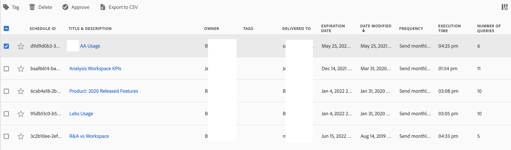

# Progetti programmati

I progetti Analysis Workspace pianificati possono essere gestiti in Adobe Analytics utilizzando **[!UICONTROL Components]** > **[!UICONTROL Scheduled projects]**.

In **[!UICONTROL Scheduled Projects]** è possibile modificare ed eliminare pianificazioni ricorrenti dei progetti.  L&#39;[elenco progetti pianificato](#scheduled-project-list) mostra gli elementi creati da un utente specifico. Se l’account utente è disabilitato nell’applicazione, tutte le consegne pianificate si interrompono.

## Elenco progetti programmati

Nell&#39;elenco Progetti pianificati ➊ sono visualizzate le colonne per:

| Colonna | Descrizione |
| --- | --- |
|  | Quando sono selezionati uno o più progetti programmati, nella parte inferiore dell’interfaccia Progetti programmati viene visualizzata una barra blu delle azioni. Per ulteriori dettagli, consulta [Azioni](#actions). |
|  | Seleziona questa opzione per favorire  o per non favorire  un progetto pianificato. |
| **[!UICONTROL Schedule ID]** | Un ID utilizzato principalmente a scopo di debug. |
| **[!UICONTROL Name]** | Nome del progetto. Seleziona  per visualizzare ulteriori dettagli sul progetto pianificato. Selezionare  per aprire un menu di scelta rapida. Da questo menu puoi:<ul><li> **[!UICONTROL Delete]** un progetto pianificato.</li><li> **[!UICONTROL Tag]** un progetto pianificato.</li><li> **[!UICONTROL Approve]** un progetto pianificato.</li><li> **[!UICONTROL Export CSV]**: esporta un progetto pianificato in un file CSV.</li></ul> |
| **[!UICONTROL Owner]** | La persona che ha creato ed è proprietaria del progetto. |
| **[!UICONTROL Tags]** | (facoltativo) Assegnare tag è un modo efficace per organizzare progetti. Tutti gli utenti possono creare tag e applicarne uno o più a un progetto. Tuttavia, puoi visualizzare solo i tag dei progetti di tua proprietà o che sono stati condivisi con te. |
| **[!UICONTROL Delivered to]** | Destinatari del progetto pianificato. |
| **[!UICONTROL Expiration date]** | Puoi impostare la data di scadenza massima fino a un anno, indipendentemente dalla frequenza di pianificazione. |
| **[!UICONTROL Frequency]** | Con quale frequenza desideri che questo progetto di pianificazione venga inviato a uno o più destinatari. |
| **[!UICONTROL Execution Time]** | A che ora del giorno viene inviato questo progetto programmato. |
| **[!UICONTROL Number of Queries]** | Il numero di query su questo progetto. |
| **[!UICONTROL Longest Date Range]** | L’intervallo di date più lungo definito per il progetto pianificato. Questo valore potrebbe essere rilevante per analizzare i problemi di prestazioni. Per ulteriori informazioni, vedere [Reporting Activity Manager](/help/admin/admin/reporting-activity-manager/reporting-activity-overview.md). |
| **[!UICONTROL Number of queries]** | Numero di query eseguite per il progetto pianificato. Questo valore potrebbe essere rilevante per analizzare i problemi di prestazioni. Per ulteriori informazioni, vedere [Reporting Activity Manager](/help/admin/admin/reporting-activity-manager/reporting-activity-overview.md). |

È possibile utilizzare  per configurare le colonne da visualizzare.

Cerca un progetto pianificato utilizzando . Puoi anche vedere se sono stati applicati filtri dal pannello Filtri. Per rimuovere un filtro, selezionare  per un filtro. Per rimuovere tutti i filtri, selezionare **[!UICONTROL Clear all]**.

Per modificare un progetto pianificato, seleziona il titolo del progetto. Utilizza la finestra di dialogo **[!UICONTROL Edit scheduled project]** per aggiornare i dettagli della pianificazione. Vedi [Invia file ad altri](../analyze/analysis-workspace/curate-share/t-schedule-report.md) per ulteriori dettagli.

Selezionare **[!UICONTROL Update]** per aggiornare la pianificazione.

## Azioni

Di seguito sono riportate le azioni comuni di Gestione progetti programmati: Puoi selezionare le azioni dal menu di scelta rapida o dalla barra blu delle azioni quando selezioni uno o più progetti pianificati.

| Icona | Azione | Descrizione |
|:---:|---|---|
|  | **[!UICONTROL *x *selezionato]** | Seleziona per deselezionare i progetti pianificati selezionati. |
|  | **[!UICONTROL Delete]** | Elimina i progetti pianificati selezionati per il progetto; i progetti non vengono eliminati. |
|  | **[!UICONTROL Tag]** | Assegna tag ai progetti pianificati selezionati. In **[!UICONTROL Tag Scheduled projects]** selezionare i tag e selezionare **[!UICONTROL Save]** da salvare. |
|  | **[!UICONTROL Approve]** | Approva i progetti programmati selezionati. |
|  | **[!UICONTROL Export to CSV]** | Esporta i progetti pianificati selezionati in un file denominato `Export Scheduled Projects List.csv`. |

## Filtro

Puoi filtrare i progetti pianificati [Elenco progetti pianificati](#scheduled-project-list) utilizzando il pannello dei filtri ➌. Per mostrare o nascondere il pannello dei filtri, utilizza l’icona .

Il pannello dei filtri è costituito dalle sezioni seguenti.

### Tag

| Tag | Descrizione |
|---|---|
| {width="300"} | La sezione **[!UICONTROL Tags]** consente di filtrare in base ai tag. <ul><li> **[!UICONTROL Search Tags]** per cercare i tag da utilizzare per filtrare.</li><li>Puoi selezionare più di un tag. I tag disponibili dipendono dalle selezioni effettuate in altre sezioni nel pannello dei filtri.</li><li>I numeri indicano:<ul><li>7︎⃣: numero di progetti pianificati associati al tag specifico.</li></ul></li></ul> |

### Proprietari

| Proprietario | Descrizione |
|---|---|
| {width="300"} | La sezione **[!UICONTROL Owner]** consente di filtrare in base ai proprietari. <ul><li>Puoi utilizzare  *Ricerca proprietari* per cercare i proprietari da utilizzare per filtrare.</li><li>Puoi selezionare più di un proprietario. I proprietari disponibili dipendono dalle selezioni effettuate in altre sezioni nel pannello dei filtri.</li><li>I numeri indicano:<ul><li>4︎⃣: numero di progetti pianificati associati al proprietario specifico.</li></ul></li></ul> |

### Altri filtri

| Altri filtri | Descrizione |
|---|---|
| {width="300"} | La sezione **[!UICONTROL Other filters]** ti consente di filtrare in base ad un altro filtro predefinito.<ul><li>È possibile scegliere una o più delle opzioni seguenti:<ul><li> **[!UICONTROL Expired]**: filtro per progetti pianificati scaduti.</li><li>**[!UICONTROL Failed]**: filtro per progetti pianificati per i quali la pianificazione non è riuscita.</li></ul>Ciò che puoi selezionare dipende dal tuo ruolo e dalle autorizzazioni.</li><li>Puoi selezionare più di un altro filtro. Gli altri filtri disponibili dipendono dalle selezioni effettuate in altre sezioni nel pannello dei filtri.</li><li>I numeri indicano:<ul><li>4︎⃣: numero di progetti pianificati associati all’altro filtro specifico.</li></ul></li></ul> |

<!--
# Scheduled projects

Scheduled Analysis Workspace projects can be managed under **Analytics > Components > Scheduled Projects**.

When you manage scheduled projects, you can edit and delete recurring project schedules:

*  Change the file type (.csv or PDF)
*  Update the project description
*  Add or remove recipients
*  Change the frequency

To modify a scheduled project

1.  Select **Analytics > Components > Scheduled Projects**.
1.  Search for a schedule in the search bar or by using the filter options in the left rail. You can filter by [!UICONTROL Tags], [!UICONTROL Owners], [!UICONTROL Favorites], and more.

## Available columns

| Field | Description |
| --- | --- |
| [!UICONTROL Favorites] | Selecting the star icon makes this schedule a favorite. |
| [!UICONTROL Schedule ID] | This ID is used mainly for debugging purposes. |
| [!UICONTROL Title and description] | Title and description of this project. |
| [!UICONTROL Owner] | The person who created and owns the project. |
| [!UICONTROL Tags] | (optional) Tagging is a good way to organize projects. All users can create tags and apply one or more tags to a project. However, you can see tags only for those projects that you own or that have been shared with you.  |
| [!UICONTROL Delivered to] | The recipient(s) of this scheduled project. |
| [!UICONTROL Expiration date] | For any scheduled project frequency, you can set the expiration date for up to one year in the future. |
| [!UICONTROL Frequency] | How often you want to have this schedule project sent to the recipient(s). |
| [!UICONTROL Execution time] | At what time of day this scheduled project gets sent. |
| [!UICONTROL Number of queries] | The number of queries against this project. | 

## Common actions

The following are common actions in the Scheduled Projects manager:

|Action|Description|
|---|---|
|**[!UICONTROL Edit]**|Select the title of the schedule to update its delivery settings.|
|**[!UICONTROL Delete]**|Select the scheduled project in the list and then click Delete from the menu. This will delete the selected schedule for the project; the project itself will not be deleted.|
|**[!UICONTROL Tag]**|Select the scheduled project in the list and then choose "Tag" or "Approve" to organize your schedules and make them easier to search for.|
|**[!UICONTROL View failed schedules]**|Navigate to the left rail > Other filters > Failed to see schedules that have failed.|
|**[!UICONTROL View expired schedules]**|Navigate to the left rail > Other filters > Expired to see schedules that have expired. Click the title of the schedule to setup a new delivery schedule.|
|**[!UICONTROL View schedule ID]**|Navigate to column options in the top right and add the Schedule ID column to the table. The scheduled ID is often useful for debugging.|

The Scheduled Projects manager shows the items that a specific user created. If the user account is disabled in the application, all scheduled deliveries stop. Scheduled project ownership can be transferred to a new user under **Admin** > **Analytics Users & Assets** > **Transfer Assets**.
-->