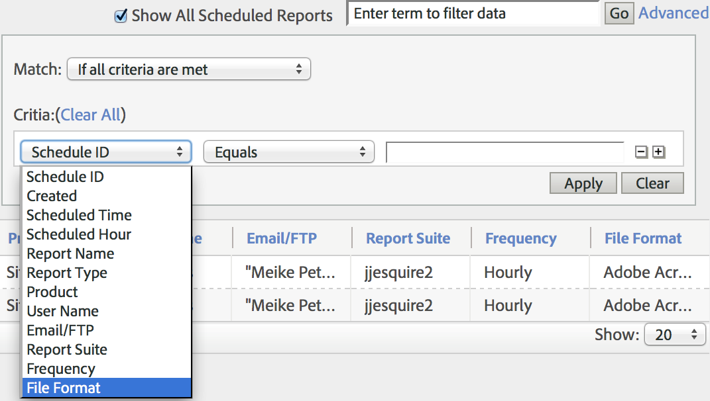

# Coda dei rapporti pianificati

Gli utenti a livello amministratore possono visualizzare e gestire i rapporti pianificati in tutta l’organizzazione.

**[!UICONTROL Analytics]** > **[!UICONTROL Components]** > **[!UICONTROL All components]** > **[!UICONTROL Scheduled Reports]**

Le funzionalità a livello amministratore in Gestione rapporti pianificati includono:

* L’opzione [Mostra tutti i rapporti pianificati](/help/components/scheduled-reports-admin.md#section_3F167CAAEEC24140B476CF95B7402690) nella tua organizzazione.
* [Funzionalità di filtro avanzate](/help/components/scheduled-reports-admin.md#section_206A52A85DE84947AAB3AD082FBF6275) in tutta la tua organizzazione.
* La nuova scheda [Coda dei rapporti](/help/components/scheduled-reports-admin.md#section_03C866115D354BB182E90BF4D52F1E0B) che elenca tutti i rapporti in coda per l’esecuzione sui server della generazione rapporti.
* L’esposizione dell’[ID pianificazione](/help/components/scheduled-reports-admin.md#section_568B70F4228C4229977CB85D2DCD53A1) nell’interfaccia Coda dei rapporti.

## Mostrare tutti i report pianificati {#section_3F167CAAEEC24140B476CF95B7402690}

Sulla scheda **[!UICONTROL Report List]**, puoi **[!UICONTROL Show All Scheduled Reports]** nella tua organizzazione, oltre a quelli che hai pianificato personalmente.

>[!NOTE]
>
>La colonna **[!UICONTROL Report Name]** mostra il nome del rapporto in fase di pianificazione mentre la colonna **[!UICONTROL File Name]** qualsiasi nome di file personalizzato da te impostato in Opzioni di consegna avanzate. Di conseguenza, se si pianificano più rapporti dello stesso tipo e si specificano nomi personalizzati per ciascuno, la Gestione rapporti pianificati mostrerà più voci con lo stesso nome di rapporto ma con nomi di file diversi. Ciò è dovuto al fatto che il back-end del rapporto pianificato è lo stesso, quindi la colonna Nome rapporto avrebbe gli stessi nomi di rapporto per tutti tranne i nomi di file personalizzati (come impostati).

## Funzionalità di filtro avanzate {#section_206A52A85DE84947AAB3AD082FBF6275}

Ad esempio, se desideri filtrare tutti i rapporti pianificati per ogni ora, dovrai specificare **[!UICONTROL Frequency equals Hourly]** nel filtro **[!UICONTROL Advanced]** e fare clic su **[!UICONTROL Apply]**:

## Coda dei rapporti {#section_03C866115D354BB182E90BF4D52F1E0B}

Questa coda ti consente di gestire ed eventualmente eliminare qualsiasi rapporto pianificato che sta “intasando” la coda. (In genere, i rapporti scadono dopo 4 ore.)

La coda dei rapporti ti dà anche la possibilità di “saltare una volta un rapporto pianificato”. Basta fare clic sull’icona blu nella colonna **[!UICONTROL Manage]**.

## ID pianificazione {#section_568B70F4228C4229977CB85D2DCD53A1}

Avere il **[!UICONTROL Schedule ID]** esposto nell’interfaccia Coda dei rapporti è di aiuto quando si deve contattare l’assistenza clienti di Adobe per la risoluzione di un problema relativo ai rapporti pianificati.

