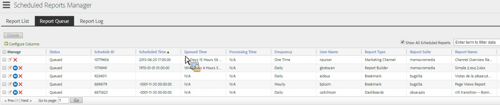

# Coda dei report pianificati

Consente agli utenti a livello di amministratore di visualizzare e gestire i rapporti pianificati in tutta l’organizzazione.

**[!UICONTROL Analytics]** > **[!UICONTROL Components]** > **[!UICONTROL All components]** > **[!UICONTROL Scheduled Reports]**

Le funzionalità a livello di amministratore in Gestione rapporti pianificata includono:

* Opzione per [Mostra tutti i report pianificati](/help/components/scheduled-reports-admin.md#section_3F167CAAEEC24140B476CF95B7402690) nella tua organizzazione.
* [Funzionalità di filtro avanzate](/help/components/scheduled-reports-admin.md#section_206A52A85DE84947AAB3AD082FBF6275) in tutta l’organizzazione.
* Il nuovo [Coda report](/help/components/scheduled-reports-admin.md#section_03C866115D354BB182E90BF4D52F1E0B) scheda che elenca tutti i report in coda per l&#39;esecuzione sui server di report.
* Esposizione di [ID Schedule](/help/components/scheduled-reports-admin.md#section_568B70F4228C4229977CB85D2DCD53A1) nell’interfaccia Coda di report.

## Mostra tutti i report pianificati {#section_3F167CAAEEC24140B476CF95B7402690}

Il giorno **[!UICONTROL Report List]** , è possibile **[!UICONTROL Show All Scheduled Reports]** nella tua organizzazione, oltre a quelli che hai pianificato personalmente.

>[!NOTE]
>
>Il **[!UICONTROL Report Name]** nella colonna viene visualizzato il nome del report in fase di pianificazione e il **[!UICONTROL File Name]** In questa colonna viene visualizzato qualsiasi nome di file personalizzato impostato dall&#39;utente in Opzioni di consegna avanzate. Di conseguenza, se si pianificano più rapporti dello stesso tipo e si specificano nomi personalizzati per ciascuno di essi, Gestione rapporti pianificati visualizzerà più voci con lo stesso Nome rapporto ma con nomi di file diversi. Questo perché il report back-end da pianificare è lo stesso, pertanto la colonna Nome report avrà gli stessi nomi di report per tutti i nomi di file tranne quelli personalizzati (come impostato).

## Funzionalità di filtro avanzate {#section_206A52A85DE84947AAB3AD082FBF6275}

Ad esempio, per filtrare tutti i rapporti pianificati per ora, puoi specificare **[!UICONTROL Frequency equals Hourly]** nel **[!UICONTROL Advanced]** filtra e fai clic su **[!UICONTROL Apply]**:

## Coda report {#section_03C866115D354BB182E90BF4D52F1E0B}

Questa coda ti consente di gestire e potenzialmente eliminare tutti i rapporti pianificati che stanno &quot;intasando&quot; la coda. In genere, i rapporti scadono dopo 4 ore.

La Coda di rapporti consente inoltre di &quot;saltare una volta un rapporto pianificato&quot;. Fai clic sull’icona blu nella sezione **[!UICONTROL Manage]** colonna.

## ID Schedule {#section_568B70F4228C4229977CB85D2DCD53A1}

Avere **[!UICONTROL Schedule ID]** exposed nell’interfaccia della coda di rapporti consente di contattare l’Assistenza clienti di Adobe per la risoluzione di un problema di rapporti pianificati.

