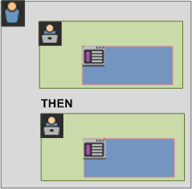

# Contenitori di segmenti

Un segmento imposta le condizioni per filtrare un visitatore in base agli attributi o alle interazioni del visitatore con il sito. Per impostare le condizioni in un segmento, imposta le regole per filtrare i visitatori in base alle loro caratteristiche e/o quelle di navigazione. Per suddividere ulteriormente i dati dei visitatori, puoi filtrare in base a visite e/o hit di visualizzazione pagina specifiche per ciascun visitatore. Il Generatore di segmento fornisce un’architettura semplice per generare questi sottoinsiemi e applicare le regole come contenitori Visitatore, Visita o Hit nidificati e gerarchici.

L’architettura dei contenitori utilizzata nel Generatore di segmenti definisce

-  **[!UICONTROL Visitor]** come contenitore più esterno, contenente i dati generali specifici del visitatore per visite e visualizzazioni di pagina.
-  una nidificata **[!UICONTROL Visit]** Contenitore consente di impostare regole per suddividere i dati del visitatore in base alle visite e
-  una nidificata **[!UICONTROL Hit]** Il contenitore consente di suddividere le informazioni sui visitatori in base alle singole visualizzazioni di pagina.

Ogni contenitore consente di generare rapporti sulla cronologia di un visitatore e sulle sue interazioni suddivise per visite o di suddividere i singoli hit.

<table style="table-layout: fixed; border: none;">

<tr>
<td style="background-color: #E5E4E2;" colspan="3" width="200" height="100"> Visitatori</td>
</tr>

<tr>
<td style="background-color: #E5E4E2;" width="200"></td>
<td style="background-color: #D3D3D3;" colspan="2" width="200" height="100"> Visite</td>
</tr>

<tr>
<td style="background-color: #E5E4E2;" width="200" height="100"></td>
<td style="background-color: #D3D3D3;" width="200" height="100"></td>
<td style="background-color: #C0C0C0;" width="200" height="100" colspan="1"> Hit</td>
</tr>
</table>

<!---->

Ecco una panoramica video dei contenitori di segmenti:

>[!VIDEO](https://video.tv.adobe.com/v/25401/?quality=12)

## Contenitore Visitatore

Il contenitore Visitatore include ogni visita e visualizzazione di pagina dei visitatori entro un intervallo di tempo specificato. Un filtro a livello di Visitatore restituisce la pagina che soddisfa la condizione più tutte le altre pagine visualizzate dal visitatore (e vincolate solo da intervalli di date definiti). Poiché è il contenitore definito in modo più ampio, i rapporti generati a livello del contenitore Visitatore restituiscono le visualizzazioni di pagina per tutte le visite e consentono di generare un’analisi per più visite. Pertanto, il contenitore Visitatore è il più suscettibile a modifiche in base a intervalli di date definiti.

I contenitori Visitatore possono includere valori basati sulla cronologia generale di un visitatore:

- Giorni precedenti al primo acquisto
- Pagina di ingresso originale
- Domini di riferimento originali

## Contenitore Visita

Il contenitore Visita consente di identificare le interazioni di pagina, le campagne o le conversioni per una specifica sessione web. Un segmento a livello di visita restituisce la pagina che soddisfa la condizione più tutte le altre pagine visualizzate come parte della sessione di visita (e vincolate solo da intervalli di date definiti). Il contenitore Visita è il contenitore più comunemente utilizzato perché acquisisce i comportamenti per l’intera sessione di visita una volta soddisfatta la regola. Il contenitore Visita consente di definire quali visite includere o escludere nella creazione e applicazione di un segmento. Può fornirti risposte alla domanda: quanti visitatori hanno visualizzato la sezione Notizie e Sport nella stessa visita? O quanti visitatori hanno visualizzato pagine che hanno portato a una conversione in vendita?

I contenitori Visita includono valori basati sull’occorrenza per visita:

- Numero di visite
- Pagina di ingresso
- Frequenza di ritorno
- Metriche di partecipazione
- Metriche allocate linearmente

## Contenitore Hit

Il contenitore Hit definisce gli hit pagina da includere o escludere da un segmento. Il contenitore Hit è il più ristretto tra quelli disponibili per consentire di identificare clic specifici e visualizzazioni di pagina in cui è vera una condizione. Puoi visualizzare un singolo codice di tracciamento o isolare il comportamento all’interno di una particolare sezione del sito. Puoi inoltre identificare un valore specifico quando si verifica un’azione, ad esempio il canale di marketing al momento di un ordine.

I contenitori Hit includono valori basati su raggruppamenti di singole pagine:

- Prodotti
- Proprietà elenco
- eVar elenco
- eVar del merchandising (nel contesto degli eventi)

   >[!NOTE]
   >
   >Se utilizzi questo contenitore su un valore persistente, ad esempio una eVar, esso richiama ogni hit in cui tale valore è persistente. Se un codice di tracciamento scade dopo una settimana, tale valore potrebbe persistere in più visite.

## Contenitore Gruppo logico

Il contenitore Gruppo logico consente di fornire un contenitore separato all’interno delle regole del segmento per filtrare le entità che non sono basate sulla gerarchia. Ad esempio, potrebbe essere utile fornire un contenitore nidificato all’interno del segmento che filtra in base a Visitatore. Questo tipo di logica richiede l’interruzione della gerarchia (in quanto hai già utilizzato un contenitore Visitatore di livello superiore) per filtrare solo per i visitatori selezionati. Per ulteriori informazioni, consulta [Esempi di Gruppo logico](/help/components/segmentation/segmentation-workflow/seg-sequential-build.md).

## Nidificazione dei contenitori {#nest-containers}

Quando crei contenitori di segmenti all’interno di altri contenitori, stai creando in sostanza un segmento all’interno di un altro segmento. I contenitori nidificati utilizzano la logica seguente:

1. Determina i dati inclusi utilizzando il contenitore più esterno. Eventuali dati che non corrispondono a questa regola esterna vengono scartati nel rapporto segmentato.
1. Applica la regola nidificata ai dati rimanenti. La regola nidificata NON si applica agli hit espulsi dalla prima regola.
1. Ripeti l’operazione fino al completamento del calcolo di tutte le regole del contenitore nidificato. I dati rimanenti vengono quindi inclusi nel rapporto risultante.

Puoi utilizzare la nidificazione tra contenitori e tra regole all’interno di un contenitore. In ciascun contenitore è possibile nidificare:

| Nome del contenitore | Contenuto che può essere nidificato |
|---|---|
| Hit | Solo eventi |
| Visita | Contenitore Hit, Eventi |
| Visitatore | Contenitore Visita, contenitore Hit, Eventi |
| Gruppo logico | Contenitore Visitatore, contenitore Visita, contenitore Hit |

### Includere più contenitori in una singola definizione

L’inclusione di più segmenti in un nuovo segmento composto consente di perfezionare ulteriormente i dati. Trascinare due segmenti esistenti insieme funge da istruzione “OPPURE” quando filtri i visitatori. Tutti i contenitori nell’area di lavoro vengono analizzati a fronte di tutti i dati e i dati che corrispondono a uno qualsiasi dei contenitori vengono inclusi nel rapporto.

Ad esempio, se trascini un contenitore Visita in cui Paese = Stati Uniti insieme a un contenitore Visita in cui Ordine = True,

```
Country = United States + Order = True
```

crea un segmento che si comporta in questo ordine:

1. Il segmento esamina innanzitutto tutti i dati e identifica tutti i visitatori negli Stati Uniti.
2. Il segmento esamina quindi nuovamente tutti i dati, cercando se eventuali visitatori hanno effettuato un ordine.
3. Entrambi i set di dati vengono quindi applicati al rapporto.

## Contenitori per i segmenti sequenziali {#containers-sequential}

La segmentazione sequenziale utilizza gli stessi contenitori di base, inclusi [!UICONTROL Visitors], [!UICONTROL Visits] e [!UICONTROL Hits] (comprese le visualizzazioni di pagina o altre dimensioni) nidificati gerarchicamente.

<table style="table-layout:fixed; border: none;">

<tr>
<td style="background-color: #E5E4E2;" colspan="3" width="200" height="100"> Visitatori</td>
</tr>

<tr>
<td style="background-color: #E5E4E2;" width="200"></td>
<td style="background-color: #D3D3D3;" colspan="2" width="200" height="100"> Visite</td>
</tr>

<tr>
<td style="background-color: #E5E4E2;" width="200" height="100"></td>
<td style="background-color: #D3D3D3;" width="200" height="100"></td>
<td style="background-color: #C0C0C0;" width="200" height="100" colspan="1"> Hit</td>
</tr>
</table>

<!---->

[!UICONTROL Visitors] costituisce il contenitore con l’ordine più alto nella segmentazione sequenziale. [!UICONTROL Visits] è infatti contenuto all’interno del contenitore [!UICONTROL Visitors] e [!UICONTROL Hits] è contenuto all’interno del contenitore [!UICONTROL Visitors] o [!UICONTROL Visits]. Per creare segmenti sequenziali ben ordinati, è necessario mantenere [questa gerarchia di contenitori](/help/components/segmentation/seg-overview.md#section_7FDF47B3C6A94C38AE40D3559AFFAF70).

**Per creare i segmenti sequenziali**, i contenitori vengono nidificati e uniti alla logica sequenziale utilizzando l’operatore [!UICONTROL THEN]`true`, che richiede che ogni contenitore sia in base alla sequenza del visitatore.

<table style="table-layout:fixed; border: none;">

<tr>

<td style="background-color: #E5E4E2;" colspan="3" width="200" height="100"> Visitatori</td>
</tr>

<tr>
<td style="background-color: #E5E4E2;" width="200"></td>
<td style="background-color: #D3D3D3;" colspan="2" width="200" height="100"> Visite</td>
</tr>

<tr>
<td style="background-color: #E5E4E2;" width="200" height="100"></td>
<td style="background-color: #D3D3D3;" width="200" height="100"></td>
<td style="background-color: #C0C0C0;" width="200" height="100" colspan="1"> Hit</td>
</tr>

<tr>
<td style="background-color: #E5E4E2;"></td><td colspan="2">THEN</td></td>
</tr>

<tr>
<td style="background-color: #E5E4E2;" width="200"></td>
<td style="background-color: #D3D3D3;" colspan="2" width="200" height="100"> Visite</td>
</tr>

<tr>
<td style="background-color: #E5E4E2;" width="200" height="100"></td>
<td style="background-color: #D3D3D3;" width="200" height="100"></td>
<td style="background-color: #C0C0C0;" width="200" height="100" colspan="1"> Hit</td>
</tr>
</table>

<!---->

L’unica eccezione a questa gerarchia di contenitori si verifica quando si utilizza il [contenitore Gruppo logico](/help/components/segmentation/segmentation-workflow/seg-sequential-build.md). Il contenitore [!UICONTROL Logic Group] consente di nidificare un hit all’interno di un contenitore senza l’ordine di acquisire eventi e dimensioni ma al di fuori di un ordine sequenziale.

<table style="table-layout:fixed; border: none;">

<tr>
<td style="background-color: #E5E4E2;" colspan="3" width="200" height="100"> Visitatori</td>
</tr>

<tr>
<td style="background-color: #E5E4E2;" width="200"></td>
<td style="background-color: #D3D3D3;" colspan="2" width="200" height="100"> Visite</td>
</tr>

<tr>
<td style="background-color: #E5E4E2;" width="200" height="100"></td>
<td style="background-color: #D3D3D3;" width="200" height="100"></td>
<td style="background-color: #C0C0C0;" width="200" height="100" colspan="1"> Hit</td>
</tr>

<tr>
<td style="background-color: #E5E4E2;"></td><td colspan="2">THEN</td></td>
</tr>

<tr>
<td style="background-color: #E5E4E2;" width="200"></td>
<td style="background-color: #D3D3D3;" colspan="2" width="200" height="100"> Gruppo</td>
</tr>

<tr>
<td style="background-color: #E5E4E2;" width="200" height="100"></td>
<td style="background-color: #D3D3D3;" width="200" height="100"></td>
<td style="background-color: #C0C0C0;" width="200" height="100" colspan="1"> Hit</td>
</tr>

<tr>
<td style="background-color: #E5E4E2;" width="200" height="100"></td>
<td style="background-color: #D3D3D3;" width="200" height="100"></td>
<td style="background-color: #C0C0C0;" width="200" height="100" colspan="1"> Visite</td>
</tr>

</table>

<!---->

## Rapporti basati sui dati dei contenitori {#reports}

I contenitori consentono di filtrare dati diversi in modo diverso in base ai valori di reporting quando si suddividono i segmenti e li si applicano ai rapporti.

I dati acquisiti a ogni livello della gerarchia dei contenitori Visitatore > Visita > Hit influiscono sulla modalità di creazione dei segmenti. Se prendi lo stesso segmento applicato allo stesso rapporto utilizzando lo stesso set di dati, ottieni valori diversi in base al contenitore da cui generi il rapporto. Fattori quali il livello di reporting dei contenitori e la persistenza dei valori tra gli hit possono influire in modo significativo sulla precisione dei rapporti.

### Nozioni di base dei dati dei contenitori {#container-data}

Ad esempio, il visitatore descritto di seguito ha visitato un sito durante la prima visita, partendo dalla home page ha visitato tre pagine aggiuntive e ha convertito la visita in una vendita. In una visita separata, il visitatore ha visitato per prima cosa la pagina di prodotto, poi la home page e di nuovo la pagina di prodotto, per poi terminare la sessione dopo aver guardato i cappelli invernali. In base ai dati acquisiti per ciascun contenitore per il segmento, nel rapporto vengono visualizzati valori diversi.

Il `Pages equals Winter Coat` il segmento seguente viene applicato al **Rapporto pagine**.


In base al contenitore selezionato, il rapporto mostra risultati diversi per le visite e le visualizzazioni di pagina seguenti da parte di un visitatore.

<table style="table-layout:auto; border: 0;">

<tr>
<td style="background-color: #E5E4E2;"></td>
<td style="background-color: #E5E4E2;" colspan="4"><b>Visita 1</b></td>
</tr>
<tr>
<tr>
<td style="background-color: #E5E4E2;">

</td>
<td style="background-color: #FFFFFF; "><br/>Home</td>
<td style="background-color: #FFFFFF;"><br/>Abbigliamento invernale</td>
<td style="background-color: #FFFFFF;"><br/>Cappotto invernale</td>
<td style="background-color: #FFFFFF;"><br/>Acquisto $100</td>
</tr>
<tr>
<td colspan="5">
</tr>
<tr>
<td style="background-color: #E5E4E2;"></td>
<td style="background-color: #E5E4E2;"colspan="4"><b>Visita 2</b></td>
</tr>
<tr>
<tr style="border: 0;">

<td style="background-color: #E5E4E2;">

</td>
<td style="background-color: #FFFFFF; "><br/>Abbigliamento invernale</td>
<td style="background-color: #FFFFFF;"><br/>Stivali invernali</td>
<td style="background-color: #FFFFFF;"><br/>Abbigliamento invernale</td>
<td style="background-color: #FFFFFF;"><br/>Cappelli invernali</td>

</table>


<!---->

### Generazione di rapporti dal contenitore Hit

Quando questa condizione si trova all’interno di un contenitore Hit, il rapporto elenca solo le pagine in cui *Pagina = Cappotti invernali* è true. Poiché solo una pagina corrisponde a questa condizione in un contenitore di una sola pagina, viene visualizzata solo la pagina Cappotti invernali.

| Pagina | Visualizzazioni pagina |
|---|--:|
| Cappotto invernale | 1 |

<!---->

I rapporti dal contenitore Hit mostrano come la generazione di rapporti da contenitori diversi influisca sui valori complessivi dei rapporti. Dal rapporto del segmento emerge che le visualizzazioni di pagina equivalgono approssimativamente alle visite (circa 2.000 visitatori hanno visto pagine duplicate nel corso di una visita, il che si somma al numero totale di visualizzazioni di pagina). E i visitatori univoci corrispondono approssimativamente al numero di visite (circa 2.000 visitatori univoci hanno visitato più di una volta).

|  | Metrica | # | % |
|---|---|--:|--:|
|  | Visualizzazioni pagina:<br/>Visualizzazioni:<br/>Visitatori univoci: | **69.252** di 351,292 <br/>**67.554** di 165,175 <br/>**63.541** di 113,169 | **19%**<br/>**40%**<br/>**56%** |


<!---->

>[!IMPORTANT]
>
>Indipendentemente da come visualizzi i dati (dai contenitori Hit, Visita o Visitatore), tutti hanno lo stesso numero di visitatori, 63.541 in questo esempio. Indipendentemente da come generi il rapporto, la condizione iniziale del visitatore (visitatori che hanno visualizzato la pagina Cappotti invernali) rimane intatta. È il sottoinsieme di dati da cui generi il rapporto ai diversi livelli.

### Generazione di rapporti dal contenitore Visita

Se la stessa condizione si trova all’interno di un contenitore Visita, il rapporto elenca tutte le pagine della visita in cui *Pagina è uguale a Cappotti invernali* è true. Non solo filtra la pagina Cappotti invernali, ma acquisisce anche le altre pagine della visita in cui la condizione è vera. Poiché il visitatore ha visitato anche la pagina Home, la pagina di prodotto e la pagina di acquisto durante la visita, queste pagine aggiuntive sono elencate nel rapporto quando questo viene segnalato utilizzando i dati del contenitore Visitatore.

| Pagina | Visualizzazioni pagina |
|---|--:|
| Home | 1 |
| Prodotto | 1 |
| Cappotto invernale | 1 |
| Acquisto | 1 |

<!---->

Esaminando i valori del segmento dal contenitore Visita, noterai che il numero di visualizzazioni di pagina è aumentato notevolmente. Questo aumento è dovuto al fatto che la generazione di rapporti dal contenitore Visita identifica tutte le pagine che soddisfano le condizioni, più tutte le altre pagine visualizzate durante la visita (con tutte le visualizzazioni di pagina acquisite in ciascun contenitore Visita).

|  | Metrica | # | % |
|---|---|--:|--:|
|  | Visualizzazioni pagina:<br/>Visualizzazioni:<br/>Visitatori univoci: | **226.193** di 351,292 <br/>**67.554** di 165,175 <br/>**63.541** di 113,169 | **64%**<br/>**40%**<br/>**56%** |

<!---->

### Generazione di rapporti dal contenitore Visitatore

Se la stessa condizione si trova all’interno di un contenitore Visitatore, il rapporto elenca tutte le pagine visualizzate da qualsiasi visitatore in cui *Pagina è uguale a Cappotti invernali* è true. Ciò significa che se un visitatore ha visualizzato la pagina Cappotti invernali, vengono elencate tutte le pagine del contenitore Visitatore (comprese le visualizzazioni di pagina avvenute durante altre visite). Pertanto, anche le pagine che non corrispondono alla condizione vengono elencate nel rapporto, in quanto il visitatore le ha visualizzate in un momento precedente. Tutte le pagine nel contenitore Visitatore sono elencate nel rapporto, anche se si sono verificate in precedenza e non soddisfano specificatamente le condizioni.

| Visita 1<br/>Pagina | <br/>Visualizzazioni pagina |
|---|--:|
| Home | 1 |
| Abbigliamento invernale | 1 |
| Cappotto invernale | 1 |
| Acquisto | 1 |

| Visita 2<br/>Pagina | <br/>Visualizzazioni pagina |
|---|--:|
| Abbigliamento invernale | 2 |
| Stivali invernali | 1 |
| Cappelli invernali | 1 |

| Visita 1 + Visita 2<br/>Pagina | <br/>Visualizzazioni pagina |
|---|--:|
| Abbigliamento invernale | 3 |
| Home | 1 |
| Cappotto invernale | 1 |
| Acquisto | 1 |
| Stivali invernali | 1 |
| Cappelli invernali | 1 |

<!---->

Quando visualizzi i segmenti dal contenitore Visitatore, noterai un aumento delle visualizzazioni di pagina e delle visite. Questo aumento è dovuto al fatto che, a partire dal livello del visitatore, se quest’ultimo ha visitato la pagina Cappotti invernali una sola volta (rendendo la condizione vera), tutte le altre visualizzazioni di pagina e tutte le altre visite sono state acquisite per quel visitatore.

|  | Metrica | # | % |
|---|---|--:|--:|
|  | Visualizzazioni pagina:<br/>Visualizzazioni:<br/>Visitatori univoci: | **240.094** di 351,292 <br/>**83.823** di 165,175 <br/>**63.541** di 113,169 | **68%**<br/>**50%**<br/>**56%** |

<!---->

In sintesi, comprendere il funzionamento della segmentazione su vari raggruppamenti di dati è fondamentale per interpretare i dati restituiti.

## Generazione di rapporti in base al contenitore {#reporting}

Ogni raggruppamento dei dati dei segmenti ha un determinato ambito a cui viene applicata. La maggior parte dei raggruppamenti si basa sulle *visualizzazioni di pagina*, tuttavia molti segmenti importanti si basano sul contenitore *Visita* e in misura minore sul contenitore *Visitatore*. È importante comprendere i rapporti in base all’ambito del contenitore.

Utilizzo di `Page equals Winter Coats` Esempio di segmento: di seguito sono riportati alcuni esempi di risultati di questo segmento in base a come vengono applicati i dati del contenitore e a come l’ambito dei dati corrisponde al tipo di segmento.

### Contenitore di segmenti basato sulla regola del segmento corrispondente

Se si applica il contenitore di segmenti a un ambito naturale di dati, si ottengono risultati attesi in cui le righe corrispondono alla regola del segmento.

- **Contenitore Hit in cui pagina è uguale a “Cappotto invernale”**: la visualizzazione di un rapporto di *pagina* con questo segmento restituisce solo i valori che equivalgono a “Cappotto invernale”. Tutte le altre pagine sono escluse dal rapporto.
- **Contenitore Visita in cui la pagina di ingresso è uguale a “Abbigliamento invernale”**: la visualizzazione di un rapporto della *pagina di ingresso* con questo segmento restituisce solo la seconda visita, perché la pagina di ingresso corrisponde alla regola del segmento.
- **Contenitore Visita in cui il numero di visite è uguale a 1**: tutte le visualizzazioni di pagina dalla prima visita sono incluse nel rapporto, poiché corrisponde alla regola del segmento.

### Visualizzazioni di pagina a livello del contenitore Visita

Molte regole dei segmenti identificano le visualizzazioni di pagina per visita. Quando si verifica questa identificazione, viene applicato l’intero contenitore Visitatore, se solo un singolo hit corrisponde alla regola. Questo rapporto del segmento è particolarmente utile perché le visualizzazioni di pagina basate sulle visite forniscono informazioni in base alle visualizzazioni di pagina per visita.

- **Contenitore Visita in cui pagina è uguale alla pagina “Cappotto invernale”**: in un rapporto di pagina a livello del contenitore Visitatore vengono visualizzate tutte le visualizzazioni di pagina delle visite che includevano una visualizzazione della pagina “Abbigliamento invernale”. Se una pagina corrisponde alla regola del segmento, nel rapporto vengono incluse tutte le visualizzazioni di pagina associate a tale visita.
- **Contenitore Visita in cui pagina è uguale a &quot;Home page&quot;**: in un rapporto di pagina con questo segmento vengono visualizzati solo i dati della prima visita, perché nella seconda visita il visitatore non ha visualizzato una pagina &quot;Home page&quot;.
- **Contenitore Visitatore in cui pagina è uguale a “Abbigliamento invernale”**: in un rapporto di pagina, questo segmento recupera tutti i dati da entrambe le visite poiché in entrambe le visite il visitatore ha visualizzato la pagina “Abbigliamento invernale”.

### Contenitore di segmenti che identifica gli hit minori delle visualizzazioni di pagina

Se utilizzi un segmento con un contenitore più piccolo, l’ambito di raggruppamento restituisce dati imprevisti. Se utilizzi un raggruppamento più piccolo, vengono comunque inclusi tutti gli hit dall’ambito di dati.

- **Contenitore Hit in cui la pagina di ingresso è uguale a “Pagina di prodotto”**: ogni pagina viene associata alla pagina di ingresso della visita, creando un raggruppamento basato sulle visite. L’utilizzo di questo segmento non solo include la pagina di ingresso Pagina di prodotto, ma anche tutti gli hit di quella visita.
- **Contenitore Hit in cui Var dell’elenco 1 contiene ValoreA**: se più valori sono stati definiti sullo stesso hit delle Var dell’elenco, tutti i valori delle variabili sono inclusi nel segmento. Non è possibile separare i valori che si verificano nella stessa visualizzazione di pagina perché il contenitore Hit è il contenitore di segmenti più piccolo per suddividere gli hit.
- **Contenitore Hit in cui pagina è uguale a “Acquisto”**: se utilizzi le visualizzazioni di pagina come metrica, viene visualizzata solo la pagina di acquisto (come previsto). Se utilizzi un rapporto di partecipazione alle entrate, tutte le pagine della prima visita riceveranno $ 100, poiché le metriche di partecipazione sono basate sulle visite.
- **Contenitore Hit in cui pagina è uguale a “Cappotto invernale”**: se utilizzi le visualizzazioni di pagina come metrica, viene visualizzata solo la pagina “Cappotto invernale” (come previsto). Se utilizzi un rapporto di partecipazione alle entrate, nessuna pagina riceverà credito, perché questa dimensione richiede una dimensione persistente. La visualizzazione di pagina in cui è stato realizzato l’acquisto (Pagina di acquisto) non è inclusa nel contenitore Hit, pertanto nessun articolo riceverà partecipazione alle entrate. Tuttavia, l’esecuzione di un rapporto dal contenitore Visita includerebbe tutte le visualizzazioni di pagina in quella visita e distribuirebbe la partecipazione alle entrate ($ 100) tra tutte le pagine visualizzate nella sessione.

## Persistenza tra contenitori {#persistence}

Il filtraggio in base alle dimensioni che persistono in un intervallo di pagine, ad esempio un eVar di Campaign o una dimensione di riferimento, influisce sui dati raccolti a livello di contenitore e deve essere compreso per garantire la precisione dei rapporti.

I dati del segmento possono variare in base alla persistenza di una dimensione o variabile applicata nelle pagine selezionate. Alcune dimensioni, come la dimensione pagina, forniscono valori univoci a livello di pagina e vengono filtrate in base ai dati provenienti dal contenitore Hit. Consulta l’esempio [Rapporti basati sui dati dei contenitori](/help/components/segmentation/seg-overview.md). Altre dimensioni, come il dominio di riferimento, persistono su più pagine per una visita. Ad esempio: `Referring Domain equals aol.com`. Alcune dimensioni o variabili applicate, come la durata della visita, si estendono sull’intera cronologia di un visitatore.

<!---->

A differenza della dimensione pagina, il valore del dominio di riferimento è associato a ogni pagina in questa visita. Ad esempio, il visitatore di seguito arriva alla home page da un sito referrer. Pertanto, a tutte le pagine all’interno di tale visita viene assegnato lo stesso valore di dominio di riferimento.

Il `Referring Domain equals aol.com` il segmento seguente viene applicato al **Rapporto pagine**.

<table style="table-layout:fixed; border: 0;">

<tr>
<td style="background-color: #E5E4E2;"></td>
<td style="background-color: #E5E4E2;" colspan="4"><b>Visita 1</b></td>
</tr>
<tr>
<tr>
<td style="background-color: #E5E4E2;">
<br/>aol.com
</td>
<td style="background-color: #FFFFFF; "><br/>Home</td>
<td style="background-color: #FFFFFF;"><br/>Abbigliamento invernale</td>
<td style="background-color: #FFFFFF;"><br/>Cappotto invernale</td>
<td style="background-color: #FFFFFF;"><br/>Acquisto $100</td>
</tr>
<tr>
<td colspan="5">
</tr>
<tr>
<td style="background-color: #E5E4E2;"></td>
<td style="background-color: #E5E4E2;"colspan="4"><b>Visita 2</b></td>
</tr>
<tr>
<tr style="border: 0;">

<td style="background-color: #E5E4E2;">
<br/>weather.com
</td>
<td style="background-color: #FFFFFF; "><br/>Abbigliamento invernale</td>
<td style="background-color: #FFFFFF;"><br/>Stivali invernali</td>
<td style="background-color: #FFFFFF;"><br/>Abbigliamento invernale</td>
<td style="background-color: #FFFFFF;"><br/>Cappelli invernali</td>

</table>

<!---->

In una nuova visita, il visitatore proviene da un altro sito referrer. Pertanto, a tutte le pagine della nuova visita viene assegnato il nuovo valore del dominio di riferimento per ogni visualizzazione di pagina.

### Generazione di rapporti dal contenitore Hit

Poiché a tutte le visualizzazioni di pagina all’interno della stessa visita viene assegnato lo stesso valore del dominio di riferimento, il reporting viene eseguito a livello del contenitore Hit in cui `Referring Domain equsls 'aol.com'` restituisce tutte le pagine elencate nella tabella seguente.

| Il dominio di riferimento è uguale a &quot;aol.com&quot; | Visualizzazioni pagina |
|----|---:|
| Home | 1 |
| Abbigliamento invernale | 1 |
| Cappotto invernale | 1 |
| Acquisto | 1 |

<!---->

Dai dati del contenitore Hit emerge che poco più di 92.000 visualizzazioni di pagina sono state visualizzate in oltre 33.000 visite da poco più di 32.000 visitatori. In media, in ogni visita erano presenti tre visualizzazioni di pagina e quasi tutte le visite sono state effettuate da visitatori univoci.

|  | Metrica | # | % |
|---|---|--:|--:|
|  | Visualizzazioni pagina:<br/>Visualizzazioni:<br/>Visitatori univoci: | **98.234** di 351,165 <br/>**33.203** di 165,173 <br/>**32.269** di 113,110 | **27%**<br/>**20%**<br/>**28%** |

<!---->

### Generazione di rapporti dal contenitore Visita

Se la stessa condizione viene filtrata nel contenitore Visita per un rapporto di pagine, tutte le pagine della visita in cui `Referring Domain equals 'aol.com'`è vero. Poiché il valore del dominio di riferimento è impostato a livello di visita, i rapporti a livello di visualizzazione di pagina e visita sono gli stessi.

| Il dominio di riferimento è uguale a &quot;aol.com&quot; | Visualizzazioni pagina |
|----|---:|
| Home | 1 |
| Abbigliamento invernale | 1 |
| Cappotto invernale | 1 |
| Acquisto | 1 |

<!---->

Poiché tutte le pagine hanno lo stesso valore del dominio di riferimento in base alla visita, il rapporto a livello del contenitore Visita è (quasi) uguale al rapporto generato dal contenitore Visualizzazione pagina. C&#39;è una lieve differenza (98.234 contro 98.248) a causa di anomalie nei dati.

|  | Metrica | # | % |
|---|---|--:|--:|
|  | Visualizzazioni pagina:<br/>Visualizzazioni:<br/>Visitatori univoci: | **98.248** di 351,165 <br/>**33.203** di 165,173 <br/>**32.269** di 113,110 | **27%**<br/>**20%**<br/>**28%** |

<!---->

### Generazione di rapporti dal contenitore Visitatore

Dal contenitore Visitatore, il rapporto di pagina elenca tutte le pagine visualizzate da qualsiasi visitatore in cui `Referring Domain equals 'aol.com'` è vero. Pertanto, se un visitatore ha *&#39;aol.com&#39;* come dominio di riferimento in qualsiasi momento della cronologia (entro il periodo di tempo definito), vengono elencate tutte le pagine del contenitore Visitatore (comprese le visualizzazioni di pagina in altre visite). Anche le pagine che non corrispondono alla condizione principale sono elencate nel rapporto, perché sono incluse nel contenitore Visitatore. Tutte le pagine nel contenitore Visitatore sono elencate nel rapporto, anche se si sono verificate in precedenza e non soddisfano specificatamente le condizioni.

In un rapporto del dominio di riferimento, `Referring Domain equals 'aol.com'` è true in quattro visualizzazioni di pagina, ma `Referring Domain equals "weather.com"` è true nelle altre pagine viste dal visitatore. Dal contenitore Visitatore, ottieni un elenco di Visitatori in cui &quot;aol.com&quot; è true. ma offre anche pagine in cui il dominio di riferimento è &quot;weather.com&quot; e non il valore che corrisponde alla richiesta iniziale nel segmento.

| Visita 1<br/>Il dominio di riferimento è uguale a &quot;aol.com&quot; | <br/>Visualizzazioni pagina |
|----|---:|
| Home | 1 |
| Abbigliamento invernale | 1 |
| Cappotto invernale | 1 |
| Acquisto | 1 |

| Visita 2<br/>Dominio di riferimento = &#39;weather.com&#39; | <br/>Visualizzazioni pagina |
|----|---:|
| Abbigliamento invernale | 2 |
| Cappotto invernale | 1 |
| Acquisto | 1 |

| Contenitore Visitatore<br/>Il dominio di riferimento è uguale a &quot;aol.com&quot; | Visualizzazioni pagina |
|----|---:|
| Abbigliamento invernale<br/>Dominio di riferimento: &#39;aol.com&#39; | 1 |
| Abbigliamento invernale<br/>Dominio di riferimento: &#39;weather.com&#39; | 1 |
| Home <br/>Dominio di riferimento: &#39;aol.com&#39; | 1 |
| Cappotto invernale <br/>Dominio di riferimento: &#39;aol.com&#39; | 1 |
| Acquisto<br/>Dominio di riferimento: &#39;aol.com&#39; | 1 |
| Stivali invernali<br/>Dominio di riferimento: &#39;weather.com&#39; | 1 |
| Cappelli invernali<br/>Dominio di riferimento: &#39;weather.com&#39; | 1 |


<!---->

Quando visualizzi i dati dal contenitore Visitatore, noterai che le visualizzazioni di pagina sono aumentate in modo significativo (da 98.248 a 112.925). Questo aumento si verifica perché sono state elencate tutte le visualizzazioni di pagina del visitatore (comprese le pagine con altri valori del dominio di riferimento salvati in a livello del contenitore Visitatore). E le visite aggiuntive da parte di quel visitatore, che aumentano le visite da 33.203 a 43.448.

|  | Metrica | # | % |
|---|---|--:|--:|
|  | Visualizzazioni pagina:<br/>Visualizzazioni:<br/>Visitatori univoci: | **112.925** di 351,165 <br/>**43.448** di 165,173 <br/>**32.269** di 113,110 | **32%**<br/>**26%**<br/>**28%** |

<!---->

## Riepilogo

- Il contenitore Visitatore restituisce tutte le pagine visualizzate da un visitatore in cui almeno una pagina soddisfa i criteri. Pertanto, se una pagina viene visualizzata solo durante la visita 1 del giorno 1, tutte le pagine visualizzate dal visitatore in più visite sono incluse nei dati.
- Il contenitore Visita restituisce tutte le pagine visualizzate in una visita, per le quali almeno una pagina soddisfa i criteri. Pertanto, se una pagina è visualizzata solo durante la visita 1 del giorno 1, tutte le pagine visualizzate nell’intera visita sono incluse nei dati.
- Fai attenzione a basare la condizione utilizzata per la segmentazione su un eVar o su un altro tipo di variabile persistente. Ad esempio, puoi utilizzare la condizione &quot;dove la campagna contiene e-mail&quot; che scade dopo sette giorni. Quindi, se la campagna è impostata sulla prima visita, persiste per altri sette giorni. Ogni visita è inclusa anche se la campagna è stata impostata solo sulla prima visita. Sono incluse anche le altre visite (purché rientrino nell’intervallo di date del rapporto). Se non desideri includere i valori persistenti, utilizza l’evento “istanza di” oppure una variabile Prop equivalente, se disponibile.
