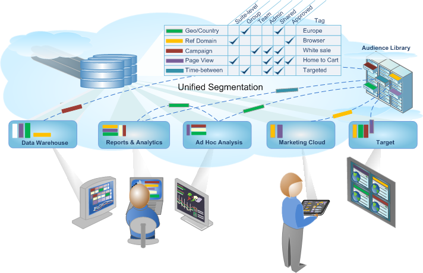

# Segmentazione di Analytics

Adobe Analytics ti consente di creare, gestire, condividere e applicare segmenti di pubblico efficaci e mirati ai tuoi rapporti utilizzando le funzionalità di Analytics, Adobe Experience Cloud, Adobe Target e altri prodotti Adobe integrati.

La segmentazione di Analytics include il [Generatore di segmenti](/help/components/segmentation/segmentation-workflow/seg-workflow.md) per creare segmenti ed eseguire un test preliminare e il [Gestore segmenti](/help/components/segmentation/segmentation-workflow/seg-workflow.md) per raccogliere i segmenti, assegnare loro tag, approvarli, impostarne la protezione e condividerli all’interno dell’organizzazione.

I data scientist e gli analisti di marketing possono utilizzare, estendere e perfezionare i segmenti per analisi specifiche in base alle proprie esigenze, quindi salvare il segmento affinché altri utenti possano estenderlo, perfezionarlo e salvarlo come nuovo segmento nella libreria. Viene così avviato un ciclo di progettazione e gestione di informazioni codificate sul pubblico come un [flusso di lavoro del segmento unificato](/help/components/segmentation/segmentation-workflow/seg-workflow.md).

**Introduzione**

Inizia con l’[Impostazione di un flusso di lavoro di segmentazione](/help/components/segmentation/segmentation-workflow/seg-workflow.md) o con la [Creazione di segmenti](/help/components/segmentation/segmentation-workflow/seg-build.md), oppure consulta le [Informazioni sui segmenti](/help/components/segmentation/seg-overview.md) per una panoramica rapida.
