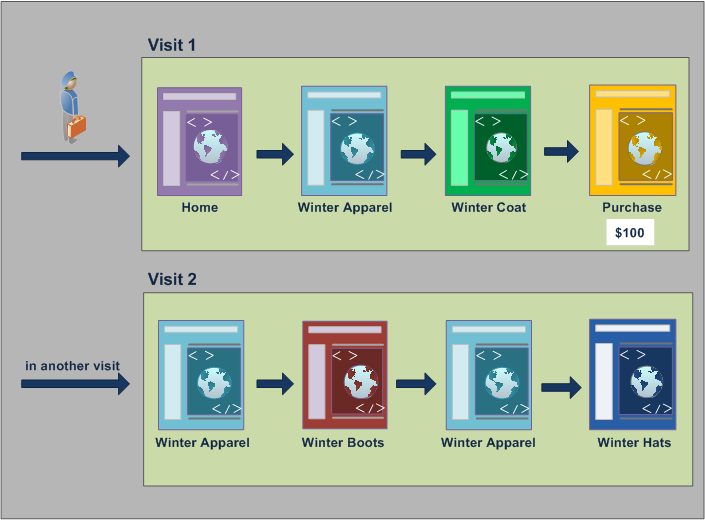
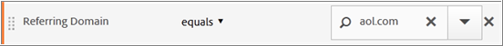
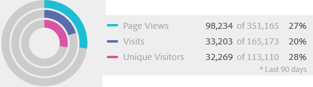

# Informazioni su segmenti e contenitori

I segmenti consentono di identificare sottoinsiemi di visitatori in base a caratteristiche o interazioni con siti Web. I segmenti sono progettati come approfondimenti di audience codificati che puoi creare per le tue esigenze specifiche, e quindi verificare, modificare e condividere con altri membri del team o utilizzarli in altri prodotti  Adobe e funzionalità di Analytics.

I segmenti si basano su una gerarchia di [!UICONTROL Visitor]livello [!UICONTROL Visit] e di [!UICONTROL Hit] livello che utilizza un modello contenitore nidificato. I contenitori nidificati consentono di definire gli attributi e le azioni dei visitatori in base alle regole tra e all’interno dei contenitori. I segmenti di Analytics possono essere generati, approvati, condivisi, salvati ed eseguiti tra più prodotti e funzionalità nel [!DNL Adobe Experience Cloud]. I segmenti possono essere generati da un rapporto, incorporati in un rapporto dashboard o contrassegnati come segnalibri per un accesso rapido.

You can build and save segments in the Segment Builder, or generate segments from a Fallout report (in [!DNL ad hoc analysis]). Puoi anche utilizzare ed estendere segmenti predefiniti basati su regole specifiche tra contenitori nidificati, per filtrare i risultati e applicarli ai rapporti. In addition, segments can be used together as [stacked segments](/help/components/segmentation/segmentation-workflow/seg-workflow.md).

## Segmenti {#section_CC4EBA2A6CCB4F8BBB8437052A880657}

I segmenti identificano chi sono i visitatori (paese, genere, caffetteria), quali dispositivi e servizi utilizzano (browser, motore di ricerca, dispositivo mobile), da dove si sono spostati (motore di ricerca, pagina di uscita precedente, ricerca naturale) e molto altro ancora.


I segmenti possono essere basati sui seguenti valori:

* Visitatori basati sugli attributi: tipo di browser, dispositivo, numero di visite, paese, genere.
* Visitatori in base alle interazioni: campagne, ricerca di parole chiave, motore di ricerca.
* Visitatori basati su uscite e voci: visitatori da Facebook, una pagina di destinazione definita, dominio di riferimento.
* Visitatori basati su variabili personalizzate: campo modulo, categorie definite, ID cliente.

Durante la creazione di segmenti di pubblico in Segment Builder (Generatore di segmenti), puoi definire le condizioni utilizzando gli [!UICONTROL AND] [!UICONTROL OR] operatori e tra i contenitori.


Questo tipo di segmento filtra i set di dati in base alle caratteristiche collegate tra loro utilizzando gli [!UICONTROL AND] operatori e [!UICONTROL OR] .

## Segmenti sequenziali {#section_EE5B14287FC44E0B96E77679A2438948}

I segmenti sequenziali consentono di identificare i visitatori in base alla navigazione e alla visualizzazione della pagina all’interno del sito, fornendo un segmento di azioni e interazioni definite. I segmenti sequenziali ti consentono di identificare cosa piace a un visitatore e cosa evita. When building sequential segments, the [!UICONTROL THEN] operator is used to define and order visitor navigation.


| Visita uno | Visita due | Visita tre |
|---|---|---|
| Nella prima visita, il visitatore è andato alla pagina di destinazione principale (A), ha escluso la pagina della campagna (B), quindi ha visualizzato la pagina Prodotto (C). | Nella seconda visita, il visitatore si è nuovamente recato alla pagina di destinazione principale (A), ha escluso la pagina della campagna (B), è tornato nuovamente alla pagina Prodotto (C), quindi a una nuova pagina (D). | Nella terza visita, il visitatore è entrato e ha seguito lo stesso percorso della prima e della seconda visita, quindi esclusa la pagina F per passare direttamente a una pagina di prodotto di destinazione (G). |

I segmenti sequenziali possono essere basati sui seguenti valori hit:

* Visitatori in base alla sequenza di hit di pagina: visualizzazioni di pagina all’interno di una singola visita, visualizzazioni di pagina in visite separate, visite che escludevano le visualizzazioni di pagina.
* Visitatori in base al tempo tra le visualizzazioni della pagina e dopo di esse, dopo un limite di tempo, tra gli hit, dopo un evento.


Un segmento sequenziale filtra i set di dati in base alle azioni dell&#39;utente che utilizzano l&#39; [!UICONTROL THEN] operatore.

## Video introduttivo {#section_89D6184890AF4086A8056BFBB0B68C29}

Questo video di YouTube offre una breve panoramica dei segmenti contenitori e di come utilizzarli.

| Nome video | Collegamento video |
|---|---|
| Contenitori segmento | [Segmento di contenitori in  Adobe Analytics](https://www.youtube.com/watch?v=A513j-ej0oc&amp;index=2&amp;list=PL2tCx83mn7GtHqZicFTa--aE6d02BvvTd) |

## Informazioni sui contenitori {#section_AF2A28BE92474DB386AE85743C71B2D6}

Un segmento imposta le condizioni per filtrare un visitatore in base ai suoi attributi o alle sue interazioni con il sito. Per impostare le condizioni in un segmento, impostate le regole per filtrare i visitatori in base alle caratteristiche e/o alle caratteristiche di navigazione del visitatore. Per suddividere ulteriormente i dati dei visitatori, puoi filtrare in base a visite e/o hit di visualizzazione pagina specifiche per ciascun visitatore. Il Generatore di segmenti offre un’architettura semplice per creare questi sottoinsiemi e applicare le regole come contenitori nidificati, gerarchici Visitatori, Visite o Hit.

The container architecture employed in the Segment Builder defines **[!UICONTROL Visitor]** as the outermost container, containing overarching data specific for the visitor across visits and page views. A nested **[!UICONTROL Visit]** container lets you set rules to break down the visitor&#39;s data based on visits, and a nested **[!UICONTROL Hit]** container lets you break down visitor information based on individual page views. Ogni contenitore consente di eseguire rapporti nella cronologia del visitatore, interazioni suddivise per visite o suddividere singoli hit.


**Contenitore visitatori**

Il contenitore Visitatore include ogni visita e visualizzazione di pagina per i visitatori entro un intervallo di tempo specificato. Un segmento a livello di Visitatore restituisce la pagina che soddisfa la condizione più tutte le altre pagine visualizzate dal visitatore (e che è vincolata solo da intervalli di date definiti). Come contenitore più ampio, i report generati a livello di contenitore Visitatore restituiranno le visualizzazioni di pagina per tutte le visite e consentono di generare un&#39;analisi multi-visita. Di conseguenza, il contenitore Visitatore è il contenitore più suscettibile a modifiche in base a intervalli di date definiti.

I contenitori dei visitatori possono includere valori basati sulla cronologia generale di un visitatore:

* Giorni precedenti al primo acquisto
* Pagina di ingresso originale
* Domini di riferimento originali

**Visita contenitore**

Il contenitore Visita consente di identificare le interazioni di pagina, le campagne o le conversioni per una specifica sessione Web. Il contenitore Visita è il contenitore più comunemente utilizzato perché acquisisce i comportamenti per l’intera sessione di visita una volta soddisfatta la regola e consente di definire quali visite includere o escludere nella creazione e nell’applicazione di un segmento. Può aiutarti a rispondere alla domanda su quanti visitatori hanno visualizzato la sezione news e sport nella stessa visita? O pagine attribuite a una conversione riuscita a una vendita?

I contenitori delle visite includono valori basati sulle occorrenze per visita:

* Numero visita
* Pagina di ingresso
* Frequenza di ritorno
* Metriche di partecipazione
* Metriche allocate linearmente

**Contenitore di hit**

Il contenitore Hit definisce gli hit di pagina da includere o escludere da un segmento. Si tratta del più ristretto tra i contenitori disponibili per identificare clic specifici e visualizzazioni di pagina quando viene soddisfatta una condizione, consentendoti di visualizzare un singolo codice di tracciamento o di isolare il comportamento all’interno di una particolare sezione del sito. Puoi inoltre identificare un valore specifico quando si verifica un’azione, ad esempio il canale di marketing al momento di un ordine.

I contenitori degli hit includono valori basati su singole suddivisioni di pagina:

* Prodotti
* Proprietà elenco
* Elenca eVar
* eVar di merchandising (nel contesto degli eventi)

   >[!NOTE]
   >
   >Se si utilizza questo contenitore su un valore che persiste, ad esempio una variabile evar, verrà eseguito il pulling in ogni hit in cui tale valore è persistente. Nel caso di un codice di tracciamento che scade dopo una settimana, tale valore potrebbe persistere per più visite.

**Contenitore gruppo logico**

Il contenitore del gruppo logico consente di fornire un contenitore separato all&#39;interno delle regole del segmento per filtrare le entità non basate sulla gerarchia. Ad esempio, potrebbe essere utile fornire un contenitore nidificato all&#39;interno del segmento che si filtra in base al visitatore. Questo tipo di logica richiede l&#39;interruzione della gerarchia (in quanto si dispone già di un contenitore Visitor di livello superiore) per filtrare solo i visitatori selezionati. Questo può essere ottenuto utilizzando il contenitore Gruppo logica. Per ulteriori informazioni, consulta Esempi [per i gruppi](/help/components/segmentation/segmentation-workflow/seg-sequential-build.md) logici.

## Nesting di contenitori {#section_7FDF47B3C6A94C38AE40D3559AFFAF70}

Durante la creazione di contenitori di segmenti all’interno di altri contenitori, si crea sostanzialmente un segmento all’interno di un segmento. La seguente logica viene utilizzata con i contenitori nidificati:

1. Determinare i dati inclusi utilizzando il contenitore più esterno. Eventuali dati che non corrispondono a questa regola esterna vengono scartati nel rapporto segmentato.
1. Applicare la regola nidificata ai dati rimanenti. La regola nidificata NON si applica agli hit che la prima regola genera.
1. Ripetere l&#39;operazione fino al calcolo di tutte le regole del contenitore nidificato. I dati rimanenti vengono quindi inclusi nel rapporto risultante.

È possibile utilizzare la nidificazione tra contenitori e tra regole all&#39;interno di un contenitore. È possibile nidificare in ciascun contenitore:

| Nome contenitore | Contenuto nidificabile |
|---|---|
| Hit | Solo eventi |
| Visita | Contenitore hit, Eventi |
| Visitatore | Visita contenitore, Hit contenitore, Eventi |
| Gruppo logica | Contenitore visitatori, Contenitore visite, Contenitore Hit |

**Includi più contenitori in una singola definizione**

L&#39;inclusione di più segmenti in un nuovo segmento composto consente di perfezionare ulteriormente i dati. Trascinate insieme due segmenti esistenti come istruzione &quot;OR&quot; quando filtrate i visitatori. Tutti i contenitori nel quadro vengono revisionati rispetto a tutti i dati, e tutti i dati che corrispondono a uno qualsiasi dei contenitori sono inclusi nel rapporto.

Ad esempio, trascinare un contenitore Visita dove Paese = Stati Uniti con un contenitore Visita in cui Ordine = Vero

```
Country = United States + Order = True
```

crea un segmento che si comporta in questo ordine:

1. Questo segmento esaminerebbe innanzitutto tutti i dati e identificherebbe tutti i visitatori negli Stati Uniti.
1. Il segmento quindi visualizzerebbe di nuovo tutti i dati, cercando di vedere se eventuali visitatori hanno effettuato un ordine.
1. Entrambi i set di dati vengono quindi applicati al rapporto.

## Contenitori per segmenti sequenziali {#section_324AF503F51A4A62806151FE440F3B2E}

La segmentazione sequenziale utilizza gli stessi contenitori di base, inclusi [!UICONTROL Visitors], [!UICONTROL Visits]e [!UICONTROL Hits] (comprese le visualizzazioni di pagina o altre dimensioni) nidificati gerarchicamente.


[!UICONTROL Visitors] costituiscono il contenitore con l&#39;ordine più alto nella segmentazione sequenziale, con [!UICONTROL Visits] contenuto all&#39;interno del [!UICONTROL Visitors] contenitore e [!UICONTROL Hits] contenuto all&#39;interno [!UICONTROL Visitors] o [!UICONTROL Visits] dei contenitori. Per creare segmenti sequenziali ben ordinati, è necessario mantenere questa gerarchia [di](/help/components/segmentation/seg-overview.md#section_7FDF47B3C6A94C38AE40D3559AFFAF70) contenitori.

**Per creare segmenti** sequenziali, i contenitori sono nidificati e la logica sequenziale uniti utilizzando l&#39; [!UICONTROL THEN] operatore che richiede che ogni contenitore sia true in base alla sequenza del visitatore.


L&#39;unica eccezione a questa gerarchia di contenitori è quando si utilizza il contenitore [del gruppo](/help/components/segmentation/segmentation-workflow/seg-sequential-build.md)logico. Il [!UICONTROL Logic Group] contenitore consente di nidificare un hit all’interno di un contenitore senza l’ordine di acquisire eventi e dimensioni ma al di fuori di un ordine sequenziale.


## Report basati sui dati del contenitore {#concept_BE822C12F87C4F07B7147D80BEFBAB87}

I contenitori consentono di filtrare i diversi dati in modo diverso in base ai valori di reporting quando si suddividono i segmenti e li si applica ai report.

I dati acquisiti a ogni livello della gerarchia Visitatore > Visita > Contenitori hit influiscono sulla modalità di creazione dei segmenti. Se si prende lo stesso segmento applicato allo stesso rapporto utilizzando lo stesso set di dati, si otterranno valori diversi in base al contenitore dal quale si genera il rapporto. Fattori come il livello di reporting dei contenitori e la persistenza dei valori tra gli hit possono comportare grandi cambiamenti nella precisione dei rapporti.

## Nozioni di base dei dati del contenitore {#section_9576D970F912450191AFB5B83F7F1656}

Ad esempio, il visitatore descritto di seguito ha visitato un sito alla prima visita, è atterrato sulla home page e poi ha visitato tre pagine aggiuntive e convertito la visita in una vendita. In una visita separata, il visitatore è atterrato questa volta attraverso la pagina Prodotto, poi alla pagina Home, di nuovo alla pagina Prodotto, e poi ha chiuso la sessione dopo aver guardato i cappelli invernali. In base ai dati acquisiti per ciascun contenitore per il segmento, nel rapporto verranno visualizzati valori diversi.

Le *pagine equivalgono al segmento del cappotto* invernale riportato di seguito viene applicato al report **** Pagine.


In base al contenitore selezionato, il rapporto visualizza risultati diversi.



**Generazione di rapporti dal contenitore Hit**

Quando questa condizione si trova all&#39;interno di un contenitore Hit, il rapporto elenca solo le pagine in cui *Page = Winter Coats* è true. Poiché solo una pagina corrisponde a questa condizione in un contenitore di una sola pagina, viene visualizzata solo la pagina Inverno Coats.


I rapporti dal contenitore Hit mostrano come i rapporti provenienti da contenitori diversi influiscono sui valori complessivi dei rapporti. Visualizzando il rapporto sui segmenti, si noti che le visualizzazioni delle pagine sono approssimativamente uguali alle visite (circa 2.000 visitatori hanno visto pagine duplicate all&#39;interno di una visita che si aggiunge al numero totale di visualizzazioni di pagina), e che i visitatori univoci sono approssimativamente uguali al numero di visite (circa 2.000 visitatori unici visitati più di una volta).


>[!IMPORTANT]
>
>Indipendentemente dalla modalità di visualizzazione dei dati, dai contenitori Hit, Visit o Visitor, questi utenti hanno tutti lo stesso numero di visitatori, 63, 541, in questo esempio. Indipendentemente dalla modalità di generazione del rapporto, la condizione iniziale del visitatore (visitatori che hanno visualizzato la pagina Inverno) rimane intatta. È il sottoinsieme di dati da cui si esegue la segnalazione ai diversi livelli.

**Generazione di rapporti dal contenitore Visita**

Se la stessa condizione si trova all’interno di un contenitore Visita, il rapporto elenca tutte le pagine della visita in cui *Page uguale a Winter Coats* è true. Filtra la pagina Inverno Cappotti, ma anche tutte le altre pagine della visita dove la condizione è vera. Poiché il visitatore ha visitato anche le pagine Home, Prodotto e Acquisto all’interno della visita in cui è stata soddisfatta la condizione, queste pagine aggiuntive sono elencate nel rapporto quando vengono segnalate utilizzando i dati del contenitore Visitatore.


Mostrando i valori del segmento dal contenitore Visita, potete notare che il numero di visualizzazioni di pagina è aumentato notevolmente. Questo perché il reporting dal contenitore Visita identifica tutte le pagine che soddisfano le condizioni, più tutte le altre pagine visualizzate nella visita (con tutte le visualizzazioni di pagina acquisite in ciascun contenitore Visita).


**Generazione di rapporti dal contenitore Visitatore**

Se la stessa condizione si trova all’interno di un contenitore Visitatore, il rapporto elenca tutte le pagine visualizzate da qualsiasi visitatore in cui *Page è uguale a Winter Coats* (Costa d’inverno). Questo significa che se un visitatore ha visualizzato la pagina Cappeti invernali, verranno elencate tutte le pagine del contenitore Visitatore, comprese le visualizzazioni di pagina in altre visite. Di conseguenza, le pagine che non corrispondono alla condizione vengono elencate nel rapporto perché il visitatore le ha visualizzate in un momento precedente. Tutte le pagine nel contenitore Visitatore vengono elencate nel rapporto, anche se si sono verificate in precedenza e non soddisfano specificatamente le condizioni.


Visualizzando i segmenti dal contenitore Visitatore, puoi vedere che le visualizzazioni e le visite delle pagine sono aumentate. Questo perché dal livello del visitatore, se il visitatore ha visitato la pagina Inverno solo una volta (rendendo la condizione true), tutte le altre visualizzazioni di pagina e tutte le altre visite vengono acquisite per quel visitatore.


In sintesi, comprendere il funzionamento della segmentazione su varie suddivisioni di dati è fondamentale per interpretare i dati restituiti.

## Generazione di rapporti in base al contenitore {#section_D0604748F2794327B8C668617A31EC18}

Ogni suddivisione dei dati del segmento ha un ambito a cui viene applicata. La maggior parte delle suddivisioni si basa sulle visualizzazioni *di* pagina, tuttavia, molti segmenti importanti si basano sul contenitore *Visita* e in misura minore sul contenitore *Visitatore* . È importante comprendere i rapporti in base all&#39;ambito del contenitore.

In base all&#39;esempio di segmento *Page = Winter Coats* utilizzato in precedenza, i problemi elencati di seguito definiscono altri aspetti del segmento in base a come vengono applicati i dati del contenitore e a come l&#39;ambito dei dati dovrebbe corrispondere al tipo di segmento.

**Contenitore di segmenti basato sulla regola di segmento corrispondente**

Se si applica il contenitore di segmenti a un ambito naturale di dati, si ottengono risultati attesi in cui gli elementi di riga corrispondono alla regola del segmento.

* **Contenitore di hit dove la pagina è uguale a &quot;Cappotto invernale&quot;**: La visualizzazione di un rapporto *Pagina* con questo segmento restituisce solo i valori che equivalgono a &quot;Inverno&quot;. Tutte le altre pagine sono escluse dal reporting.
* **Visita il contenitore in cui la pagina iniziale è uguale a &quot;Inverno Apparel&quot;**: La visualizzazione di un rapporto Pagina *di* immissione con questo segmento restituisce solo la seconda visita, perché la pagina di immissione corrisponde alla regola del segmento.
* **Visita contenitore in cui il numero di visita è uguale a 1**: Visualizzazione di una visita Tutte le visualizzazioni di pagina dalla prima visita sono incluse nel rapporto perché corrisponde alla regola del segmento.

**Visualizzazioni di pagina a livello di contenitore Visita**

Molte regole del segmento identificano le visualizzazioni di pagina per visita. In questo caso, viene applicato l&#39;intero contenitore Visitatore, se un solo hit corrisponde alla regola. Questo rapporto sui segmenti è particolarmente utile perché le visualizzazioni delle pagine basate sulle visite forniscono informazioni approfondite in base alle visualizzazioni di pagina per visita.

* **Visita il contenitore dove la pagina è uguale alla pagina**&quot;Inverno Coat&quot;: In un rapporto Pagina a livello di contenitore Visitatore vengono visualizzate tutte le visualizzazioni di pagina delle visite che includevano una vista della pagina &quot;Inverno Apparel&quot;. Se una pagina corrisponde alla regola del segmento, nel rapporto vengono incluse tutte le visualizzazioni di pagina associate a tale visita.
* **Visita contenitore in cui la pagina è uguale a &quot;Pagina** principale&quot;: In un rapporto Pagina con questo segmento vengono visualizzati solo i dati della prima visita. Questo perché nella seconda visita il visitatore non visualizzava una pagina &quot;Home&quot;.
* **Contenitore del visitatore la cui pagina è uguale a &quot;Inverno Apparel&quot;**: In un rapporto Pagina, questo segmento recupera tutti i dati da entrambe le visite perché in entrambe le visite il visitatore ha visualizzato la pagina &quot;Inverno Apparel&quot;.

**Contenitore di segmenti che identifica gli hit più piccoli delle visualizzazioni di pagina**

Se si utilizza un segmento con un contenitore più piccolo dell&#39;ambito di suddivisione, vengono restituiti dati imprevisti. Se si utilizza una suddivisione più piccola, vengono comunque inseriti tutti gli hit dall’ambito di dati specificato.

* **Hit contenitore in cui la pagina di immissione è uguale alla pagina** Prodotto: Ogni pagina viene associata alla pagina iniziale della visita, per cui viene suddivisa in base alle visite. L’utilizzo di questo segmento non interessa solo la pagina di prodotto della pagina iniziale, ma anche tutti gli hit della visita.
* **Contenitore di hit in cui l&#39;elenco Var 1 contiene ValueA**: Se più valori sono stati definiti sullo stesso hit della variabile list var, tutti i valori delle variabili sono inclusi nel segmento. Non è possibile separare i valori che si verificano nella stessa visualizzazione pagina perché il contenitore Hit è il contenitore segmento più piccolo per suddividere gli hit.
* **Contenitore di hit dove Page è uguale a &quot;Purchase&quot;**: Se si utilizzano le visualizzazioni di pagina come metrica, viene visualizzata solo la pagina Acquisto (come previsto). Se si utilizza un rapporto Partecipazione alle entrate, tutte le pagine della prima visita riceveranno $100, poiché le metriche di partecipazione sono basate sulle visite.
* **Contenitore di hit dove Page è uguale a &quot;Winter Coat&quot;**: Se si utilizzano le visualizzazioni di pagina come metrica, viene visualizzata solo la pagina corrispondente invernale (come previsto). Se si utilizza un rapporto Partecipazione alle entrate, non vengono accreditate pagine perché questa dimensione richiede una dimensione persistente. La visualizzazione della pagina che ha effettuato l’acquisto (pagina Acquisto) non è inclusa nel contenitore Hit, quindi non viene data alcuna partecipazione alle entrate per alcun articolo. Tuttavia, l&#39;esecuzione di un rapporto dal contenitore Visita includerebbe tutte le visualizzazioni di pagina in quella visita e distribuirebbe la partecipazione alle entrate ($100) tra tutte le pagine visualizzate nella sessione.

## Persistenza tra contenitori {#concept_E579D72B1C644AE9A4C4EAF6B47A4DCB}

Il filtraggio in base alle dimensioni che persistono in un intervallo di pagine, ad esempio un eVar Campaign   o una dimensione Referring, influisce sui dati raccolti a livello di contenitore e deve essere compreso per la precisione dei report.

I dati del segmento possono variare in base alla persistenza di una dimensione o variabile applicata nelle pagine selezionate. Alcune dimensioni, come la dimensione Pagina, forniscono valori univoci a livello di pagina e vengono filtrate in base ai dati provenienti dal contenitore Hit. (Vedere l&#39;esempio [Rapporti basati su Dati](/help/components/segmentation/seg-overview.md) contenitore). Altre dimensioni, come la dimensione Dominio di riferimento, persistono su più pagine per una visita. Alcune dimensioni o variabili applicate, come Durata visita, si estendono sull&#39;intera cronologia di un visitatore.



A differenza della dimensione Pagina, il valore Dominio di riferimento è associato a ogni pagina di questa visita. Ad esempio, il visitatore di seguito arriva alla home page da un sito di riferimento. Di conseguenza, a tutte le pagine all’interno di tale visita viene assegnato lo stesso valore di dominio di riferimento.

Il dominio di *riferimento è uguale al segmento aol.com* riportato di seguito, applicato al report **** Pagine.


In una nuova visita, al visitatore viene fatto riferimento da un altro sito. Di conseguenza, a tutte le pagine della nuova visita viene assegnato il nuovo valore di dominio di riferimento per ciascuna visualizzazione di pagina.

**Generazione di rapporti dal contenitore Hit**

Poiché a tutte le visualizzazioni di pagina all’interno della stessa visita viene assegnato lo stesso valore di Dominio di riferimento, il reporting a livello del contenitore Hit in cui Dominio di *riferimento = &quot;aol.com&quot;* restituisce tutte le pagine elencate nella tabella seguente.


Visualizzando i dati dal contenitore Hit, poco più di 92.000 visualizzazioni di pagina sono state visualizzate in oltre 33.000 visite da poco più di 32.000 visitatori. In media, in ogni visita erano presenti tre visualizzazioni di pagina, e quasi tutte le visite erano effettuate da visitatori univoci.



**Generazione di rapporti dal contenitore Visita**

Se la stessa condizione viene filtrata nel contenitore Visita per un report Pagine, tutte le pagine della visita in cui Domain *Referring = &quot;aol.com&quot;* sono vere. Poiché il valore del dominio di riferimento è impostato a livello di visita, i rapporti a livello di Visualizzazione pagina e Visita sono gli stessi.


In questo esempio, poiché tutte le pagine hanno lo stesso valore di dominio di riferimento in base alla visita, il rapporto a livello di contenitore Visita è (quasi) lo stesso del rapporto del contenitore Visualizzazione pagina (con un leggero offset (da 98 a 234 a 98.248) a causa di anomalie nei dati).


**Generazione di rapporti dal contenitore Visitatore**

Dal contenitore Visitatore, il rapporto Pagina elenca tutte le pagine visualizzate da qualsiasi visitatore in cui Domain *Referring è uguale a &quot;aol.com&quot;* . Di conseguenza, se un visitatore aveva *&quot;aol.com&quot;* come dominio di riferimento in qualsiasi momento della cronologia (entro il periodo di tempo definito), verranno elencate tutte le pagine del contenitore Visitatore, comprese le visualizzazioni di pagina in altre visite. Anche le pagine che non corrispondono alla condizione principale verranno elencate nel rapporto perché queste pagine sono incluse nel contenitore Visitatore. Tutte le pagine nel contenitore Visitatore vengono elencate nel rapporto, anche se si sono verificate in precedenza e non soddisfano specificatamente le condizioni.

In un report Dominio di riferimento, *Referring Domain = &quot;aol.com&quot;* è true in quattro visualizzazioni di pagina, ma *Referring Domain = &quot;meteora.com&quot;* è true nelle altre pagine colpite dal visitatore. Dal contenitore Visitatore, viene visualizzato un elenco di Visitatori in cui &quot;aol.com&quot; è vero, ma fornisce anche delle pagine in cui il dominio di riferimento è &quot;meteorologo.com&quot;, non il valore che corrisponde alla richiesta iniziale nel segmento.


Quando visualizzi i dati dal contenitore Visitatore, le visualizzazioni di pagina sono aumentate in modo significativo (da 98.248 a 112.925). Questo perché sono state elencate tutte le visualizzazioni di pagina del visitatore, comprese quelle con altri valori di dominio di riferimento salvati a livello del contenitore Visitatore (così come le visite aggiuntive da parte del visitatore, che hanno aumentato le visite da 33.203 a 43.448).


In sintesi,

* Il contenitore Visita restituisce tutte le pagine visualizzate in una visita in cui almeno una pagina soddisfa i criteri. Pertanto, se una pagina viene visualizzata solo alla visita 1 del giorno 1, tutte le pagine visualizzate nell’intera visita sono incluse nei dati.
* Prestate attenzione quando la condizione su cui state segmentando è su un eVar  o un altro tipo di variabile persistente. Ad esempio, potete utilizzare la condizione &quot;dove la campagna contiene e-mail&quot; e che scade dopo 7 giorni. Quindi, se la campagna è impostata sulla prima visita, persisterà per altri 7 giorni. Ogni visita sarà inclusa anche se la campagna è stata impostata solo alla prima visita. Saranno incluse anche le altre visite (purché rientrino nell&#39;intervallo di date del rapporto). Se desiderate eliminare l&#39;inclusione di valori persistenti, utilizzate l&#39;evento &quot;instance of&quot; oppure una variabile Prop equivalente, se disponibile.

