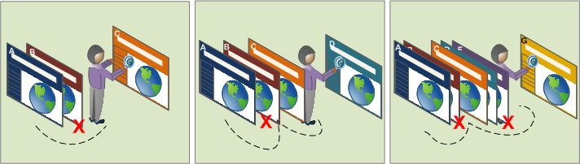

# Informazioni sui segmenti

I segmenti consentono di identificare sottoinsiemi di visitatori in base a caratteristiche o interazioni con siti web. I segmenti sono progettati come insight sul pubblico che puoi creare per esigenze specifiche e successivamente puoi verificarli, modificarli e condividerli con altri membri del team o utilizzarli in altri prodotti Adobe e in altre funzionalità di Analytics.

I segmenti si basano su una gerarchia a livello di [!UICONTROL Visitor], [!UICONTROL Visit] e [!UICONTROL Hit] che utilizza un modello di contenitori nidificati. I contenitori nidificati ti consentono di definire gli attributi e le azioni dei visitatori in base alle regole tra e all’interno dei contenitori. I segmenti di Analytics possono essere generati, approvati, condivisi, salvati ed eseguiti tra più prodotti e funzionalità in [!DNL Adobe Experience Cloud]. I segmenti possono essere generati da un rapporto, incorporati in un rapporto dashboard o contrassegnati con segnalibro per l’accesso rapido.

Puoi generare e salvare i segmenti nel Generatore di segmenti o generarli da un rapporto di fallout (in [!UICONTROL Analysis Workspace]). Puoi anche utilizzare ed estendere segmenti predefiniti basati su regole specifiche tra contenitori nidificati, per filtrare i risultati e applicarli ai rapporti. Inoltre, i segmenti possono essere utilizzati insieme come [segmenti sovrapposti](/help/components/segmentation/segmentation-workflow/seg-workflow.md).

Identificazione dei segmenti

- chi sono i visitatori (paese, genere, caffetteria),
- quali dispositivi e servizi utilizzano (browser, motore di ricerca, dispositivo mobile),
- luogo di navigazione (motore di ricerca, pagina di uscita precedente, ricerca naturale),
- e molto di più.

<!---->

I segmenti possono essere basati sui seguenti valori:

- Visitatori in base agli attributi: tipo di browser, dispositivo, numero di visite, paese, genere.
- Visitatori in base alle interazioni: campagne, ricerca di parole chiave, motore di ricerca.
- Visitatori in base a uscite ed entrate: visitatori da Facebook, da una pagina di destinazione definita, da un dominio di riferimento.
- Visitatori in base a variabili personalizzate: campo modulo, categorie definite, ID cliente.

Durante la creazione di segmenti di pubblico nel Generatore di segmenti, puoi definire le condizioni utilizzando gli operatori [!UICONTROL AND] e [!UICONTROL OR] tra i contenitori.

<table style="table-layout:fixed; border: none;">

<tr>

<td style="background-color: #E5E4E2;" colspan="3" width="200" height="100"> Visitatori</td>
</tr>

<tr>
<td style="background-color: #E5E4E2;" width="200"></td>
<td style="background-color: #D3D3D3;" colspan="2" width="200" height="100"> Visite</td>
</tr>

<tr>
<td style="background-color: #E5E4E2;" width="200" height="100"></td>
<td style="background-color: #D3D3D3;" width="200" height="100"></td>
<td style="background-color: #C0C0C0;" width="200" height="100" colspan="1"> Hit</td>
</tr>

<tr>
<td style="background-color: #E5E4E2;"></td><td colspan="2">E</td></td>
</tr>

<tr>
<td style="background-color: #E5E4E2;" width="200"></td>
<td style="background-color: #D3D3D3;" colspan="2" width="200" height="100"> Visite</td>
</tr>

<tr>
<td style="background-color: #E5E4E2;" width="200" height="100"></td>
<td style="background-color: #D3D3D3;" width="200" height="100"></td>
<td style="background-color: #C0C0C0;" width="200" height="100" colspan="1"> Hit</td>
</tr>
</table>

<table style="table-layout:fixed; border: none;">

<tr>

<td style="background-color: #E5E4E2;" colspan="3" width="200" height="100"> Visitatori</td>
</tr>

<tr>
<td style="background-color: #E5E4E2;" width="200"></td>
<td style="background-color: #D3D3D3;" colspan="2" width="200" height="100"> Visite</td>
</tr>

<tr>
<td style="background-color: #E5E4E2;" width="200" height="100"></td>
<td style="background-color: #D3D3D3;" width="200" height="100"></td>
<td style="background-color: #C0C0C0;" width="200" height="100" colspan="1"> Hit</td>
</tr>

<tr>
<td style="background-color: #E5E4E2;"></td><td colspan="2">O</td></td>
</tr>

<tr>
<td style="background-color: #E5E4E2;" width="200"></td>
<td style="background-color: #D3D3D3;" colspan="2" width="200" height="100"> Visite</td>
</tr>

<tr>
<td style="background-color: #E5E4E2;" width="200" height="100"></td>
<td style="background-color: #D3D3D3;" width="200" height="100"></td>
<td style="background-color: #C0C0C0;" width="200" height="100" colspan="1"> Hit</td>
</tr>
</table>

<!---->

Questo tipo di segmento filtra i set di dati in base alle caratteristiche unite utilizzando gli operatori [!UICONTROL AND] e [!UICONTROL OR].

- Puoi [applicare più segmenti a un rapporto o a un progetto](/help/components/segmentation/segmentation-workflow/seg-workflow.md).
- I segmenti sono universali per tutte le suite di rapporti.
- Il [Generatore di segmenti](/help/components/segmentation/segmentation-workflow/seg-workflow.md) semplifica la creazione dei segmenti.
- Il [Gestore segmenti](/help/components/segmentation/segmentation-workflow/seg-workflow.md) consente di impostare [flussi di lavoro](/help/components/segmentation/segmentation-workflow/seg-workflow.md) con funzioni di condivisione dei segmenti, assegnazione di tag, verifica e approvazione.
- Puoi [assegnare tag ai segmenti](/help/components/segmentation/segmentation-workflow/seg-workflow.md) per organizzarli ed effettuare ricerche in un secondo momento, anziché utilizzare le cartelle.
- Puoi creare [Segmenti sequenziali](/help/components/segmentation/segmentation-workflow/seg-sequential-build.md).
- Il contenitore [!UICONTROL Page View] è stato rinominato contenitore [!UICONTROL Hit] per indicare che segmenta tutti i tipi di dati e non solo le visualizzazioni di pagina. Ad esempio, le chiamate di tracciamento dei collegamenti e le chiamate trackAction dagli SDK per dispositivi mobili sono tutte incluse o escluse dal contenitore Hit.

## Segmentazione in Analysis Workspace:

Analysis Workspace contiene le seguenti funzioni aggiuntive:

- Puoi [confrontare i segmenti](../../analyze/analysis-workspace/c-panels/c-segment-comparison/segment-comparison.md).
- Utilizzare i [segmenti come dimensioni](https://experienceleague.adobe.com/docs/core-services/interface/audiences/audience-library.html?lang=it) in un confronto.
- Utilizzare i segmenti nell’[analisi dell’abbandono](../../analyze/analysis-workspace/visualizations/fallout/compare-segments-fallout.md).

## Segmenti forniti da Adobe

La barra Componenti sul lato sinistro della schermata mostra i segmenti creati da te e dalla tua azienda e i segmenti forniti da Adobe. Quando fai clic su **[!UICONTROL Show all]**, in genere questi segmenti vengono visualizzati nella parte inferiore dell’elenco e sono identificati dal logo di Adobe a destra.

## Segmenti sequenziali {#sequential}

I segmenti sequenziali ti consentono di identificare i visitatori in base alla navigazione e alla visualizzazione di pagine nel sito, fornendo un segmento di azioni e interazioni definite. I segmenti sequenziali ti consentono di identificare cosa piace a un visitatore e cosa evita. Quando si creano segmenti sequenziali, l’operatore [!UICONTROL THEN] viene utilizzato per definire e ordinare la navigazione dei visitatori.

<!---->

| Visita uno | Visita due | Visita tre |
|---|---|---|
| Durante la prima visita, il visitatore è passato alla pagina di destinazione principale A, ha escluso la pagina della campagna B e ha visualizzato la pagina di prodotto C. | Durante la seconda visita, ancora una volta il visitatore è passato alla pagina di destinazione principale A, ha escluso la pagina della campagna B ed è passato alla pagina di prodotto C, quindi è passato alla nuova pagina D. | Durante la terza visita, il visitatore è entrato e ha seguito lo stesso percorso della prima e della seconda visita, quindi ha escluso la pagina F per passare direttamente a una pagina di prodotto target G. |

I segmenti sequenziali possono essere basati sui seguenti valori hit:

- Visitatori in base alla sequenza di hit della pagina: visualizzazioni pagina all’interno di una singola visita, visualizzazioni pagina in visite separate, visite in cui sono state escluse visualizzazioni pagina.
- Visitatori in base al tempo tra e dopo le visualizzazioni pagina: dopo un limite di tempo, tra gli hit, dopo un evento.

<table style="table-layout:fixed; border: none;">

<tr>

<td style="background-color: #E5E4E2;" colspan="3" width="200" height="100"> Visitatori</td>
</tr>

<tr>
<td style="background-color: #E5E4E2;" width="200"></td>
<td style="background-color: #D3D3D3;" colspan="2" width="200" height="100"> Visite</td>
</tr>

<tr>
<td style="background-color: #E5E4E2;" width="200" height="100"></td>
<td style="background-color: #D3D3D3;" width="200" height="100"></td>
<td style="background-color: #C0C0C0;" width="200" height="100" colspan="1"> Hit</td>
</tr>

<tr>
<td style="background-color: #E5E4E2;"></td><td colspan="2">POI</td></td>
</tr>

<tr>
<td style="background-color: #E5E4E2;" width="200"></td>
<td style="background-color: #D3D3D3;" colspan="2" width="200" height="100"> Visite</td>
</tr>

<tr>
<td style="background-color: #E5E4E2;" width="200" height="100"></td>
<td style="background-color: #D3D3D3;" width="200" height="100"></td>
<td style="background-color: #C0C0C0;" width="200" height="100" colspan="1"> Hit</td>
</tr>
</table>

<table style="table-layout:fixed; border: none;">

<tr>

<td style="background-color: #E5E4E2;" colspan="3" width="200" height="100"> Visitatori</td>
</tr>

<tr>
<td style="background-color: #E5E4E2;" width="200"></td>
<td style="background-color: #D3D3D3;" colspan="2" width="200" height="100"> Visite</td>
</tr>

<tr>
<td style="background-color: #E5E4E2;" width="200" height="100"></td>
<td style="background-color: #D3D3D3;" width="200" height="100"></td>
<td style="background-color: #C0C0C0;" width="200" height="100" colspan="1"> Hit</td>
</tr>

<tr>
<td style="background-color: #E5E4E2;"></td><td style="background-color: #D3D3D3;"></td><td>E</td></td>
</tr>

<tr>
<td style="background-color: #E5E4E2;" width="200" height="100"></td>
<td style="background-color: #D3D3D3;" width="200" height="100"></td>
<td style="background-color: #C0C0C0;" width="200" height="100" colspan="1"> Hit</td>
</tr>

<tr>
<td style="background-color: #E5E4E2;"></td><td colspan="2">POI</td></td>
</tr>

<tr>
<td style="background-color: #E5E4E2;" width="200"></td>
<td style="background-color: #D3D3D3;" colspan="2" width="200" height="100"> Visite</td>
</tr>

<tr>
<td style="background-color: #E5E4E2;" width="200" height="100"></td>
<td style="background-color: #D3D3D3;" width="200" height="100"></td>
<td style="background-color: #C0C0C0;" width="200" height="100" colspan="1"> Hit</td>

<tr>
<td style="background-color: #E5E4E2;"></td><td style="background-color: #D3D3D3;"></td><td>O</td></td>
</tr>

<tr>
<td style="background-color: #E5E4E2;" width="200" height="100"></td>
<td style="background-color: #D3D3D3;" width="200" height="100"></td>
<td style="background-color: #C0C0C0;" width="200" height="100" colspan="1"> Hit</td>
</tr>
</tr>
</table>

<!---->

Un segmento sequenziale filtra i set di dati in base alle azioni degli utenti che utilizzano l’operatore [!UICONTROL THEN].

## Video sulla segmentazione {#segment-video}

Questo video offre una breve panoramica sui contenitori di segmenti e su come utilizzarli.

>[!BEGINSHADEBOX]

Per un video demo, vedi  [Contenitori di segmenti](https://video.tv.adobe.com/v/25401?quality=12&learn=on){target="_blank"}.

>[!ENDSHADEBOX]

## Accedere agli strumenti di segmentazione {#access}

+++ **Come si accede al Generatore di segmenti?**

Per accedere al Generatore di segmenti:

- Visualizzazione di un rapporto esistente e clic sull’icona dei segmenti  nella barra di navigazione a sinistra. Nella barra del segmento visualizzata, fai clic su **[!UICONTROL Add]**, oppure

- Nella parte superiore del Gestore segmenti, fai clic su **[!UICONTROL + Add]**.  

  oppure

- Fai clic sul titolo di un segmento esistente nel Gestore segmenti per modificare il segmento nel Generatore di segmenti.

+++

+++ **Come si accede al Gestore segmenti?**

Per accedere al Gestore segmenti:

- Vai a **[!UICONTROL Analytics]** > **[!UICONTROL Components]** nella navigazione superiore. Quindi fai clic su **[!UICONTROL Segments]**, oppure

- Visualizza un report esistente e fai clic sull’icona Segmenti  nella barra di navigazione a sinistra. Quindi fai clic su **[!UICONTROL Manage]**, oppure

- Premi il tasto barra “/” in qualsiasi punto dell’interfaccia e cerca il Gestore segmenti.

+++

## Autorizzazioni {#section_648DFA3A882146C485A84ED014EEC707}

+++ **Quali diritti e privilegi servono per utilizzare, creare e gestire i segmenti?**

Per impostazione predefinita, tutti gli utenti possono creare e modificare segmenti personali. Tuttavia, gli amministratori possono decidere chi può disporre delle [autorizzazioni per la creazione di segmenti](https://experienceleague.adobe.com/docs/analytics/admin/admin-console/home.html?lang=it) e possono assegnarle a gruppi specifici. Questi segmenti possono essere condivisi direttamente con qualsiasi altro utente Analytics.

Gli amministratori possono modificare qualsiasi segmento e condividere i segmenti con i gruppi e con tutti gli altri utenti dell’organizzazione. [Altro...](/help/components/segmentation/seg-reference/seg-rights.md)

+++

+++ **Posso visualizzare tutti i segmenti nella mia azienda?**

Sì, gli amministratori possono visualizzare tutti i segmenti all’interno dell’interfaccia utente di [!DNL Analysis Workspace].

Report Builder mostra i segmenti di tua proprietà e quelli condivisi con te.

+++

+++ **Posso gestire tutti i segmenti di Analytics nel Gestore segmenti?**

Sì, tutti i segmenti possono essere gestiti nel Gestore segmenti. Il Gestore segmenti mostra i segmenti che possono essere visualizzati dal proprietario (l’utente che ha creato i segmenti), dagli utenti con cui sono stati condivisi e dagli amministratori. Il selettore dei segmenti mostra i segmenti di proprietà dell’utente e quelli condivisi con l’utente.

Gli amministratori possono visualizzare tutti i segmenti all’interno dell’interfaccia utente di Analysis Workspace.

Report Builder mostra solo i segmenti generati da te o quelli che sono stati condivisi con te specificamente.

+++

+++ **Perché non posso eliminare questo segmento?**

Se il segmento è stato [pubblicato in Experience Cloud](/help/components/segmentation/segmentation-workflow/seg-workflow.md), non è possibile eliminarlo o modificarlo. Tuttavia, puoi copiarlo e modificare la versione copiata.

+++
