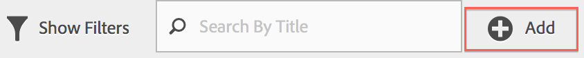
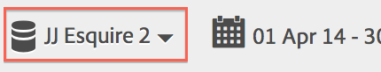

# Domande frequenti

Risposte alle domande frequenti su funzioni di segmentazione, accesso, autorizzazioni, procedure ottimali e gestione di segmenti legacy.

## Funzioni {#section_BD58629D1A9346BF879E229FA6BEC7A2}

* Segmentazione in  Analysis Workspace:

   * Puoi [confrontare i segmenti](https://docs.adobe.com/content/help/it-IT/analytics/analyze/analysis-workspace/panels/segment-comparison/segment-comparison.html).
   * Utilizza [i segmenti come dimensioni](https://docs.adobe.com/content/help/it-IT/core-services/interface/audiences/audience-library.html) in un confronto.
   * Use segments in [fallout analysis](https://docs.adobe.com/help/en/analytics/analyze/analysis-workspace/visualizations/fallout/compare-segments-fallout.html).

* Puoi [applicare più segmenti a un rapporto o a un progetto](/help/components/segmentation/segmentation-workflow/seg-workflow.md).
* I segmenti sono universali per tutte le suite di rapporti.
* Il Generatore di [segmenti](/help/components/segmentation/segmentation-workflow/seg-workflow.md) semplifica la creazione di segmenti.
* Gestione  segmenti consente di impostare [flussi di lavoro](/help/components/segmentation/segmentation-workflow/seg-workflow.md) con funzioni di condivisione dei segmenti, assegnazione di tag, verifica e approvazione.

* Puoi assegnare [tag ai segmenti](/help/components/segmentation/segmentation-workflow/seg-workflow.md) per organizzarli ed effettuare ricerche in un secondo momento, anziché utilizzare le cartelle. Precedentemente, per organizzare i segmenti erano state utilizzate le cartelle (in [!DNL Ad Hoc Analysis]).

* Puoi creare segmenti  sequenziali all’esterno di  Ad Hoc Analysis.
* Il contenitore Visualizzazione pagina è stato rinominato nel contenitore Hit per indicare che questo contenitore segmenta tutti i tipi di dati e non solo le visualizzazioni di pagina. Ad esempio, le chiamate di tracciamento dei collegamenti e le chiamate trackAction dagli SDK per dispositivi mobili sono tutte incluse o escluse dal contenitore degli hit. Notate che non c&#39;è stata una modifica al modo in cui funziona questo contenitore - è stato semplicemente rinominato.

Per ulteriori informazioni, consulta [Miglioramento della segmentazione in  post di Adobe Analytics](https://blogs.adobe.com/digitalmarketing/analytics/improving-segmentation-adobe-analytics/) sul blog Digital Marketing.

## Accesso agli strumenti di segmentazione {#section_088AD0E4E21943DFA8CF7206AEC485DD}

**Come si raggiunge il Generatore di segmenti?**

Per accedere al Generatore di segmenti:

* Visualizzare un rapporto esistente e fare clic sull&#39;icona Segmenti  nella navigazione a sinistra. Nella barra del segmento visualizzata, fai clic su **[!UICONTROL Add]** oppure

* Nella parte superiore del Gestore segmenti, fai clic su **[!UICONTROL + Add]**.  

    oppure 

* Fai clic sul titolo di un segmento esistente in Segment Manager (Gestore segmenti) per modificare il segmento nel Segment Builder (Generatore di segmenti).

**Come si accede a Segment Manager?**

Accedi a Segment Manager tramite:

* Vai a **[!UICONTROL Analytics]** > **[!UICONTROL Components]** nella navigazione superiore. Quindi fai clic su **[!UICONTROL Segments]**, oppure

* Visualizzare un rapporto esistente e fare clic sull&#39;icona Segmenti  nella navigazione a sinistra. Quindi fai clic su **[!UICONTROL Manage]**, oppure

* Premere il tasto barra &#39;/&#39; ovunque nell&#39;interfaccia e cercare Segment Manager.

**Dov&#39;è andato a discesa il segmento legacy?**

Il menu a discesa dei segmenti in Reporting e analisi è stato sostituito da un&#39;interfaccia molto più ampia di Generatore [di](/help/components/segmentation/segmentation-workflow/seg-workflow.md) segmenti che consente di creare segmenti &quot;universali&quot; utilizzabili tra le suite di rapporti e tra  soluzioni Adobe Analytics. Per visualizzare un elenco dei segmenti esistenti, fai clic sull’icona Segmenti  

nella barra di navigazione a sinistra e viene visualizzata la barra dei segmenti.

**Dov&#39;è andato a discesa la suite di rapporti legacy?**

Il menu a discesa della suite di rapporti è stato spostato accanto al selettore di date nell&#39;angolo superiore destro di ciascun rapporto o dashboard.

## Autorizzazioni {#section_648DFA3A882146C485A84ED014EEC707}

**Quali diritti e privilegi devo utilizzare, creare e gestire i segmenti?**

Per impostazione predefinita, tutti gli utenti possono creare e modificare segmenti personali. Tuttavia, gli amministratori possono decidere chi deve disporre [delle autorizzazioni per creare segmenti](https://docs.adobe.com/content/help/it-IT/analytics/admin/user-product-management/user-groups/groups.html) e assegnarli a gruppi specifici. Questi segmenti possono essere condivisi direttamente con qualsiasi altro utente Analytics.

Gli amministratori possono modificare qualsiasi segmento e condividere i segmenti con i gruppi e con tutti gli altri membri dell&#39;organizzazione. [Altro...](/help/components/segmentation/seg-reference/seg-rights.md)

**Posso visualizzare tutti i segmenti nella mia azienda?**

Sì, gli amministratori possono visualizzare tutti i segmenti all’interno delle interfacce [!DNL Analysis Workspace] e [!DNL Reports & Analytics] utente.

Analisi ad hoc e Report Builder mostrano segmenti di proprietà e segmenti condivisi con voi.

**Posso gestire tutti i segmenti di Analytics in Segment Manager?**

Sì, tutti i segmenti possono essere gestiti in Segment Manager (Gestore segmenti) in  Analysis Workspace, Reporting e analisi e  Ad Hoc Analysis. Segment Manager (Gestione segmenti) visualizza i segmenti che sono visibili al proprietario (utente che ha creato il segmento), agli utenti condivisi e agli utenti di amministrazione. Il selettore dei segmenti visualizza i segmenti di proprietà e condivisi con l’utente.

Gli amministratori possono visualizzare tutti i segmenti all&#39;interno dell&#39;Analysis Workspace  e delle interfacce [!DNL Reports & Analytics] utente.

 Ad Hoc Analysis e il Report Builder visualizzano solo i segmenti generati dall&#39;utente stesso o che sono stati condivisi specificatamente con l&#39;utente.

**Perché non posso eliminare questo segmento?**

Se il segmento è stato [pubblicato nel Experience Cloud](/help/components/segmentation/segmentation-workflow/seg-workflow.md), non è possibile eliminarlo o modificarlo. Tuttavia, potete copiarlo e modificare la versione copiata.

## Best practice {#section_E2C3A1B4B4274D1B86CAA9C0359D049C}

**Cosa devo fare con segmenti duplicati con lo stesso nome ma con definizioni diverse?**
Ora che i segmenti funzionano in più suite di rapporti, potresti avere più segmenti con lo stesso nome. È consigliabile

* Rinominare segmenti con lo stesso nome, ma definizioni diverse, oppure
* Elimina segmenti non più necessari.

**Cosa suggerisce  Adobe per quanto riguarda la pulizia dei segmenti?**

* Assegna tag a tutti i segmenti con tag legacy.
* Rivedete i segmenti che avete.
* Aggiungeteli alla libreria dei segmenti, se applicabile.
* Approva segmenti canonici.
* Assegnare tag ai segmenti in base alle [best practice](/help/components/segmentation/segmentation-workflow/seg-workflow.md).

## Gestione dei segmenti legacy {#section_76CF47142D1A4FB6A0718AD9073049FE}

**Cos&#39;è successo ai segmenti esistenti?**

I segmenti esistenti continueranno a funzionare come prima. Tutti i report a cui sono applicati questi segmenti continueranno a funzionare correttamente. [Altro...](/help/components/segmentation/seg-transition.md)

La maggior parte dei segmenti predefiniti e suite precedenti verranno trasferiti come modelli di segmento nel Generatore di segmenti. I modelli di segmento sono utilizzati per creare rapidamente segmenti personalizzati con audience comuni. I modelli di segmento non possono essere applicati direttamente a un report, ma possono essere facilmente salvati in un segmento personalizzato.

I modelli di segmento sono contrassegnati da un’icona speciale in Generatore di segmenti:

**Cos’è successo alle cartelle dei segmenti esistenti?**

Invece di ( Ad Hoc Analysis) cartelle, Segment Manager utilizza i tag . I nomi delle cartelle vengono automaticamente convertiti in tag e tali tag vengono applicati ai rispettivi segmenti.

**Cos&#39;è successo ai report pianificati con segmenti applicati?**

I report pianificati continuano a essere eseguiti correttamente con i segmenti definiti.

Quando eliminate un segmento, i rapporti pianificati e le dashboard a cui è applicato questo segmento continuano a funzionare normalmente, ovvero il segmento o la dashboard continua a utilizzare il segmento eliminato.

I rapporti pianificati non vengono aggiornati quando si modifica un segmento con lo stesso nome. Esempio: Supponiamo che tu abbia 2 segmenti con lo stesso nome in suite di rapporti diverse:

È presente un segnalibro che fa riferimento al segmento per la suite di rapporti principale. Quindi si elimina quel segmento perché è un duplicato. Il segnalibro continuerà a essere eseguito, facendo riferimento alla definizione del segmento eliminato. Se si modifica la definizione del segmento per il segmento principale in modo da includere Catalina Island e Tijuana Mexico, il segmento applicato al segnalibro non verrà modificato. Utilizzerà la vecchia definizione. Per risolvere il problema, aggiornare il segnalibro in modo che faccia riferimento alla nuova definizione. Se non sei sicuro se un segnalibro, una dashboard o un rapporto pianificato utilizza un segmento eliminato, puoi modificare il nome del segmento rimanente in modo che sia più chiaro se il segnalibro utilizza il segmento rimanente.

**Cosa succede ai segmenti di Data Warehouse?**

Tutti i segmenti di Data Warehouse esistenti funzionano ancora nella Data Warehouse. La maggior parte dei segmenti di Data Warehouse funzionerà anche in altri componenti come  Analysis Workspace,  Ad Hoc Analysis e Reporting e analisi.

Puoi creare o modificare nuovi segmenti di Data Warehouse nel generatore/manager segmenti. Il meccanismo di compatibilità dei prodotti nel Generatore di segmenti determina automaticamente se un segmento è compatibile con l’Data Warehouse.

**Cosa succede ai segmenti preferiti ( Ad Hoc Analysis)?**

Questi segmenti  Ad Hoc Analysis vengono visualizzati come segmenti regolari in  Adobe Analytics.

Non devono essere confusi con la funzione Preferiti in Segment Manager (Gestore segmenti), che consente di contrassegnare i segmenti come preferiti.

**Cosa succede ai segmenti preconfigurati?**

* **Visite a pagina singola**
* **Visite da dispositivi mobili**
* **Visite da Ricerca naturale**
* **Visite da ricerca a pagamento**
* **Visite con il cookie ID visitatore**

Questi segmenti verranno trasferiti come modelli di segmento nel Generatore di segmenti.

I rapporti esistenti con questi segmenti continueranno a funzionare correttamente.

**Cosa succede ai segmenti  Experience Cloud (Suite):**

* Non acquirenti
* Acquirenti
* Prima visita
* Visite dai siti social
* Visite di oltre 10 minuti*
* Visite con 5+ visite precedenti*
* Visite da Facebook*

La maggior parte di questi segmenti (tranne quelli contrassegnati con un asterisco *) verrà migrata come modelli di segmento nel generatore di segmenti. Inoltre, sono stati aggiunti diversi nuovi modelli di segmento.

I rapporti esistenti con questi segmenti continueranno a funzionare correttamente.

**Cosa succede ai segmenti Admin (noti anche come segmenti &quot;globali&quot;)?**

**I segmenti amministratore** verranno migrati nella nuova interfaccia del segmento e visualizzati come segmenti condivisi con tutti.

Il proprietario di questi segmenti è impostato sull’amministratore con l’account più vecchio nell’elenco degli utenti di amministrazione della società di accesso. Tuttavia, tutti gli amministratori possono eliminare, modificare e condividere questi segmenti.

L&#39;interfaccia di gestione dei segmenti nel Admin Console  in cui gli amministratori hanno creato e gestito questi segmenti globali non è più disponibile. Adesso, gli amministratori devono usare il nuovo generatore di segmenti per creare segmenti e condividerli con gruppi o individui appropriati o con tutti.

<!-- 

seg_definition.xml

 -->

I segmenti esistenti che utilizzano la logica modificata come descritto in questo documento continuano a funzionare correttamente, anche se devono essere aggiornati prima di poter essere salvati di nuovo. Ad esempio, se hai un segmento esistente in cui Stati Uniti contiene &#39;New York&#39;, continua a funzionare correttamente, anche se la prossima volta che modifichi il segmento dovrai aggiornarlo per utilizzare il tipo enumerato con una condizione uguale.

**Suggerimenti sulla migrazione**

I seguenti suggerimenti sono utili per migrare le dimensioni comuni:

* Geo-city/region/country - cerca e seleziona città, regioni o paesi specifici invece di utilizzare una partita parziale.
* Browser - utilizzare la dimensione Tipi di browser per ottenere tutti i browser in un tipo, ad esempio Google Chrome
* Sistemi operativi: utilizzate le dimensioni dei tipi di sistema operativo per ottenere tutti i sistemi operativi in un tipo, ad esempio Microsoft Windows.

* [Dimension nuovi e rinominati](/help/components/segmentation/seg-transition.md#section_73CF121B64A24DEF8E6499F3167BF742)
* [Modifiche a Contiene](/help/components/segmentation/seg-transition.md#section_1A9EDEE5CBC44B5AA6262560052ABE77)
* [Modifiche a minore di e maggiore di](/help/components/segmentation/seg-transition.md#section_84A8AAD0344148AD9F9211D3EB271903)

## Dimension nuovi e rinominati {#section_73CF121B64A24DEF8E6499F3167BF742}

La tabella seguente contiene un elenco di dimensioni rinominate in Segment Builder (Generatore di segmenti).

<table id="table_1A8C1940FD0446FA8414C6A7DE66E44C"> 
 <thead> 
  <tr> 
   <th colname="col1" class="entry"> Nuovo nome Dimension </th> 
   <th colname="col2" class="entry"> Nome precedente </th> 
   <th colname="col3" class="entry"> Note </th> 
  </tr> 
 </thead>
 <tbody> 
  <tr> 
   <td colname="col1"> Tipi di sistemi operativi </td> 
   <td colname="col2"> Nuovo </td> 
   <td colname="col3"> Aggiunto nella primavera 2015. </td> 
  </tr> 
  <tr> 
   <td colname="col1"> Larghezza browser - Estremità </td> 
   <td colname="col2"> Larghezza browser </td> 
   <td colname="col3"> Questa dimensione è compatibile con tutte le interfacce e viene suddivisa in un elenco enumerato di intervalli invece di valori interi specifici. Per segmentare valori specifici, utilizzare la versione granulare di questa dimensione in un segmento data warehouse. </td> 
  </tr> 
  <tr> 
   <td colname="col1"> Altezza browser - Esteso </td> 
   <td colname="col2"> Altezza browser </td> 
   <td colname="col3"> Questa dimensione è compatibile con tutte le interfacce e viene suddivisa in un elenco enumerato di intervalli invece di valori interi specifici. Per segmentare valori specifici, utilizzare la versione granulare di questa dimensione in un segmento data warehouse. </td> 
  </tr> 
  <tr> 
   <td colname="col1"> Larghezza browser - Granulare </td> 
   <td colname="col2"> Larghezza browser </td> 
   <td colname="col3"> 
È stato rinominato ed è ora compatibile solo con data warehouse. Quando si definiscono segmenti compatibili con tutte le interfacce, utilizzare il tipo enumerato, Larghezza browser - Estremità. 
 </td> 
  </tr> 
  <tr> 
   <td colname="col1"> Altezza browser - Granulare </td> 
   <td colname="col2"> Altezza browser </td> 
   <td colname="col3"> 
È stato rinominato ed è ora compatibile solo con data warehouse. Quando si definiscono segmenti compatibili con tutte le interfacce, utilizzare il tipo enumerato Altezza browser - Estremità. 
 </td> 
  </tr> 
  <tr> 
   <td colname="col1"> Supporto per cookie </td> 
   <td colname="col2"> Cookie </td> 
   <td colname="col3"> - </td> 
  </tr> 
  <tr> 
   <td colname="col1"> Profondità colore </td> 
   <td colname="col2"> Profondità colore del monitor </td> 
   <td colname="col3"> - </td> 
  </tr> 
  <tr> 
   <td colname="col1"> - </td> 
   <td colname="col2"> "App - *" </td> 
   <td colname="col3"> i prefissi "App -" sono stati rimossi da diversi tipi di dimensioni. Poiché i dati dell'app mobile vengono generalmente acquisiti in una suite di rapporti che non contiene dati Web, questi prefissi non erano necessari. </td> 
  </tr> 
  <tr> 
   <td colname="col1"> Pagina di entrata originale </td> 
   <td colname="col2"> Pagina di ingresso originale </td> 
   <td colname="col3"> - </td> 
  </tr> 
  <tr> 
   <td colname="col1"> Java abilitato </td> 
   <td colname="col2"> Java </td> 
   <td colname="col3"> - </td> 
  </tr> 
  <tr> 
   <td colname="col1"> Lunghezza massima URL browser mobile </td> 
   <td colname="col2"> Lunghezza URL browser mobile </td> 
   <td colname="col3"> - </td> 
  </tr> 
  <tr> 
   <td colname="col1"> Decorazione di Mobile Mail </td> 
   <td colname="col2"> Supporto per Mobile Decoration Mail </td> 
   <td colname="col3"> - </td> 
  </tr> 
  <tr> 
   <td colname="col1"> Dispositivo mobile </td> 
   <td colname="col2"> Nome dispositivo mobile </td> 
   <td colname="col3"> - </td> 
  </tr> 
  <tr> 
   <td colname="col1"> Lunghezza massima segnalibro per dispositivi mobili </td> 
   <td colname="col2"> Lunghezza massima segnalibro per dispositivi mobili </td> 
   <td colname="col3"> - </td> 
  </tr> 
  <tr> 
   <td colname="col1"> Lunghezza max e-mail mobile </td> 
   <td colname="col2"> Lunghezza massima URL posta mobile </td> 
   <td colname="col3"> - </td> 
  </tr> 
  <tr> 
   <td colname="col1"> Sistema operativo mobile (obsoleto) </td> 
   <td colname="col2"> Sistema operativo mobile </td> 
   <td colname="col3"> Usa la dimensione Sistema operativo e applica invece una visita dai segmenti dei dispositivi mobili. </td> 
  </tr> 
  <tr> 
   <td colname="col1"> Invio Per Dispositivi Mobili Per Parlare </td> 
   <td colname="col2"> PTT mobile </td> 
   <td colname="col3"> - </td> 
  </tr> 
  <tr> 
   <td colname="col1"> Viste sondaggio </td> 
   <td colname="col2"> Totale visualizzazioni sondaggio </td> 
   <td colname="col3"> - </td> 
  </tr> 
  <tr> 
   <td colname="col1"> Risposte sondaggio </td> 
   <td colname="col2"> Totale risposte sondaggio </td> 
   <td colname="col3"> - </td> 
  </tr> 
  <tr> 
   <td colname="col1"> Profondità visita </td> 
   <td colname="col2"> Lunghezza percorso </td> 
   <td colname="col3"> - </td> 
  </tr> 
  <tr> 
   <td colname="col1"> Codice postale </td> 
   <td colname="col2"> CAP </td> 
   <td colname="col3"> - </td> 
  </tr> 
 </tbody> 
</table>

## Modifiche agli Dimension basati su stringhe con valori noti {#section_1A9EDEE5CBC44B5AA6262560052ABE77}

Le dimensioni basate sulle stringhe con un insieme noto di valori sono state modificate in tipi enumerati. Quando si crea un segmento utilizzando queste dimensioni, l&#39;elenco viene precompilato con tutti i valori noti e l&#39;unico operatore supportato è uguale. Questo consente di segmentare rapidamente i valori esatti cercati senza selezionare valori non desiderati quando si utilizza una corrispondenza meno restrittiva.

Le seguenti dimensioni sono state modificate in elenchi enumerati:

| produttore di dispositivi mobili | lunghezza e-mail mobile | profondità colore |
|---|---|---|
| dimensione schermo mobile | numero dispositivo mobile | risoluzione monitor |
| altezza dello schermo mobile | push per dispositivi mobili per parlare | plugin |
| supporto cookie per dispositivi mobili | mobile mail decoration | sistema operativo |
| supporto per immagini mobili | servizi di informazione mobile | tipo referrer |
| profondità colore mobile | tipo di dispositivo mobile | motore di ricerca |
| supporto audio per dispositivi mobili | tipo di browser | state |
| supporto video per dispositivi mobili | browser | paese geo |
| tamburo mobile | tipo di connessione | regione geografica |
| protocolli di rete mobile | vettore mobile | geolocalità |
| dispositivi mobili | cookie | geo dma |
| Java mobile vm | fedeltà dei clienti | cookie persistente |
| lunghezza segnalibro mobile | Java attivata | ricerca a pagamento |
| url mobile length | language |  |

## Modifiche agli Dimension basati su numeri interi con valori noti {#section_84A8AAD0344148AD9F9211D3EB271903}

Le dimensioni basate su numeri interi (come la larghezza del browser) con un set noto di valori sono state suddivise in intervalli enumerati, in modo da poter definire rapidamente i segmenti per un intervallo specifico. Questi elenchi enumerati vengono aggiunti con &quot; - Buckets&quot; dopo il nome della dimensione. La schermata seguente illustra come queste dimensioni vengono segmentate utilizzando le interfacce generatore di segmenti precedente e nuova:

Gli operatori minore, maggiore di e simili ora sono compatibili solo con i segmenti di Data Warehouse. I segmenti destinati ad essere compatibili con tutte le interfacce di reporting devono utilizzare la versione &quot;Bucketing&quot; della metrica con l&#39;operatore equals.
