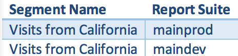

# Domande frequenti

Risposte alle domande frequenti su funzioni di segmentazione, accesso, autorizzazioni, best practice e gestione di segmenti legacy.

## Funzioni {#section_BD58629D1A9346BF879E229FA6BEC7A2}

* Segmentazione in Analysis Workspace:

   * Puoi [confrontare i segmenti](https://docs.adobe.com/content/help/it-IT/analytics/analyze/analysis-workspace/panels/segment-comparison/segment-comparison.html).
   * Utilizzare i [segmenti come dimensioni](https://docs.adobe.com/content/help/it-IT/core-services/interface/audiences/audience-library.html) in un confronto.
   * Utilizzare i segmenti nell’[analisi dell’abbandono](https://docs.adobe.com/help/it-IT/analytics/analyze/analysis-workspace/visualizations/fallout/compare-segments-fallout.html).

* Puoi [applicare più segmenti a un rapporto o a un progetto](/help/components/segmentation/segmentation-workflow/seg-workflow.md).
* I segmenti sono universali per tutte le suite di rapporti.
* Il [Generatore di segmenti](/help/components/segmentation/segmentation-workflow/seg-workflow.md) semplifica la creazione dei segmenti.
* Il [Gestore segmenti](/help/components/segmentation/segmentation-workflow/seg-workflow.md) consente di impostare [flussi di lavoro](/help/components/segmentation/segmentation-workflow/seg-workflow.md) con funzioni di condivisione dei segmenti, assegnazione di tag, verifica e approvazione.
* Puoi [assegnare tag ai segmenti](/help/components/segmentation/segmentation-workflow/seg-workflow.md) per organizzarli ed effettuare ricerche in un secondo momento, anziché utilizzare le cartelle.
* Puoi creare [Segmenti sequenziali](/help/components/segmentation/segmentation-workflow/seg-sequential-build.md).
* Il contenitore Visualizzazione pagina è stato rinominato contenitore Hit per indicare che il contenitore segmenta tutti i tipi di dati e non solo le visualizzazioni di pagina. Ad esempio, le chiamate di tracciamento dei collegamenti e le chiamate trackAction dagli SDK per dispositivi mobili sono tutte incluse o escluse dal contenitore Hit. Nota che il funzionamento del contenitore non è cambiato, il contenitore è stato semplicemente rinominato.

Per maggiori dettagli, consulta il post [Miglioramento della segmentazione in Adobe Analytics](https://blogs.adobe.com/digitalmarketing/analytics/improving-segmentation-adobe-analytics/) sul blog di digital marketing.

## Accedere agli strumenti di segmentazione {#section_088AD0E4E21943DFA8CF7206AEC485DD}

**Come si accede al Generatore di segmenti?**

Per accedere al Generatore di segmenti:

* Visualizza un rapporto esistente e fai clic sull’icona Segmenti  nella navigazione a sinistra. Nella barra del segmento visualizzata, fai clic su **[!UICONTROL Add]**, oppure

* Nella parte superiore del Gestore segmenti, fai clic su **[!UICONTROL + Add]**.  

   oppure

* Fai clic sul titolo di un segmento esistente nel Gestore segmenti per modificare il segmento nel Generatore di segmenti.

**Come si accede al Gestore segmenti?**

Per accedere al Gestore segmenti:

* Vai a **[!UICONTROL Analytics]** > **[!UICONTROL Components]** nella navigazione superiore. Quindi fai clic su **[!UICONTROL Segments]**, oppure

* Visualizza un rapporto esistente e fai clic sull’icona Segmenti  nella navigazione a sinistra. Quindi fai clic su **[!UICONTROL Manage]**, oppure

* Premi il tasto barra “/” in qualsiasi punto dell’interfaccia e cerca il Gestore segmenti.

**Cos’è successo al menu a discesa dei segmenti precedente?**

Il menu a discesa dei segmenti in Reports &amp; Analytics è stato sostituito da un’interfaccia molto più funzionale del [Generatore di segmenti](/help/components/segmentation/segmentation-workflow/seg-workflow.md) che consente di creare segmenti “universali” utilizzabili tra le suite di rapporti e tra le soluzioni Adobe Analytics. Per visualizzare un elenco dei segmenti esistenti, fai clic sull’icona Segmenti  

nella barra di navigazione a sinistra per visualizzare la barra dei segmenti.

**Cos’è successo al menu a discesa delle suite di rapporti precedente?**

Il menu a discesa della suite di rapporti è stato spostato accanto al selettore di date nell’angolo in alto a destra di ciascun rapporto o dashboard.

## Autorizzazioni {#section_648DFA3A882146C485A84ED014EEC707}

**Quali diritti e privilegi servono per utilizzare, creare e gestire i segmenti?**

Per impostazione predefinita, tutti gli utenti possono creare e modificare segmenti personali. Tuttavia, gli amministratori possono decidere chi può disporre delle [autorizzazioni per la creazione di segmenti](https://docs.adobe.com/content/help/it-IT/analytics/admin/user-product-management/user-groups/groups.html) e possono assegnarle a gruppi specifici. Questi segmenti possono essere condivisi direttamente con qualsiasi altro utente Analytics.

Gli amministratori possono modificare qualsiasi segmento e condividere i segmenti con i gruppi e con tutti gli altri utenti dell’organizzazione. [Altro...](/help/components/segmentation/seg-reference/seg-rights.md)

**Posso visualizzare tutti i segmenti nella mia azienda?**

Sì, gli amministratori possono visualizzare tutti i segmenti all’interno delle interfacce utente [!DNL Analysis Workspace] e [!DNL Reports & Analytics].

Ad Hoc Analysis e Report Builder mostrano i segmenti di tua proprietà e quelli condivisi con te.

**Posso gestire tutti i segmenti di Analytics nel Gestore segmenti?**

Sì, tutti i segmenti possono essere gestiti nel Gestore segmenti. Il Gestore segmenti mostra i segmenti che possono essere visualizzati dal proprietario (l’utente che ha creato i segmenti), dagli utenti con cui sono stati condivisi e dagli amministratori. Il selettore dei segmenti mostra i segmenti di proprietà dell’utente e quelli condivisi con l’utente.

Gli amministratori possono visualizzare tutti i segmenti all’interno delle interfacce utente di Analysis Workspace e [!DNL Reports & Analytics].

Il Report Builder visualizza solo i segmenti generati da te o quelli condivisi con te in modo specifico.

**Perché non posso eliminare questo segmento?**

Se il segmento è stato [pubblicato in Experience Cloud](/help/components/segmentation/segmentation-workflow/seg-workflow.md), non è possibile eliminarlo o modificarlo. Tuttavia, puoi copiarlo e modificare la versione copiata.

## Best practice {#section_E2C3A1B4B4274D1B86CAA9C0359D049C}

**Cosa conviene fare con i segmenti duplicati che hanno lo stesso nome ma definizioni diverse?**
Ora che i segmenti funzionano in più suite di rapporti, potresti avere più segmenti con lo stesso nome. Consigliamo di svolgere una delle seguenti azioni:

* Rinominare i segmenti che hanno lo stesso nome ma definizioni diverse, oppure
* Eliminare i segmenti non più necessari.

**Cosa consiglia Adobe per quanto riguarda la pulizia dei segmenti?**

* Assegna a tutti i segmenti un tag legacy.
* Esamina i tuoi segmenti.
* Aggiungili alla libreria dei segmenti, se applicabile.
* Approva i segmenti canonici.
* Assegna tag ai segmenti seguendo le [best practice](/help/components/segmentation/segmentation-workflow/seg-workflow.md).

## Gestione dei segmenti legacy {#section_76CF47142D1A4FB6A0718AD9073049FE}

**Cos’è successo ai segmenti esistenti?**

I segmenti esistenti continueranno a funzionare come prima. Tutti i rapporti a cui sono applicati questi segmenti continueranno a funzionare correttamente. [Altro...](/help/components/segmentation/seg-transition.md)

La maggior parte dei segmenti predefiniti e dei segmenti delle suite precedenti migreranno e diventeranno modelli nel Generatore di segmenti. I modelli di segmenti sono utilizzati per creare rapidamente segmenti personalizzati con audience comuni. I modelli di segmenti non possono essere applicati direttamente a un rapporto, ma possono essere salvati con facilità in un segmento personalizzato.

I modelli di segmenti sono contrassegnati da un’icona specifica nel Generatore di segmenti:

**Cos’è successo ai rapporti programmati con segmenti applicati?**

I rapporti programmati continuano a essere eseguiti correttamente con i segmenti definiti.

Quando elimini un segmento, i rapporti e le dashboard programmati a cui è applicato il segmento continuano a funzionare normalmente, ovvero il segmento o la dashboard continua a utilizzare il segmento eliminato.

I rapporti programmati non vengono aggiornati quando si modifica un segmento con lo stesso nome. Ad esempio, supponiamo che tu abbia 2 segmenti con lo stesso nome in suite di rapporti diverse:

È presente un segnalibro che fa riferimento al segmento per la suite di rapporti principale. Quel segmento viene quindi eliminato in quanto si tratta di un duplicato. Il segnalibro continuerà a essere eseguito e farà riferimento alla definizione del segmento eliminato. Se modifichi la definizione del segmento per il segmento maindev in modo da includere Isola di Catalina e Tijuana Messico, il segmento applicato al segnalibro non subirà modifiche e utilizzerà la vecchia definizione. Per risolvere il problema, aggiorna il segnalibro in modo che faccia riferimento alla nuova definizione. Se hai dubbi sul fatto che un segnalibro, una dashboard o un rapporto programmato utilizzino un segmento eliminato, modifica il nome del segmento rimanente in modo che risulti più chiaro se il segnalibro lo sta utilizzando.

**Cosa succederà ai segmenti di Data Warehouse?**

Tutti i segmenti esistenti di Data Warehouse continueranno a funzionare in Data Warehouse. La maggior parte dei segmenti di Data Warehouse funzionerà anche in altri componenti come Analysis Workspace e Reports &amp; Analytics.

Puoi creare o modificare nuovi segmenti di Data Warehouse nel Generatore/Gestore segmenti. Il meccanismo di compatibilità dei prodotti nel Generatore di segmenti determina automaticamente la compatibilità di un segmento con Data Warehouse.

**Cosa succederà ai segmenti preconfigurati?**

* **Visite a pagina singola**
* **Visite da dispositivi mobili**
* **Visite da ricerca naturale**
* **Visite da ricerca a pagamento**
* **Visite con il cookie ID visitatore**

Verrà eseguita la migrazione di questi segmenti e diventeranno modelli di segmenti nel Generatore di segmenti. I rapporti esistenti a cui sono applicati questi segmenti continueranno a funzionare correttamente.

**Cosa succederà ai segmenti Experience Cloud (Suite):**

* Non acquirenti
* Acquirenti
* Prime visite
* Visite dai siti social
* Visite di oltre 10 minuti*
* Visite con oltre 5 visite precedenti*
* Visite da Facebook*

La maggior parte di questi segmenti (tranne quelli contrassegnati con un asterisco *) verrà migrata e i segmenti diventeranno modelli nel Generatore di segmenti. Sono stati inoltre aggiunti diversi nuovi modelli di segmenti.

I rapporti esistenti a cui sono applicati questi segmenti continueranno a funzionare correttamente.

**Cosa succederà ai segmenti admin (noti anche come segmenti “globali”)?**

I segmenti **admin** verranno migrati nella nuova interfaccia dei segmenti e visualizzati come segmenti condivisi con tutti.

Il proprietario di questi segmenti è impostato sull’amministratore con l’account più vecchio nell’elenco degli utenti amministratori dell’azienda di accesso. Tuttavia, tutti gli amministratori possono eliminare, modificare e condividere questi segmenti.

L’interfaccia di gestione dei segmenti in Admin Console, in cui gli amministratori potevano creare e gestire i segmenti globali, non è più disponibile. Ora gli amministratori devono usare il nuovo Generatore di segmenti per creare segmenti e condividerli con gruppi o singoli utenti specifici o con tutti.

<!-- 

seg_definition.xml

 -->

I segmenti esistenti che utilizzano una logica che ha subito modifiche nel modo descritto in questo documento continueranno a funzionare correttamente, ma dovranno essere aggiornati prima di poter essere salvati di nuovo. Ad esempio, se hai un segmento esistente in cui Stati degli Stati Uniti contiene “New York”, esso continuerà a funzionare correttamente, ma la prossima volta che modifichi il segmento dovrai aggiornarlo per utilizzare il tipo enumerato con una condizione “è uguale a”.

**Suggerimenti per la migrazione**

Di seguito sono riportati alcuni suggerimenti per la migrazione delle dimensioni comuni:

* Geo-città/area geografica/paese: cerca e seleziona città, aree geografiche o paesi specifici invece di utilizzare una corrispondenza parziale.
* Browser: utilizza la dimensione Tipi di browser per ottenere tutti i browser in un tipo, ad esempio Google Chrome
* Sistemi operativi: utilizza le dimensioni Tipi di sistema operativo per ottenere tutti i sistemi operativi in un tipo, ad esempio Microsoft Windows.

* [Dimensioni nuove e rinominate](/help/components/segmentation/seg-transition.md#section_73CF121B64A24DEF8E6499F3167BF742)
* [Modifiche a “contiene”](/help/components/segmentation/seg-transition.md#section_1A9EDEE5CBC44B5AA6262560052ABE77)
* [Modifiche a “minore di” e “maggiore di”](/help/components/segmentation/seg-transition.md#section_84A8AAD0344148AD9F9211D3EB271903)

## Dimensioni nuove e rinominate {#section_73CF121B64A24DEF8E6499F3167BF742}

La tabella seguente contiene un elenco di dimensioni rinominate nel Generatore di segmenti.

<table id="table_1A8C1940FD0446FA8414C6A7DE66E44C"> 
 <thead> 
  <tr> 
   <th colname="col1" class="entry"> Nuovo nome della dimensione </th> 
   <th colname="col2" class="entry"> Nome precedente </th> 
   <th colname="col3" class="entry"> Note </th> 
  </tr> 
 </thead>
 <tbody> 
  <tr> 
   <td colname="col1"> Tipi di sistemi operativi </td> 
   <td colname="col2"> Nuovo </td> 
   <td colname="col3"> Aggiunto nella primavera 2015. </td> 
  </tr> 
  <tr> 
   <td colname="col1"> Larghezza browser - Bucket </td> 
   <td colname="col2"> Larghezza browser </td> 
   <td colname="col3"> Questa dimensione è compatibile con tutte le interfacce ed è suddivisa in un elenco enumerato di intervalli invece di valori interi specifici. Per segmentare valori specifici, utilizza la versione granulare di questa dimensione in un segmento di Data Warehouse. </td> 
  </tr> 
  <tr> 
   <td colname="col1"> Altezza browser - Bucket </td> 
   <td colname="col2"> Altezza browser </td> 
   <td colname="col3"> Questa dimensione è compatibile con tutte le interfacce ed è suddivisa in un elenco enumerato di intervalli invece di valori interi specifici. Per segmentare valori specifici, utilizza la versione granulare di questa dimensione in un segmento di Data Warehouse. </td> 
  </tr> 
  <tr> 
   <td colname="col1"> Larghezza browser - Granulare </td> 
   <td colname="col2"> Larghezza browser </td> 
   <td colname="col3"> 
Questa dimensione è stata rinominata ed è ora compatibile solo con Data Warehouse. Quando definisci i segmenti compatibili con tutte le interfacce, utilizza il tipo enumerato, Larghezza browser - Bucket. 
 </td> 
  </tr> 
  <tr> 
   <td colname="col1"> Altezza browser - Granulare </td> 
   <td colname="col2"> Altezza browser </td> 
   <td colname="col3"> 
Questa dimensione è stata rinominata ed è ora compatibile solo con Data Warehouse. Quando definisci i segmenti compatibili con tutte le interfacce, utilizza il tipo enumerato, Altezza browser - Bucket. 
 </td> 
  </tr> 
  <tr> 
   <td colname="col1"> Supporto per cookie </td> 
   <td colname="col2"> Cookie </td> 
   <td colname="col3"> - </td> 
  </tr> 
  <tr> 
   <td colname="col1"> Profondità colore </td> 
   <td colname="col2"> Profondità colore del monitor </td> 
   <td colname="col3"> - </td> 
  </tr> 
  <tr> 
   <td colname="col1"> - </td> 
   <td colname="col2"> “App - *” </td> 
   <td colname="col3"> i prefissi “App -” sono stati rimossi da diversi tipi di dimensioni. Poiché i dati delle app mobile vengono generalmente acquisiti in una suite di rapporti che non contiene dati web, questi prefissi non erano necessari. </td> 
  </tr> 
  <tr> 
   <td colname="col1"> Pagina di ingresso originale </td> 
   <td colname="col2"> Pagina di ingresso originale </td> 
   <td colname="col3"> - </td> 
  </tr> 
  <tr> 
   <td colname="col1"> Java abilitato </td> 
   <td colname="col2"> Java </td> 
   <td colname="col3"> - </td> 
  </tr> 
  <tr> 
   <td colname="col1"> Lunghezza massima URL browser mobile </td> 
   <td colname="col2"> Lunghezza URL browser mobile </td> 
   <td colname="col3"> - </td> 
  </tr> 
  <tr> 
   <td colname="col1"> Decoration Mail mobile </td> 
   <td colname="col2"> Supporto per Decoration Mail mobile </td> 
   <td colname="col3"> - </td> 
  </tr> 
  <tr> 
   <td colname="col1"> Dispositivo mobile </td> 
   <td colname="col2"> Nome dispositivo mobile </td> 
   <td colname="col3"> - </td> 
  </tr> 
  <tr> 
   <td colname="col1"> Lunghezza massima segnalibro mobile </td> 
   <td colname="col2"> Lunghezza massima URL segnalibro mobile </td> 
   <td colname="col3"> - </td> 
  </tr> 
  <tr> 
   <td colname="col1"> Lunghezza massima e-mail mobile </td> 
   <td colname="col2"> Lunghezza massima URL e-mail mobile </td> 
   <td colname="col3"> - </td> 
  </tr> 
  <tr> 
   <td colname="col1"> Sistema operativo mobile (obsoleto) </td> 
   <td colname="col2"> Sistema operativo mobile </td> 
   <td colname="col3"> Utilizza la dimensione Sistema operativo e applica le visite dai segmenti dei dispositivi mobili. </td> 
  </tr> 
  <tr> 
   <td colname="col1"> Push-to-talk per dispositivi mobili </td> 
   <td colname="col2"> PTT mobile </td> 
   <td colname="col3"> - </td> 
  </tr> 
  <tr> 
   <td colname="col1"> Visualizzazioni sondaggio </td> 
   <td colname="col2"> Totale visualizzazioni sondaggio </td> 
   <td colname="col3"> - </td> 
  </tr> 
  <tr> 
   <td colname="col1"> Risposte sondaggio </td> 
   <td colname="col2"> Totale risposte sondaggio </td> 
   <td colname="col3"> - </td> 
  </tr> 
  <tr> 
   <td colname="col1"> Profondità della visita </td> 
   <td colname="col2"> Lunghezza percorso </td> 
   <td colname="col3"> - </td> 
  </tr> 
  <tr> 
   <td colname="col1"> Codice postale </td> 
   <td colname="col2"> CAP </td> 
   <td colname="col3"> - </td> 
  </tr> 
 </tbody> 
</table>

## Modifiche alle dimensioni basate su stringhe con valori noti {#section_1A9EDEE5CBC44B5AA6262560052ABE77}

Le dimensioni basate su stringhe che hanno un set noto di valori sono state modificate in tipi enumerati. Quando crei un segmento utilizzando queste dimensioni, l’elenco viene precompilato con tutti i valori noti e l’unico operatore supportato è “uguale a”. Ciò consente di segmentare rapidamente i valori esatti desiderati senza selezionare altri valori quando utilizzi una corrispondenza meno restrittiva.

Le seguenti dimensioni sono state modificate in elenchi enumerati:

| produttore di dispositivi mobili | lunghezza e-mail mobile | profondità colore |
|---|---|---|
| dimensioni schermo mobile | numero dispositivo mobile | risoluzione monitor |
| altezza schermo mobile | push-to-talk per dispositivi mobili | plug-in |
| supporto cookie per dispositivi mobile | decoration mail mobile | sistema operativo |
| supporto per immagini mobile | servizi di informazione mobile | tipo di referrer |
| profondità colore mobile | tipo di dispositivo mobile | motore di ricerca |
| supporto audio per dispositivi mobili | tipo di browser | stato |
| supporto video per dispositivi mobili | browser | paese |
| drm mobile | tipo di connessione | area geografica |
| protocolli di rete mobile | operatore di telefonia mobile | città |
| sistema operativo mobile | cookie | geo dma |
| vm java mobile | fedeltà del cliente | cookie persistente |
| lunghezza segnalibro mobile | java abilitato | ricerca a pagamento |
| lunghezza url mobile | lingua |  |

## Modifiche alle dimensioni basate su numeri interi con valori noti {#section_84A8AAD0344148AD9F9211D3EB271903}

Le dimensioni basate su numeri interi (come la larghezza del browser) con un set di valori noto sono state suddivise in intervalli enumerati, in modo da poter definire rapidamente i segmenti per un intervallo specifico. Gli elenchi enumerati sono seguiti da “ - Bucket” dopo il nome della dimensione. La schermata seguente illustra il modo in cui queste dimensioni vengono segmentate utilizzando l’interfaccia precedente del Generatore di segmenti e l’interfaccia nuova:

Gli operatori “minore di”, “maggiore di” e simili ora sono compatibili solo con i segmenti di Data Warehouse. I segmenti destinati ad essere compatibili con tutte le interfacce di reporting devono utilizzare la versione “Bucket” della metrica con l’operatore “uguale a”.
