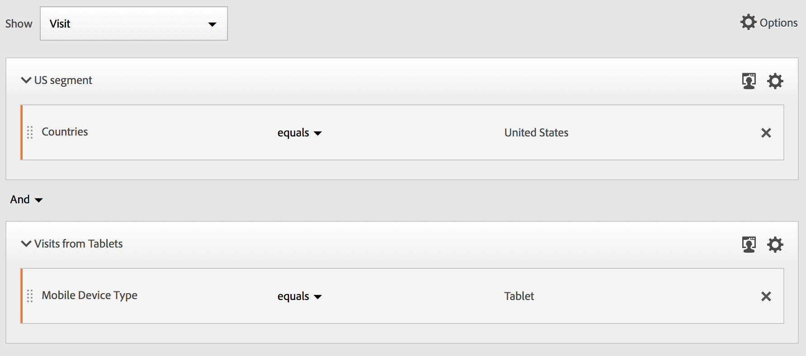

# Generatore di segmenti {#segment-builder}

>[!CONTEXTUALHELP]
>id="components_segments_productcompatibility"
>title="Compatibilità prodotto"
>abstract="Un numero ridotto di criteri di segmento disponibili non è compatibile con tutti gli strumenti di Adobe Analytics. In questo elenco sono indicati gli strumenti compatibili con il segmento. Per rendere un segmento compatibile con tutti gli strumenti di Adobe Analytics, modifica i criteri."

>[!CONTEXTUALHELP]
>id="components_filters_createaudience"
>title="Creare un pubblico"
>abstract="I tipi di pubblico possono essere creati da un segmento e condivisi con Adobe Experience Platform per l’attivazione."

>[!CONTEXTUALHELP]
>id="components_filters_datapreview"
>title="Anteprima dati"
>abstract="Confronta i dati di questo segmento con i dati della visualizzazione dati. La percentuale di anteprima è basata sul numero totale della visualizzazione dati a partire dagli **ultimi 90 giorni**.  Se l’anteprima non viene caricata, è possibile che la connessione sia ancora in retrocompilazione."

La finestra di dialogo **[!UICONTROL Segment builder]** viene utilizzata per creare nuovi segmenti o modificare quelli esistenti. La finestra di dialogo si chiama **[!UICONTROL New segment]** o **[!UICONTROL Edit segment]** per i segmenti creati o gestiti dal gestore [[!UICONTROL Segment]](/help/components/segmentation/segmentation-workflow/seg-manage.md).

>[!BEGINTABS]

>[!TAB Generatore di segmenti]

>[!TAB Crea o modifica segmento]

>[!ENDTABS]

1. Specifica i dettagli seguenti ( indica i dati obbligatori):

   | Elemento | Descrizione |
   | --- | --- |
   | **[!UICONTROL Report suite]** | Puoi selezionare la suite di rapporti per il segmento. |
   | **[!UICONTROL Project-only segment]** | Una casella di informazioni per spiegare che il segmento è visibile solo nel progetto in cui viene creato e che non verrà aggiunto all’elenco dei componenti. Consenti a **[!UICONTROL Make this segment available to all your projects and add it to your component list]** di modificare tale impostazione. Questa casella di informazioni è visibile solo quando si crea un [segmento rapido](seg-quick.md) e si trasforma le informazioni del segmento rapido in un segmento normale utilizzando **[!UICONTROL Open builder]** dall&#39;interfaccia [!UICONTROL Quick segment]. |
   | **[!UICONTROL Title]**  | Denomina il segmento, ad esempio `Last month mobile visitors`. |
   | **[!UICONTROL Description]** | Fornire una descrizione per il segmento, ad esempio `Segment to define the mobile customers for the last month`. |
   | **[!UICONTROL Tags]** | Organizza il segmento creando o applicando uno o più tag. Inizia a digitare per trovare i tag esistenti che puoi selezionare. Oppure premi **[!UICONTROL ENTER]** per aggiungere un nuovo tag. Seleziona  per rimuovere un tag. |
   | **[!UICONTROL Definition]**  | Definisci il segmento utilizzando il [Generatore di definizioni](#definition-builder). |

   {style="table-layout:auto"}

1. Per verificare se la definizione del segmento è corretta, utilizza l’anteprima costantemente aggiornata dei risultati del segmento in alto a destra.
1. Per pubblicare il segmento in Experience Cloud, seleziona **[!UICONTROL Publish this segment to the  Experience Cloud (for *suite di rapporti *)]**. Per ulteriori informazioni, vedi [Pubblicare i segmenti in Experience Cloud](/help/components/segmentation/segmentation-workflow/seg-publish.md).
1. Seleziona:
   * **[!UICONTROL Save]** per salvare il segmento.
   * **[!UICONTROL Save As]** per salvare una copia del segmento.
   * **[!UICONTROL Delete]** per eliminare il segmento.
   * **[!UICONTROL Cancel]** per annullare eventuali modifiche apportate al segmento o per annullare la creazione di un nuovo segmento.

## Generatore di definizioni

Utilizza il Generatore di definizioni per creare la definizione del segmento. In questa creazione vengono utilizzati componenti, contenitori, operatori e logica.

Puoi configurare il tipo e l’ambito della definizione:

1. Per specificare il tipo di definizione, indica se desideri creare una definizione di inclusione o esclusione. Selezionare  **[!UICONTROL Options]** e dal menu a discesa **[!UICONTROL Include]** o **[!UICONTROL Exclude]**.
1. Per specificare l&#39;ambito della definizione, selezionare dal menu a discesa **[!UICONTROL Include]** o **[!UICONTROL Exclude]** se si desidera che l&#39;ambito della definizione sia **[!UICONTROL Hits]**, **[!UICONTROL Visits]** o **[!UICONTROL Visitors]**.

È sempre possibile modificare queste impostazioni in un secondo momento.

### Componenti

Una parte fondamentale della costruzione della definizione del segmento è l’utilizzo di dimensioni, metriche, segmenti esistenti e intervalli di date. Tutti questi componenti sono disponibili dal pannello dei componenti nel Generatore di segmenti.

{width=100%}

Per aggiungere un componente:

1. Trascina un componente dal pannello dei componenti su **[!UICONTROL Drag and drop Metric(s), Segment(s), and/or Dimensions here]**. Puoi usare  nella barra dei componenti per cercare componenti specifici.
1. Specifica i dettagli del componente. Ad esempio, seleziona un valore da **[!UICONTROL Select value]**. Oppure inserisci un valore. Cosa e come specificare uno o più valori dipende dal componente e dall’operatore.
1. Facoltativamente, modifica l’operatore predefinito. Ad esempio, da **[!UICONTROL equals]** a **[!UICONTROL equals any of]**. Consulta [Operatori](../seg-reference/seg-operators.md) per una panoramica dettagliata degli operatori disponibili.

Per modificare un componente:

* Seleziona un nuovo operatore per il componente dal menu a discesa operatore.
* Se è il caso, seleziona o specifica un valore diverso per l’operatore.
* Se il tipo di componente è una dimensione, puoi definire il modello di attribuzione. Per ulteriori informazioni, consulta [Modello di attribuzione](#attribution).

Per eliminare un componente:

* Seleziona  in un componente.

### Contenitori

Puoi raggruppare più componenti in uno o più contenitori e definire la logica all’interno e tra contenitori. I contenitori consentono di creare definizioni complesse per il segmento.

{Width=100%}

* Per aggiungere un contenitore, seleziona **[!UICONTROL Add container]** da  **[!UICONTROL Options]**.
* Per aggiungere un componente esistente al contenitore, trascinalo nel contenitore.
* Per aggiungere un altro componente al contenitore, trascinalo dal pannello dei componenti al contenitore. Utilizza la linea di inserimento blu come guida.
* Per aggiungere un altro componente all’esterno del contenitore, trascinalo dal pannello dei componenti all’esterno del contenitore, ma all’interno del contenitore di definizione principale. Utilizza la linea di inserimento blu come guida.
* Per modificare la logica tra i componenti di un contenitore, tra contenitori o tra un contenitore e un componente, seleziona **[!UICONTROL And]**, **[!UICONTROL Or]**, **[!UICONTROL Then]** appropriati. Quando selezioni **[!UICONTROL Then]**, converti il segmento in un segmento sequenziale. Per ulteriori informazioni, vedere [Creare un segmento sequenziale](seg-sequential-build.md).
* Per cambiare il livello del contenitore, seleziona  **[!UICONTROL Hits]**,  **[!UICONTROL Visits]** o  **[!UICONTROL Visitors]**.

È possibile utilizzare  in un contenitore per le azioni seguenti:

| Azione contenitore | Descrizione |
|---|---|
| **[!UICONTROL Add container]** | Aggiungi un contenitore nidificato al contenitore. |
| **[!UICONTROL Exclude]** | Escludi il risultato dal contenitore nella definizione del segmento. Una barra a sinistra rossa sottile identifica un contenitore di esclusione. |
| **[!UICONTROL Include]** | Includi il risultato del contenitore nella definizione del segmento. “Includi” è l’impostazione predefinita. Una sottile barra grigia a sinistra identifica un contenitore di inclusione. |
| **[!UICONTROL Name container]** | Rinomina il contenitore dalla relativa descrizione predefinita. Digita un nome nel campo di testo. Se non fornisci alcun input, viene utilizzata la descrizione predefinita. |
| **[!UICONTROL Delete container]** | Elimina il contenitore dalla definizione. |

## Intervalli di date

Puoi creare segmenti che contengono intervalli di date continui. In questo modo, potrai rispondere a domande su campagne o eventi in corso. Ad esempio, puoi creare un segmento che include *tutti coloro che hanno effettuato un acquisto online negli ultimi 60 giorni*.

>[!BEGINSHADEBOX]

Per un video dimostrativo, guarda  [Intervalli di date continui nei segmenti](https://video.tv.adobe.com/v/25403/?quality=12&learn=on){target="_blank"}.

>[!ENDSHADEBOX]

## Sovrapponi segmenti {#stack}

Puoi creare un segmento utilizzando i segmenti. Quando utilizzi i segmenti in un segmento, puoi ottimizzare il segmento e ridurne la complessità.

Immagina di segmentare sulla combinazione di canale di interazione (5) e stati degli Stati Uniti (50). Puoi creare 250 segmenti, ciascuno per la combinazione unica di tipo di dispositivo (telefono cellulare rispetto a tablet) e stato degli Stati Uniti. Per ottenere gli utenti del tablet in California, puoi utilizzare uno dei 250 segmenti:

In alternativa, puoi definire 55 segmenti: 50 segmenti per gli stati degli Stati Uniti e 5 per i possibili canali di interazione. Quindi impilare i segmenti per ottenere gli stessi risultati. Per ottenere gli utenti dell’app mobile California, puoi impilare due segmenti:

## Attribution {#attribution}

>[!CONTEXTUALHELP]
>id="components_filters_attribution_repeating"
>title="Ripetizione"
>abstract="Include le istanze e i valori persistenti per la dimensione."

>[!CONTEXTUALHELP]
>id="components_filters_attribution_instance"
>title="Istanza"
>abstract="Include le istanze per la dimensione."

>[!CONTEXTUALHELP]
>id="components_filters_attribution_nonrepeatinginstance"
>title="Istanza non ripetuta"
>abstract="Include istanze univoche (non ripetute) per la dimensione."

Quando utilizzi una dimensione nel Generatore di segmenti, puoi specificare il modello di attribuzione per tale dimensione. Il modello di attribuzione selezionato determina se i dati sono idonei per la condizione specificata per il componente dimensione.

Seleziona  all’interno del componente dimensione e seleziona uno dei modelli di attribuzione dalla finestra a comparsa:

| Modelli | Descrizione |
|---|---|
| **[!UICONTROL Repeating model (default)]** | Includi l’istanza e i valori persistenti per la dimensione per determinare la qualifica. |
| **[!UICONTROL Instance]** | Includi solo i valori di istanza per la dimensione per determinare la qualifica. |
| **[!UICONTROL Non-repeating instance]** | Includi valori univoci di istanza (non ripetuti) per la dimensione per determinare la qualifica. |

### Esempio

Come parte della definizione di un segmento hai specificato la seguente condizione: Nome pagina è uguale a Donne. Simile all’esempio precedente. Ripeti questa definizione del segmento utilizzando gli altri due modelli di attribuzione. Pertanto, hai tre segmenti ciascuno con il proprio modello di attribuzione:

* Pagina Donne - Attribuzione - Ripetuta (per impostazione predefinita)
* Pagina Donne - Attribuzione - Istanza
* Pagina Donne - Attribuzione - Istanza non ripetuta

La tabella seguente spiega, per ogni modello di attribuzione, quali eventi in arrivo sono qualificati  per tale condizione.

| Pagina Donne - Attribuzione -  *modello di attribuzione* | Evento 1: Il Nome pagina è uguale a Donne | Evento 2: Il Nome pagina è uguale a Uomini | Evento 3: Il Nome pagina è uguale a Donne | Evento 4: Il Nome pagina è uguale a Donne (persistente) | Evento 5: Il Nome pagina è uguale a Pagamento | Evento 6: Il Nome pagina è uguale a Donne | Evento 7: Il Nome pagina è uguale a Pagina Home |
|---|:---:|:---:|:---:|:---:|:---:|:---:|:--:|
| Ripetizione (per impostazione predefinita) |  |  |  |  |  |  |  |
| Istanza |  |  |  |  |  |  |  |
| Istanza non ripetuta |  |  |  |  |  |  |  |

Un esempio di rapporto sugli eventi che utilizzano i tre segmenti è simile al seguente:

<!--

The [!UICONTROL Segment Builder] lets you build simple or complex segments that identify visitor attributes and actions across visits and page hits. It provides a canvas to drag and drop metric dimensions, events, or other segments in order to segment visitors based on hierarchy logic, rules, and operators.

There are several ways to access the Segment Builder:

* **Analytics top navigation**: Click **[!UICONTROL Analytics]** > **[!UICONTROL Components]** > **[!UICONTROL Segments]**.
* **[!UICONTROL Analysis Workspace]**: Click **[!UICONTROL Analytics]** > **[!UICONTROL Workspace]**, open a project and click **[!UICONTROL + New]** > **[!UICONTROL Create Segment]**.
* **[!UICONTROL Report Builder]**: [Add or edit segments in Report Builder](https://experienceleague.adobe.com/it/docs/analytics/analyze/report-builder/work-with-segments).

## Builder criteria {#section_F61C4268A5974C788629399ADE1E6E7C}

You can add rule definitions and containers to define your segments.

1. **[!UICONTROL Title]**: Name the segment.
1. **[!UICONTROL Description]**: Provide a description for the segment. 
1. **[!UICONTROL Tags]**: [Tag the segment](/help/components/segmentation/segmentation-workflow/seg-workflow.md) you are creating by picking from a list of existing tags or creating a new tag.
1. **[!UICONTROL Definitions]**: This is where you [build and configure segments](/help/components/segmentation/segmentation-workflow/seg-workflow.md), add rules, and nest and sequence containers. 
1. **[!UICONTROL Show]**: (Top Container selector.) Lets you select the top-level [container](/help/components/segmentation/seg-overview.md) ( [!UICONTROL Visitor], [!UICONTROL Visit], [!UICONTROL Hit]). The default top-level container is the Hit container.
1. **[!UICONTROL Options]**: (gear) icon

   * **[!UICONTROL + Add container]**: Lets you add a new container (below the top-level container) to the segment definition.
   * **[!UICONTROL Exclude]**: Lets you define the segment by excluding one or more dimensions, segments, or metrics.

1. **[!UICONTROL Dimensions]**: Components are dragged and dropped from the Dimensions list (orange sidebar).
1. **[!UICONTROL Operator]**: You can compare and constrain values using selected operators.
1. **[!UICONTROL Value]**: The value you entered or selected for the dimension or segment or metric.
1. **[!UICONTROL Attribution Models]**: Available for dimensions only, these models determine what values in a dimension to segment for. Dimension models are particularly useful in sequential segmentation.

   * **[!UICONTROL Repeating]** (default): Includes instances and persisted values for the dimension.
   * **[!UICONTROL Instance]**: Includes instances for the dimension.
   * **[!UICONTROL Non-repeating instance]**: Includes unique instances (non-repeating) for the dimension. This is the model applied in Flow when repeat instances are excluded.

   

   **Example: Hit segment where eVar1 = A** 

   |  Example  | A  | A  |  A (persisted) | B  | A  | C  |
   |---|---|---|---|---|---|---|
   |  Repeating  | X  | X  | X  | -  | X  | -  |
   |  Instance  | X  | X  | - | - | X | - |
   |  Non-repeating instance  | X | - | - | -  | X  | -  |

1. **[!UICONTROL And/Or/Then]**: Assigns the [!UICONTROL AND/OR/THEN] operators between containers or rules. The THEN operator lets you [define sequential segments](/help/components/segmentation/segmentation-workflow/seg-sequential-build.md).
1. **[!UICONTROL Metric]**: (Green sidebar) Metric that was dragged and dropped from the Metrics list.
1. **[!UICONTROL Comparison]** operator: You can compare and constrain values using selected operators.
1. **[!UICONTROL Value]**: The value you entered or selected for the dimension or segment or metric.
1. **[!UICONTROL X]**: (Delete) Lets you delete this part of the segment definition.
1. **[!UICONTROL Experience Cloud publishing]**: Publishing an Adobe Analytics segment to the Experience Cloud lets you use the segment for marketing activity in [!DNL Audience Manager] and in other activation channels. [Learn more...](/help/components/segmentation/segmentation-workflow/seg-publish.md)
1. **[!UICONTROL Audience library]**: Adobe's audience services manage the translation of visitor data into audience segmentation. As such, creating and managing audiences is similar to creating and using segments, with the added ability to share the audience segment to the Experience Cloud. [Learn more...](https://experienceleague.adobe.com/docs/core-services/interface/audiences/audience-library.html?lang=it)
1. **[!UICONTROL Search]**: Searches the list of dimensions, segments, or metrics.
1. **[!UICONTROL Dimensions]**: (List) Click the header to expand.
1. **[!UICONTROL Metrics]**: Click the header to expand.
1. **[!UICONTROL Segments]**: Click the header to expand.
1. **[!UICONTROL Report suite selector]**: Lets you select the report suite that this segment will be saved under. You can still utilize the segment in all report suites.
1. **[!UICONTROL Segment Preview]**: Lets you preview the key metrics to see whether you have a valid segment and how broad the segment is. Represents the breakdown of the data set you can expect to see if you apply this segment. Shows 3 concentric circles and a list to show the number and percentage of matches for [!UICONTROL Hits], [!UICONTROL Visits], and [!UICONTROL Visitors] for a segment run against a data set. This chart is updated immediately after you create or make changes to your segment definition.
1. **[!UICONTROL Product Compatibility]**: Provides a list of which Adobe Analytics products (Analysis Workspace, Data Warehouse) with which the segment you created is compatible. Most segments are compatible with all products. However, not all operators and dimensions are compatible with all Analytics products, especially [Data Warehouse](/help/components/segmentation/seg-reference/seg-compatibility.md). This chart is updated immediately after you make changes to your segment definition.
1. **[!UICONTROL Save]** or **[!UICONTROL Cancel]**: Saves or cancels the segment. After clicking **[!UICONTROL Save]**, you are taken to the Segment Manager where you can manage the segment.

## Build segments {#build-segments}

1. Simply drag a Dimension, Segment, or Metric Event from the left pane to the [!UICONTROL Definitions] field.

   

   The default top-level [!UICONTROL Hit] container is shown after dragging an element to [!UICONTROL Definitions]. You can change the container type to Visit or Visitor from the **[!UICONTROL Show]** drop-down menu.

1. Set the [operator](/help/components/segmentation/seg-reference/seg-operators.md) from the drop-down menu.
1. Enter or select a value for the item selected.
1. Add additional containers if needed, using **[!UICONTROL And]**, **[!UICONTROL Or]**, or **[!UICONTROL Then]** rules.
1. After placing the containers and setting the rules, see the results of the segment in the validation chart at the top right. The validator indicates the percentage and absolute number of page views, visits, and unique visitors that match the segment you created.
1. Under **[!UICONTROL Tags]**, [tag](/help/components/segmentation/segmentation-workflow/seg-tag.md) the container by selecting an existing tag or creating a new one.
1. Click **[!UICONTROL Save]** to save the segment.

You are now taken to the [Segment Manager](/help/components/segmentation/segmentation-workflow/seg-manage.md), where you can tag, share, and manage your segment in multiple ways.

## Add containers {#section_1C38F15703B44474B0718CEF06639EFD}

You can [build a framework of containers](/help/components/segmentation/seg-overview.md) and then place logic rules and operators between.

1. Click **[!UICONTROL Options > Add Container]**.

   

   A new [!UICONTROL Hit] container opens without a [!UICONTROL Hit] (Page View) identified.

   

1. Change the container type as needed.
1. Drag a Dimension, Segment, or Event from the left pane to the container.
1. Continue to add new containers from the top-level **[!UICONTROL Options]** > **[!UICONTROL Add container]** button at the top of the definition, or add containers from within a container to nest logic.

   **OR**

   Select one or more rules and then click **[!UICONTROL Options]** > **[!UICONTROL Add container from selection]**. This turns your selection into a separate container.

## Use date ranges {#concept_252A83D43B6F4A4EBAB55F08AB2A1ACE}

You can build segments that contain rolling date ranges in order to answer questions about ongoing campaigns or events.

For example, you can easily build a segment that includes "everyone who has made a purchase over the past 60 days".

You create a Visit container and within it, add the [!UICONTROL Last 60 days] time range and the metric [!UICONTROL Orders is greater than or equal to 1], with an AND operator:

>[!BEGINSHADEBOX]

See  [Rolling date ranges in segments](https://video.tv.adobe.com/v/25403?quality=12&learn=on){target="_blank"} for a demo video.

>[!ENDSHADEBOX]

## Stack segments {#task_58140F17FFD64FF1BC30DC7B0A1B0E6D}

Stacking segments works by combining the criteria in each segment using an 'and' operator, and then applying the combined criteria. This can be done in a Workspace project directly or in segment builder. 

For example, stacking a "mobile phone users" segment and a "US geography" segment would return data only for mobile phone users in the US.

Think of these segments as building blocks or modules that you can include in a segment library, for users to use as they see fit. That way, you can dramatically reduce the number of segments needed. For example, assume you have 40 segments:

* 20 for mobile phone users in different countries (US_mobile, Germany_mobile, France_mobile, Brazil_mobile, etc.) 
* 20 for tablet users in different countries (US_tablet, Germany_tablet, France_tablet, Brazil_tablet, etc.)

By using segment stacking, you can reduce your segment count to 22 and stack them as needed. You would need to create these segments:

* one segment for mobile users 
* one segment for tablet users 
* 20 segments for the different geographies

>[!NOTE]
>
>When stacking two segments, they are by default joined by an AND statement. This cannot be changed to an OR statement.

1. Go to the Segment Builder.
1. Provide a title and description for the segment.

   Step Result 1. Click **[!UICONTROL Show Segments]** to bring up the list of segments in the left navigation.

   Step Result 1. Drag and drop the segments you want to stack to the segment definition canvas. Here is an example of a segment that stacks the existing segments "Visits from Tablets" and "US Geo":

   

1. Save the segment.

   Step Result 

-->

## Modelli di segmento {#concept_5098446CC78D441E93B8E4D1D1EA6558}

Sono forniti modelli di segmenti per casi di utilizzo di segmentazione comuni, ad esempio &quot;Prime visite&quot; o &quot;Visite da dispositivi mobili&quot;. Sono disponibili nei progetti Workspace e nel generatore di segmenti come blocchi predefiniti per i nuovi segmenti.

I modelli sono identificati dal logo Adobe &quot;A&quot;. Di seguito è riportato un esempio di modelli:

<table id="table_98B87D807E9344C9BEBF072C65D87B1B"> 
 <thead> 
  <tr> 
   <th colname="col1" class="entry"> Nome modello </th> 
   <th colname="col2" class="entry"> Definizione </th> 
  </tr> 
 </thead>
 <tbody> 
  <tr> 
   <td colname="col1"> Abbandona carrello </td> 
   <td colname="col2">Visualizza i dati per i visitatori che hanno aggiunto elementi ai loro carrelli ma non hanno ordinato nulla. Nella definizione del segmento, il contenitore è Visita. La regola per questo segmento sequenziale è 
 Aggiunte carrello non è nullo 
 
Then 
 
Ordini è uguale a 0. 
 </td> 
  </tr> 
  <tr> 
   <td colname="col1"> Prime visite </td> 
   <td colname="col2">Visualizza i dati per i visitatori che hanno visitato un massimo di una [1] volte. Nella definizione del segmento, il contenitore è Visita. La regola è 
Il numero di visite è uguale a 1. 
 </td> 
  </tr> 
  <tr> 
   <td colname="col1"> Non acquirenti </td> 
   <td colname="col2">Visualizza i dati per i visitatori che non hanno partecipato a un evento di ordine. Nella definizione del segmento, il contenitore è Visitatore. Questo segmento utilizza la logica Exclude. La regola è 
Ordini non nulli. 
 </td> 
  </tr> 
  <tr> 
   <td colname="col1"> Visita non a pagina singola (non rimbalzate) </td> 
   <td colname="col2">Visualizza i dati per i visitatori che hanno visitato più di una volta. Nella definizione del segmento, il contenitore è Visitatore. Questo segmento utilizza la logica Exclude. La regola è 
L'accesso singolo non è nullo. 
 </td> 
  </tr> 
  <tr> 
   <td colname="col1"> Ricerca a pagamento </td> 
   <td colname="col2">Visualizzare i dati dei visitatori provenienti da una ricerca a pagamento. Nella definizione del segmento, il contenitore è Visita. La regola è 
Ricerca a pagamento è uguale a 1. 
 </td> 
  </tr> 
  <tr> 
   <td colname="col1"> Acquirenti </td> 
   <td colname="col2">Visualizza i dati per i visitatori che hanno partecipato a un evento di ordine. Nella definizione del segmento, il contenitore è Visitatore. La regola è 
Ordini non nulli. 
 </td> 
  </tr> 
  <tr> 
   <td colname="col1"> Visite di ritorno </td> 
   <td colname="col2">Visualizza i dati dei visitatori che hanno visitato almeno una volta. Nella definizione del segmento, il contenitore è Visita. La regola è 
Il numero di visite è maggiore di 1. 
 </td> 
  </tr> 
  <tr> 
   <td colname="col1"> Visite a pagina singola </td> 
   <td colname="col2"> Visualizzare i dati delle visite in cui viene visualizzato il valore di una singola pagina, anche se durante tale visita è possibile inviare più visualizzazioni di pagina. Le visite a pagina singola con eventi di collegamento di uscita sono incluse nel segmento. Nella definizione del segmento, il contenitore è Visita. La regola è 
Visite a pagina singola è uguale a 1. 
 </td> 
  </tr> 
  <tr> 
   <td colname="col1"> Il prodotto visualizzato non è stato aggiunto al carrello </td> 
   <td colname="col2">Visualizza i dati per i visitatori che hanno visualizzato i prodotti ma senza aggiunte al carrello. Nella definizione del segmento, il contenitore è Visita. La regola per questo segmento sequenziale è 
Visualizzazioni prodotto non nulle 
 
Then 
 
 Aggiunte al carrello è uguale a 0. 
 </td> 
  </tr> 
  <tr> 
   <td colname="col1"> Visite da Campaign </td> 
   <td colname="col2">Visualizza i dati dei visitatori a cui fanno riferimento le campagne. Nella definizione del segmento, il contenitore è Visita. La regola è 
Il codice di tracciamento non è nullo. 
 </td> 
  </tr> 
  <tr> 
   <td colname="col1"> Visite da dispositivi mobili </td> 
   <td colname="col2">Visualizza i dati dei visitatori tramite dispositivi mobili. Nella definizione del segmento, il contenitore è Visita. La regola è 
Il dispositivo mobile non è nullo. 
 </td> 
  </tr> 
  <tr> 
   <td colname="col1"> Visite da ricerca naturale </td> 
   <td colname="col2">Visualizzare i dati dei visitatori che non provengono da una ricerca a pagamento. Nella definizione del segmento, il contenitore è Visita. La regola è 
Ricerca a pagamento è uguale a 0. 
 </td> 
  </tr> 
  <tr> 
   <td colname="col1"> Visite da dispositivi non mobili </td> 
   <td colname="col2">Visualizza i dati dei visitatori che non utilizzano dispositivi mobili. Nella definizione del segmento, il contenitore è Visita. Questo segmento utilizza la logica Exclude. La regola è 
Tipo di dispositivo mobile è uguale a Telefono cellulare 
 
Oppure 
 
Tipo di dispositivo mobile è uguale a Tablet. 
 </td> 
  </tr> 
  <tr> 
   <td colname="col1"> Visite dai telefoni </td> 
   <td colname="col2">Visualizza i dati dei visitatori tramite telefono. Nella definizione del segmento, il contenitore è Visita. La regola è 
Tipo di dispositivo è uguale a Telefono cellulare. 
 </td> 
  </tr> 
  <tr> 
   <td colname="col1"> Visite dai motori di ricerca </td> 
   <td colname="col2">Visualizza i dati dei visitatori a cui fanno riferimento i motori di ricerca. Nella definizione del segmento, il contenitore è Visita. La regola è 
Tipo referrer è uguale a Motori di ricerca. 
 </td> 
  </tr> 
  <tr> 
   <td colname="col1"> Visite dai siti social </td> 
   <td colname="col2">Visualizza i dati dei visitatori a cui fanno riferimento i siti di social networking. Nella definizione del segmento, il contenitore è Visita. La regola è 
Tipo di referrer è uguale a Social network. 
 </td> 
  </tr> 
  <tr> 
   <td colname="col1"> Visite da tablet </td> 
   <td colname="col2">Visualizza i dati dei visitatori utilizzando le tavolette. Nella definizione del segmento, il contenitore è Visita. La regola è 
Tipo di dispositivo è uguale a Tablet. 
 </td> 
  </tr> 
  <tr> 
   <td colname="col1"> Visite con il cookie ID visitatore </td> 
   <td colname="col2">Visualizza i dati dai visitatori al tuo sito, dove è richiesto un cookie persistente. Nella definizione del segmento, il contenitore è Visita. La regola è 
Il cookie persistente è uguale a 1. 
 </td> 
  </tr> 
 </tbody> 
</table>
