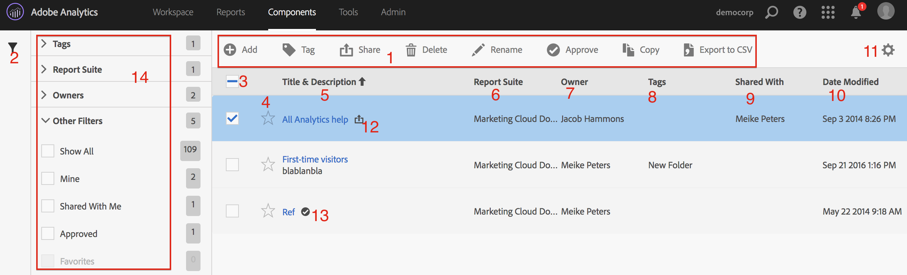

# Gestire segmenti

Il Gestore segmenti offre diversi modi per curare i segmenti, ad esempio condividere, filtrare, assegnare tag, approvare, copiare, eliminare e contrassegnare come preferiti.

Il Gestore segmenti di Analytics mostra tutti i segmenti di tua proprietà e quelli che sono stati condivisi con te. Gli utenti a livello di amministratore possono visualizzare tutti i segmenti dell’organizzazione. Questa panoramica presenta l’interfaccia utente e le funzionalità del Gestore segmenti. Per accedere al Gestore segmenti

* Vai su **[!UICONTROL Analytics]** > **[!UICONTROL Components]** > **[!UICONTROL Segments]** nella navigazione superiore.
* Visualizza un rapporto esistente e fai clic sull’icona Segmenti  nella navigazione a sinistra. Quindi fai clic su **[!UICONTROL Manage]**.

## Video introduttivo {#section_B3C5DA22DC5248DBA17C56E03DA2D4F2}

Questo [video di su Adobe Analytics](https://docs.adobe.com/content/help/en/analytics-learn/tutorials/components/segmentation/segment-management-and-sharing.html) offre una breve panoramica sull’utilizzo del Gestore segmenti.

## Interfaccia utente del Gestore segmenti {#section_7FDCD12949BE4741A402DB83AB7B37DF}

| # | Funzionalità dell’interfaccia utente | Descrizione |
|---|---|---|
| 1 | Barra degli strumenti del Gestore segmenti | Dopo aver selezionato un segmento, viene visualizzata questa barra degli strumenti. La maggior parte delle attività di gestione può essere completata da questa barra degli strumenti. |
| 2 | Mostra filtri | Facendo clic sull’icona del filtro viene visualizzato il menu del filtro. È possibile filtrare per Tag, Proprietari, Mostra tutto (solo amministratori), Personali, Preferiti, Approvati e Condivisi con me. |
| 3 | Caselle di controllo | Seleziona un segmento per gestirlo. |
| 4 | Preferiti | Facendo clic sulla stella accanto a un segmento, la stella diventa gialla e il segmento viene contrassegnato come preferito. |
| 5 | Titoli e descrizioni dei segmenti | Forniti nel Generatore di segmenti. Per modificare il titolo e la descrizione, fai clic sul collegamento del titolo, che ti riporta al Generatore di segmenti. |
| 6 | Suite di rapporti | Questa colonna indica in quale suite di rapporti il segmento è stato salvato l’ultima volta. |
| 7 | Proprietario | Indica il proprietario del segmento. In quanto utente non amministratore, puoi visualizzare solo i segmenti che possiedi o quelli che sono stati condivisi con te. |
| 8 | Tag (non selezionato nel selettore colonna, di conseguenza la colonna non viene visualizzata) | I tag applicati al segmento da te o da altri utenti che lo hanno condiviso con te. |
| 9 | Condiviso con | Elenca singoli utenti o gruppi (solo amministratori) o tutti coloro (solo amministratori) con cui hai condiviso il segmento. |
| 10 | Data di modifica | Mostra la data dell’ultima modifica apportata al segmento. |
| 11 | Selettore colonna | Consente di selezionare o deselezionare le colonne nel Gestore segmenti. |
| 12 | Icona Condiviso | Indica che il segmento è condiviso da te o con te. |
| 13 | Icona Approvato | Indica che il segmento è stato approvato da un amministratore. |
| 14 | Filtri | Ti consente di visualizzare e selezionare i filtri per tag, suite di rapporti, proprietari e altro (Mostra tutto, Personali, Condivisi con me, Approvati, Preferiti). |
