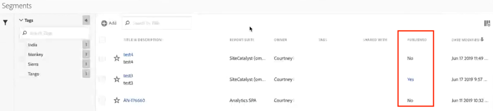

# Pubblicare segmenti in Experience Cloud

La pubblicazione di un segmento  Adobe Analytics nel Experience Cloud  consente di utilizzare il segmento per attività di marketing in [!DNL Audience Manager] e in altri canali di attivazione, inclusi  Adobe [!DNL Advertising Cloud], [!DNL Target] e [!DNL Campaign]. Aggiornamenti recenti hanno ottimizzato notevolmente il flusso di lavoro di pubblicazione. Ora puoi pubblicare i segmenti di Analytics  Experience Cloud in meno di 8 ore. Utilizzate questi segmenti per attivare i tipi di pubblico in  Audience Manager a tutte le destinazioni a valle.

Abbiamo anche aumentato il numero massimo di segmenti  Adobe Analytics pubblicabili a 75 (da 20). Puoi visualizzare i segmenti pubblicati in [!UICONTROL Analytics > Components > Segments].

>[!NOTE]
>
> Adobe Campaign (Classic e Standard) si comporta in modo diverso in quanto si trova a una latenza aggiuntiva di 24 ore sopra la latenza di 8 ore.

## Prerequisiti

* Verifica che la suite di rapporti in cui stai salvando questo segmento sia [abilitata per il Experience Cloud](https://docs.adobe.com/content/help/en/core-services/interface/audiences/t-publish-audience-segment.html). In caso contrario non sarà possibile pubblicarlo nel Experience Cloud .
* Accertatevi di lavorare in una suite di rapporti [mappata all&#39;organizzazione](https://docs.adobe.com/content/help/it-IT/core-services/interface/about-core-services/report-suite-mapping.html) Experience Cloud.
* Accertati che la tua organizzazione utilizzi  ID Experience Cloud.
* Prima di poter pubblicare i segmenti, l’amministratore deve assegnare l’ [!UICONTROL Segment Publishing] autorizzazione a un profilo di prodotto nel Admin Console [di](https://docs.adobe.com/content/help/it-IT/core-services/interface/manage-users-and-products/admin-getting-started.html)e aggiungere l’utente al profilo di prodotto.

## Considerazioni

* **Limiti** delle suite di rapporti: Puoi pubblicare fino a 75 segmenti per suite di rapporti. Questo limite è imposto. Se hai già 75 segmenti pubblicati, non puoi pubblicare altri segmenti fino a quando non annulli la pubblicazione di un numero sufficiente di segmenti per scendere al di sotto della soglia dei 75 segmenti.
* **Limiti** di appartenenza: Il pubblico condiviso con il [!DNL Experience Cloud] da  Adobe Analytics non può superare i 20 milioni di membri unici.
* **Privacy** dei dati: Le audience non vengono filtrate in base allo stato di autenticazione di un visitatore. Se un visitatore può navigare nel sito come utente autenticato o non autenticato, le azioni che si verificano per un visitatore non autenticato possono comunque determinare l&#39;inclusione del visitatore nel pubblico. Leggi la privacy [di](https://www.adobe.com/privacy/experience-cloud.html) Adobe Experience Cloud per comprendere le implicazioni sulla privacy derivanti dalla condivisione di tipi di pubblico.
* Per una discussione sulle **differenze tra i segmenti in[!DNL Adobe Analytics]e[!DNL Audience Manager]**, [fai clic qui](https://docs.adobe.com/content/help/it-IT/analytics/integration/audience-analytics/audience-analytics-workflow/aam-analytics-segments.html).

## Cronologia pubblicazione segmenti

| Disponibilità | Quando è disponibile | Dove è disponibile |
|---|---|---|
| Metadati (titolo e definizione del segmento) | Immediatamente dopo la pubblicazione | [!DNL Audience Manager], [!UICONTROL Experience Cloud Audience Library], [!DNL Target] |
| Segmento utilizzabile con appartenenza | ~ 8 ore dopo la pubblicazione | Visitor Profile Viewer in [!DNL Audience Manager] |
| Caratteristiche e popolazione di appartenenza | Entro 24-48 ore | [!DNL Audience Manager] |

>[!NOTE]
>Una volta alla settimana, tutti i dati saranno completamente sincronizzati per tenere conto di eventuali ritardi o discrepanze non catturati nella settimana precedente.

## Pubblicare segmenti in [!UICONTROL Segment Builder]

1. Passa a **[!UICONTROL Analytics > Workspace > Components > Segments]> +**
1. Crea un segmento nel [!UICONTROL Segment Builder].
1. Immetti un titolo e una descrizione per il segmento. In caso contrario non potrai salvarlo.
1. Controlla suite **[!UICONTROL Publish this segment to the Experience Cloud (for *di *rapporti)]**.

>[!IMPORTANT]
>Quando confrontate  numeri di Adobe Analytics con numeri di Audience Manager, accertatevi di utilizzare &quot;Visitatori con  ID Experience Cloud&quot; quando guardate le anteprime dei segmenti in Analytics invece dell&#39;anteprima totale dei segmenti &quot;Visitatori unici&quot; quando confrontate numeri di con  numeri di:
>
>

| Elemento | Descrizione |
|---|---|
| **[!UICONTROL Publish this segment to the Experience Cloud (for *<report suite>*)]** | Quando questa opzione è attivata, il titolo e la definizione del segmento (ovvero il pubblico shell, come spesso utilizzato nelle piattaforme pubblicitarie) vengono condivisi istantaneamente con il Experience Cloud , mentre l&#39;appartenenza al segmento viene valutata e condivisa ogni 4 ore.   Quando quell&#39;audience è associata a un&#39;attività, [!DNL Target]ad esempio, [!DNL Analytics] inizia a inviare ID per i visitatori idonei per quel Experience Cloud  e per quel [!DNL Target] pubblico. A questo punto, il nome del pubblico e i dati corrispondenti iniziano a essere visualizzati sulla pagina di Experience Cloud Audiences.   |
| **[!UICONTROL Audience Creation Window]** | L&#39;intervallo di tempo selezionato viene utilizzato per creare l&#39;audience su base di calendario continuo. Ad esempio, &quot;Ultimi 30 giorni&quot; (impostazione predefinita) include i visitatori che hanno aderito al pubblico negli ultimi 30 giorni a partire dalla data odierna (NON dalla data originale in cui è stato creato il segmento). |
| **[!UICONTROL Create in Audience Library]** | I segmenti creati e pubblicati possono essere resi disponibili senza latenza nella Libreria Pubblico  Experience Cloud. Non dipendono dagli aggiornamenti di Analytics. Questi segmenti non vengono conteggiati rispetto al limite di 75 segmenti pubblicati. |
| **[!UICONTROL x of 75 Published]** | Mostra il numero di segmenti che avete pubblicato nel Experience Cloud . Fai clic sul collegamento per visualizzare un elenco dei segmenti pubblicati e la suite di rapporti e il proprietario associati. |
| **[!UICONTROL Save]** | Salva questo segmento. |

## Annullamento della pubblicazione o eliminazione di segmenti

Per eliminare un segmento pubblicato in Experience Cloud, devi prima annullarne la pubblicazione. Per annullare la pubblicazione di un segmento, **deseleziona** la casella di controllo utilizzata per pubblicarlo.

>[!NOTE]
>
>**Non** puoi annullare la pubblicazione di un segmento attualmente in uso da una delle seguenti soluzioni Adobe: [!DNL Analytics] (in [!DNL Audience Analytics]), [!DNL Campaign], [!DNL Advertising Cloud] (per clienti [!DNL Core Service] e [!DNL Audience Manager]) e tutti gli altri partner esterni (per i clienti [!DNL Audience Manager]). **Puoi** annullare la pubblicazione di un segmento utilizzato da [!DNL Target].

## Visualizza lo stato di pubblicazione dei segmenti nel pannello [!UICONTROL Segment Manager]

1. Passa a [!UICONTROL Analytics > Components > Segments].
1. Notate la nuova [!UICONTROL Published] colonna. Sì/No indica se il segmento è stato pubblicato o meno sul Experience Cloud .

## Recuperare l’ [!DNL Audience Manager] UUID

Esistono due modi per acquisire l’AAM UUID attualmente associato al browser:

* Adobe Experience Cloud Debugger
* Strumento di sviluppo nativo nei browser (ad esempio, Chrome Developer Tools)

Le schermate seguenti mostrano come recuperare l’AAM UUID nel browser e utilizzarlo  visualizzatore del profilo visitatore del Audience Manager per convalidare le caratteristiche e i segmenti di appartenenza.

**Metodo 1: Usa Adobe Experience Cloud Debugger**

1. Scaricate e installate [Adobe Experience Cloud Debugger](https://docs.adobe.com/content/help/it-IT/analytics/implementation/testing-and-validation/debugger.html) in Chrome Web Store.
1. Avviare il debugger quando si carica una pagina.
1. Scorrete fino alla sezione dell’Audience Manager  e trovate l’UUID AAM impostato nella pagina del browser corrente (`50814298273775797762943354787774730612` nell’esempio di seguito)

**Metodo 2: Utilizzare Chrome Developer Tools (o altri strumenti per sviluppatori di browser)**

1. Avviare Chrome Developer Tools prima di caricare una pagina
1. Caricate la pagina e selezionate Applicazioni > Cookie. L’UUID AAM deve essere impostato nel cookie 3rd-partyDemdex ([adobe.demdex.net](https://docs.adobe.com/content/help/it-IT/audience-manager/user-guide/reference/demdex-calls.html) nell’esempio seguente). Il demdex del campo è il AAM UUID impostato nel browser (`50814298273775797762943354787774730612` nell’esempio di seguito).

## Usa  Audience Manager [!UICONTROL Visitor Profile Viewer]

L&#39;UUID AAM nel browser verrà utilizzato per impostazione predefinita quando [!UICONTROL Visitor Profile Viewer] viene caricato. Se verifica le realizzazioni delle caratteristiche per altri utenti, immetti un UUID nel campo UUID e fai clic su [!UICONTROL Refresh]. Per ulteriori informazioni, consulta Visualizzatore [profilo](https://docs.adobe.com/content/help/en/audience-manager/user-guide/features/visitor-profile-viewer.html) visitatori.

## Visualizzare le caratteristiche del segmento in [!DNL Audience Manager]

In AAM, l&#39;elenco di visitatori con ECID per un determinato segmento viene valutato in streaming come segmenti di Analytics condivisi con  Experience Cloud.

1. In [!DNL Audience Manager], vai a [!UICONTROL Audience Data > Traits > Analytics Traits]. Vedrai una cartella per ogni suite di rapporti Analytics mappata alla tua organizzazione  Experience Cloud. Queste cartelle (per Caratteristiche, Segmenti e Origini dati) vengono create quando il servizio di base Profili e pubblico/Persone viene avviato o fornito.
1. Selezionate la cartella per la suite di rapporti in cui avete creato in precedenza il segmento con cui desiderate condividere [!DNL Audience Manager]. Vedrai il segmento/pubblico creato. Quando condividete un segmento, si verificano 2 cose in [!DNL Audience Manager]:
* Viene creata una caratteristica, prima senza alcun dato. Circa 8 ore dopo che il segmento viene pubblicato in [!DNL Analytics], l’elenco di ECID viene configurato e condiviso con [!DNL Audience Manager] e altre soluzioni  Experience Cloud.

* Viene creato un segmento con una sola caratteristica. Utilizza l’origine dati associata alla suite di rapporti in cui hai pubblicato il segmento.
* La scadenza della caratteristica ora è impostata su 16 giorni (in precedenza era di 2 giorni).

## Visualizza il segmento in [!DNL Adobe Target]

The [!UICONTROL Publish this segment to the Experience Cloud] checkbox during the segment creation process in Adobe Analytics allows the segment to be available within the Adobe Target&#39;s custom audience library. Puoi utilizzare un segmento creato in Analytics o Audience Manager per attività in Target. Ad esempio, puoi creare campagne sulla base delle metriche di conversione di Analytics e sui segmenti di pubblico creati in Analytics.

1. Fai clic su [!UICONTROL Audiences].
1. On the [!UICONTROL Audiences] page, locate the audience sourced from the [!DNL Experience Cloud]. These audiences are available for use in [!DNL Target] activities.
