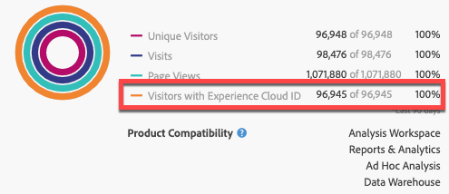

# Pubblicare segmenti in Experience Cloud {#publish-segments}

>[!CONTEXTUALHELP]
>id="components_segments_publishing"
>title="Pubblicazione in Experience Cloud"
>abstract="Puoi pubblicare il pubblico derivato da questo segmento nella Libreria pubblico, dove può essere utilizzato per attività di marketing in Target e altre soluzioni Experience Cloud."

>[!CONTEXTUALHELP]
>id="components_segments_audienclibrary"
>title="Libreria pubblico"
>abstract="I segmenti creati nella Libreria pubblico sono disponibili immediatamente e non dipendono dagli aggiornamenti di Analytics."

La pubblicazione di un segmento di Adobe Analytics in Experience Cloud consente di utilizzare il segmento per l&#39;attività di marketing in [!DNL Audience Manager] e in altri canali di attivazione, inclusi [!DNL Advertising Cloud], [!DNL Target] e [!DNL Campaign] di Adobe.

Puoi pubblicare i segmenti di Analytics in Experience Cloud in meno di 8 ore. Utilizza questi segmenti per attivare il pubblico in Audience Manager per tutte le destinazioni a valle.

>[!BEGINSHADEBOX]

Consulta  [Pubblica segmenti](https://video.tv.adobe.com/v/36961?quality=12&learn=on&captions=ita){target="_blank"} per un video dimostrativo.

>[!ENDSHADEBOX]

>[!NOTE]
>
>Adobe Campaign (Classic e Standard) si comporta in modo diverso in quanto è soggetto a una latenza aggiuntiva di 24 ore oltre la latenza di 8 ore.

## Prerequisiti

* Assicurati che la suite di rapporti in cui stai salvando il segmento sia [abilitata per Experience Cloud](https://experienceleague.adobe.com/docs/core-services/interface/audiences/t-publish-audience-segment.html?lang=it). In caso contrario, non puoi pubblicarlo in Experience Cloud.
* Assicurati che la tua organizzazione utilizzi gli ID di Experience Cloud.
* Prima che possa pubblicare i segmenti, l’amministratore deve assegnare l’autorizzazione [!UICONTROL Segment Publishing] a un profilo di prodotto nin [Admin Console](https://experienceleague.adobe.com/docs/core-services/interface/manage-users-and-products/admin-getting-started.html?lang=it) e aggiungerti al profilo di prodotto.

## Considerazioni

* **Limiti delle suite di rapporti**: puoi pubblicare fino a 75 segmenti per suite di rapporti. Questo limite viene sempre applicato. Se hai già pubblicato 75 segmenti, non puoi pubblicarne altri finché non annulli la pubblicazione di un numero di segmenti tale da scendere al di sotto della soglia di 75 segmenti.
* **Limiti di appartenenza**: i tipi di pubblico condivisi con [!DNL Experience Cloud] da Adobe Analytics non possono superare i 20 milioni di membri univoci.
* **Privacy dei dati**: i tipi di pubblico non vengono filtrati sulla base dello stato di autenticazione di un visitatore. Se un visitatore può navigare nel sito come utente autenticato o non autenticato, le azioni che si verificano per un visitatore non autenticato possono comunque determinare l’inclusione del visitatore nel pubblico. Consulta [Privacy di Adobe Experience Cloud](https://www.adobe.com/it/privacy/experience-cloud.html) per comprendere tutte le implicazioni in materia di privacy derivanti dalla condivisione dei tipi di pubblico.
* Per una discussione sulle **differenze tra i segmenti in [!DNL Adobe Analytics] e[!DNL Audience Manager]**, visita [questa paginai](https://experienceleague.adobe.com/docs/analytics/integration/audience-analytics/audience-analytics-workflow/aam-analytics-segments.html?lang=it).

## Timeline per la pubblicazione dei segmenti

| Dati disponibili | Quando sono disponibili | Dove sono disponibili |
|---|---|---|
| Metadati (titolo e definizione del segmento) | Immediatamente dopo la pubblicazione | [!DNL Audience Manager], [!UICONTROL Experience Cloud Audience Library], [!DNL Target] |
| Segmento utilizzabile con appartenenza | ~8 ore dopo la pubblicazione | Visualizzatore del profilo del visitatore in [!DNL Audience Manager] |
| Popolazione per caratteristiche e appartenenza | Entro 24-48 ore | [!DNL Audience Manager] |

>[!NOTE]
>Una volta alla settimana, tutti i dati saranno sincronizzati completamente per tenere conto di eventuali variazioni o discrepanze non acquisite nella settimana precedente.

## Pubblicare i segmenti in [!UICONTROL Segment Builder]

1. In Adobe Analytics, vai a **[!UICONTROL Components]** > **[!UICONTROL Segments]**
1. Seleziona **[!UICONTROL Add]** per creare un nuovo segmento.
   
1. Fornisci un titolo e una descrizione per il segmento. Questi campi sono obbligatori prima di salvare.
1. Nella sezione **[!UICONTROL Experience Cloud publishing]**, seleziona l&#39;opzione **[!UICONTROL Publish this segment to the Experience Cloud (for *suite di rapporti *)]**.

>[!IMPORTANT]
>Per confrontare i numeri di Adobe Analytics con i numeri di Audience Manager, quando visualizzi le anteprime dei segmenti in Analytics assicurati di utilizzare “Visitatori con ID Experience Cloud”, e non “Visitatori univoci”:
>
>

| Elemento | Descrizione |
|---|---|
| **[!UICONTROL Publish this segment to the Experience Cloud (for *`<report suite>`*)]** | Quando questa opzione è abilitata, il titolo e la definizione del segmento (ovvero il pubblico shell spesso utilizzato nelle piattaforme di annunci) vengono condivisi istantaneamente con Experience Cloud, mentre l’appartenenza al segmento viene valutata e condivisa ogni 4 ore.  Quando quel pubblico viene associato a un’attività in [!DNL Target], ad esempio, [!DNL Analytics] inizia a inviare ID per i visitatori idonei per quel pubblico di Experience Cloud [!DNL Target]. A questo punto, il nome del pubblico e i dati corrispondenti iniziano a essere visualizzati sulla pagina [!DNL Audience Library] in Experience Cloud.   |
| **[!UICONTROL Audience Creation Window]** | L’arco temporale selezionato viene utilizzato per creare il pubblico su una base di calendario continua. Ad esempio, “Ultimi 30 giorni” (impostazione predefinita) include i visitatori idonei per il pubblico negli ultimi 30 giorni dalla data odierna (NON dalla data originale di creazione del segmento). |
| **[!UICONTROL Create in Audience Library]** | I segmenti creati e pubblicati possono essere resi disponibili senza latenza nella pagina [!DNL Audience Library] in Experience Cloud. Non dipendono dagli aggiornamenti di Analytics. Questi segmenti non vengono conteggiati rispetto al limite di 75 segmenti pubblicati. |
| **[!UICONTROL x of 75 Published]** | Mostra il numero di segmenti pubblicati in Experience Cloud. Fai clic sul collegamento per visualizzare un elenco dei segmenti pubblicati e della suite di rapporti e del relativo proprietario associati. |
| **[!UICONTROL Save]** | Salva questo segmento. |

## Annullare la pubblicazione o eliminare segmenti

Per eliminare un segmento pubblicato in Experience Cloud, devi prima annullarne la pubblicazione. Per annullare la pubblicazione di un segmento, **deseleziona** la casella di controllo utilizzata per pubblicarlo.

>[!NOTE]
>
>**Non** puoi annullare la pubblicazione di un segmento attualmente in uso da una delle seguenti soluzioni Adobe: [!DNL Analytics] (in [!DNL Audience Analytics]), [!DNL Campaign], [!DNL Advertising Cloud] (per clienti [!DNL Core Service] e [!DNL Audience Manager]) e tutti gli altri partner esterni (per i clienti [!DNL Audience Manager]). **Puoi** annullare la pubblicazione di un segmento utilizzato da [!DNL Target].

## Visualizzare lo stato di pubblicazione dei segmenti

Il numero massimo di segmenti Adobe Analytics pubblicabili è 75.

Per visualizzare i segmenti pubblicati:

1. In Adobe Analytics, vai a **[!UICONTROL Components]** > **[!UICONTROL Segments]**.

1. Visualizza la colonna **[!UICONTROL Published]**. **[!UICONTROL Yes]** in questa colonna indica che il segmento è stato pubblicato in Experience Cloud. **[!UICONTROL No]** indica che non lo ha fatto.

   

## Recupera l’UUID di [!DNL Audience Manager]

Esistono due modi per acquisire l’UUID di Adobe Audience Manager attualmente associato al browser:

* Adobe Experience Cloud Debugger
* Strumento per sviluppatori nativo nei browser (ad esempio, gli strumenti per sviluppatori di Chrome)

Le schermate seguenti mostrano come recuperare l’UUID di Adobe Audience Manager sul browser e utilizzarlo in Visualizzatore del profilo del visitatore di Audience Manager per convalidare le caratteristiche e l’iscrizione al segmento.

### Metodo 1: utilizzare Adobe Experience Cloud Debugger

1. Scarica e installa [Adobe Experience Cloud Debugger](/help/implement/validate/debugger.md) nel web store di Chrome.
1. Avvia il debugger durante il caricamento di una pagina.
1. Scorri fino alla sezione Audience Manager e trova l’UUID di Adobe Audience Manager impostato nella pagina del browser corrente
(`50814298273775797762943354787774730612` nell&#39;esempio seguente)

### Metodo 2: utilizzare gli strumenti per sviluppatori di Chrome (o altri strumenti per sviluppatori del browser)

1. Avvia gli strumenti per sviluppatori di Chrome prima di caricare una pagina
1. Carica la pagina e seleziona Applicazioni > Cookie. L’UUID di Adobe Audience Manager deve essere impostato nel componente di terze parti
Cookie demdex ([adobe.demdex.net](https://experienceleague.adobe.com/docs/audience-manager/user-guide/reference/demdex-calls.html?lang=it) nell&#39;esempio seguente). Il campo demdex è l’UUID di Adobe Audience Manager impostato
nel browser (`50814298273775797762943354787774730612` nell&#39;esempio seguente).

## Utilizza il [!UICONTROL Visitor Profile Viewer] di Audience Manager

Per impostazione predefinita, al caricamento di [!UICONTROL Visitor Profile Viewer] verrà utilizzato l&#39;UUID di Adobe Audience Manager nel browser. Se verifichi le realizzazioni delle caratteristiche per altri utenti, inserisci un UUID nel campo UUID e fai clic su [!UICONTROL Refresh]. Per ulteriori informazioni, consulta il [Visualizzatore del profilo del visitatore](https://experienceleague.adobe.com/docs/audience-manager/user-guide/features/visitor-profile-viewer.html?lang=it).

## Visualizzare le caratteristiche del segmento in [!DNL Audience Manager]

In Adobe Audience Manager, l’elenco dei visitatori con ECID per un dato segmento viene valutato in streaming, poiché Analytics condivide segmenti con Experience Cloud.

1. In [!DNL Audience Manager], passa a [!UICONTROL Audience Data > Traits > Analytics Traits]. Visualizzerai una cartella per ogni suite di rapporti di Analytics mappata alla tua organizzazione di Experience Cloud. Queste cartelle (per Caratteristiche, Segmenti e Origini dati) sono create quando viene avviato o eseguito il provisioning del servizio principale Profili e Tipi di pubblico/Persone.
1. Seleziona la cartella per la suite di rapporti in cui hai creato in precedenza il segmento che desideri condividere con [!DNL Audience Manager]. Visualizzerai il segmento/pubblico creato. Quando condividi un segmento, si verificano 2 cose in [!DNL Audience Manager]:
   * viene creata una caratteristica, all’inizio senza dati. Circa 8 ore dopo la pubblicazione del segmento in [!DNL Analytics], l’elenco degli ECID viene acquisito e condiviso con [!DNL Audience Manager] e altre soluzioni Experience Cloud.

     

   * Viene creato un segmento con una caratteristica. Utilizza l’origine dati associata alla suite di rapporti in cui hai pubblicato il segmento.
   * La scadenza delle caratteristiche ora è impostata su 16 giorni (in precedenza era di 2 giorni).

## Visualizzare il segmento in [!DNL Adobe Target]

La casella di controllo [!UICONTROL Publish this segment to the Experience Cloud] nel processo di creazione dei segmenti in Adobe Analytics consente di rendere disponibile il segmento nella libreria dei tipi di pubblico personalizzati di Adobe Target. Puoi utilizzare un segmento creato in Analytics o Audience Manager per attività in Target. Ad esempio, puoi creare campagne sulla base delle metriche di conversione di Analytics e sui segmenti di pubblico creati in Analytics.

1. Fai clic su [!UICONTROL Audiences].
1. Nella pagina [!UICONTROL Audiences], individua il pubblico ottenuto da [!DNL Experience Cloud]. Questi tipi di pubblico sono disponibili per l’utilizzo nelle attività di [!DNL Target].
