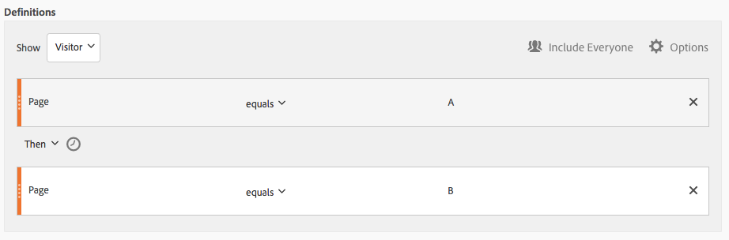
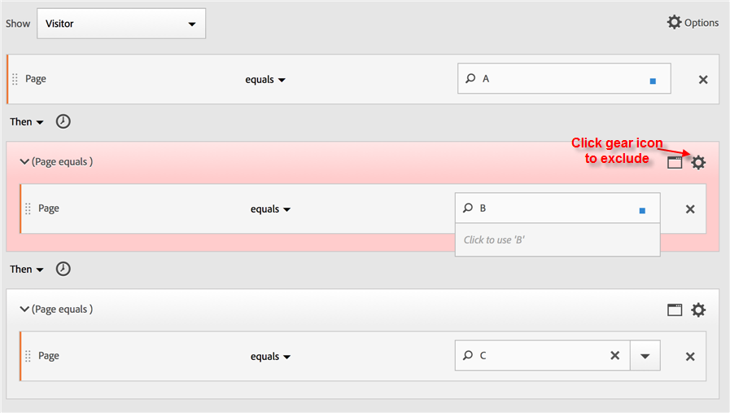
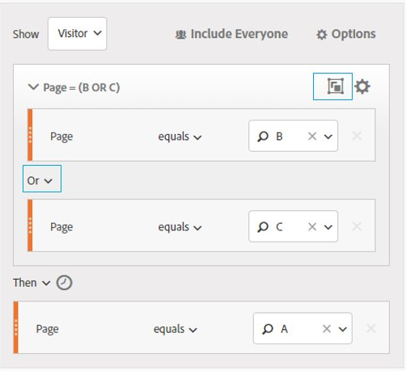

# Creare segmenti sequenziali

I segmenti sequenziali vengono creati utilizzando l&#39;operatore THEN, anziché AND o OR. Ciò implica che si verifica un criterio di segmento, seguito da un altro. Per impostazione predefinita, un segmento sequenziale identifica tutti i dati corrispondenti, mostrando il filtro &quot;Includi tutti&quot;. I segmenti sequenziali possono essere ulteriormente filtrati in un sottoinsieme di hit corrispondenti utilizzando le opzioni &quot;Solo prima della sequenza&quot; e &quot;Solo dopo la sequenza&quot;.

Inoltre, è possibile vincolare i segmenti sequenziali a una durata specifica di tempo, granularità e conteggi tra i punti di controllo utilizzando gli operatori [Dopo e Entro](/help/components/segmentation/segmentation-workflow/seg-sequential-build.md).

## Includi tutti {#section_75ADDD5D41F04800A09E592BB2940B35}

Quando si crea un segmento in cui è impostata l&#39;opzione &quot;Includi tutti&quot;, il segmento identifica i percorsi che corrispondono al pattern specificato nel suo insieme. Questo è un esempio di segmento di sequenza di base alla ricerca di un hit (Pagina A) seguito da un altro (Pagina B) visitato dallo stesso visitatore. Il segmento è impostato su Includi tutti.

| Se risultato... | Sequenza |
|--- |--- |
| Corrisponde | A poi BA (in una visita diversa) BA poi D e poi B |
| Non corrisponde | B e A |

## Solo prima della sequenza e solo dopo la sequenza {#section_736E255C8CFF43C2A2CAAA6D312ED574}

Le opzioni **[!UICONTROL Only Before Sequence]** e il **[!UICONTROL Only After Sequence]** filtro del segmento a un sottoinsieme di dati prima o dopo la sequenza specificata.

* **Solo prima della sequenza**: Include tutti gli hit prima di una sequenza + il primo hit della sequenza stessa (vedere l’esempio 1, 3). Se una sequenza appare più volte in un percorso, &quot;Only Before Sequence&quot; include il primo hit dell&#39;ultima occorrenza della sequenza e tutti gli hit precedenti (vedere l&#39;esempio 2).
* **Solo dopo la sequenza**: Include tutti gli hit dopo una sequenza + l’ultimo hit della sequenza stessa (vedere l’esempio 1, 3). Se una sequenza appare più volte in un percorso, &quot;Only After&quot; include l’ultimo hit della prima occorrenza della sequenza e tutti gli hit successivi (vedere l’esempio 2).

Ad esempio, considerate una sequenza di B -> D. I tre filtri identificano gli hit come segue:

**Esempio 1: B e D appaiono una volta**

| Esempio | Una  | B | C | D | E | F |
|---|---|---|---|---|---|---|
| Includi tutti | Una  | B | C | D | E | F |
| Solo prima della sequenza | Una  | B |  |  |  |  |
| Solo dopo la sequenza |  |  |  | D | E | F |

**Esempio 2: B e D appaiono più volte**

| Esempio | Una  | B | C | D | B | C | D | E |
|---|---|---|---|---|---|---|---|---|
| Includi tutti | Una  | B | C | D | B | C | D | E |
| Solo prima della sequenza | Una  | B | C | D | B |  |  |  |
| Solo dopo la sequenza |  |  |  | D | B | C | D | E |

Inquadriamo anche questo concetto con la dimensione Profondità di Hit.

**Esempio 3: Profondità Hit 3 poi 5**

## Vincoli Dimension {#section_EAFD755F8E674F32BCE9B642F7F909DB}

In una clausola &quot;within&quot;, tra istruzioni THEN, è possibile aggiungere, ad esempio, &quot;within 1 search keyword instance&quot;, &quot;within 1  eVar 47 instance&quot;. In questo modo si vincola il segmento entro un’istanza di una dimensione.

L&#39;impostazione di una clausola &quot;Within Dimension&quot; tra le regole consente a un segmento di limitare i dati alle sequenze in cui tale clausola è soddisfatta. Vedere l&#39;esempio seguente, in cui il vincolo è impostato su &quot;Entro 1 pagina&quot;:

| Se risultato... | Sequenza |
|--- |--- |
| Corrisponde | A poi B |
| Non corrisponde | A poi C poi B (perché B non era all&#39;interno di 1 pagina di A) **Nota:**  Se si elimina la restrizione della dimensione, &quot;A then B&quot; e &quot;A then C then B&quot; corrisponderanno entrambi. |

## Sequenza Visualizzazione pagina semplice

Identificare i visitatori che hanno visualizzato una pagina e quindi un’altra pagina. I dati a livello di hit filtreranno questa sequenza indipendentemente dalle sessioni di visita precedenti, passate o intermedie o dall&#39;ora o dal numero di visualizzazioni di pagina che si verificano tra due.

**Esempio**: Il visitatore ha visualizzato la pagina A, quindi la pagina B nella stessa o in un&#39;altra visita.

**Casi d’uso**

Di seguito sono riportati alcuni esempi di utilizzo del segmento.

1. I visitatori di un sito sportivo visualizzano la pagina di destinazione del calcio e quindi visualizzano la pagina di destinazione del basket in ordine sequenziale, ma non necessariamente nella stessa visita. Questo provoca una campagna per trasmettere i contenuti della pallacanestro ai telespettatori durante la stagione calcistica.
1. Il rivenditore di automobili identifica una relazione tra coloro che accedono alla pagina di fedeltà del cliente e poi vanno alla pagina video in qualsiasi momento durante la visita o un&#39;altra visita.

**Crea questo segmento**

È possibile nidificare due regole di pagina all&#39;interno di un [!UICONTROL Visitor] contenitore di livello principale e sequenziare gli hit di pagina utilizzando l&#39; [!UICONTROL THEN] operatore .

## Sequenza di visitatori tra le visite

Identificare i visitatori che sono usciti da una campagna e sono quindi tornati alla sequenza di visualizzazioni di pagina in un’altra sessione.

**Esempio**: Il visitatore ha visualizzato la pagina A in una visita, quindi ha visualizzato la pagina B in un’altra visita.

**Casi d&#39;uso**

Di seguito sono riportati alcuni esempi di utilizzo di questo tipo di segmento:

* Visitatori alla pagina Sport di un sito di notizie, quindi rivede la pagina Sport in un&#39;altra sessione.
* Un rivenditore di vestiti vede una relazione tra i visitatori che accedono a una pagina di destinazione in una sessione e quindi accedono direttamente alla pagina di estrazione in un&#39;altra sessione.

**Crea questo segmento**

In questo esempio vengono nidificati due **[!UICONTROL Visit]** contenitori all&#39;interno del **[!UICONTROL Visitor]** contenitore di primo livello e il segmento viene sequenze utilizzando l&#39; [!UICONTROL THEN] operatore.

## Sequenza a livello misto

Identificare i visitatori che visualizzano due pagine in un numero indeterminato di visite, ma poi una terza pagina in una visita separata.

**Esempio**: I visitatori visitano la pagina A e quindi la pagina B in una o più visite, seguita da una visita alla pagina C in una visita separata.

**Casi d&#39;uso**

Di seguito sono riportati alcuni esempi di utilizzo di questo tipo di segmento:

* I visitatori visitano prima un sito di notizie e poi visualizzano la pagina sportiva nella stessa visita. In un&#39;altra visita il visitatore visita la pagina meteo.
* Il rivenditore definisce i visitatori che accedono alla pagina Principale e quindi alla pagina Account personale. In un’altra visita, visita la pagina Visualizza carrello.

**Crea questo segmento**

1. Rilasciate due dimensioni pagina dai riquadri a sinistra all’interno di un contenitore di [!UICONTROL Visitor] livello principale.
1. Aggiungere l&#39;operatore THEN tra di essi.
1. Fate clic **[!UICONTROL Options]** > **[!UICONTROL Add container]** , quindi aggiungete un [!UICONTROL Visit] contenitore sotto il [!UICONTROL Visitor] livello e create una sequenza utilizzando l&#39; [!UICONTROL THEN] operatore.

## Aggrega contenitori

L&#39;aggiunta di più [!UICONTROL Hit] contenitori all&#39;interno di un [!UICONTROL Visitor] contenitore consente di utilizzare gli operatori appropriati tra lo stesso tipo di contenitori e di utilizzare regole e dimensioni quali Pagina e Numero visita per definire la visualizzazione della pagina e fornire una dimensione di sequenza all&#39;interno del [!UICONTROL Hit] contenitore. L’applicazione della logica a livello di Hit consente di vincolare e combinare le corrispondenze a uno stesso livello di hit all’interno del [!UICONTROL Visitor] contenitore per creare una serie di tipi di segmenti.

**Esempio**: I visitatori hanno visitato la pagina A dopo il primo hit nella sequenza di visualizzazioni di pagina (nella pagina D dell’esempio), quindi hanno visitato la pagina B o la pagina C senza tenere conto del numero di visite.

**Casi d&#39;uso**

Di seguito sono riportati alcuni esempi di utilizzo di questo tipo di segmento:

* Identificare i visitatori che accedono alla pagina di destinazione Principale in una visita, quindi visualizzare la pagina di abbigliamento Uomo in un&#39;altra visita, quindi visualizzare la pagina di destinazione Donna o Bambini in un&#39;altra visita.
* Un e-zine cattura i visitatori che accedono alla home page in una visita, alla pagina Sport in un&#39;altra visita e alla pagina Opinioni in un&#39;altra visita.

**Crea questo segmento**

1. Selezionate il [!UICONTROL Visitor] contenitore come contenitore di primo livello.
1. Aggiungete contenitori a due [!UICONTROL Hit]livelli, una dimensione con una dimensione numerica appropriata unita allo stesso [!UICONTROL Hit] livello dall&#39; [!UICONTROL AND] operatore e [!UICONTROL OR] .
1. All&#39;interno del [!UICONTROL Visit] contenitore, aggiungere un altro [!UICONTROL Hit] contenitore e nidificare altri due [!UICONTROL Hit] contenitori uniti a un [!UICONTROL OR] operatore o [!UICONTROL AND] .

   Sequenza di questi [!UICONTROL Hit] contenitori nidificati con l&#39; [!UICONTROL THEN] operatore .

## &quot;Nidificazione&quot; nei segmenti sequenziali

Posizionando i punti di controllo sia a livello [!UICONTROL Visit] che [!UICONTROL Hit] a livello, potete vincolare il segmento a soddisfare i requisiti all’interno di una visita specifica, nonché a un hit specifico.

**Esempio**: Il visitatore ha visitato la pagina A e ha visitato la pagina B nella stessa visita. In una nuova visita, il visitatore è quindi passato alla pagina C.

**Crea questo segmento**

1. Sotto un contenitore di [!UICONTROL Visit] livello principale, trascinate in due dimensioni di pagina.
1. Selezionate entrambe le regole, fate clic su **[!UICONTROL Options]** > **[!UICONTROL Add container from selection]** e modificatelo in un [!UICONTROL Visit] contenitore.
1. Unitevi a loro con un [!UICONTROL THEN] operatore.
1. Crea un contenitore Hit come peer per il [!UICONTROL Visit] contenitore e trascina in una dimensione di pagina.
1. Unisci la sequenza nidificata nel [!UICONTROL Visit] contenitore con il [!UICONTROL Hit] contenitore utilizzando un altro [!UICONTROL THEN] operatore.

## Escludere gli hit

Le regole di segmento includono tutti i dati a meno che non escludiate [!UICONTROL Visitor]specificamente [!UICONTROL Visit]o [!UICONTROL Hit] i dati utilizzando la [!UICONTROL Exclude] regola. Consente di ignorare i dati comuni e creare segmenti con maggiore attenzione. Oppure consente di creare segmenti, escludendo i gruppi trovati, per identificare il set di dati rimanente, ad esempio la creazione di una regola che includa i visitatori di successo che hanno effettuato gli ordini e che li escluda per identificare i &quot;non acquirenti&quot;. Tuttavia, nella maggior parte dei casi, è meglio creare regole che escludano valori ampi piuttosto che cercare di utilizzare la [!UICONTROL Exclude] regola per eseguire il targeting di valori specifici.

Ad esempio:

* **Escludi pagine**. Utilizza una regola del segmento per eliminare una pagina specifica (ad esempio *`Home Page`*) da un rapporto, creare una regola Hit in cui la pagina sia uguale a &quot;Home Page&quot;, quindi escluderla. Questa regola include automaticamente tutti i valori eccetto Pagina iniziale.
* **Escludi i domini** di riferimento. Utilizza una regola che include solo i domini di riferimento da Google.com ed esclude tutti gli altri.
* **Identificare i non acquirenti**. Identificare quando gli ordini sono maggiori di zero e quindi escludere il [!UICONTROL Visitor].

L&#39; [!UICONTROL Exclude] operatore può essere utilizzato per identificare una sequenza in cui visite o hit specifici non vengono eseguiti dal visitatore. [!UICONTROL Exclude Checkpoints] può essere incluso anche all&#39;interno di un gruppo logico.

### Escludi tra punti di controllo

Applica la logica per segmentare i visitatori in cui un checkpoint non si è verificato in modo esplicito tra altri due checkpoint.

**Esempio**: Visitatori che hanno visitato la pagina A e quindi la pagina C, ma non la pagina B.

**Casi d&#39;uso**

Di seguito sono riportati alcuni esempi di utilizzo di questo tipo di segmento:

* Visitatori a una pagina LifeStyle e poi alla sezione Theatre senza andare alla pagina Arti.
* Un rivenditore automatico vede una relazione tra coloro che visitano la pagina di destinazione principale e poi vanno direttamente alla campagna Nessun interesse senza andare alla pagina Veicolo.

**Crea questo segmento**

Create un segmento come fareste per un segmento sequenziale semplice, misto o nidificato, quindi impostate l&#39; [!UICONTROL EXCLUDE] operatore per l&#39;elemento contenitore. L&#39;esempio seguente è un segmento di aggregazione in cui i tre [!UICONTROL Hit] contenitori vengono trascinati nel quadro, l&#39; [!UICONTROL THEN] operatore assegnato per partecipare alla logica del contenitore, quindi escludete il contenitore della visualizzazione della pagina centrale per includere solo i visitatori che sono passati dalla pagina A alla pagina C nella sequenza.

### Escludi all&#39;inizio della sequenza

Se il punto di controllo di esclusione si trova all&#39;inizio di un segmento sequenziale, si assicura che la visualizzazione della pagina esclusa non sia avvenuta prima del primo hit non escluso.

**Esempio**: Il visitatore ha visitato la pagina A e non la pagina B.

**Casi d&#39;uso**

Di seguito sono riportati alcuni esempi di utilizzo di questo tipo di segmento:

* Visitatori che hanno visitato la pagina A e non hanno visitato la pagina B.
* Un ristorante vuole vedere utenti inveterati che evitano la pagina di destinazione principale e vanno direttamente alla pagina Ordina per uscire.

**Crea questo segmento**

Crea due contenitori Hit separati all’interno di un contenitore Visitor di livello principale. Quindi, impostare l&#39; [!UICONTROL EXCLUDE] operatore per il primo contenitore.

### Escludi alla fine della sequenza

Se il checkpoint di esclusione si trova alla fine di una sequenza, assicura che il checkpoint non si sia verificato tra l’ultimo checkpoint non escluso e la fine della sequenza di visitatori.

**Esempio**: I visitatori visitano la pagina A e non hanno visitato la pagina B nelle visite correnti o successive.

**Casi d&#39;uso**

Di seguito sono riportati alcuni esempi di utilizzo di questo tipo di segmento:

* Visitatori che hanno visitato la pagina A e non hanno visitato la pagina B.
* Un ristorante vuole vedere utenti inveterati che evitano la pagina di destinazione principale e vanno direttamente alla pagina Ordina per uscire.

**Crea questo segmento**

Create un segmento di sequenza semplice trascinando due [!UICONTROL Hit] contenitori sul quadro e collegandoli utilizzando l&#39; [!UICONTROL THEN] operatore. Quindi assegnate l&#39; [!UICONTROL EXCLUDE] operatore al secondo [!UICONTROL Hit] contenitore della sequenza.

## Contenitori del gruppo Logica

I contenitori del gruppo logico sono necessari per raggruppare le condizioni in un singolo punto di controllo del segmento sequenziale. Il contenitore del gruppo logico speciale è disponibile solo nella segmentazione sequenziale, per assicurarsi che le sue condizioni siano soddisfatte dopo qualsiasi checkpoint sequenziale precedente e prima di qualsiasi checkpoint sequenziale successivo. Le condizioni all&#39;interno del punto di controllo del gruppo logico stesso possono essere soddisfatte in qualsiasi ordine. Per contro, i contenitori non sequenziali (hit, visit, visitor) non richiedono che le loro condizioni siano soddisfatte all&#39;interno della sequenza globale, generando risultati non intuitivi se utilizzati con un operatore THEN.
Il [!UICONTROL Logic Group] contenitore è stato progettato per trattare *diversi checkpoint come un gruppo*, *senza alcun ordine* tra i checkpoint raggruppati. In altre parole, non ci interessa l&#39;ordine dei checkpoint all&#39;interno di quel gruppo. Ad esempio, non è possibile nidificare un [!UICONTROL Visitor] contenitore all&#39;interno di un [!UICONTROL Visitor] contenitore. È invece possibile nidificare un [!UICONTROL Logic Group] contenitore all&#39;interno di un [!UICONTROL Visitor] contenitore con checkpoint di [!UICONTROL Visit]livello e [!UICONTROL Hit]livello specifici.

>[!NOTE]
>
>Un [!UICONTROL Logic Group] può essere definito solo in un segmento sequenziale, il che significa che l&#39; [!UICONTROL THEN] operatore è utilizzato all&#39;interno dell&#39;espressione.

| Gerarchia contenitore | Illustrazione | Definizione |
|---|---|---|
| Gerarchia contenitore standard |  | All’interno del [!UICONTROL Visitor] contenitore, i contenitori [!UICONTROL Visit] e [!UICONTROL Hit] i contenitori sono nidificati in sequenza per estrarre segmenti in base agli hit, al numero di visite e al visitatore. |
| Gerarchia contenitore logica |  | La gerarchia di contenitori standard è necessaria anche all&#39;esterno del [!UICONTROL Logic Group] contenitore. Ma all&#39;interno del [!UICONTROL Logic Group] contenitore, i checkpoint non richiedono un ordine o una gerarchia stabiliti; questi checkpoint devono semplicemente essere soddisfatti dal visitatore in qualsiasi ordine. |

I gruppi logici possono sembrare scoraggianti: ecco alcune best practice per utilizzarli:

**Gruppo logico o contenitore Hit/Visit?**
Se si desidera raggruppare i checkpoint sequenziali, il &quot;contenitore&quot; è il gruppo logico. Tuttavia, se tali checkpoint sequenziali devono verificarsi all&#39;interno di un singolo hit o di un ambito di visita, è necessario un contenitore &quot;hit&quot; o &quot;visit&quot;. (Naturalmente, l&#39;hit non ha senso per un gruppo di checkpoint sequenziali, quando un hit può accreditare non più di un checkpoint).

**I gruppi logici semplificano la creazione di segmenti sequenziali?**
Sì, possono. Supponiamo che tu stia cercando di identificare questo segmento di visitatori: **Visitatori che hanno visualizzato la pagina A, quindi hanno visualizzato ciascuna delle pagine di B, C e D**

È possibile creare questo segmento senza un contenitore del gruppo logico, ma è complesso e laborioso. Dovete specificare ogni sequenza di pagine che il visitatore può visualizzare:
* `Visitor Container [Page A THEN Page B THEN Page C THEN Page D] or`
* `Visitor Container [Page A THEN Page B THEN Page D THEN Page C] or`
* `Visitor Container [Page A THEN Page C THEN Page B THEN Page D] or`
* `Visitor Container [Page A THEN Page C THEN Page D THEN Page B] or`
* `Visitor Container [Page A THEN Page D THEN Page B THEN Page C] or`
* `Visitor Container [Page A THEN Page D THEN Page C THEN Page B]`

Un contenitore del gruppo logico semplifica notevolmente la creazione di questo segmento, come illustrato di seguito:

### Crea un segmento del gruppo logico {#section_A5DDC96E72194668AA91BBD89E575D2E}

Come altri contenitori, [!UICONTROL Logic Group] i contenitori possono essere costruiti in più modi all&#39;interno del [!UICONTROL Segment Builder]. Questo è il modo preferito per nidificare [!UICONTROL Logic Group] i contenitori:

1. Trascina dimensioni, eventi o segmenti dai riquadri a sinistra.
1. Cambia il contenitore superiore in [!UICONTROL Visitor] contenitore.
1. Modificare l&#39;operatore [!UICONTROL AND] o [!UICONTROL OR] inserito per impostazione predefinita nell&#39;operatore THEN.
1. Selezionate i [!UICONTROL Hit] contenitori (Dimension, Evento o Elemento) e fate clic su **[!UICONTROL Options]** > **[!UICONTROL Add container from selection]**.
1. Fate clic sull&#39;icona del contenitore e selezionate **[!UICONTROL Logic Group]**.  
1. Ora è possibile impostare l&#39; [!UICONTROL Hit] interno del [!UICONTROL Logic Group] contenitore senza considerare la gerarchia.

### Checkpoint del gruppo logico in qualsiasi ordine

L’ [!UICONTROL Logic Group] utilizzo consente di soddisfare le condizioni all’interno del gruppo che risiedono al di fuori della sequenza. Questo consente di creare segmenti in cui un [!UICONTROL Visit] [!UICONTROL Hit] contenitore o un contenitore si verifica indipendentemente dalla gerarchia normale.

**Esempio**: I visitatori che hanno visitato la pagina A, hanno visitato la pagina B e la pagina C in qualsiasi ordine.

**Crea questo segmento**

Le pagine B e C sono nidificate in un [!UICONTROL Logic Group] contenitore all&#39;interno del [!UICONTROL Visitor] contenitore esterno. Il [!UICONTROL Hit] contenitore per A è seguito dal [!UICONTROL Logic Group] contenitore con B e C identificato utilizzando l&#39; [!UICONTROL AND] operatore. Poiché si trova in [!UICONTROL Logic Group], la sequenza non è definita e premendo entrambe le pagine B e C in un qualsiasi ordine l&#39;argomento risulta vero.

**Un altro esempio**: Visitatori che hanno visitato la pagina B o la pagina C, quindi visitato la pagina A:

Il segmento deve corrispondere al lease di uno dei checkpoint del gruppo logico (B o C). Inoltre, le condizioni di gruppo logico possono essere soddisfatte nello stesso hit o tra più hit&#x200B;.

### Prima corrispondenza del gruppo logico

L’ [!UICONTROL Logic Group] utilizzo consente di soddisfare le condizioni all’interno del gruppo che risiedono al di fuori della sequenza. In questo primo segmento di corrispondenza non ordinato, le [!UICONTROL Logic Group] regole sono identificate per prime come una visualizzazione di pagina della pagina B o della pagina C, quindi come visualizzazione richiesta della pagina A.

**Esempio**: Visitatori che hanno visitato la pagina B o la pagina C, quindi hanno visitato la pagina A.

**Crea questo segmento**

Le dimensioni delle pagine B e C sono raggruppate all&#39;interno di un [!UICONTROL Logic Group] contenitore con l&#39; [!UICONTROL OR] operatore selezionato, quindi il [!UICONTROL Hit]contenitore che identifica come valore la visualizzazione della pagina A.

### Logic Group exclude AND

Creare segmenti utilizzando le [!UICONTROL Logic Group] visualizzazioni di più pagine aggregate per definire quali pagine devono essere hit mentre altre pagine non sono state specificamente visualizzate. ****

**Esempio**: Il visitatore ha visitato la pagina A, quindi non ha visitato esplicitamente la pagina B o C, ma la pagina hit D.

**Crea questo segmento**

Crea questo segmento trascinando Dimension, eventi e segmenti predefiniti dai riquadri a sinistra. Vedere [Creazione di un segmento](/help/components/segmentation/segmentation-workflow/seg-sequential-build.md)di gruppo logico.

Dopo aver nidificato i valori all’interno del [!UICONTROL Logic Group], fate clic sul **[!UICONTROL Exclude]** pulsante all’interno del [!UICONTROL Logic Group] contenitore.

### Esclusione gruppo logica OR

Creare segmenti utilizzando le [!UICONTROL Logic Group] visualizzazioni di più pagine aggregate per definire quali pagine devono essere hit mentre altre pagine non sono state specificamente visualizzate.

**Esempio**: Visitatori che hanno visitato la pagina A, ma non la pagina B o la pagina C prima della pagina A.

**Crea questo segmento**

Le pagine B e C iniziali sono identificate in un [!UICONTROL Logic Group] contenitore escluso, quindi seguite da un hit per la pagina A da parte del visitatore.

Crea questo segmento trascinando Dimension, eventi e segmenti predefiniti dai riquadri a sinistra.

Dopo aver nidificato i valori all’interno del [!UICONTROL Logic Group], fate clic sul **[!UICONTROL Exclude]** pulsante all’interno del [!UICONTROL Logic Group] contenitore.

## Creazione di segmenti temporali e time-after

Utilizzate gli operatori [!UICONTROL Within] e [!UICONTROL After] gli operatori incorporati nell&#39;intestazione di ciascun contenitore per definire ora, eventi e conteggio.

È possibile limitare la corrispondenza a una determinata durata utilizzando i [!UICONTROL Within] contenitori e [!UICONTROL After] specificando una granularità e un conteggio. L&#39; [!UICONTROL Within] operatore viene utilizzato per specificare un limite massimo per il periodo di tempo tra due checkpoint. L&#39; [!UICONTROL After] operatore viene utilizzato per specificare un limite minimo per il periodo di tempo tra due checkpoint.

### Operatori After e Within {#section_CCAF5E44719447CFA7DF8DA4192DA6F8}

La durata è specificata da una singola lettera maiuscola che rappresenta la granularità seguita da un numero che rappresenta il conteggio di ripetizioni della granularità.

**[!UICONTROL Within]** include l&#39;endpoint (minore o uguale a).

**[!UICONTROL After]** non include l&#39;endpoint (maggiore di).

| Operatori | Descrizione |
|--- |--- |
| DOPO | L&#39;operatore After viene utilizzato per specificare un limite minimo per il periodo di tempo tra due checkpoint. Quando si impostano i valori Dopo, il limite di tempo inizia quando il segmento viene applicato. Ad esempio, se l&#39;operatore After è impostato su un contenitore per identificare i visitatori che visitano la pagina A ma non tornano alla pagina B fino a dopo un giorno, quel giorno inizierà quando il visitatore esce dalla pagina A.  Affinché il visitatore sia incluso nel segmento, devono trascorrere almeno 1440 minuti (un giorno) dopo aver lasciato la pagina A per visualizzare la pagina B. |
| ALL&#39;INTERNO | L&#39;operatore Within viene utilizzato per specificare un limite massimo per il periodo di tempo tra due checkpoint. Ad esempio, se l&#39;operatore Within è impostato su un contenitore per identificare i visitatori che visitano la pagina A e poi ritornano a visitare la pagina B entro un giorno, quel giorno inizierà quando il visitatore esce dalla pagina A. Per essere incluso nel segmento, il visitatore avrà un tempo massimo di un giorno prima di aprire la pagina B.   Per includere il visitatore nel segmento, la visita alla pagina B deve avvenire entro un massimo di 1440 minuti (un giorno) dopo aver lasciato la pagina A per visualizzare la pagina B. |
| DOPO/ALL&#39;INTERNO | Quando si utilizzano gli operatori After e Within, è importante comprendere che entrambi gli operatori inizieranno e finiranno in parallelo, non in sequenza.   Ad esempio, se si crea un segmento con il contenitore impostato su: `After = 1 Week(s) and Within = 2 Week(s)` Allora le condizioni per identificare i visitatori nel segmento sono soddisfatte solo tra 1 e 2 settimane. Entrambe le condizioni vengono applicate dal momento dell&#39;hit della prima pagina. |

### Utilizzo dell&#39;operatore After

* Ora dopo consente di monitorare per anno, mese, giorno, ora e minuto per far corrispondere le visite.
* Time After può essere applicato solo a un [!UICONTROL Hit] contenitore, perché è l&#39;unico livello per il quale è definita tale granularità fine.

**Esempio**: I visitatori che hanno visitato la pagina A hanno visitato la pagina B solo dopo 2 settimane.***

**Crea il segmento**: Questo segmento viene creato aggiungendo un [!UICONTROL Visitor] contenitore con due [!UICONTROL Hit] contenitori. È quindi possibile impostare l&#39; [!UICONTROL THEN] operatore, aprire il menu a discesa [!UICONTROL AFTER] dell&#39;operatore e impostare il numero di settimane.

**Corrisponde**

Se viene indicato &quot;Dopo 2 settimane&quot;, se un hit per la pagina A si verifica il 1° giugno 2019, alle 00:01, l&#39;hit seguente per la pagina B corrisponderà a condizione che venga prima del 15 giugno 2019 00:01 (14 giorni dopo).

| Hit A | Hit B | Corrispondente |
|--- |--- |--- |
| **Un** hit: 1 giugno 2019 00:01 | **B** hit: 15 giugno 2019 00:01 | **Corrisponde:** Questo vincolo di tempo corrisponde perché è Dopo il 1 giugno 2019 (due settimane). |
| **Un** hit: 1 giugno 2019 00:01 | **B** hit: 8 giugno 2019 00:01 B hit: 15 giugno 2019 00:01 | **Non corrisponde:** Il primo hit sulla pagina B non corrisponde perché è in conflitto con il vincolo che lo richiede dopo due settimane. |

### Utilizzare l&#39;operatore Within

* [!UICONTROL Within] consente di monitorare per anno, mese, giorno, ora e minuto per far corrispondere le visite.
* [!UICONTROL Within] può essere applicato solo a un [!UICONTROL Hit] contenitore perché è l&#39;unico livello per il quale è definita tale granularità fine.

>[!IMPORTANT]
>
>In una clausola &quot;within&quot;, tra istruzioni THEN, è possibile aggiungere, ad esempio, &quot;within 1 search keyword instance&quot;, &quot;within 1  eVar 47 instance&quot;. In questo modo si vincola il segmento entro un’istanza di una dimensione.

**Esempio**: I visitatori che hanno visitato la pagina A hanno quindi visitato la pagina B in 5 minuti.

**Crea il segmento**: Questo segmento viene creato aggiungendo un [!UICONTROL Visitor] contenitore, quindi trascinandolo con due [!UICONTROL Hit] contenitori. È quindi possibile impostare l&#39; [!UICONTROL THEN] operatore, aprire l&#39;elenco a discesa dell&#39; [!UICONTROL AFTER] operatore e impostare l&#39;intervallo: hit, visualizzazioni di pagina, visite, minuti, ore, giorni, settimane, mesi, trimestri o anni.

**Corrisponde**

Le corrispondenze devono verificarsi entro il limite di tempo. Per l&#39;espressione , se un visitatore accede alla pagina A a 00:01, l&#39;hit seguente alla pagina B corrisponderà a condizione che sia attivato o precedente alle 00:06 (cinque minuti dopo, incluso lo stesso minuto). Anche gli hit nello stesso minuto corrisponderanno.

### Gli operatori Within e After

Utilizzate [!UICONTROL Within] e [!UICONTROL After] per fornire un endpoint massimo e minimo a entrambe le estremità di un segmento.

**Esempio**: I visitatori che hanno visitato la pagina A hanno quindi visitato la pagina B dopo 2 settimane, ma entro 1 mese.

**Crea il segmento**: Crea il segmento sequenziando due [!UICONTROL Hit] contenitori all’interno di un [!UICONTROL Visitor] contenitore. Quindi impostate gli [!UICONTROL After] operatori e [!UICONTROL Within] .

**Corrisponde**

Tutti i visitatori che hanno raggiunto la pagina A il 1° giugno 2019 ritornano dopo il 15 giugno 2019 00:01, ma *prima* del 1° luglio 2019 sono inclusi nel segmento. Confronta con [Time Between Exclusions](/help/components/segmentation/segmentation-workflow/seg-sequential-build.md)(Tempo tra le esclusioni).

Gli operatori [!UICONTROL After] e [!UICONTROL Within] possono essere utilizzati insieme per definire un segmento sequenziale.

In questo esempio viene illustrata una seconda visita alla pagina B dopo due settimane, ma entro un mese.
