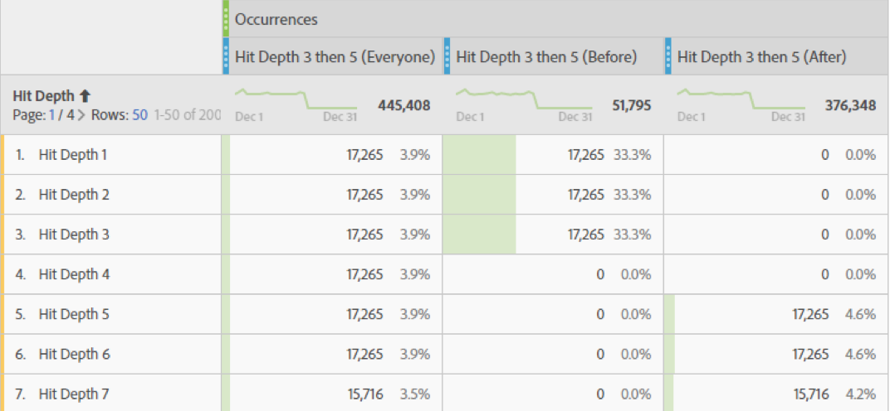
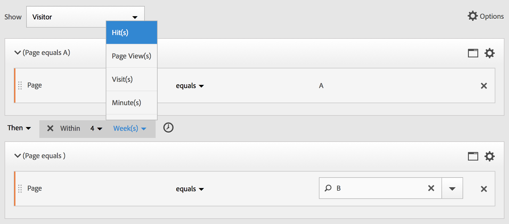

# Creare segmenti sequenziali

I segmenti sequenziali vengono creati utilizzando l’operatore THEN, anziché AND o OR. THEN implica che si verifica un criterio di segmento, seguito da un altro. Per impostazione predefinita, un segmento sequenziale identifica tutti i dati corrispondenti, mostrando il filtro “Includi tutti”. I segmenti sequenziali possono essere ulteriormente filtrati in un sottoinsieme di hit corrispondenti utilizzando le opzioni “Solo prima della sequenza” e “Solo dopo la sequenza”.

Inoltre, puoi vincolare i segmenti sequenziali a una durata di tempo, a una granularità e a conteggi tra punti di controllo specifici utilizzando gli [operatori After (dopo) e Within (entro)](/help/components/segmentation/segmentation-workflow/seg-sequential-build.md).

## Includi tutti {#section_75ADDD5D41F04800A09E592BB2940B35}

Quando crei un segmento in cui è impostata l’opzione “Includi tutti”, il segmento identifica i percorsi che corrispondono al pattern specificato nel suo insieme. Di seguito è riportato un esempio di segmento di sequenza di base alla ricerca di un hit (Pagina A) seguito da un altro (Pagina B) visitato dallo stesso visitatore. Il segmento è impostato su Includi tutti.

| Se il risultato | Sequenza |
|--- |--- |
| Corrisponde | A then B A then (in una visita diversa) B A then D then B |
| Non corrisponde | B then A |

## Solo prima della sequenza e Solo dopo la sequenza {#section_736E255C8CFF43C2A2CAAA6D312ED574}

Le opzioni **[!UICONTROL Only Before Sequence]** e **[!UICONTROL Only After Sequence]** filtrano il segmento in un sottoinsieme di dati prima o dopo la sequenza specificata.

* **Solo prima della sequenza**: include tutti gli hit prima di una sequenza più il primo hit della sequenza stessa (vedi gli esempi 1 e 3). Se una sequenza appare più volte in un percorso, “Solo prima della sequenza” include il primo hit dell’ultima occorrenza della sequenza e tutti gli hit precedenti (vedi l’esempio 2).
* **Solo dopo la sequenza**: include tutti gli hit dopo una sequenza più l’ultimo hit della sequenza stessa (vedi gli esempi 1 e 3). Se una sequenza appare più volte in un percorso, “Solo dopo la sequenza” include l’ultimo hit della prima occorrenza della sequenza e tutti gli hit successivi (vedi l’esempio 2).

Ad esempio, considera una sequenza B -> D. I tre filtri identificano gli hit come segue:

**Esempio 1: B then D compare una volta**

| Esempio | A | B | C | D | E | F |
|---|---|---|---|---|---|---|
| Includi tutti | A | B | C | D | E | F |
| Solo prima della sequenza | A | B |  |  |  |  |
| Solo dopo la sequenza |  |  |  | D | E | F |

**Esempio 2: B then D compare più volte**

| Esempio | A | B | C | D | B | C | D | E |
|---|---|---|---|---|---|---|---|---|
| Includi tutti | A | B | C | D | B | C | D | E |
| Solo prima della sequenza | A | B | C | D | B |  |  |  |
| Solo dopo la sequenza |  |  |  | D | B | C | D | E |

Inquadriamo questo concetto anche con la dimensione Profondità di hit.

**Esempio 3: Profondità di hit 3 then 5**

## Vincoli della dimensione {#section_EAFD755F8E674F32BCE9B642F7F909DB}

In una clausola “within” (entro), tra istruzioni THEN, puoi aggiungere ad esempio “entro 1 istanza di parola chiave di ricerca”, “entro 1 istanza di eVar 47”. In questo modo si vincola il segmento entro un’istanza di una dimensione.

L’impostazione di una clausola “entro la dimensione” tra le regole consente a un segmento di limitare i dati alle sequenze in cui tale clausola è soddisfatta. Vedi l’esempio seguente, in cui il vincolo è impostato su “Entro 1 pagina”:

| Se il risultato | Sequenza |
|--- |--- |
| Corrisponde | A then B |
| Non corrisponde | A then C then B (perché B non si trovava entro 1 pagina rispetto ad A) **Nota:** se elimini la restrizione della dimensione, sia “A then B” che “A then C then B” corrisponderanno. |

## Sequenza semplice di visualizzazione di pagina

Identifica i visitatori che hanno visualizzato una pagina e poi un’altra pagina. I dati a livello di hit filtrano questa sequenza indipendentemente dalle sessioni di visita precedenti, passate o intermedie o dal momento o dal numero di visualizzazioni di pagina che si verificano tra le pagine.

**Esempio**: il visitatore ha visualizzato la pagina A e poi la pagina B nella stessa visita o in un’altra.

**Casi di utilizzo**

Di seguito sono riportati alcuni esempi di utilizzo del segmento.

1. I visitatori di un sito sportivo visualizzano la pagina di destinazione del calcio e poi la pagina di destinazione del basket in ordine sequenziale, ma non necessariamente nella stessa visita. In questo modo una campagna riceve l’istruzione di inviare contenuti relativi al basket ai visualizzatori durante la stagione calcistica.
1. Un rivenditore di automobili identifica una relazione tra coloro che visitano per prima cosa la pagina relativa alla fedeltà clienti e poi visitano la pagina video in qualsiasi momento durante la stessa visita o in un’altra visita.

**Creare il segmento**

È possibile nidificare due regole di pagina all’interno di un contenitore principale [!UICONTROL Visitor] e sequenziare gli hit di pagina utilizzando l’operatore [!UICONTROL THEN].

## Sequenza di visitatori in più visite

Identifica i visitatori che hanno abbandonato una campagna ma sono poi tornati alla sequenza di visualizzazioni di pagina in un’altra sessione.

**Esempio**: il visitatore ha visualizzato la pagina A in una visita, quindi ha visualizzato la pagina B in un’altra visita.

**Casi di utilizzo**

Di seguito sono riportati alcuni esempi di utilizzo di questo tipo di segmento:

* I visitatori della pagina Sport di un sito di notizie visitano nuovamente la pagina Sport in un’altra sessione.
* Un rivenditore di abbigliamento individua una relazione tra i visitatori che visitano per prima cosa una pagina di destinazione in una sessione e quindi si spostano direttamente alla pagina di pagamento in un’altra sessione.

**Creare il segmento**

In questo esempio vengono nidificati due contenitori **[!UICONTROL Visit]** all’interno del contenitore principale **[!UICONTROL Visitor]** e il segmento viene sequenziato utilizzando l’operatore [!UICONTROL THEN].

## Sequenza a livello misto

Identifica i visitatori che visualizzano due pagine nel corso di un numero indeterminato di visite, ma poi visualizzano una terza pagina in una visita separata.

**Esempio**: i visitatori visitano la pagina A e poi la pagina B in una o più visite e in seguito visualizzano la pagina C in una visita separata.

**Casi di utilizzo**

Di seguito sono riportati alcuni esempi di utilizzo di questo tipo di segmento:

* Il visitatore visita prima un sito di notizie e poi la pagina Sport nella stessa visita. In un’altra visita il visitatore visita la pagina Meteo.
* Il rivenditore definisce i visitatori che accedono alla pagina Principale e poi alla pagina Il mio account. In un’altra visita, visualizzano la pagina Visualizza carrello.

**Creare il segmento**

1. Rilascia due dimensioni pagina dai riquadri a sinistra all’interno di un contenitore principale [!UICONTROL Visitor].
1. Aggiungi l’operatore THEN tra le dimensioni.
1. Fai clic su **[!UICONTROL Options]** > **[!UICONTROL Add container]**, quindi aggiungi un contenitore [!UICONTROL Visit] sotto al livello [!UICONTROL Visitor]e crea una sequenza utilizzando l’operatore [!UICONTROL THEN].

## Aggregare i contenitori

L’aggiunta di più contenitori [!UICONTROL Hit] all’interno di un contenitore [!UICONTROL Visitor] consente di utilizzare gli operatori appropriati tra lo stesso tipo di contenitori e di utilizzare regole e dimensioni quali pagina e numero visite per definire la visualizzazione di pagina e fornire una dimensione di sequenza all’interno del contenitore [!UICONTROL Hit]. L’applicazione della logica a livello di hit consente di vincolare e combinare le corrispondenze a uno stesso livello di hit all’interno del contenitore [!UICONTROL Visitor] per creare una varietà di tipi di segmenti.

**Esempio**: i visitatori hanno visitato la pagina A dopo il primo hit nella sequenza di visualizzazioni di pagina (pagina D nell’esempio), poi hanno visitato la pagina B o la pagina C senza tenere conto del numero di visite.

**Casi di utilizzo**

Di seguito sono riportati alcuni esempi di utilizzo di questo tipo di segmento:

* Per identificare i visitatori che visitano la pagina di destinazione Principale in una visita, poi visualizzano la pagina Abbigliamento uomo in un’altra visita e poi visualizzano la pagina di destinazione Abbigliamento donna o bambino in un’altra visita.
* Una rivista online acquisisce i visitatori che accedono alla Home page in una visita, alla pagina Sport in un’altra visita e alla pagina Opinioni in un’altra visita.

**Creare il segmento**

1. Seleziona il contenitore [!UICONTROL Visitor] come contenitore principale.
1. Aggiungi due contenitori a livello di [!UICONTROL Hit]: una dimensione con una dimensione numerica appropriata unita allo stesso livello di [!UICONTROL Hit] dagli operatori [!UICONTROL AND] e [!UICONTROL OR].
1. All’interno del contenitore [!UICONTROL Visit], aggiungi un altro contenitore [!UICONTROL Hit] e nidifica altri due contenitori [!UICONTROL Hit] uniti con un operatore [!UICONTROL OR]o [!UICONTROL AND].

   Crea una sequenza per questi contenitori [!UICONTROL Hit] nidificati con l’operatore [!UICONTROL THEN].

## La “nidificazione” nei segmenti sequenziali

Posizionando punti di controllo sia a livello di [!UICONTROL Visit] che a livello di [!UICONTROL Hit], potrai vincolare il segmento in modo da soddisfare i requisiti all’interno di una visita specifica o di un hit specifico.

**Esempio**: il visitatore ha visitato la pagina A e poi la pagina B nella stessa visita. In una nuova visita, il visitatore è quindi passato alla pagina C.

**Creare il segmento**

1. Trascina due dimensioni di pagina sotto un contenitore principale [!UICONTROL Visit].
1. Seleziona entrambe le regole, fai clic su **[!UICONTROL Options]** > **[!UICONTROL Add container from selection]** e modificalo in un contenitore [!UICONTROL Visit].
1. Uniscile con un operatore [!UICONTROL THEN].
1. Crea un contenitore Hit come peer per il contenitore [!UICONTROL Visit] e trascina una dimensione di pagina.
1. Unisci la sequenza nidificata nel contenitore [!UICONTROL Visit] con il contenitore [!UICONTROL Hit] utilizzando un altro operatore [!UICONTROL THEN].

## Escludere gli hit

Le regole del segmento includono tutti i dati a meno che tu non escluda espressamente i dati di [!UICONTROL Visitor], [!UICONTROL Visit] o [!UICONTROL Hit] utilizzando la regola [!UICONTROL Exclude]. Essa consente di ignorare i dati comuni e creare segmenti con maggiore precisione. Oppure consente di creare segmenti escludendo i gruppi individuati per identificare il set di dati rimanente. Ad esempio è possibile creare una regola che includa i visitatori che hanno effettuato un ordine e poi escluderli per identificare i “non acquirenti”. Tuttavia, nella maggior parte dei casi è meglio creare regole che escludano valori ampi piuttosto che cercare di utilizzare la regola [!UICONTROL Exclude] per valori di inclusione specifici.

Ad esempio:

* **Escludi pagine**. Utilizza una regola di segmento per eliminare una pagina specifica (ad esempio *`Home Page`*) da un rapporto, creare una regola Hit in cui la pagina sia uguale a “Home page” e poi escluderla. Questa regola include automaticamente tutti i valori eccetto “Home page”.
* **Escludi i domini di riferimento**. Utilizza una regola che include solo i domini di riferimento da Google.com ed esclude tutti gli altri.
* **Identifica i non acquirenti**. Identifica quando gli ordini sono maggiori di zero e quindi esclude il [!UICONTROL Visitor].

L’operatore [!UICONTROL Exclude] può essere utilizzato per identificare una sequenza in cui visite o hit specifici non vengono eseguiti dal visitatore. [!UICONTROL Exclude Checkpoints] può essere incluso anche all’interno di un [Gruppo logico](/help/components/segmentation/segmentation-workflow/seg-sequential-build.md).

### Escludi tra punti di controllo

Applica la logica per segmentare i visitatori quando un punto di controllo non si è verificato in modo esplicito tra altri due punti di controllo.

**Esempio**: i visitatori che hanno visitato la pagina A e poi la pagina C, ma non la pagina B.

**Casi di utilizzo**

Di seguito sono riportati alcuni esempi di utilizzo di questo tipo di segmento:

* I visitatori visualizzano una pagina Lifestyle e poi la sezione Teatro senza visitare la pagina Arte.
* Un rivenditore di automobili vede una relazione tra coloro che visitano la pagina di destinazione principale e poi vanno direttamente alla campagna Nessun interesse senza visitare la pagina Veicolo.

**Creare il segmento**

Crea un segmento come faresti per un segmento sequenziale semplice, a livello misto o nidificato, quindi imposta l’operatore [!UICONTROL EXCLUDE] per l’elemento contenitore. L’esempio seguente è un segmento aggregato in cui i tre contenitori [!UICONTROL Hit] vengono trascinati nell’area di lavoro, l’operatore [!UICONTROL THEN] viene assegnato per unire la logica dei contenitori e poi escludere il contenitore della visualizzazione di pagina centrale in modo da includere solo i visitatori che sono passati dalla pagina A alla pagina C nella sequenza.

### Escludi all’inizio della sequenza

Se il punto di controllo di esclusione si trova all’inizio di un segmento sequenziale, ciò assicura che una visualizzazione di pagina esclusa non sia avvenuta prima del primo hit non escluso.

**Esempio**: il visitatore ha visitato la pagina A e non la pagina B.

**Casi di utilizzo**

Di seguito sono riportati alcuni esempi di casi di utilizzo di questo tipo di segmento:

* I visitatori che hanno visitato la pagina A e non la pagina B.
* Un ristorante vuole vedere utenti abituali che evitano la pagina di destinazione principale e vanno direttamente alla pagina Ordina.

**Creare il segmento**

Crea due contenitori Hit separati all’interno di un contenitore Visitor di livello principale. Quindi, imposta l’operatore [!UICONTROL EXCLUDE] per il primo contenitore.

### Escludi alla fine della sequenza

Se il punto di controllo di esclusione si trova alla fine di una sequenza, ciò assicura che il punto di controllo non si sia verificato tra l’ultimo punto di controllo non escluso e la fine della sequenza del visitatore.

**Esempio**: i visitatori visitano la pagina A e non visitano la pagina B nella stessa visita o in visite successive.

**Casi di utilizzo**

Di seguito sono riportati alcuni esempi di utilizzo di questo tipo di segmento:

* I visitatori che hanno visitato la pagina A e non la pagina B.
* Un ristorante vuole vedere utenti abituali che evitano la pagina di destinazione principale e vanno direttamente alla pagina Ordina.

**Creare il segmento**

Crea un segmento di sequenza semplice trascinando due contenitori [!UICONTROL Hit] sull’area di lavoro e collegandoli utilizzando l’operatore [!UICONTROL THEN]. Quindi assegna l’operatore [!UICONTROL EXCLUDE] al secondo contenitore [!UICONTROL Hit] della sequenza.

## Contenitori Gruppo logico

I contenitori Gruppo logico sono necessari per raggruppare le condizioni in un singolo punto di controllo del segmento sequenziale. Il contenitore Gruppo logico è disponibile solo nella segmentazione sequenziale per assicurare che le sue condizioni siano soddisfatte dopo qualsiasi punto di controllo sequenziale precedente e prima di qualsiasi punto di controllo sequenziale successivo. Le condizioni all’interno del punto di controllo del Gruppo logico stesso possono essere soddisfatte in qualsiasi ordine. Al contrario, i contenitori non sequenziali (Hit, Visita, Visitatore) non richiedono che le loro condizioni siano soddisfatte all’interno della sequenza globale, generando risultati poco intuitivi se utilizzati con un operatore THEN.
Il contenitore [!UICONTROL Logic Group] è stato progettato per trattare *diversi punti di controllo come un gruppo*, *senza alcun ordine* tra i punti di controllo raggruppati. In altre parole, l’ordine dei punti di controllo all’interno di quel gruppo è irrilevante. Ad esempio, non è possibile nidificare un contenitore [!UICONTROL Visitor] all’interno di un contenitore [!UICONTROL Visitor]. È invece possibile nidificare un contenitore [!UICONTROL Logic Group] all’interno di un contenitore [!UICONTROL Visitor] con specifici punti di controllo a livello di [!UICONTROL Visit] e [!UICONTROL Hit].

>[!NOTE]
>
>Un [!UICONTROL Logic Group] può essere definito solo in un segmento sequenziale, il che significa che l’operatore [!UICONTROL THEN] è utilizzato all’interno dell’espressione.

| Gerarchia dei contenitori | Illustrazione | Definizione |
|---|---|---|
| Gerarchia dei contenitori standard |  | All’interno del contenitore [!UICONTROL Visitor], i contenitori [!UICONTROL Visit] e [!UICONTROL Hit] sono nidificati in sequenza per estrarre segmenti in base agli hit, al numero di visite e al visitatore. |
| Gerarchia dei contenitori logica |  | La gerarchia dei contenitori standard è necessaria anche all’esterno del contenitore [!UICONTROL Logic Group]. Ma all’interno del contenitore [!UICONTROL Logic Group], i punti di controllo non richiedono un ordine o una gerarchia stabiliti, devono semplicemente essere soddisfatti dal visitatore in qualsiasi ordine. |

I gruppi logici possono sembrare scoraggianti. Ecco alcune best practice per utilizzarli:

**Gruppo logico o contenitore Hit/Visita?**
Se desideri raggruppare punti di controllo sequenziali, il “contenitore” di cui hai bisogno è Gruppo logico. Tuttavia, se i punti di controllo sequenziali devono verificarsi nell’ambito di un singolo hit o di una visita, è necessario un contenitore Hit o Visita. Risulta ovvio che il contenitore Hit non è adatto per un gruppo di punti di controllo sequenziali, quando un hit può accreditare non più di un punto di controllo.

**I gruppi logici semplificano la creazione di segmenti sequenziali?**
Sì. Supponiamo che tu stia cercando di identificare questo segmento di visitatori: **Visitatori che hanno visualizzato la pagina A e poi le pagine B, C e D**

Puoi creare questo segmento senza un contenitore Gruppo logico, ma il processo sarebbe complesso e laborioso. Dovresti specificare ogni sequenza di pagine che il visitatore può visualizzare:
* `Visitor Container [Page A THEN Page B THEN Page C THEN Page D] or`
* `Visitor Container [Page A THEN Page B THEN Page D THEN Page C] or`
* `Visitor Container [Page A THEN Page C THEN Page B THEN Page D] or`
* `Visitor Container [Page A THEN Page C THEN Page D THEN Page B] or`
* `Visitor Container [Page A THEN Page D THEN Page B THEN Page C] or`
* `Visitor Container [Page A THEN Page D THEN Page C THEN Page B]`

Un contenitore Gruppo logico semplifica notevolmente la creazione di questo segmento, come illustrato di seguito:

### Creare un segmento del Gruppo logico {#section_A5DDC96E72194668AA91BBD89E575D2E}

Come altri contenitori, i contenitori [!UICONTROL Logic Group] possono essere costruiti in più modi all’interno del [!UICONTROL Segment Builder]. Di seguito viene illustrata la modalità consigliata per la nidificazione dei contenitori [!UICONTROL Logic Group]:

1. Trascina dimensioni, eventi o segmenti dai riquadri a sinistra.
1. Modifica il contenitore in alto in un contenitore [!UICONTROL Visitor].
1. Modifica l’operatore [!UICONTROL AND] o [!UICONTROL OR] inserito per impostazione predefinita e imposta l’operatore THEN.
1. Seleziona i contenitori [!UICONTROL Hit] (Dimensione, Evento o Elemento) e fai clic su **[!UICONTROL Options]** > **[!UICONTROL Add container from selection]**.
1. Fai clic sull’icona del contenitore e seleziona **[!UICONTROL Logic Group]**.  
1. Ora puoi impostare il contenitore [!UICONTROL Hit] all’interno del contenitore [!UICONTROL Logic Group] senza considerare la gerarchia.

### Punti di controllo del Gruppo logico in qualsiasi ordine

L’utilizzo di [!UICONTROL Logic Group] consente di soddisfare le condizioni all’interno del gruppo che risiedono al di fuori della sequenza. Ciò ti consente di creare segmenti in cui un contenitore [!UICONTROL Visit] o [!UICONTROL Hit] si verifica indipendentemente dalla gerarchia usuale.

**Esempio**: visitatori che hanno visitato la pagina A e poi la pagina B e C in qualsiasi ordine.

**Creare il segmento**

Le pagine B e C sono nidificate in un contenitore [!UICONTROL Logic Group] all’interno del contenitore [!UICONTROL Visitor] esterno. Il contenitore [!UICONTROL Hit] per A è seguito dal contenitore [!UICONTROL Logic Group] in cui B e C sono identificate utilizzando l’operatore [!UICONTROL AND]. Poiché si trova in [!UICONTROL Logic Group], la sequenza non è definita e visitare le pagine B e C in un qualsiasi ordine rende l’argomento true.

**Un altro esempio**: visitatori che hanno visitato la pagina B o la pagina C e poi hanno visitato la pagina A.

Il segmento deve corrispondere ad almeno uno dei punti di controllo del gruppo logico (B o C). Inoltre, le condizioni del gruppo logico possono essere soddisfatte nello stesso hit o tra più hit&#x200B;.

### Prima corrispondenza del Gruppo logico

L’utilizzo di [!UICONTROL Logic Group] consente di soddisfare le condizioni all’interno del gruppo che risiedono al di fuori della sequenza. In questo segmento di prima corrispondenza non ordinato, le regole del [!UICONTROL Logic Group] sono identificate inizialmente come una visualizzazione di pagina della pagina B o della pagina C, poi come la visualizzazione richiesta della pagina A.

**Esempio**: visitatori che hanno visitato la pagina B o la pagina C e poi hanno visitato la pagina A.

**Creare il segmento**

Le dimensioni di pagina B e pagina C sono raggruppate all’interno di un contenitore [!UICONTROL Logic Group] in cui è selezionato l’operatore [!UICONTROL OR], e poi all’interno del contenitore [!UICONTROL Hit] che identifica come valore la visualizzazione della pagina A.

### Escludi AND in Gruppo logico

Crea segmenti utilizzando [!UICONTROL Logic Group] quando più visualizzazioni di pagina sono aggregate per definire quali pagine dovevano essere visitate necessariamente mentre altre pagine sono state specificatamente saltate. ****

**Esempio**: il visitatore ha visitato la pagina A, poi ha esplicitamente saltato la pagina B o C, ma ha visualizzato la pagina D.

**Creare il segmento**

Crea questo segmento trascinando dimensioni, eventi e segmenti predefiniti dai riquadri a sinistra. Consulta [Creazione di un segmento del Gruppo logico](/help/components/segmentation/segmentation-workflow/seg-sequential-build.md).

Dopo aver nidificato i valori all’interno del [!UICONTROL Logic Group], fai clic sul pulsante **[!UICONTROL Exclude]** all’interno del contenitore [!UICONTROL Logic Group].

### Escludi OR in Gruppo logico

Crea segmenti utilizzando [!UICONTROL Logic Group] quando più visualizzazioni di pagina sono aggregate per definire quali pagine dovevano essere visitate necessariamente mentre altre pagine sono state specificatamente saltate.

**Esempio**: visitatori che hanno visitato la pagina A, ma non hanno visitato la pagina B o la pagina C prima della pagina A.

**Creare il segmento**

Le pagine B e C iniziali sono identificate in un contenitore [!UICONTROL Logic Group], che viene escluso, e sono seguite da un hit della pagina A da parte del visitatore.

Crea questo segmento trascinando dimensioni, eventi e segmenti predefiniti dai riquadri a sinistra.

Dopo aver nidificato i valori all’interno del [!UICONTROL Logic Group], fai clic sul pulsante **[!UICONTROL Exclude]** all’interno del contenitore [!UICONTROL Logic Group].

## Creare segmenti entro (within) e dopo (after) un periodo di tempo

Utilizza gli operatori [!UICONTROL Within] e [!UICONTROL After] incorporati nell’intestazione di ciascun contenitore per definire periodo di tempo, eventi e conteggio.

Puoi limitare la corrispondenza a una determinata durata utilizzando gli operatori [!UICONTROL Within] e [!UICONTROL After] specificando granularità e conteggio. L’operatore [!UICONTROL Within] viene utilizzato per specificare un limite massimo per il periodo di tempo tra due punti di controllo. L’operatore [!UICONTROL After] viene utilizzato per specificare un limite minimo per il periodo di tempo tra due punti di controllo.

### Operatori After e Within {#section_CCAF5E44719447CFA7DF8DA4192DA6F8}

La durata è specificata da una singola lettera maiuscola che rappresenta la granularità seguita da un numero che rappresenta il conteggio di ripetizioni della granularità.

**[!UICONTROL Within]** include il punto finale (minore o uguale a).

**[!UICONTROL After]** non include il punto finale (maggiore di).

| Operatori | Descrizione |
|--- |--- |
| AFTER (DOPO) | L’operatore After viene utilizzato per specificare un limite minimo per il periodo di tempo tra due punti di controllo. Quando si impostano i valori After, il limite di tempo inizia quando il segmento viene applicato. Ad esempio, se l’operatore After è impostato su un contenitore per identificare i visitatori che visitano la pagina A ma non tornano per visitare la pagina B fino a un giorno dopo, quel giorno inizierà quando il visitatore esce dalla pagina A. Affinché il visitatore sia incluso nel segmento, devono trascorrere almeno 1440 minuti (un giorno) dopo l’abbandono della pagina A per visualizzare la pagina B. |
| WITHIN (ENTRO) | L’operatore Within viene utilizzato per specificare un limite massimo per il periodo di tempo tra due punti di controllo. Ad esempio, se l’operatore Within è impostato su un contenitore per identificare i visitatori che visitano la pagina A e poi ritornano a visitare la pagina B entro un giorno, quel giorno inizierà quando il visitatore esce dalla pagina A. Per essere incluso nel segmento, il visitatore avrà un tempo massimo di un giorno prima di aprire la pagina B. Affinché il visitatore sia incluso nel segmento, la visita alla pagina B deve avvenire entro un massimo di 1440 minuti (un giorno) dopo l’abbandono della pagina A per visualizzare la pagina B. |
| AFTER/WITHIN (DOPO/ENTRO) | Quando si utilizza sia After che Within, è importante comprendere che entrambi gli operatori inizieranno e finiranno in parallelo, non in modo sequenziale.   Ad esempio, se crei un segmento con il contenitore impostato su: `After = 1 Week(s) and Within = 2 Week(s)` Allora le condizioni per identificare i visitatori nel segmento sono soddisfatte solo tra 1 e 2 settimane. Entrambe le condizioni vengono applicate dal momento del primo hit pagina. |

### Utilizzare l’operatore After

* After consente di monitorare per anno, mese, giorno, ora e minuto per far corrispondere le visite.
* After può essere applicato solo a un contenitore [!UICONTROL Hit], perché è l’unico livello per il quale è definita una granularità così fine.

**Esempio**: i visitatori che hanno visitato la pagina A hanno visitato la pagina B solo dopo 2 settimane.****

**Creare il segmento**: questo segmento viene creato aggiungendo un contenitore [!UICONTROL Visitor] con due contenitori [!UICONTROL Hit]. È quindi possibile impostare l’operatore [!UICONTROL THEN], aprire il menu a discesa dell’operatore [!UICONTROL AFTER] e impostare il numero di settimane.

**Corrispondenze**

Se si imposta “After 2 weeks” (Dopo 2 settimane), se un hit per la pagina A si verifica il 1° giugno 2019 alle 00:01, un hit successivo per la pagina B corrisponderà ad esso se si verifica prima del 15 giugno 2019 alle 00:01 (14 giorni dopo).

| Hit A | Hit B | Corrispondenza |
|--- |--- |--- |
| Hit **A**: 1° giugno 2019, 00:01 | Hit **B**: 15 giugno 2019, 00:01 | **Corrisponde:** questo vincolo di tempo corrisponde perché è dopo il 1° giugno 2019 (due settimane). |
| Hit **A**: 1° giugno 2019, 00:01 | Hit **B**: 8 giugno 2019, 00:01 Hit B: 15 giugno 2019, 00:01 | **Non corrisponde:** il primo hit sulla pagina B non corrisponde perché è in conflitto con il vincolo che lo richiede dopo due settimane. |

### Utilizzare l’operatore Within

* [!UICONTROL Within] consente di monitorare per anno, mese, giorno, ora e minuto per far corrispondere le visite.
* [!UICONTROL Within] può essere applicato solo a un contenitore [!UICONTROL Hit], perché è l’unico livello per il quale è definita una granularità così fine.

>[!IMPORTANT]
>
>In una clausola “within” (entro), tra istruzioni THEN, puoi aggiungere ad esempio “entro 1 istanza di parola chiave di ricerca”, “entro 1 istanza di eVar 47”. In questo modo si vincola il segmento entro un’istanza di una dimensione.

**Esempio**: i visitatori che hanno visitato la pagina A hanno visitato la pagina B entro 5 minuti.

**Creare il segmento**: questo segmento viene creato aggiungendo un contenitore [!UICONTROL Visitor] e trascinandolo insieme a due contenitori [!UICONTROL Hit]. È quindi possibile impostare l’operatore [!UICONTROL THEN], aprire l’elenco a discesa dell’operatore [!UICONTROL AFTER] e impostare l’intervallo: hit, visualizzazioni di pagina, visite, minuti, ore, giorni, settimane, mesi, trimestri o anni.

**Corrispondenze**

Le corrispondenze devono verificarsi entro il limite di tempo. Per l’espressione, se un visitatore visita la pagina A alle 00:01, un hit successivo alla pagina B corrisponderà ad esso se si verifica alle 00:06 o prima (cinque minuti dopo, incluso l’ultimo minuto). Gli hit nello stesso minuto corrisponderanno a loro volta.

### Gli operatori Within e After

Utilizza [!UICONTROL Within] e [!UICONTROL After] per fornire un punto finale massimo e minimo a entrambe le estremità di un segmento.

**Esempio**: i visitatori che hanno visitato la pagina A hanno poi visitato la pagina B dopo 2 settimane, ma entro 1 mese.

**Creare il segmento**: crea il segmento sequenziando due contenitori [!UICONTROL Hit] all’interno di un contenitore [!UICONTROL Visitor]. Quindi imposta gli operatori [!UICONTROL After] e [!UICONTROL Within].

**Corrispondenze**

Tutti i visitatori che hanno raggiunto la pagina A il 1° giugno 2019 e ritornano dopo le 00:01 del 15 giugno 2019 ma *prima* del 1° luglio 2019 sono inclusi nel segmento. Confronta con [Periodo di tempo tra le esclusioni](/help/components/segmentation/segmentation-workflow/seg-sequential-build.md).

Gli operatori [!UICONTROL After] e [!UICONTROL Within] possono essere utilizzati insieme per definire un segmento sequenziale.

In questo esempio viene illustrata una seconda visita alla pagina B dopo due settimane, ma entro un mese.
