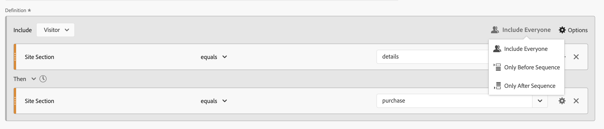

# Segmenti sequenziali

È possibile creare segmenti sequenziali utilizzando l&#39;operatore logico [!UICONTROL Then] tra componenti, contenitori e componenti o contenitori. L&#39;operatore logico [!UICONTROL Then] implica che si verifica una condizione di segmento, seguita da un&#39;altra.

Inoltre, è possibile vincolare i segmenti sequenziali a una durata di tempo, a una granularità e a conteggi specifici tra punti di controllo utilizzando **[!UICONTROL After]** e **[!UICONTROL Within operators]**.

>[!BEGINSHADEBOX]

Consulta  [Segmentazione sequenziale](https://experienceleague.adobe.com/en/docs/analytics-learn/tutorials/components/segmentation/sequential-segmentation){target="_blank"} per un video demo.

>[!ENDSHADEBOX]

Un segmento sequenziale ha alcune [funzionalità di base](#basics) e opzioni aggiuntive che è possibile configurare per aggiungere maggiore complessità al segmento sequenziale:

## Nozioni di base

Le nozioni di base per la creazione di un segmento sequenziale non sono diverse dalla creazione di un segmento regolare utilizzando il [Generatore di segmenti](seg-build.md). Un segmento regolare diventa automaticamente un segmento sequenziale non appena si seleziona l&#39;operatore **[!UICONTROL Then]** nella definizione principale o in uno qualsiasi dei contenitori utilizzati nel [Generatore di segmentazione](seg-build.md).

### Esempi

Gli esempi seguenti illustrano come utilizzare i segmenti sequenziali in vari casi d’uso.

#### Sequenza semplice

Identifica i visitatori che hanno visualizzato una pagina e poi un’altra pagina. I dati a livello di hit vengono segmentati utilizzando questa sequenza. Indipendentemente dalle visite precedenti, passate o intermedie dei visitatori, oppure dall’ora o dal numero di visualizzazioni di pagina che si verificano tra le visite.

#### Sequenza tra le visite

Identifica i visitatori che hanno visualizzato una pagina in una visita e poi un’altra pagina in un’altra visita. Per distinguere tra le visite, utilizza i contenitori per generare la sequenza e definire il livello  **[!UICONTROL Visit]** per ogni contenitore.

#### Sequenza a livello misto

Identifica i visitatori che visualizzano due pagine nel corso di un numero indeterminato di visite e quindi visualizzano una terza pagina in una visita separata. Utilizza nuovamente i contenitori per generare la sequenza e definire il livello  **[!UICONTROL Visit]** nel contenitore che definisce la visita separata.

#### Sequenza di aggregazione

Identifica i visitatori che alla prima visita hanno visitato una pagina specifica e poi hanno visitato altre pagine. Per distinguere la sequenza di hit, utilizzare i contenitori per separare la logica a livello di contenitore  **[!UICONTROL Visit]**.

#### Nidificare una sequenza

Identifica tutte le visite in cui un visitatore visita una pagina prima di un’altra e poi effettua visite di follow-up che coinvolgono altre due pagine. Ad esempio, identifica tutte le visite in cui un visitatore visita prima la pagina principale, poi una pagina di categoria 1 e poi altre visite in cui in ogni visita vengono visitate le pagine di categoria 2 e categoria 3.

## [!UICONTROL After] e [!UICONTROL Within]

È possibile utilizzare  **[!UICONTROL After]** e  **[!UICONTROL Within]** operatore **[!UICONTROL Then]** per definire ulteriori [vincoli di tempo](#time-constraints) o [vincoli per Hit, Visite o Dimensioni](#event-session-and-dimension-constraints).

### Vincoli temporali

Per applicare vincoli di tempo all&#39;operatore **[!UICONTROL Then]**:

1. Seleziona .
1. Selezionare **[!UICONTROL Within]** o **[!UICONTROL After]** dal menu di scelta rapida.
1. Specificare un periodo di tempo (**[!UICONTROL Minute]**, **[!UICONTROL Hour]**, fino a **[!UICONTROL Years]**).
1. Selezionare  **[!UICONTROL *number *]**per aprire un popup che consente di digitare o specificare un numero utilizzando **[!UICONTROL -]**o **[!UICONTROL +]**.

Per rimuovere un vincolo di tempo, utilizzare .

La tabella seguente spiega più dettagliatamente gli operatori dei vincoli di tempo.

| Operatori | Descrizione |
|--- |--- |
| **[!UICONTROL After]** | L&#39;operatore [!UICONTROL After] viene utilizzato per specificare un limite minimo per il periodo di tempo tra due punti di controllo. Quando si impostano i valori After, il limite di tempo inizia quando il segmento viene applicato. Ad esempio, se l&#39;operatore [!UICONTROL After] è impostato su un contenitore per identificare i visitatori che visitano la pagina A, ma non tornano a visitare la pagina B fino a dopo un giorno, quel giorno inizierà quando il visitatore esce dalla pagina A.  Affinché il visitatore sia incluso nel segmento, devono trascorrere almeno 1440 minuti (un giorno) dopo l’uscita dalla pagina A per visualizzare la pagina B. |
| **[!UICONTROL Within]** | L&#39;operatore [!UICONTROL Within] viene utilizzato per specificare un limite massimo per il periodo di tempo tra due punti di controllo. Ad esempio, se l&#39;operatore [!UICONTROL Within] è impostato su un contenitore per identificare i visitatori che visitano la pagina A e poi ritornano a visitare la pagina B entro un giorno, quel giorno inizia quando il visitatore esce dalla pagina A. Per essere incluso nel segmento, il visitatore ha un tempo massimo di un giorno prima di aprire la pagina B. Affinché il visitatore sia incluso nel segmento, l’apertura della pagina B deve avvenire entro un massimo di 1440 minuti (un giorno) dopo l’uscita dalla pagina A per visualizzare la pagina B. |
| **[!UICONTROL After but Within]** | Quando si utilizzano entrambi gli operatori [!UICONTROL After] e [!UICONTROL Within], entrambi gli operatori iniziano e terminano in parallelo, non in sequenza.  Ad esempio, si crea un segmento con il contenitore impostato su: `After = 1 Week(s) and Within = 2 Week(s)`. Le condizioni per identificare i visitatori in questo segmento sono soddisfatte solo tra una e due settimane. Entrambe le condizioni vengono applicate dal momento della prima visualizzazione della pagina. |

#### Esempi

Alcuni esempi di utilizzo dei vincoli di tempo.

##### Operatore [!UICONTROL After]

Identifica i visitatori che hanno visitato una pagina e poi un’altra solo dopo due settimane. Ad esempio, i visitatori che hanno visitato la home page, ma le | La pagina delle scarpe solo dopo due settimane.

Se una visualizzazione di pagina per la Home si verifica il 1° giugno 2024, alle 00:01, allora una visualizzazione di pagina per le donne | Le scarpe corrispondono finché la visualizzazione della pagina si verifica dopo il 15 giugno 2024 00:01.

##### Operatore [!UICONTROL Within]

Identifica i visitatori che hanno visitato una pagina e poi un’altra pagina entro cinque minuti. Ad esempio, i visitatori che hanno visitato la home page e poi le donne | Scarpe pagina entro 5 minuti.

Se una visualizzazione di pagina per la Home si verifica il 1° giugno 2024, alle 12:01, allora una visualizzazione di pagina per le donne | Le scarpe corrispondono finché la visualizzazione della pagina si verifica prima del 15 giugno 2024 12:16.

##### Operatore [!UICONTROL After] ma [!UICONTROL Within]

Identifica i visitatori che hanno visitato una pagina e poi un’altra pagina dopo due settimane, ma entro un mese. Ad esempio, i visitatori che hanno visitato la Home page e poi dopo due settimane ed entro un mese le | Pagina Scarpe.

Tutti i visitatori che hanno raggiunto la Home page il 1° giugno 2024 e che ritornano a visitare le donne | La pagina delle scarpe dopo il 15 giugno 2019 00:01, ma prima del 1 luglio 2019 si qualifica per il segmento.

### [!UICONTROL Hit], [!UICONTROL Visit] e [!UICONTROL Dimension] vincoli

I vincoli di  **[!UICONTROL After]** e  **[!UICONTROL Within]** consentono di specificare non solo un vincolo di tempo, ma anche un vincolo di hit, visita o dimensione. Selezionare **[!UICONTROL Hit(s)]**, **[!UICONTROL Visit(s)]** o **[!UICONTROL Other dimensions]**  **[!UICONTROL *Nome Dimension *]**. Puoi usare il campo [!UICONTROL *Ricerca*] per cercare una dimensione.

#### Esempio

Di seguito è riportato un esempio di segmento sequenziale alla ricerca di visitatori che hanno visitato una pagina di categoria di prodotto (donne) | Scarpe), seguita da una pagina di pagamento (Checkout | Grazie) in una sola pagina.

Le sequenze di esempio seguenti corrispondono o non corrispondono:

| Sequenza |  |
|--- | :---: |
| Pagina `Women \| Shoes` seguita dalla pagina `Checkout \| Thank You` |  |
| Pagina `Women \| Shoes` seguita dalla pagina `Women \| Tops` seguita dalla pagina `Checkout \| Thank You` |  |

## [!UICONTROL Include]

Puoi specificare quali dati includere nel segmento sequenziale o in un contenitore sequenziale che fa parte del segmento sequenziale.

### [!UICONTROL Everyone] {#include_everyone}

Per creare un segmento sequenziale che includa tutti, selezionare l&#39;opzione  **[!UICONTROL Include Everyone]**.

Il segmento sequenziale identifica i dati che corrispondono al pattern specificato nel suo insieme.  Di seguito è riportato un esempio di un segmento di sequenza di base alla ricerca di visitatori che hanno visitato una pagina di categoria di prodotto (donne) | Scarpe), seguita da una pagina di pagamento (Checkout | Grazie). Il segmento è impostato su  **[!UICONTROL Include Everyone]**.

Le sequenze di esempio seguenti corrispondono o non corrispondono:

| | Sequenza |  |
|---:|--- | --- |
| 1 | `Women \| Shoes` quindi `Checkout \| Thank You` nella stessa visita |  |
| 2 | `Women \| Shoes` quindi `Men \| Shoes` e `Checkout \| Thank You` (per visite diverse) |  |
| 3 | `Checkout \| Thank You` quindi `Women \| Shoes` |  |

### [!UICONTROL Only Before Sequence] e [!UICONTROL Only After Sequence]

Le opzioni  **[!UICONTROL Only Before Sequence]** e  **[!UICONTROL Only After Sequence]** segmentano i dati in un sottoinsieme prima o dopo la sequenza specificata.

*  **Only Before Sequence**: include tutti i dati prima di una sequenza e i primi dati della sequenza stessa. Se una sequenza appare più volte come parte dei dati, [!UICONTROL Only Before Sequence] include il primo hit dell&#39;ultima occorrenza della sequenza e tutti gli hit precedenti.
*  **Solo dopo la sequenza**: include tutti gli hit dopo una sequenza e gli ultimi dati della sequenza stessa. Se una sequenza appare più volte come parte dei dati, [!UICONTROL Only After Sequence] include l&#39;ultimo hit della prima occorrenza della sequenza e tutti gli hit successivi.

Si consideri una definizione che specifica una sequenza di un componente con criteri identificati da B, seguita (Then) da un componente con criteri identificati da D. Le tre opzioni consentono di identificare i dati nel modo seguente:

| B Then D | A | B | C | D | E | F |
|---|:---:|:---:|:---:|:---:|:---:|:---:|
| Includi tutti |  |  |  |  |  |  |
| Solo prima della sequenza |  |  |  |  |  |  |
| Solo dopo la sequenza |  |  |  |  |  |  |

| B Then D (si verifica più volte) | A | B | C | D | B | C | D | E |
|---|:---:|:---:|:---:|:---:|:---:|:---:|:---:|:---:|
| Includi tutti |  |  |  |  |  |  |  |  |
| Solo prima della sequenza |  |  |  |  |  |  |  |  |
| Solo dopo la sequenza |  |  |  |  |  |  |  |  |

#### Esempio

Hai definito tre versioni di un segmento sequenziale per le sezioni del sito. Uno con l&#39;opzione  **[!UICONTROL Include Everyone]**, uno con l&#39;opzione  **[!UICONTROL Only Before Sequence]** e uno con l&#39;opzione  **[!UICONTROL Only After Sequence]**. Hai assegnato ai tre segmenti il nome desiderato.

Quando si esegue il reporting sulle sezioni del sito utilizzando questi tre segmenti, l’output di esempio in una tabella a forma libera è simile al seguente:

## [!UICONTROL Exclude]

Le definizioni dei segmenti includono tutti i dati a meno che tu non escluda espressamente  [!UICONTROL Person],  [!UICONTROL Visit] o  [!UICONTROL Hit] utilizzando **[!UICONTROL Exclude]**.

[!UICONTROL Exclude] ti consente di ignorare i dati comuni e creare segmenti con maggiore attenzione. Escludi consente inoltre di creare segmenti escludendo gruppi specifici di visitatori. Ad esempio, per definire un segmento che specifica i visitatori che hanno effettuato ordini e quindi escludere quel gruppo di visitatori per identificare *non acquirenti*. Si consiglia di creare regole che utilizzano una definizione ampia anziché tentare di utilizzare [!UICONTROL Exclude] per individuare visitatori specifici che corrispondono a valori di inclusione specifici.

Esempio di definizioni di esclusione:

* **Escludi pagine**. Utilizza una definizione di segmento per eliminare una pagina specifica (ad esempio *Home page*) da un report, creare una regola Hit in cui la pagina sia uguale a `Home Page` e quindi escludere la regola. Questa definizione include automaticamente tutte le pagine ad eccezione della *home page*.
* **Escludi i domini di riferimento**. Utilizza una definizione che includa solo i domini di riferimento da Google.com ed escluda tutti gli altri.
* **Identifica i non acquirenti**. Identifica quando gli ordini sono maggiori di zero e quindi esclude il [!UICONTROL Person].

[!UICONTROL Exclude] può essere utilizzato per identificare una sequenza in cui i visitatori non fanno parte di visite specifiche o eseguono hit specifici. [!UICONTROL Exclude] può essere incluso anche in un [!UICONTROL Logic Group] (vedi sotto).

Puoi escludere i contenitori, non i componenti.

### Esempi

Di seguito sono riportati alcuni esempi di utilizzo di [!UICONTROL Exclude].

#### [!UICONTROL Exclude] entro

Identifica i visitatori che hanno visitato una pagina, non un’altra pagina e poi un’altra pagina. Escludi il contenitore utilizzando  [!UICONTROL Exclude]. Una sottile barra rossa a sinistra identifica un contenitore escluso.

#### [!UICONTROL Exclude] all&#39;inizio

Identifica i visitatori che hanno visitato una pagina senza mai passare a un’altra pagina. Ad esempio, le persone che hanno ritirato un acquisto senza mai visitare la home page.

#### [!UICONTROL Exclude] alla fine

Identifica i visitatori che hanno visitato una pagina ma non altre pagine. Ad esempio, i visitatori che hanno visitato la pagina principale ma non le pagine di pagamento.

## [!UICONTROL Logic Group]

>[!NOTE]
>
>Un [!UICONTROL Logic Group] può essere definito solo in un segmento sequenziale, il che significa che l&#39;operatore [!UICONTROL Then] è utilizzato all&#39;interno del contenitore.

Il Gruppo logico consente di raggruppare le condizioni in un singolo punto di controllo del segmento sequenziale. Come parte della sequenza, la logica definita nel contenitore identificato come Gruppo logico viene valutata dopo qualsiasi punto di controllo sequenziale precedente e prima di qualsiasi punto di controllo sequenziale successivo.

Le condizioni all’interno del Gruppo logico stesso possono essere soddisfatte in qualsiasi ordine. Al contrario, i contenitori non sequenziali (hit, visita, visitatore) non richiedono che le loro condizioni siano soddisfatte all&#39;interno della sequenza complessiva, generando possibili risultati non intuitivi se utilizzati con un operatore **[!UICONTROL Then]**.

[!UICONTROL Logic Group] è stato progettato per trattare *diverse condizioni come un gruppo, senza alcun ordine* tra le condizioni raggruppate. In caso contrario, l’ordine delle condizioni all’interno di un Gruppo logico è irrilevante.

Alcune best practice per utilizzare il Gruppo logico sono:

* Per raggruppare punti di controllo sequenziali.
* Semplificare la costruzione di segmenti sequenziali.

### Esempi

Di seguito sono riportati alcuni esempi sull’utilizzo del contenitore Gruppo logico.

#### Qualsiasi ordine

Identifica i visitatori che hanno visitato una pagina e poi hanno visualizzato ogni pagina di un altro set di pagine in qualsiasi ordine. Ad esempio, i visitatori che hanno visitato la home page e poi le pagine Uomini, Donne e Bambini, indipendentemente dall’ordine.

È possibile creare questo segmento senza [!UICONTROL Logic Group], ma la costruzione sarà complessa e laboriosa. Specifica ogni sequenza di pagine che il visitatore può visualizzare. Per chiarezza, solo il primo contenitore viene aperto  e gli altri contenitori sono chiusi . Puoi derivare il contenuto degli altri contenitori dai titoli.

Puoi utilizzare [!UICONTROL Logic Group] per semplificare la creazione di questo segmento, come illustrato di seguito. Accertati di selezionare  **[!UICONTROL Logic Group]** per il contenitore.

#### Prima corrispondenza

Identifica i visitatori che hanno visitato una pagina o un’altra pagina e poi hanno visitato un’altra pagina. Ad esempio, i visitatori che hanno visitato la pagina Donne o Uomini e poi il Checkout | Pagina di ringraziamento.

#### [!UICONTROL Exclude] [!UICONTROL And]

Identifica i visitatori che hanno visitato una pagina e poi esplicitamente non hanno visitato un set di altre pagine, ma un’altra pagina. Ad esempio, i visitatori che hanno visitato la home page e non la pagina Uomini o donne, ma la pagina Bambini.

#### [!UICONTROL Exclude] [!UICONTROL Or]

Identifica i visitatori che hanno visitato una pagina e poi esplicitamente non hanno visitato alcuna pagina di un set di pagine, ma hanno visitato un’altra pagina. Ad esempio, i visitatori che hanno visitato la home page e non la pagina Uomini e donne, ma la pagina Bambini.

<!--
An example of a complex sequential segment if you want to find the visitors that 

| visit One | visit Two | visit Three |
| --- | --- | --- |
| The visitor went to the main landing page A, excluded the campaign page B, and then viewed the Product page C.| The visitor again went to the main landing page A, excluded the campaign page B, and went again to the Product page C, and then to a new page D. | The visitor entered and followed that same path as in the first and second visits, then excluded page F to go directly to a targeted product on page G. |
-->

## Un ultimo esempio

Come ultimo esempio, vuoi identificare i visitatori che hanno imparato a conoscere una pagina di prodotto specifica, senza che questi visitatori siano mai stati toccati dalla tua campagna Empower Your Move. E nella loro prima visita al tuo negozio online ha visto la Home page ma non ha guardato più lontano alcun fitness (ingranaggio) prodotti della categoria Uomini. Tuttavia, nella visita successiva, subito dopo, hanno visitato una pagina di prodotto e effettuato un ordine online senza passare prima dalla home page.

>[!MORELIKETHIS]
>
> * [Masterizzazione logica sequenziale in AA e CJA: introduzione a THEN](https://experienceleaguecommunities.adobe.com/t5/adobe-analytics-blogs/mastering-sequential-logic-in-aa-amp-cja-introduction-to-then/ba-p/738131)
