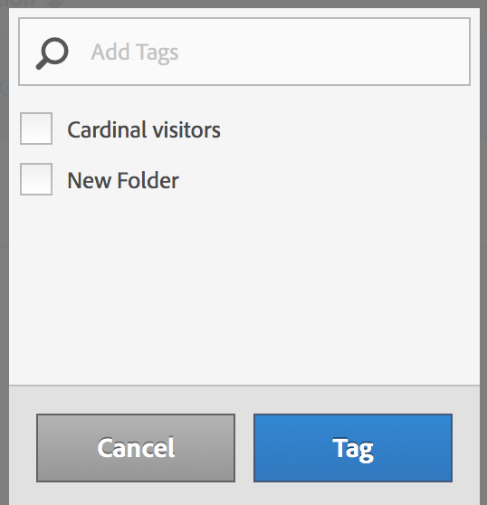

# Assegnare tag ai segmenti

Nel Gestore segmenti, assegnare tag ai segmenti ti consente di organizzarli.

Tutti gli utenti possono creare tag per i segmenti e applicarne uno o più a un segmento. Tuttavia, puoi visualizzare solo i tag dei segmenti di tua proprietà o che sono stati condivisi con te. Che tipo di tag è utile creare? Di seguito sono riportati alcuni suggerimenti di tag utili:

* Tag basati sui **nomi dei team**, ad esempio Social Marketing e Mobile Marketing.
* Tag del **progetto** (tag di analisi), ad esempio Analisi per pagina di ingresso.
* Tag di **categorie**: maschile, geografia.
* Tag del **flusso di lavoro**: Da approvare, Curato per (una specifica unità aziendale)

1. Nel Gestore segmenti, contrassegna la casella di controllo accanto al segmento a cui desideri assegnare il tag. Viene visualizzata la barra degli strumenti di gestione del segmento:

   

1. Fai clic su **[!UICONTROL Tag]** e

   * seleziona da tag esistenti, oppure
   * aggiungi un nuovo tag e premi **[!UICONTROL Enter]**.

      

1. Fa di nuovo clic su **[!UICONTROL Tag]** per assegnare il tag al segmento.

Ora il tag dovrebbe essere visualizzato nella colonna Tag (fai clic sull’icona a forma di ingranaggio in alto a destra per gestire le colonne).

Puoi anche filtrare i tag andando in **[!UICONTROL Filters]** > **[!UICONTROL Tags]**.
