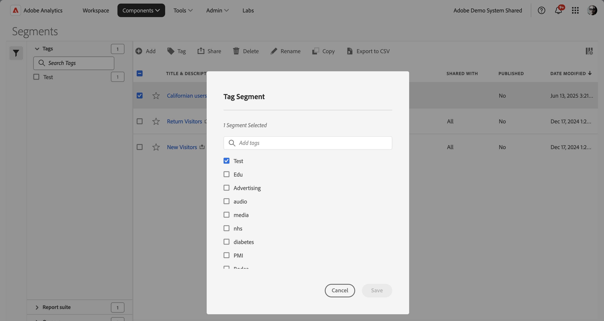

# Assegnare tag ai segmenti

Nel [Gestore segmenti](seg-manage.md), puoi utilizzare i tag per organizzare i segmenti. Gli amministratori possono assegnare tag a tutti i segmenti. Gli utenti che non sono amministratori possono assegnare tag solo ai segmenti creati o condivisi con loro.

Per assegnare tag a uno o più segmenti:

1. Nel [Gestore segmenti](seg-manage.md), seleziona uno o più segmenti ai quali desideri assegnare i tag.
1. Dalla barra delle azioni, seleziona  **[!UICONTROL Tag]**.
1. Nella finestra di dialogo **[!UICONTROL Tag Segment]** (Crea elemento dati):

   

   1. (facoltativamente) utilizzare  per cercare e limitare l&#39;elenco di tag.

   2. In base all’elenco dei tag:

      * seleziona uno o più tag esistenti dall’elenco, oppure
      * immettere un nuovo tag e premere **[!UICONTROL ENTER]**. Ripeti l’operazione per aggiungere più di un nuovo tag.

1. Selezionare **[!UICONTROL Save]** per salvare i tag per il segmento. Seleziona **[!UICONTROL Cancel]** per annullare.

Una volta salvati, i tag vengono elencati nel campo [!UICONTROL Tag] per i segmenti selezionati nel [Generatore di segmenti](seg-build.md).

## Suggerimenti

Di seguito sono riportati alcuni suggerimenti per organizzare i tag in base a:

* **Team**: ad esempio Social Marketing o Mobile Marketing.

* **Progetto**: ad esempio, Analisi pagina di ingresso.

* **Categoria**:. Ad esempio, Uomini, Donne, Bambini.

* **Geografia**: ad esempio Stati Uniti, California.

* **Flusso di lavoro**: ad esempio: Da approvare, Curato

<!--
In the [Segment manager](seg-manage.md), you can use tags to organize segments. Administrators can tag all segments. Non administroators can tags only the segments they create or have been shared with them.

To tag one or more segments:

1. In the [Segment manager](seg-manage.md), select one or more of the segments you want to tag.
1. From the action bar, select  **[!UICONTROL Tag]**.
1. In the **[!UICONTROL Tag Segments]** dialog:
   
   

   1. (optionally) use  to search for and limit the list of tags.

   2. Based on the list of tags:
   
      * select one or more existing tags from the list, or
      * enter a new tag and press **[!UICONTROL ENTER]**. Repeat to add more than one new tag.

1. Select **[!UICONTROL Save]** to save the tags for the segment. Select **[!UICONTROL Cancel]** to cancel.

Once saved, the tags are listed in the [!UICONTROL Tag] field for the selected segments in the [Segment builder](seg-builder.md). 

## Suggestions

Below are some suggestions to organize tags based on:

* **Team**: For example, Social Marketing, Mobile Marketing.
    
* **Project**: For example, Entry-page analysis.
    
* **Category**:. For example, Men, Women, Kids.

* **Geography**: For example: United States, California.
    
* **Workflow**: For example: To be approved,  Curated

-->