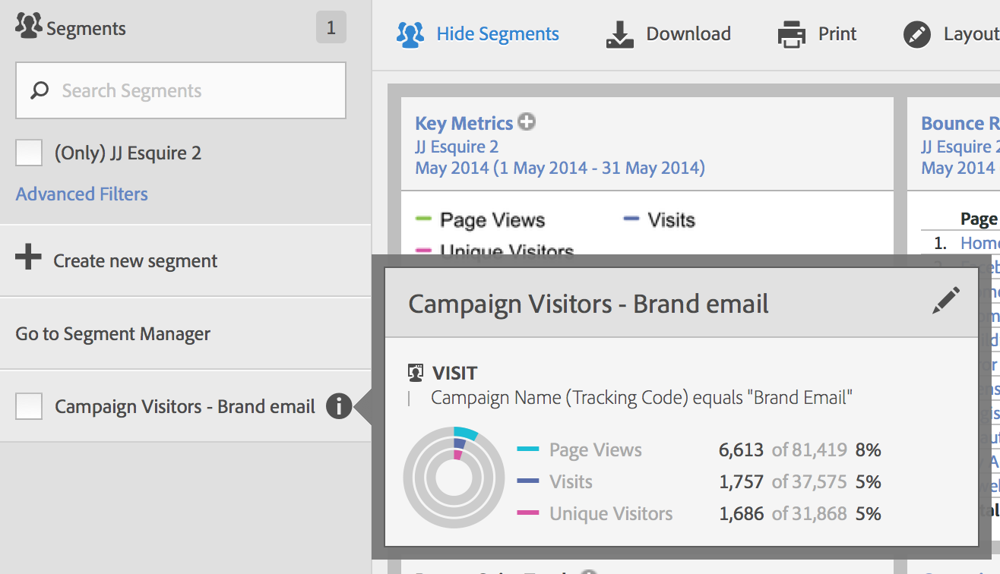
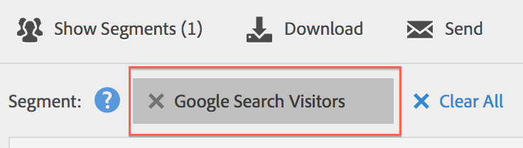

# Utilizzare i segmenti

Per utilizzare i segmenti in Analysis Workspace, è sufficiente trascinare uno o più segmenti da **[!UICONTROL Segments]** nella barra dei componenti e rilasciarli su:

* Un [pannello](/help/analyze/analysis-workspace/c-panels/panels.md) in Analysis Workspace per segmentare tutte le visualizzazioni nel pannello.
* Riga di intestazione in una [tabella a forma libera](/help/analyze/analysis-workspace/visualizations/freeform-table/freeform-table.md) in Analysis Workspace per sostituire la dimensione.
* Riga in una [tabella a forma libera](/help/analyze/analysis-workspace/visualizations/freeform-table/freeform-table.md) in Analysis Workspace per avviare un raggruppamento.
* Colonna in una [tabella a forma libera](/help/analyze/analysis-workspace/visualizations/freeform-table/freeform-table.md) in Analysis Workspace per aggiungere o sostituire una colonna o per avviare un filtro.
* Pannelli di configurazione per la visualizzazione o i pannelli che consentono di rilasciare segmenti. Ad esempio, in un pannello [Confronto segmenti](/help/analyze/analysis-workspace/c-panels/c-segment-comparison/segment-comparison.md) o in una visualizzazione di riepilogo [Metrica chiave](/help/analyze/analysis-workspace/visualizations/key-metric.md)
* Generatore di [definizioni per un segmento](/help/components/segmentation/segmentation-workflow/seg-build.md#definition-builder), in modo da includere un segmento nella definizione del segmento.
* Generatore di [definizioni per una metrica calcolata](/help/components/calculated-metrics/workflow/c-build-metrics/cm-build-metrics.md#definition-builder), in modo da includere un segmento nella definizione della metrica calcolata.

<!--
How to apply one or more segments to a report from the segment rail.

1. Bring up the report to which you want to apply a segment, for example the [!UICONTROL Pages Report].
1. Click **[!UICONTROL Show Segments]** above the report. The segment rail opens.

   

1. Mark the checkbox next to one or more of the segments or **[!UICONTROL Search Segments]** to find the right segment.

   >[!NOTE]
   >
   >You can apply more than one segment to a report (this is called segment stacking). When multiple segments are applied, the criteria in each segment is combined using an 'and' operator and then applied. There is no limit to how many segments you can stack.

   >[!NOTE]
   >
   >Clicking the Information icon (i) next to the segment name lets you preview the key metrics to see whether you have a valid segment and how broad the segment is.

1. You can filter by report suite by selecting the **[!UICONTROL (Only) `<report suite name>`]** check box. This will show only those segments that were last saved in that report suite.
1. Click **[!UICONTROL Apply Segment]** and the report will refresh. The segment or segments that are applied now display at the top of the report:

   

-->
