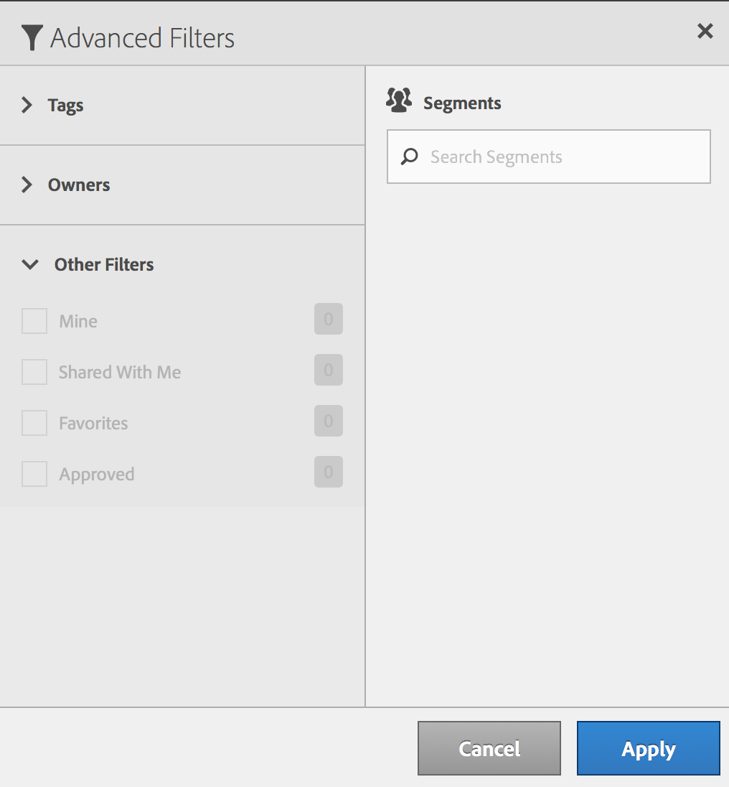

# Filtrare segmenti

È possibile filtrare per tag, proprietari e altri filtri (Mostra tutto, Personali, Condivisi con me, Preferiti e Approvati).

I filtri facilitano la ricerca di segmenti nella barra dei segmenti.

1. Nel Gestore segmenti fai clic sull’icona **[!UICONTROL Filters]**:  

   

1. Sono disponibili i seguenti filtri:

   | Nome filtro | Descrizione |
   |---|---|
   | Tag | Consente di filtrare i segmenti con [tag](/help/components/segmentation/segmentation-workflow/seg-tag.md) specifici. La colonna Tag è visualizzata per impostazione predefinita. |
   | Proprietari | Consente di filtrare i segmenti in base al proprietario. |
   | Altri filtri > Mostra tutto | **(Solo amministratori)** mostra tutti i segmenti, i relativi proprietari e la data dell’ultima modifica. |
   | Altri filtri > Personali | Mostra tutti i segmenti di tua proprietà. |
   | Altri filtri > Condivisi con me | Mostra tutti i segmenti che altri utenti hanno [condiviso](/help/components/segmentation/segmentation-workflow/t-seg-share.md) con te. |
   | Altri filtri > Preferiti | Mostra tutti i segmenti contrassegnati come [Preferiti](/help/components/segmentation/segmentation-workflow/t-seg-favorite.md). |
   | Altri filtri > Approvati | Mostra tutti i segmenti [approvati](/help/components/segmentation/segmentation-workflow/seg-approve.md) ufficialmente. |
   | Cerca segmenti | Consente di cercare i segmenti in base al nome. |
