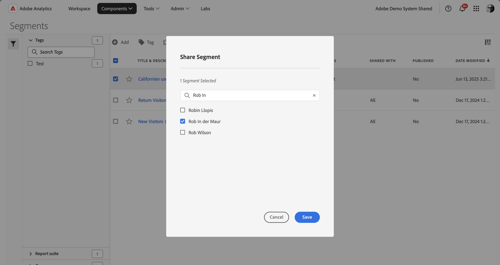

# Condividere segmenti

A seconda delle autorizzazioni, puoi condividere i segmenti con l’intera organizzazione, i gruppi o i singoli utenti.

| Amministratore | Può condividere i segmenti con tutti, con i gruppi e con gli utenti. I gruppi sono configurati come gruppi di autorizzazioni nell’Admin Console. |
|---|---|
| Non amministratore | Può condividere segmenti solo con i singoli utenti. |

Quando è necessario condividere i segmenti con l’intera azienda anziché con un solo gruppo di utenti o singoli utenti? Ecco alcune best practice che potresti seguire:

* In qualità di amministratore, condividi un segmento con **[!UICONTROL All]** (tutti) se è utile per l’intera azienda e tutti possono usarlo con facilità. In questo caso, dovresti anche considerare la possibilità di renderlo un segmento [approvato](/help/components/segmentation/segmentation-workflow/seg-approve.md).

* In qualità di amministratore, condividi un segmento con un **[!UICONTROL Group]** (gruppo) specifico se il segmento fornisce un buon valore aziendale per quel team. Non approvare ufficialmente questo tipo di segmento.
* In qualità di amministratore o di singolo utente, condividi un segmento con altri singoli utenti per esaminarlo e convalidarlo. Se non risulta utile, può essere scartato. Non approvare ufficialmente questo tipo di segmento.

1. Nel Gestore segmenti, seleziona  accanto al segmento che desideri condividere.
1. Seleziona  Condividi.
1. Nella finestra di dialogo **[!UICONTROL Share Segments]** (Crea elemento dati):

   

   Se sei un amministratore, puoi selezionare **[!UICONTROL All]** (tutti) o scegliere tra **[!UICONTROL Groups]** (gruppi) e **[!UICONTROL Users]** (utenti) dell’organizzazione. In qualità di non amministratore, puoi visualizzare solo i singoli utenti. Usa il campo **[!UICONTROL Search]** per cercare gruppi o utenti. 1.

   1. (facoltativamente) utilizzare  per *Cerca singoli utenti o gruppi* e limita l&#39;elenco di gruppi o singoli utenti con cui si desidera condividere il segmento.

   1. Seleziona **[!UICONTROL Save]** per condividere i segmenti. Seleziona **[!UICONTROL Cancel]** per annullare.

   Accanto al segmento viene visualizzata l&#39;icona Condiviso: 

1. Puoi filtrare i segmenti condivisi con te scegliendo **[!UICONTROL Filters]** > **[!UICONTROL Other Filters]** > **[!UICONTROL Shared with Me]**.

## Best practice

Di seguito sono riportate alcune best practice per la condivisione di segmenti e per la condivisione di segmenti.

* In qualità di amministratore, condividi un segmento con tutti solo se sei convinto che chiunque nella tua organizzazione abbia familiarità con l’utilizzo dei segmenti. Puoi anche valutare la possibilità di favorire questi segmenti. Per ulteriori informazioni, consulta [Contrassegnare un segmento come preferito](t-seg-favorite.md).

* In qualità di amministratore, condividi un segmento con un gruppo specifico se tale segmento fornisce valore aziendale per la parte degli utenti di tale gruppo.

* In qualità di amministratore o di singolo utente, condividi un segmento con uno o più singoli utenti per convalidarlo. Se i segmenti non si rivelano utili, puoi eliminarli.
