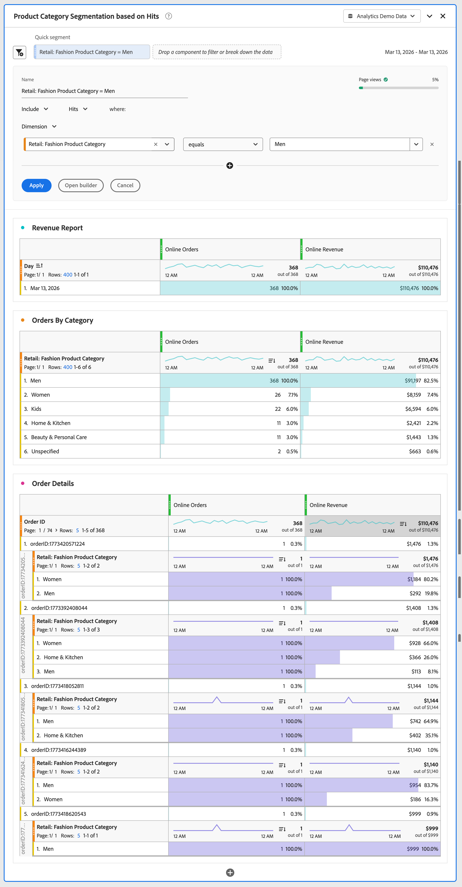
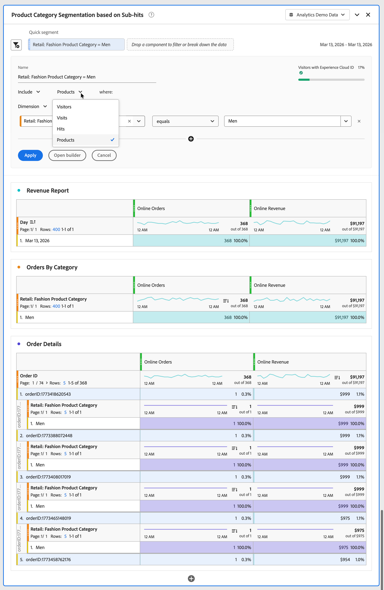
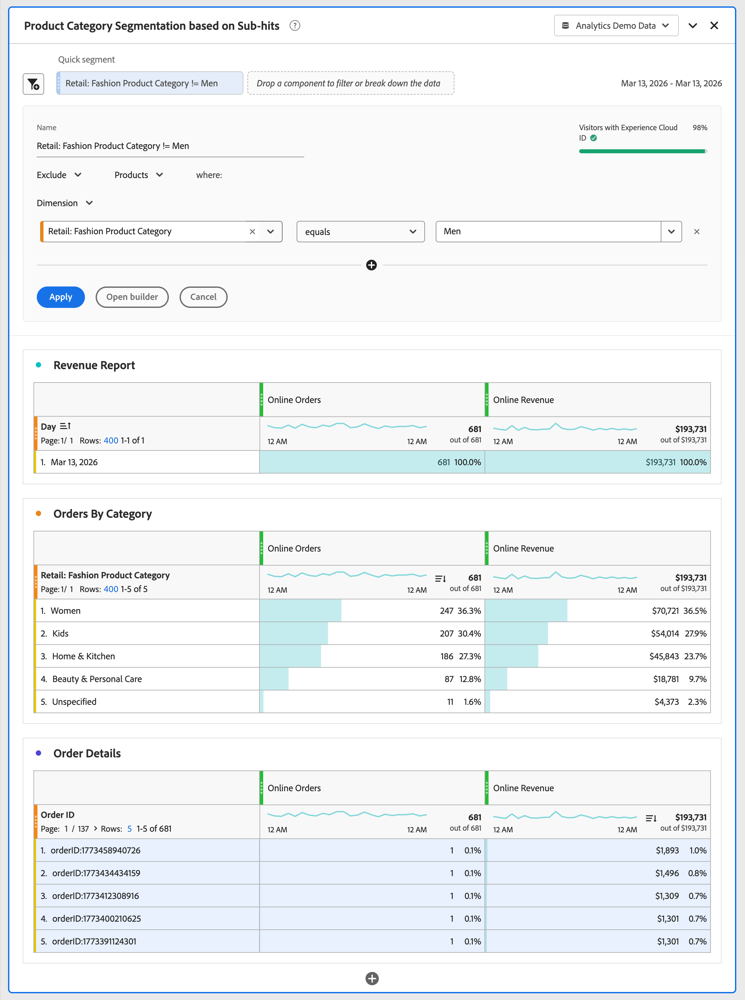

# Analisi degli hit secondari

{{release-limited-testing}}

L’analisi degli hit secondari consente di analizzare i dati dei prodotti a un livello più granulare rispetto al livello degli hit. Invece di filtrare gli hit interi, puoi segmentare i singoli prodotti all’interno degli hit. Ad esempio, segmentando una categoria di prodotti specifica senza includere tutti gli altri prodotti acquistati nello stesso ordine.

In Adobe Analytics l&#39;analisi sub-hit si applica in modo specifico alla variabile **[!UICONTROL Products]**. La variabile **[!UICONTROL Products]** è l&#39;unico oggetto con più valori in Adobe Analytics che supporta l&#39;analisi degli hit secondari.

In Adobe Analytics, la variabile [Products](/help/components/dimensions/product.md) può acquisire più prodotti in un singolo hit. Senza analisi sub-hit, la segmentazione su un attributo di prodotto restituisce tutti gli hit in cui qualsiasi prodotto all’interno di un hit corrisponde all’attributo di prodotto. Il risultato è un’attribuzione errata e metriche di ricavi gonfiate. L’analisi degli hit secondari prende in esame il filtro per singole righe di prodotto all’interno di un hit e risolve questi problemi.

Nell’analisi sub-hit, la logica di esclusione si comporta in modo diverso rispetto all’esclusione standard a livello di hit rispetto alla variabile Products. Quando si escludono gli attributi di prodotto all&#39;interno del contenitore [!UICONTROL Products], il segmento restituisce hit che **contengono prodotti** ma non corrispondono ai criteri di esclusione.

In Adobe Analytics, ogni hit ha voci di elenco dei prodotti anche se l’hit non ha un ID prodotto. Di conseguenza, l’analisi sub-hit esclude la logica e restituisce hit senza alcun prodotto.

## Esempio

Desideri misurare i ricavi online solo dalla categoria Uomini. Senza analisi sub-hit, l’applicazione di un segmento per Uomo include i ricavi da ogni prodotto in qualsiasi ordine (hit) che contiene almeno un prodotto con la categoria Uomini. Con l’analisi degli hit secondari, puoi estendere il filtro al livello del prodotto e restituire solo i ricavi per i prodotti della categoria Uomini.

Desideri inoltre misurare i ricavi online da tutte le altre categorie ad eccezione della categoria Uomini.

>[!BEGINTABS]

>[!TAB Analisi degli hit]

Nel generatore di segmentazione o come parte di un **[!UICONTROL Quick segment]**, si specifica di **[!UICONTROL Include]** **[!UICONTROL Dimension]** **[!UICONTROL Retail: Fashion Product Category]** **[!UICONTROL equals]** **[!UICONTROL Men]** sul contenitore **[!UICONTROL Hits]**.

Di conseguenza, vengono considerati tutti gli ordini contenenti almeno un **[!UICONTROL Men]** **[!UICONTROL Retail: Fashion Product Category]** e i ricavi da altri prodotti inclusi in tali ordini sono inclusi nella metrica **[!UICONTROL Online Revenue]**.
Quando si crea un report sulle categorie, vengono segnalati tutti gli altri valori per **[!UICONTROL Retail: Fashion Product Category]** che facevano parte di un ordine che includeva un prodotto con **[!UICONTROL Men]** **[!UICONTROL Retail: Fashion Product Category]**.

>[!TAB Analisi sub-hit]

Nel generatore di segmentazione o come parte di un **[!UICONTROL Quick segment]**, si specifica di **[!UICONTROL Include]** **[!UICONTROL Dimension]** **[!UICONTROL Retail: Fashion Product Category]** **[!UICONTROL equals]** **[!UICONTROL Men]** sul contenitore **[!UICONTROL Products]**.

Di conseguenza, vengono considerati tutti gli ordini contenenti almeno un **[!UICONTROL Men]** **[!UICONTROL Retail: Fashion Product Category]** e solo i ricavi dei prodotti appartenenti al **[!UICONTROL Men]** **[!UICONTROL Retail: Fashion Product Category]** sono inclusi per la metrica **[!UICONTROL Online Revenue]**.
Quando esegui il report sulle categorie, viene segnalato solo il **[!UICONTROL Men]** **[!UICONTROL Retail: Fashion Product Category]**.

>[!TAB Analisi sub-hit (esclusione)]

Nel generatore di segmentazione o come parte di un **[!UICONTROL Quick segment]**, si specifica di **[!UICONTROL Exclude]** **[!UICONTROL Dimension]** **[!UICONTROL Retail: Fashion Product Category]** **[!UICONTROL equals]** **[!UICONTROL Men]** sul contenitore **[!UICONTROL Products]**.

Per escludere a livello di prodotto, gli hit che contengono almeno un prodotto sono inclusi, quindi l’esclusione a livello di hit secondario viene applicata all’interno di tale ambito. Questa esclusione è diversa dall’esclusione a livello di hit, che esclude l’intero hit.

>[!ENDTABS]
