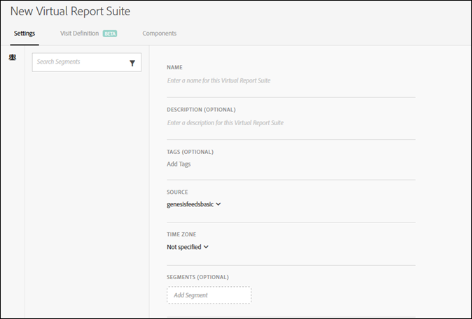

# Creare suite di rapporti

Prima di iniziare a creare suite di rapporti virtuali, devi tenere presenti alcuni aspetti.

* Gli utenti non amministratori non possono visualizzare Virtual Report Suite Manager.
* Impossibile condividere le suite di rapporti virtuali. La &quot;condivisione&quot; viene eseguita tramite gruppi/autorizzazioni.
* In Gestione suite di rapporti virtuale è possibile visualizzare solo le suite di rapporti virtuali. Devi cliccare su &quot;mostra tutto&quot; per vedere quello di tutti gli altri.

1. Passa a **[!UICONTROL Components]** > **[!UICONTROL Virtual Report Suites]**.
1. Fai clic su **[!UICONTROL Add +]**.

   

1. Compila i campi:

<table id="table_0F85B56480BB46CBA5BE236BBD70156D"> 
 <thead> 
  <tr> 
   <th colname="col1" class="entry"> Elemento </th> 
   <th colname="col2" class="entry"> Descrizione </th> 
  </tr> 
 </thead>
 <tbody> 
  <tr> 
   <td colname="col1"> Nome </td> 
   <td colname="col2"> 
Il nome della suite di rapporti virtuali non viene ereditato dalla suite di rapporti principale e deve essere distinto. 
 </td> 
  </tr> 
  <tr> 
   <td colname="col1"> Descrizione </td> 
   <td colname="col2"> 
Aggiungi una buona descrizione a beneficio degli utenti aziendali. 
 </td> 
  </tr> 
  <tr> 
   <td colname="col1"> Tag </td> 
   <td colname="col2"> 
Puoi aggiungere dei tag per organizzare le suite di rapporti. 
 </td> 
  </tr> 
  <tr> 
   <td colname="col1"> Groups (Gruppi) </td> 
   <td colname="col2"> 
Seleziona i gruppi di autorizzazioni a cui desideri accedere per questa VRS. (Puoi anche gestire le autorizzazioni del gruppo da  Amministratore &gt;  Gestione utente &gt;  Gruppi). 
 </td> 
  </tr> 
  <tr> 
   <td colname="col1"> Suite di rapporti principale </td> 
   <td colname="col2"> 
La suite di rapporti da cui questa suite di rapporti virtuale eredita le seguenti impostazioni. La maggior parte dei livelli e delle funzioni del servizio (ad esempio, impostazioni eVar, Regole di elaborazione, Classificazioni e così via) vengono ereditati. Per apportare modifiche a queste impostazioni ereditate in una VRS, devi modificare la suite di rapporti principale ( Amministratore &gt;  Suite di rapporti). 
 </td> 
  </tr> 
  <tr> 
   <td colname="col1"> Fuso orario </td> 
   <td colname="col2"> 
La scelta di un fuso orario è facoltativa. 
 
Se scegli un fuso orario, questo viene salvato insieme alla VRS. Se non si seleziona un fuso orario, verrà utilizzato quello della suite di rapporti padre. 
 
Durante la modifica di una VRS, il fuso orario salvato con la VRS viene visualizzato nel selettore a discesa. Se la VRS è stata creata prima dell’aggiunta del supporto per il fuso orario, il fuso orario della suite di rapporti principale viene visualizzato nel selettore a discesa. 
 </td> 
  </tr> 
  <tr> 
   <td colname="col1"> Segmenti </td> 
   <td colname="col2"> 
Puoi aggiungere un solo segmento oppure <a href="https://docs.adobe.com/content/help/it-IT/analytics/components/segmentation/segmentation-workflow/seg-build.html"  > impilare segmenti</a>. 
 
 
Nota:  Quando si sovrappongono due segmenti, essi sono collegati da un’istruzione AND. Non è possibile modificare questo valore in un'istruzione OR. 
 
 
Quando tenti di eliminare o modificare un segmento attualmente utilizzato in una suite di rapporti virtuale, viene visualizzato un avviso. 
 </td> 
  </tr> 
 </tbody> 
</table>
