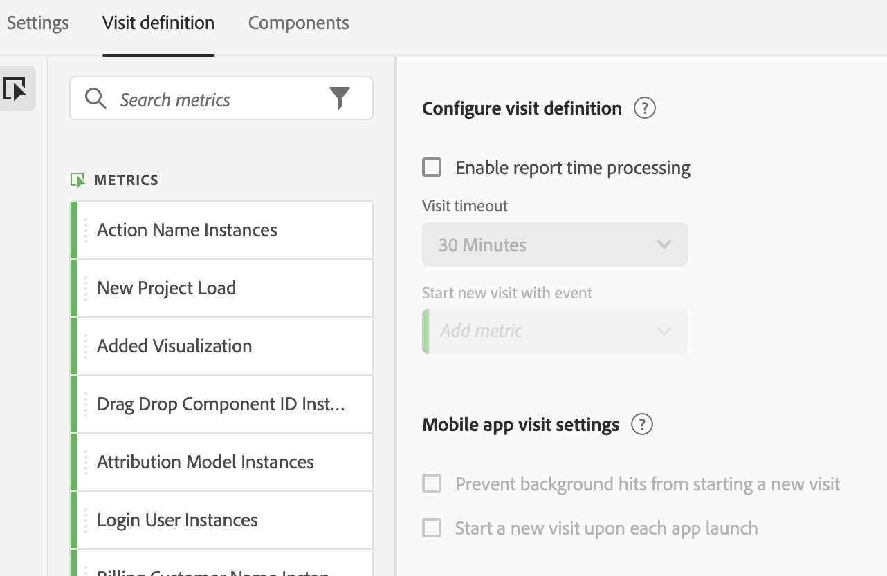

# Creare suite di rapporti

Prima di iniziare a creare suite di rapporti virtuali, tieni presente alcuni aspetti.

* Gli utenti non amministratori non possono visualizzare il gestore delle suite di rapporti virtuali.
* Non è possibile condividere le suite di rapporti virtuali. La &quot;condivisione&quot; viene eseguita tramite gruppi/autorizzazioni.
* Nella gestione delle suite di rapporti virtuali, puoi visualizzare solo le tue suite di rapporti virtuali. È necessario fare clic su &quot;mostra tutto&quot; per visualizzare i dati di tutti gli altri.

1. Passa a **[!UICONTROL Components]** > **[!UICONTROL Virtual report suites]**.
1. Fai clic su **[!UICONTROL Add +]**.

   

## Definire le impostazioni

Nella scheda [!UICONTROL Settings], definire queste impostazioni e quindi fare clic su **[!UICONTROL Continue]**.

| Elemento | Descrizione |
| --- |--- |
| Nome | Il nome della suite di rapporti virtuale non viene ereditato dalla suite di rapporti principale e deve essere distinto. |
| Descrizione | Aggiungi una buona descrizione a beneficio degli utenti aziendali. |
| Tag | Puoi aggiungere tag per organizzare le suite di rapporti. |
| Origine | La suite di rapporti da cui questa suite di rapporti virtuale eredita le impostazioni seguenti. La maggior parte dei livelli di servizio e delle funzioni (ad esempio le impostazioni di eVar, le regole di elaborazione, le classificazioni e così via) vengono ereditati. Per apportare modifiche a queste impostazioni ereditate su una suite di rapporti virtuale, devi modificare la suite di rapporti principale ( Amministratore > Suite di rapporti). |
| Fuso orario | La scelta del fuso orario è facoltativa. Se scegli un fuso orario, questo viene salvato insieme alla suite di rapporti virtuale. Se non ne scegli uno, viene utilizzato il fuso orario della suite di rapporti principale.  Quando si modifica una suite di rapporti virtuale, il fuso orario salvato con la suite di rapporti virtuale viene visualizzato nel selettore a discesa. Se la suite di rapporti virtuale è stata creata prima dell’aggiunta del supporto per il fuso orario, il fuso orario della suite di rapporti principale viene visualizzato nel selettore a discesa. |
| Segmenti | Puoi aggiungere un solo segmento o sovrapporre segmenti.   Nota: quando si impilano due segmenti, questi vengono uniti da un&#39;istruzione AND. Non può essere modificata in un&#39;istruzione OR. Quando tenti di eliminare o modificare un segmento attualmente utilizzato in una suite di rapporti virtuale, viene visualizzato un avviso. |

## Definire la definizione di visita

Nella scheda [!UICONTROL Visit Definition], definire queste impostazioni e quindi fare clic su **[!UICONTROL Continue]**.

>[!BEGINSHADEBOX]

Consulta  [Regolare la definizione di una visita](https://experienceleague.adobe.com/it/docs/analytics-learn/tutorials/components/virtual-report-suites/context-aware-sessions-in-virtual-report-suites){target="_blank"} per un video dimostrativo.

>[!ENDSHADEBOX]

| Elemento | Descrizione |
| --- |--- |
| **Configura definizione visita** |  |
| Abilita elaborazione al momento del rapporto | Utilizza l’elaborazione dei tempi di report per modificare la lunghezza di timeout predefinita per la visita. Queste impostazioni non sono distruttive e si applicano solo ad Analysis Workspace. [Ulteriori informazioni](/help/components/vrs/vrs-report-time-processing.md) |
| Timeout visita | Definisce la quantità di inattività che un visitatore univoco deve avere prima che una nuova visita venga avviata automaticamente. Questo influenzerà la metrica Visite, il contenitore del segmento di visita e le eVar che scadono durante la visita. |
| Inizia nuova visita con evento | Inizia una nuova sessione quando si verifica uno degli eventi specificati, anche se scaduta per timeout. |
| **Impostazioni di visita app mobile** | Modifica la definizione delle visite per gli hit delle app mobili raccolti dagli SDK di Adobe per dispositivi mobili. Queste impostazioni non sono distruttive e si applicano solo ad Analysis Workspace. |
| Impedisci agli hit in background di avviare una nuova visita | Impedisce agli hit in background di avviare una nuova visita e quindi di gonfiare le metriche Visite e Visitatori univoci. |
| Inizia una nuova visita a ogni avvio dell’app | Inizia una nuova sessione quando si verifica l’avvio di un’app. [Ulteriori informazioni](/help/components/vrs/vrs-mobile-visit-processing.md) |

## Includere e rinominare i componenti

1. Nella scheda [!UICONTROL Components], seleziona la casella di controllo per applicare la cura in modo da includere, escludere e rinominare i componenti per questa suite di rapporti virtuale in Analysis Workspace.
Per ulteriori informazioni sulla cura delle suite di rapporti virtuali, consulta [Cura dei componenti delle suite di rapporti virtuali](/help/components/vrs/vrs-components.md).

1. Trascina i componenti (dimensioni, metriche, segmenti o intervalli di date) che vuoi includere nella suite di rapporti virtuali nella sezione [!UICONTROL Included Components].

1. Al termine, fare clic su **[!UICONTROL Save]**.

## Anteprima dati

Sul lato destro di ogni scheda, puoi visualizzare in anteprima gli hit totali, le visite totali e i visitatori totali in questa suite di rapporti virtuale rispetto alla suite di rapporti originale.

## Visualizza compatibilità prodotto

Alcune funzioni delle suite di rapporti virtuali non sono supportate da tutti i prodotti Adobe Analytics. L’elenco di compatibilità dei prodotti consente di vedere quali prodotti all’interno di Adobe Analytics sono supportati in base alle impostazioni correnti della suite di rapporti virtuale.
