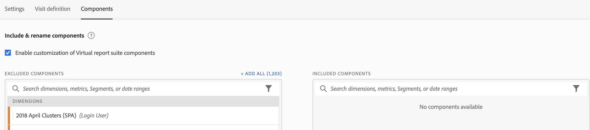

# Creare suite di rapporti

Prima di iniziare a creare suite di rapporti virtuali, devi tenere presenti alcuni aspetti.

* Gli utenti non amministratori non possono visualizzare Virtual Report Suite Manager.
* Impossibile condividere le suite di rapporti virtuali. La &quot;condivisione&quot; viene eseguita tramite gruppi/autorizzazioni.
* In Gestione suite di rapporti virtuale è possibile visualizzare solo le suite di rapporti virtuali. Devi cliccare su &quot;mostra tutto&quot; per vedere quello di tutti gli altri.

1. Passa a **[!UICONTROL Components]** > **[!UICONTROL Virtual Report Suites]**.
1. Fai clic su **[!UICONTROL Add +]**.

   

## Definisci impostazioni

Nella scheda [!UICONTROL Settings] , definisci queste impostazioni e fai clic su **[!UICONTROL Continue]**.

| Elemento | Descrizione |
| --- |--- |
| Nome | Il nome della suite di rapporti virtuali non viene ereditato dalla suite di rapporti principale e deve essere distinto. |
| Descrizione | Aggiungi una buona descrizione a beneficio degli utenti aziendali. |
| Tag | Puoi aggiungere dei tag per organizzare le suite di rapporti. |
| Origine | La suite di rapporti da cui questa suite di rapporti virtuale eredita le seguenti impostazioni. La maggior parte dei livelli e delle funzioni del servizio (ad esempio, impostazioni eVar, Regole di elaborazione, Classificazioni e così via) vengono ereditati. Per apportare modifiche a queste impostazioni ereditate in una VRS, devi modificare la suite di rapporti principale ( Amministratore > Suite di rapporti). |
| Fuso orario | La scelta di un fuso orario è facoltativa. Se scegli un fuso orario, questo viene salvato insieme alla VRS. Se non si seleziona un fuso orario, verrà utilizzato quello della suite di rapporti padre.  Durante la modifica di una VRS, il fuso orario salvato con la VRS viene visualizzato nel selettore a discesa. Se la VRS è stata creata prima dell’aggiunta del supporto per il fuso orario, il fuso orario della suite di rapporti principale viene visualizzato nel selettore a discesa. |
| Segmenti | Puoi aggiungere un solo segmento o impilare segmenti.   Nota:  Quando si sovrappongono due segmenti, essi sono collegati da un’istruzione AND. Non è possibile modificare questo valore in un&#39;istruzione OR. Quando tenti di eliminare o modificare un segmento attualmente utilizzato in una suite di rapporti virtuale, viene visualizzato un avviso. |

## Definire la definizione della visita

Nella scheda [!UICONTROL Visit Definition] , definisci queste impostazioni e fai clic su **[!UICONTROL Continue]**.

| Elemento | Descrizione |
| --- |--- |
| **Configurare la definizione di visita** |  |
| Abilita elaborazione dei tempi di report | Utilizza l’elaborazione dell’ora rapporto per modificare la lunghezza predefinita del timeout della visita. Queste impostazioni non sono distruttive e si applicano solo in Analysis Workspace. [Ulteriori informazioni](/help/components/vrs/vrs-report-time-processing.md) |
| Timeout visita | Definisce la quantità di inattività che un visitatore univoco deve avere prima dell’avvio automatico di una nuova visita. Questo influenzerà la metrica delle visite, il contenitore dei segmenti di visite e gli eVar che scadono al momento della visita. |
| Avvia nuova visita con evento | Avvia una nuova sessione quando uno degli eventi specificati viene attivato, indipendentemente dal timeout di una sessione. |
| **Impostazioni di visita per app mobili** | Modifica il modo in cui vengono definite le visite per gli hit delle app mobili raccolti dagli SDK di Adobe per dispositivi mobili. Queste impostazioni non sono distruttive e si applicano solo in Analysis Workspace. |
| Impedisci agli hit di background di avviare una nuova visita | Impedisce agli hit di background di avviare una nuova visita e di gonfiare le metriche di visite e visitatori univoci. |
| Avvia una nuova visita all’avvio di ogni app | Avvia una nuova sessione quando si verifica un avvio dell&#39;app. [Ulteriori informazioni](/help/components/vrs/vrs-mobile-visit-processing.md) |

## Includere e rinominare i componenti

1. Nella scheda [!UICONTROL Components] , seleziona la casella di controllo per applicare la cura per includere, escludere e rinominare i componenti per questa suite di rapporti virtuale in Analysis Workspace.
Per ulteriori informazioni sulla cura delle VRS, consulta [Cura dei componenti delle suite di rapporti virtuali](https://experienceleague.adobe.com/docs/analytics/components/virtual-report-suites/vrs-components.html?lang=en#virtual-report-suites).

1. Trascina nella sezione [!UICONTROL Included Components] i componenti (dimensioni, metriche, segmenti o intervalli di date) che desideri includere nella VRS.

1. Al termine, fai clic su **[!UICONTROL Save]**.

## Anteprima dati

Sul lato destro di ogni scheda, puoi visualizzare in anteprima gli hit totali, le visite totali e i visitatori totali in questa suite di rapporti virtuali, rispetto alla suite di rapporti originale.

## Visualizza compatibilità prodotto

Alcune funzionalità delle suite di rapporti virtuali non sono supportate da tutti i prodotti Adobe Analytics. L’elenco di compatibilità dei prodotti ti consente di vedere quali prodotti all’interno di Adobe Analytics sono supportati in base alle impostazioni correnti della suite di rapporti virtuali.
