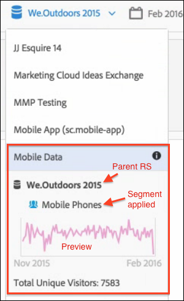

# Visualizzazione delle informazioni sulle suite di rapporti virtuali

Fai clic sull’icona i (Info) accanto al nome della suite di rapporti per ottenere informazioni al riguardo.

## Nel selettore delle suite di rapporti {#section_74E43B60C1CA4180B5ACA57574C1FA0F}

Fai clic sull’icona Info accanto alla suite di rapporti virtuali nel selettore delle suite di rapporti per ottenere le seguenti informazioni:

* Nome della suite di rapporti principale.
* Il nome di tutti i segmenti ad esso applicati.
* Una semplice anteprima della suite di rapporti con il segmento applicato.
* Numero totale di visitatori univoci.

