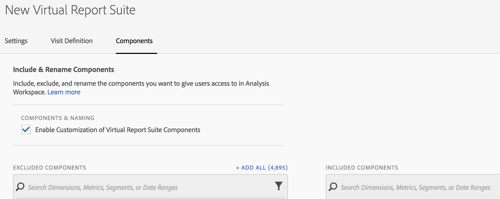
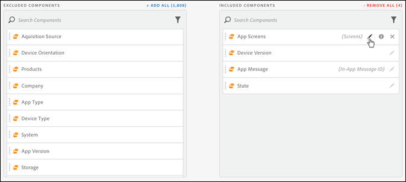
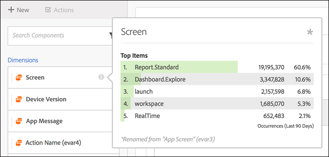

# Cura dei componenti della suite di rapporti virtuali

Le suite di rapporti virtuali possono essere curate per includere ed escludere i componenti.in Analysis Workspace.

>[!BEGINSHADEBOX]

Per un video dimostrativo, consulta  [Cura dei componenti](https://experienceleague.adobe.com/it/docs/analytics-learn/tutorials/components/virtual-report-suites/component-curation-in-virtual-report-suites){target="_blank"}.

>[!ENDSHADEBOX]

>[!NOTE]
>
>Sono state apportate modifiche ai componenti che amministratori e non amministratori possono visualizzare nei progetti Workspace curati e nelle suite di rapporti virtuali (VRS) curate. In precedenza, chiunque poteva vedere i componenti non curati facendo clic su **[!UICONTROL Show all Components]**. La [esperienza di gestione aggiornata](/help/analyze/analysis-workspace/curate-share/curate.md) consente un controllo più dettagliato sui componenti visibili.

Per abilitare la cura dei componenti:

1. Passa a **[!UICONTROL Analytics]** > **[!UICONTROL Components]** > **[!UICONTROL Virtual report suites]** > **[!UICONTROL Create new virtual report suite]**.
1. Dopo aver definito **[!UICONTROL Settings]**, fare clic sulla scheda **[!UICONTROL Components]**.

1. Selezionare la casella di controllo **[!UICONTROL Enable Customization of Virtual report suite components]**:

   

   >[!NOTE]
   >
   >Se è abilitata la personalizzazione dei componenti, la suite di rapporti virtuali è accessibile **solo in Analysis Workspace** e non nei seguenti elementi:
   >
   >* [!UICONTROL Data Warehouse]
   >* [!UICONTROL Report Builder]
   >* [!UICONTROL Activity Map]
   >* API di reportistica di Analytics

   Una volta selezionata, puoi aggiungere i componenti da includere nella suite di rapporti virtuali trascinando i componenti applicabili dalla colonna &quot;componenti esclusi&quot; alla colonna &quot;componenti inclusi&quot;. I componenti che possono essere inclusi ed esclusi sono:

   * Dimensioni
   * Metriche
   * Segmenti
   * Intervalli di date

   >[!NOTE]
   >
   >Non è necessario *condividere* componenti curati (segmenti, metriche calcolate, intervalli di date). Saranno sempre visibili in Analysis Workspace se sono curati per la suite di rapporti virtuale, anche se non sono condivisi.

1. È inoltre possibile filtrare o cercare i componenti e aggiungere l&#39;intera selezione filtrata alla colonna inclusa facendo clic su **[!UICONTROL Add All]**.

   

## Rinomina componenti {#section_0F7CD9F684FE4765BC00A2AFED56550E}

Puoi modificare i nomi visualizzati dei componenti inclusi specifici della suite di rapporti virtuale. Ad esempio, se desideri includere il nome della pagina nella suite di rapporti virtuali, ma vuoi rinominarlo in un contesto più mobile, puoi cambiarlo in App Screens. Il nuovo nome viene visualizzato in Analysis Workspace ogni volta che si utilizza questa suite di rapporti virtuale.

In Analysis Workspace, fai clic sull’icona delle informazioni di qualsiasi componente incluso per visualizzare il nome originale del componente rinominato:

## Gruppi di componenti {#section_483BEC76F49E46ADAAA03F0A12E48426}

Utilizza i gruppi di componenti per effettuare aggiunte in blocco di componenti alla suite di rapporti virtuale. Ad esempio, se desideri importare un set predefinito di componenti specifici per l’analisi delle app mobili, seleziona il gruppo di app mobili. Un set corrispondente di dimensioni e metriche (già rinominato) viene aggiunto automaticamente all’elenco delle suite di rapporti virtuali incluse.

## Comportamento di Workspace {#section_6C32F8B642804C0097FCB14E21028D4A}

Per ulteriori informazioni sulla cura in Analysis Workspace, consulta [Curare e condividere un progetto](/help/analyze/analysis-workspace/curate-share/curate.md).
