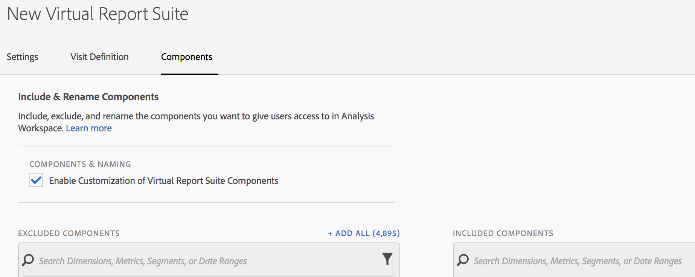
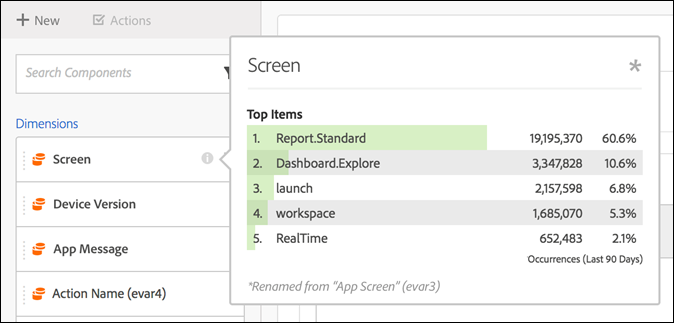

# Cura dei componenti di suite di rapporti virtuali

Le suite di rapporti virtuali possono essere curate per includere ed escludere componenti.in  Analysis Workspace.

>[!NOTE]
>
>Sono state apportate modifiche ai componenti che amministratori e non amministratori possono visualizzare nei progetti Workspace curati e nelle suite di report virtuali (VRS) curate. Precedentemente, per visualizzare i componenti non curati era sufficiente fare clic su **[!UICONTROL Show all Components]**. The [updated curation experience](https://docs.adobe.com/content/help/it-IT/analytics/analyze/analysis-workspace/curate-share/curate-projects-vrs.html) allows for more fine-grained control over which components are visible.

Per abilitare la cura dei componenti,

1. Vai a **[!UICONTROL Analytics]** > **[!UICONTROL Components]** > **[!UICONTROL Virtual Report Suites]** > **[!UICONTROL Create new virtual report suite]**.
1. Dopo aver definito la **[!UICONTROL Settings]**, fare clic sulla **[!UICONTROL Components]** scheda.

1. Selezionate la casella di controllo **[!UICONTROL Enable Customization of Virtual Report Suite Components]**:

   

   >[!NOTE]
   >
   >If component customization is enabled, the virtual report suite is accessible **only in Analysis Workspace** and is not accessible in the following:

   * [!UICONTROL Reports & Analytics]
   * [!UICONTROL Ad Hoc Analysis]
   * [!UICONTROL Data Warehouse]
   * [!UICONTROL Report Builder]
   * API di reportistica di Analytics

   Una volta selezionato, puoi aggiungere i componenti che desideri includere nella suite di rapporti virtuali trascinando i componenti applicabili dalla colonna &quot;Componenti esclusi&quot; alla colonna &quot;Componenti inclusi&quot;. I componenti che possono essere inclusi ed esclusi sono:

   * Dimensioni
   * Metriche
   * Segmenti
   * Intervalli di date

   >[!NOTE]
   >
   >There is no need to *share* curated components (segments, calculated metrics, date ranges). Saranno sempre visibili in  Analysis Workspace se sono curati per la suite di rapporti virtuali, anche se non sono condivisi.

1. È inoltre possibile filtrare o cercare i componenti e aggiungere l&#39;intera selezione filtrata alla colonna inclusa facendo clic **[!UICONTROL Add All]**.

   

## Rinomina componenti {#section_0F7CD9F684FE4765BC00A2AFED56550E}

Puoi cambiare i nomi visualizzati dei componenti inclusi specifici della suite di rapporti virtuali. Ad esempio, se desideri includere il nome della pagina nella suite di rapporti virtuali, ma vuoi rinominarlo in un contesto più mobile, puoi modificarlo in App Screens. Il nuovo nome viene visualizzato in  Analysis Workspace ogni volta che viene utilizzata questa suite di rapporti virtuale.

In  Analysis Workspace, fate clic sull’icona delle informazioni relativa a qualsiasi componente incluso per visualizzare il nome originale del componente rinominato:

## Gruppi di componenti {#section_483BEC76F49E46ADAAA03F0A12E48426}

Utilizza i gruppi di componenti per aggiungere componenti in massa alla suite di rapporti virtuale. Ad esempio, se desiderate importare un set predefinito di componenti specifico per l&#39;analisi delle app mobili, selezionate il gruppo di app per dispositivi mobili. Un set di dimensioni e metriche corrispondente (già rinominato) viene aggiunto automaticamente all&#39;elenco delle suite di rapporti virtuali Incluso.

## Comportamento Workspace {#section_6C32F8B642804C0097FCB14E21028D4A}

Per ulteriori informazioni sulla cura in  Analysis Workspace, consulta [Cura e condivisione di un progetto](https://docs.adobe.com/content/help/it-IT/analytics/analyze/analysis-workspace/curate-share/curate.html).
