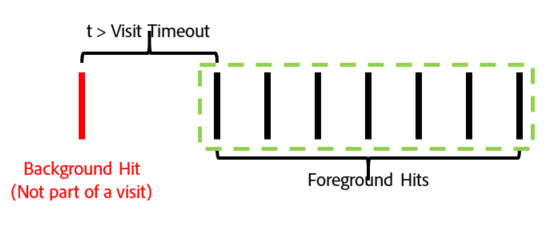
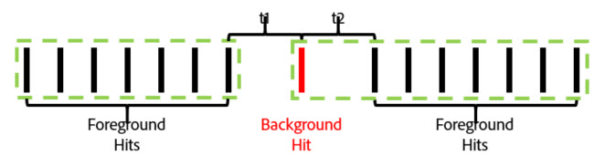

# Adobe Context-Aware Sessions

Le sessioni in base al contesto nelle suite di rapporti virtuali cambiano il modo in cui Adobe Analytics calcola le visite per dispositivi mobili. Questo articolo descrive le implicazioni di elaborazione degli hit in background e degli eventi di avvio dell’app (entrambi impostati dall’SDK per dispositivi mobili) per la definizione delle visite per dispositivi mobili.

Puoi definire una visita nel modo desiderato senza modificare i dati sottostanti, in modo che i visitatori possano interagire con le app mobili.

## Parametro URL prospettiva cliente {#section_8B298006362341E3AC16A148422D1F65}

Il processo di raccolta dei dati di Adobe Analytics consente di impostare un parametro della stringa di query che specifica la prospettiva del cliente (indicata come parametro della stringa di query "cp"). Questo campo specifica lo stato dell'applicazione digitale dell'utente finale. Questo consente di sapere se un hit è stato generato mentre un’app mobile era in stato di background.

## Elaborazione hit in background {#section_D47B3161B7E145B6A32AB06E9AA03FA3}

Un hit in background è un tipo di hit inviato ad Analytics dalla versione SDK di Adobe Mobile 4.13.6 e successiva quando l'app effettua una richiesta di tracciamento mentre è in stato di background. Esempi tipici di questo tipo:

* Dati inviati durante l'attraversamento di una recinzione geografica
* Un'interazione di notifica push

Gli esempi seguenti delineano la logica utilizzata per determinare quando una visita inizia e termina per qualsiasi visitatore quando l'impostazione "Impedisci agli hit in background di avviare una nuova visita" è abilitata o non è abilitata per una suite di rapporti virtuale.

**Se l'opzione "Impedisci agli hit in background di avviare una nuova visita" non è abilitata:**

Se questa funzione non è abilitata per una suite di rapporti virtuale, gli hit in background vengono trattati come qualsiasi altro hit, il che significa che iniziano nuove visite e agiscono esattamente come gli hit in primo piano. Ad esempio, se un hit in background si verifica meno di 30 minuti (il timeout sessione standard per una suite di rapporti) prima di un set di hit in primo piano, l’hit in background fa parte della sessione.

Se l’hit in background si verifica più di 30 minuti prima di qualsiasi hit in primo piano, l’hit in background crea una propria visita, per un conteggio totale di visite pari a 2.

**Se è abilitata l'opzione "Impedisci agli hit in background di avviare una nuova visita":**

Gli esempi seguenti illustrano il comportamento degli hit di sfondo quando questa funzione è attivata.

Esempio 1: Un hit in background si verifica in un periodo di tempo (t) prima di una serie di hit in primo piano.

In questo esempio, se *è superiore* al timeout di visita configurato dalla suite di rapporti virtuale, l'hit in background viene escluso dalla visita formata dagli hit in primo piano. Ad esempio, se il timeout della visita della suite di rapporti virtuale era impostato su 15 minuti e *fosse* di 20 minuti, la visita formata da questa serie di hit (mostrata dal contorno verde) escluderebbe l’hit in background. Ciò significa che qualsiasi eVar impostato con una scadenza "visita" sull'hit in background **non** persiste nella visita successiva e un contenitore di segmenti di visita includerebbe solo gli hit in primo piano all'interno del contorno verde.

Al contrario, se *è inferiore* al timeout della visita configurato dalla suite di rapporti virtuale, l'hit in background viene incluso come parte della visita come se fosse un hit in primo piano (mostrato dalla struttura verde):

Ciò significa che:

* Tutte le eVar impostate con scadenza "visita" sull’hit in background persistono i loro valori sugli altri hit di questa visita.
* Tutti i valori impostati nell’hit di sfondo vengono inclusi nella valutazione logica del contenitore del segmento a livello di visita.

In entrambi i casi, il numero totale di visite sarebbe 1.

Esempio 2: Se si verifica un hit di sfondo dopo una serie di hit in primo piano, il comportamento è simile:

Se l'hit in background si verifica dopo il timeout configurato della suite di rapporti virtuali, l'hit in background non fa parte di una sessione (evidenziato in verde):

Analogamente, se il periodo di tempo *è inferiore* al timeout configurato della suite di rapporti virtuali, l'hit in background viene incluso nella visita formata dagli hit in primo piano precedenti:

Ciò significa che:

* Tutte le eVar impostate con scadenza "visita" sugli hit in primo piano precedenti persistono i loro valori sull’hit in background in questa visita.
* Tutti i valori impostati nell’hit di sfondo vengono inclusi nella valutazione logica del contenitore del segmento a livello di visita.

Come prima, il numero totale di visite in entrambi i casi sarebbe 1.

Esempio 3: In alcune circostanze, un hit in background può causare la combinazione di due visite separate in una singola visita. Nel seguente scenario, un hit in background viene preceduto e seguito da una serie di hit in primo piano:

Se, in questo esempio, *t1* e *t2* sono entrambi inferiori al timeout della visita configurato nella suite di rapporti virtuale, tutti questi hit vengono combinati in una singola visita, anche se *t1* e *t2* insieme sono maggiori del timeout della visita:

Tuttavia, se *t1* e *t2* sono maggiori del timeout configurato per la suite di rapporti virtuali, questi hit saranno separati in due visite distinte:

Analogamente (come negli esempi precedenti), se *t1* è minore del timeout e *t2* è minore del timeout, l’hit in background viene incluso nella prima visita:

Se *t1* è maggiore del timeout e *t2* è minore del timeout, l'hit in background verrà incluso nella seconda visita:

Esempio 4: Negli scenari in cui si verifica una serie di hit in background nel periodo di timeout della visita della suite di rapporti virtuali, gli hit formano una "visita in background" invisibile che non viene conteggiata nel conteggio delle visite e non è accessibile tramite un contenitore di segmentazione delle visite.

Anche se questa non è considerata una visita, qualsiasi eVar impostato con scadenza visita persiste nei valori corrispondenti agli altri hit di sfondo presenti in questa "visita in background".

Esempio 5: Per gli scenari in cui si verificano più hit in background in successione dopo una serie di hit in primo piano, è possibile (a seconda dell’impostazione di timeout) che gli hit in background mantengano una visita in vita più lunga del periodo di timeout della visita. Ad esempio, se *t1* e *t2* insieme fossero maggiori del timeout della visita della suite di rapporti virtuale ma singolarmente inferiori al timeout, la visita continuerebbe ad estendersi per includere entrambi gli hit in background:

Analogamente, se una serie di hit di sfondo si verifica prima di una serie di eventi in primo piano, si verifica un comportamento simile:

Gli hit di sfondo si comportano in questo modo per mantenere eventuali effetti di attribuzione delle eVar o di altre variabili impostate durante gli hit di sfondo. Questo consente di attribuire gli eventi di conversione in primo piano a valle alle azioni eseguite mentre un'app era nello stato di background. Consente inoltre al contenitore del segmento della visita di includere hit in background che hanno determinato una sessione in primo piano a valle, utile per misurare l’efficacia dei messaggi push.

## Comportamento delle metriche delle visite {#section_50B82618A39B454493B33B1450CCBD3E}

Il conteggio delle visite si basa esclusivamente sul conteggio delle visite che includono almeno un hit in primo piano. Ciò significa che eventuali hit in background orfani o "visite in background" non vengono conteggiati per la metrica Visita.

## Funzionamento della metrica Tempo trascorso per visita {#section_0A149ABB3E034B97BD0B3A7F3EB67383}

Il tempo trascorso è ancora calcolato in modo analogo a come è senza hit di sfondo utilizzando il tempo tra hit. Anche se, se una visita include hit di sfondo (perché si sono verificati abbastanza vicino agli hit in primo piano), tali hit vengono inclusi nel tempo trascorso per il calcolo della visita come se fossero un hit in primo piano.

## Impostazioni elaborazione hit in background {#section_C8B1D38C06FF4ABAAFA78CE9550C0F4B}

Poiché l'elaborazione degli hit in background è disponibile solo per le suite di rapporti virtuali che utilizzano l'elaborazione del tempo di rapporto, Adobe Analytics supporta due modi di elaborare gli hit in background, al fine di mantenere i conteggi delle visite nella suite di rapporti di base che non utilizza l'elaborazione del tempo di rapporto. Per accedere a questa impostazione, passa ad Adobe Analytics Admin Console, passa alle impostazioni della suite di rapporti di base applicabile, quindi al menu "Mobile Management", quindi al sottomenu "Mobile Application Reporting".

1. "Elaborazione legacy su": Questa è l'impostazione predefinita per tutte le suite di rapporti. Lasciare l'elaborazione legacy sui processi gli hit di background come hit normali nella nostra pipeline di elaborazione per quanto riguarda la suite di rapporti di base per l'attribuzione dei tempi non-report. Ciò significa che qualsiasi hit in background visualizzato nella suite di rapporti di base incrementa le visite come un hit normale. Se non desiderate che gli hit di sfondo vengano visualizzati nella suite di rapporti di base, modificate questa impostazione su "Off".
1. "Elaborazione legacy disattivata": Con l'elaborazione legacy per gli hit in background disattivata, tutti gli hit in background inviati alla suite di rapporti di base vengono ignorati dalla suite di rapporti di base e sono accessibili solo quando una suite di rapporti virtuale creata in questa suite di rapporti di base è configurata per l'utilizzo dell'elaborazione dei tempi di rapporto. Ciò significa che tutti i dati acquisiti dagli hit in background inviati a questa suite di rapporti di base vengono visualizzati solo in una suite di rapporti virtuali abilitata per l'elaborazione del tempo di rapporto.

   Questa impostazione è destinata ai clienti che desiderano sfruttare la nuova elaborazione degli hit in background senza modificare il conteggio delle visite della suite di rapporti di base.

In entrambi i casi, gli hit in background vengono fatturati allo stesso costo di qualsiasi altro hit inviato ad Analytics.

## Avvio di nuove visite all'avvio di ogni app {#section_9DA9A8B9758248A6B311EFBA06AECA80}

Oltre all’elaborazione degli hit in background, le suite di rapporti virtuali possono forzare l’avvio di una nuova visita ogni volta che l’SDK di Mobile invia un evento di avvio dell’app. Con questa impostazione abilitata, ogni volta che un evento App Launch viene inviato dall’SDK, viene forzata l’avvio di una nuova visita, a prescindere dal fatto che sia stato raggiunto il timeout di una visita aperta. L’hit contenente l’evento di avvio dell’app viene incluso come primo hit nella visita successiva, incrementa il conteggio delle visite e crea un contenitore di visite distinto per la segmentazione.
