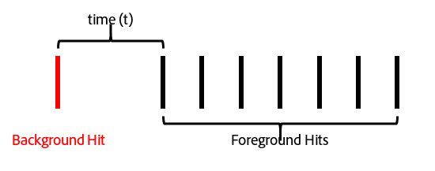

# Sessioni contestuali

Le sessioni in base al contesto nelle suite di rapporti virtuali modificano il modo in cui Adobe Analytics calcola le visite mobili. Questo articolo descrive le implicazioni di elaborazione degli hit in background e degli eventi di avvio delle app (entrambi impostati dall'SDK di Mobile) al modo in cui vengono definite le visite mobili.

Puoi definire una visita nel modo desiderato senza alterare i dati sottostanti, per far corrispondere il modo in cui i visitatori interagiscono con le tue app mobili.

## Customer Perspective URL Parameter {#section_8B298006362341E3AC16A148422D1F65}

Il processo di raccolta dati di Adobe Analytics consente di impostare un parametro stringa query che specifica la prospettiva del cliente (denotata come parametro di stringa «cp»). Questo campo specifica lo stato dell'applicazione digitale dell'utente finale. Questo consente di sapere se un hit è stato generato mentre un'app mobile era in stato di sfondo.

## Background Hit Processing {#section_D47B3161B7E145B6A32AB06E9AA03FA3}

Un hit in background è un tipo di hit inviato ad Analytics dalla versione SDK di Adobe Mobile 4.13.6 e successiva quando l'app esegue una richiesta di tracciamento in background. Esempi tipici di questo esempio:

* Dati inviati durante un attraversamento geografico
* Interazione di notifica push

Gli esempi seguenti delineano la logica utilizzata per determinare quando inizia una visita e termina per qualsiasi visitatore quando l'impostazione «Impedisci hit di contesto dall'avvio di una nuova visita» è abilitata o non è abilitata per una suite di rapporti virtuale.

** Se non viene attivato "Impedisci hit di sfondo dall'avvio di una nuova visita": **

Se questa funzione non è abilitata per una suite di rapporti virtuale, gli hit in background vengono trattati come qualsiasi altro hit, ovvero iniziano nuove visite e funzionano allo stesso modo degli hit in primo piano. Ad esempio, se si verifica un hit in background inferiore a 30 minuti (il timeout sessione standard per una suite di rapporti) prima di una serie di hit in primo piano, l'hit in background fa parte della sessione.

Se l'hit in background si verifica oltre 30 minuti prima di qualsiasi hit in primo piano, l'hit in background crea una propria visita, per un conteggio totale delle visite pari a 2.

** Se l'opzione Impedisci agli hit di sfondo di avviare una nuova visita è abilitata: **

Gli esempi seguenti illustrano il comportamento degli hit in background quando questa funzione è abilitata.

Esempio 1: Un hit di sfondo si verifica prima di una serie di hit in primo piano.

In this example, if *t* is greater than the virtual report suite's configured visit timeout, then the background hit is excluded from the visit formed by the foreground hits. For example, if the virtual report suite visit timeout was set to 15 minutes, and *t* was 20 minutes, the visit formed by this series of hits (shown by the green outline) would exclude the background hit. This means that any eVars set with a "visit" expiration on the background hit would **not** persist into the following visit, and a visit segment container would only include the foreground hits inside the green outline.

Conversely, if *t* is less than the virtual report suite's configured visit timeout, the background hit is included as part of the visit as if it were a foreground hit (shown by the green outline):

Ciò significa che:

* Eventuali evar impostati con scadenza «visit» in background rimangono invariati negli altri hit in questa visita.
* Tutti i valori impostati nell'hit di sfondo sono inclusi nella valutazione logica del contenitore di livello visita.

In entrambi i casi, il conteggio totale delle visite è 1.

Esempio 2: Se un hit di sfondo si verifica dopo una serie di hit in primo piano, il comportamento è simile:

Se l'hit di sfondo si verifica dopo il timeout configurato della suite di rapporti virtuali, l'hit in background non fa parte di una sessione (delineata in verde):

Likewise, if the time period *t* was less than the virtual report suite's configured timeout, the background hit is included in the visit formed by the previous foreground hits:

Ciò significa che:

* Tutte le evar impostate con scadenza «visit» negli hit in primo piano rimangono invariate in base all'hit in background in questa visita.
* Tutti i valori impostati nell'hit di sfondo sono inclusi nella valutazione logica del contenitore di livello visita.

Come prima, il conteggio totale delle visite in entrambi i casi sarà 1.

Esempio 3: In alcuni casi, un hit in background può determinare la combinazione di due visite separate in una singola visita. Nello scenario seguente, un hit in background è preceduto e seguito da una serie di hit in primo piano:

If, in this example, *t1* and *t2* are both less than the virtual report suite configured visit timeout, all of these hits would be combined into a single visit, even if *t1* and *t2* together are greater than the visit timeout:

If, however, *t1* and *t2* are greater than the virtual report suite configured timeout, these hits would be separated into two distinct visits:

Likewise (as in our previous examples), if *t1* is less than the timeout and *t2* is less than the timeout the background hit would be included in the first visit:

If *t1* is greater than the timeout and *t2* is less than the timeout, then the background hit would be included in the second visit:

Esempio 4: Negli scenari in cui si verificano una serie di hit in background nel periodo di timeout della suite di rapporti virtuali, gli hit formano una "visita in background" invisibile che non viene conteggiata verso il conteggio delle visite e non è accessibile tramite un contenitore di segmentazione delle visite.

Anche se questa non viene considerata una visita, qualsiasi evar impostato con scadenza visita mantiene i relativi valori all'altro hit in background in questa "visita in background".

Esempio 5: Per scenari in cui si verificano più hit in background dopo una serie di hit in primo piano, è possibile (a seconda dell'impostazione di timeout) che gli hit in background mantengano una visita più lunga rispetto al periodo di timeout delle visite. For example, if *t1* and *t2* together were greater than the virtual report suite visit timeout but individually less than the timeout, the visit would still extend to include both background hits:

Analogamente, se si verifica una serie di hit di sfondo prima di una serie di eventi in primo piano, si verifica un comportamento simile:

Gli hit in background si comportano in questo modo per mantenere eventuali effetti di attribuzione da evar o altre variabili impostate durante gli hit in background. Ciò consente di attribuire eventi di conversione in primo piano a valle alle azioni intraprese mentre un'app era in stato di sfondo. Inoltre, consente a un contenitore di segmenti di visita di includere hit in background che hanno generato una sessione in primo piano a valle, utile per misurare l'efficacia dei messaggi push.

## Visit Metric Behavior {#section_50B82618A39B454493B33B1450CCBD3E}

Il conteggio delle visite è basato unicamente sul numero di visite che includono almeno un hit in primo piano. Ciò significa che qualsiasi hit di sfondo orfano o «visite di sfondo» non conta sulla metrica Visita.

## Time Spent Per Visit Metric Behavior {#section_0A149ABB3E034B97BD0B3A7F3EB67383}

Il tempo trascorso è ancora calcolato in modo analogo al modo in cui è senza hit di sfondo utilizzando l'ora tra gli hit. Anche se, se una visita include hit in background (perché si sono verificati sufficientemente vicini agli hit in primo piano), questi hit vengono inclusi nel tempo trascorso per visita come se fossero un hit in primo piano.

## Background Hit Processing Settings {#section_C8B1D38C06FF4ABAAFA78CE9550C0F4B}

Poiché l'elaborazione di hit in background è disponibile solo per le suite di rapporti virtuali utilizzando l'elaborazione dei tempi di rapporto, Adobe Analytics supporta due modi per elaborare gli hit in background per mantenere i conteggi delle visite nella suite di rapporti di base che non utilizza Elaborazione tempo rapporto. Per accedere a questa impostazione, accedi ad Adobe Analytics Admin Console, vai alle impostazioni della suite di rapporti base, quindi vai al menu «Mobile Management», quindi al sottomenu «Mobile Application Reporting».

1. " Legacy Processing On ": Questa è l'impostazione predefinita per tutte le suite di rapporti. Se si lascia l'elaborazione legacy in base ai passaggi, si ottengono risultati normali come hit normali nel nostro ciclo di elaborazione, fino alla suite di rapporti di base Attribuzione tempo non rapporto. Ciò significa che qualsiasi hit di sfondo visualizzato nell'incremento di incremento suite di rapporti base viene considerato come un hit normale. Se non desiderate che gli hit di sfondo vengano visualizzati nella suite di rapporti di base, cambiate questa impostazione in «Off».
1. «Legacy Processing Off»: Con l'elaborazione legacy per gli hit di sfondo disattivati, tutti gli hit di background inviati alla suite di rapporti di base vengono ignorati dalla suite di rapporti di base e sono accessibili solo quando una suite di rapporti virtuali creata in questa suite di rapporti di base è configurata per l'elaborazione del fuso orario. Ciò significa che tutti i dati acquisiti da hit di background inviati a questa suite di rapporti di base vengono visualizzati solo in una suite di rapporti virtuale abilitata per l'elaborazione dei rapporti.

   Questa impostazione è destinata ai clienti che desiderano sfruttare la nuova elaborazione in background senza alterare i conteggi delle visite della suite di rapporti di base.

In entrambi i casi, gli hit in background vengono addebitati allo stesso costo di qualsiasi altro hit inviato ad Analytics.

## Starting New Visits Upon Each App Launch {#section_9DA9A8B9758248A6B311EFBA06AECA80}

Oltre all'elaborazione di hit in background, le suite di rapporti virtuali possono forzare la visualizzazione di una nuova visita ogni volta che l'SDK di Mobile invia un evento di avvio dell'app. Se questa impostazione è attivata, ogni volta che un evento App Launch viene inviato dall'SDK, forza una nuova visita a iniziare a prescindere dal raggiungimento di una visita aperta. L'hit contenente l'evento di avvio dell'app è incluso come primo hit nella visita successiva e incrementa il conteggio delle visite e crea un contenitore di visite distinto per la segmentazione.
