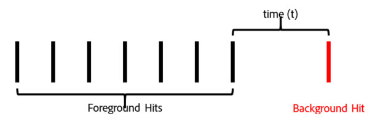

# Adobe Context-Aware Sessions

Le sessioni in base al contesto nelle suite di rapporti virtuali cambiano il modo in cui Adobe Analytics calcola le visite da qualsiasi dispositivo. Questo articolo descrive anche le implicazioni di elaborazione degli hit in background e degli eventi di avvio dell’app (entrambi impostati dall’SDK per dispositivi mobili) per la definizione delle visite mobili.

Puoi definire una visita nel modo desiderato senza modificare i dati sottostanti, per adattarla al modo in cui i visitatori interagiscono con le tue esperienze digitali.

Ecco un video sulle sessioni in base al contesto:

>[!VIDEO](https://video.tv.adobe.com/v/23545/?quality=12)

## Parametro URL prospettiva cliente

Il processo di raccolta dei dati di Adobe Analytics ti consente di impostare un parametro della stringa di query che specifica la prospettiva del cliente (indicata come parametro della stringa di query &quot;cp&quot;). Questo campo specifica lo stato dell&#39;applicazione digitale dell&#39;utente finale. Questo ti aiuta a sapere se un hit è stato generato mentre un&#39;app mobile era in background.

## Elaborazione degli hit in background

Un hit in background è un tipo di hit inviato ad Analytics dalla versione SDK di Adobe Mobile 4.13.6 e successive quando l’app effettua una richiesta di tracciamento mentre è in uno stato di background. Alcuni esempi tipici sono:

* Dati inviati durante l’attraversamento di una recinzione geografica
* Un’interazione di notifica push

Gli esempi seguenti descrivono la logica utilizzata per determinare quando una visita inizia e termina per qualsiasi visitatore quando l’impostazione &quot;Impedisci agli hit di background di avviare una nuova visita&quot; è o non è abilitata per una suite di rapporti virtuale.

**Se &quot;Impedisci agli hit di sfondo di avviare una nuova visita&quot; non è abilitato:**

Se questa funzione non è abilitata per una suite di rapporti virtuali, gli hit di background vengono trattati come qualsiasi altro hit, il che significa che iniziano nuove visite e agiscono esattamente come gli hit in primo piano. Ad esempio, se un hit in background si verifica meno di 30 minuti (il timeout di sessione standard per una suite di rapporti) prima di un set di hit in primo piano, l’hit in background fa parte della sessione.

Se l’hit di background si verifica più di 30 minuti prima di qualsiasi hit in primo piano, l’hit di background crea una propria visita, per un conteggio totale delle visite pari a 2.

**Se l’opzione &quot;Impedisci agli hit di sfondo di avviare una nuova visita&quot; è abilitata:**

Gli esempi seguenti illustrano il comportamento degli hit di background quando questa funzione è abilitata.

Esempio 1: Un hit in background si verifica per un certo periodo di tempo (t) prima di una serie di hit in primo piano.

In questo esempio, se *t* è maggiore del timeout di visita configurato dalla suite di rapporti virtuali, quindi l’hit in background viene escluso dalla visita formata dagli hit in primo piano. Ad esempio, se il timeout della visita della suite di rapporti virtuali è stato impostato su 15 minuti, e *t* era di 20 minuti, la visita formata da questa serie di hit (mostrata dal contorno verde) escludeva l’hit di sfondo. Ciò significa che qualsiasi eVar impostato con scadenza &quot;visita&quot; sull’hit di background **not** persistete nella visita successiva e un contenitore di segmenti di visita includerebbe solo gli hit in primo piano all’interno del profilo verde.

Viceversa, se *t* è inferiore al timeout di visita configurato dalla suite di rapporti virtuali, l’hit in background viene incluso come parte della visita, come se si trattasse di un hit in primo piano (mostrato dalla struttura verde):

Ciò significa che:

* Tutte le eVar impostate con scadenza &quot;visita&quot; nell’hit di background persistono i loro valori negli altri hit di questa visita.
* Tutti i valori impostati nell’hit di background vengono inclusi nella valutazione della logica del contenitore del segmento a livello di visita.

In entrambi i casi, il conteggio totale delle visite sarebbe pari a 1.

Esempio 2: Se un hit in background si verifica dopo una serie di hit in primo piano, il comportamento è simile:

Se l&#39;hit in background si verifica dopo il timeout configurato della suite di rapporti virtuali, l&#39;hit in background non fa parte di una sessione (evidenziato in verde):

Analogamente, se il periodo di tempo *t* è inferiore al timeout configurato della suite di rapporti virtuali, l’hit in background viene incluso nella visita formata dagli hit in primo piano precedenti:

Ciò significa che:

* Tutte le eVar impostate con scadenza &quot;visita&quot; sugli hit in primo piano precedenti persistono i loro valori sull’hit in background in questa visita.
* Tutti i valori impostati nell’hit di background vengono inclusi nella valutazione della logica del contenitore del segmento a livello di visita.

Come in precedenza, il conteggio totale delle visite in entrambi i casi sarebbe pari a 1.

Esempio 3: In alcune circostanze, un hit di background può causare la combinazione di due visite separate in una singola visita. Nel seguente scenario, un hit in background viene preceduto e seguito da una serie di hit in primo piano:

Se, in questo esempio, *t1* e *t2* sono entrambi inferiori al timeout di visita configurato dalla suite di rapporti virtuali, tutti questi hit vengono combinati in un’unica visita, anche se *t1* e *t2* insieme sono superiori al timeout della visita:

Se, tuttavia, *t1* e *t2* sono maggiori del timeout configurato della suite di rapporti virtuali, e questi hit vengono separati in due visite distinte:

Analogamente (come nei nostri esempi precedenti), se *t1* è inferiore al timeout e *t2* è inferiore al timeout che l’hit in background verrebbe incluso nella prima visita:

Se *t1* è maggiore del timeout e *t2* è inferiore al timeout, quindi l’hit in background verrebbe incluso nella seconda visita:

Esempio 4: Negli scenari in cui si verifica una serie di hit in background nel periodo di timeout della visita della suite di rapporti virtuali, gli hit formano una &quot;visita in background&quot; invisibile che non viene conteggiata nel conteggio delle visite e non è accessibile tramite un contenitore di segmentazione delle visite.

Anche se questa non è considerata una visita, tutti i set di eVar con scadenza visita persistono i loro valori negli altri hit di background in questa &quot;visita di background&quot;.

Esempio 5: Per gli scenari in cui si verificano più hit in background in successione dopo una serie di hit in primo piano, è possibile (a seconda dell’impostazione di timeout) che gli hit in background mantengano una visita in vita più a lungo del periodo di timeout della visita. Ad esempio, se *t1* e *t2* insieme sono stati maggiori del timeout di visita della suite di rapporti virtuali, ma singolarmente inferiori al timeout, la visita si estende comunque per includere entrambi gli hit di background:

Analogamente, se una serie di hit di background si verifica prima di una serie di eventi di primo piano, si verifica un comportamento simile:

Gli hit di sfondo si comportano in questo modo per mantenere eventuali effetti di attribuzione da eVar o altre variabili impostate durante gli hit di background. Questo consente agli eventi di conversione in primo piano a valle di essere attribuiti alle azioni intraprese mentre un&#39;app era in background. Consente inoltre a un contenitore di segmenti di visita di includere hit di background che hanno dato luogo a una sessione in primo piano a valle, utile per misurare l’efficacia dei messaggi push.

## Comportamento della metrica delle visite

Il conteggio delle visite si basa solo sul conteggio delle visite che includono almeno un hit in primo piano. Ciò significa che eventuali hit in background orfani o &quot;visite in background&quot; non vengono conteggiati per la metrica Visita.

## Comportamento della metrica Tempo trascorso per visita

Il tempo trascorso viene comunque calcolato in modo analogo a come si verifica senza hit di background utilizzando il tempo tra gli hit. Anche se, se una visita include hit di background (perché si sono verificati abbastanza vicino agli hit in primo piano), questi vengono inclusi nel calcolo del tempo trascorso per visita come se fossero hit in primo piano.

## Impostazioni di elaborazione degli hit in background

Poiché l’elaborazione degli hit in background è disponibile solo per le suite di rapporti virtuali che utilizzano l’elaborazione al momento della generazione del rapporto, Adobe Analytics supporta due modi per elaborare gli hit in background, al fine di mantenere i conteggi delle visite nella suite di rapporti di base che non utilizzano l’elaborazione al momento della generazione del rapporto. Per accedere a questa impostazione vai all&#39;Admin Console Adobe Analytics, vai alle impostazioni della suite di rapporti di base applicabile, quindi vai al menu &quot;Gestione mobile&quot; e infine al sottomenu &quot;Generazione rapporti applicazioni mobili&quot;.

1. &quot;Elaborazione legacy su&quot;: Questa è l’impostazione predefinita per tutte le suite di rapporti. L’elaborazione legacy nei processi degli hit in background viene lasciata come hit normali nella nostra pipeline di elaborazione per quanto riguarda la suite di rapporti di base Attribuzione tempo non rapporto . Ciò significa che tutti gli hit di background visualizzati nella suite di rapporti di base incrementano le visite come hit normale. Se non desideri che gli hit di background vengano visualizzati nella suite di rapporti di base, modifica questa impostazione in &quot;Off&quot;.
1. &quot;Elaborazione legacy disattivata&quot;: Con l’elaborazione legacy per gli hit in background disattivata, tutti gli hit in background inviati alla suite di rapporti di base vengono ignorati dalla suite di rapporti di base e sono accessibili solo quando una suite di rapporti virtuale creata in questa suite di rapporti di base è configurata per l’utilizzo dell’elaborazione al momento della generazione del rapporto. Ciò significa che tutti i dati acquisiti da hit in background inviati a questa suite di rapporti di base vengono visualizzati solo in una suite di rapporti virtuali abilitata per l’elaborazione dei tempi di report.

   Questa impostazione è destinata ai clienti che desiderano sfruttare la nuova elaborazione degli hit in background senza modificare il conteggio delle visite della suite di rapporti di base.

In entrambi i casi, gli hit di background vengono fatturati allo stesso costo di qualsiasi altro hit inviato ad Analytics.

## Avvio di nuove visite a ogni avvio di app

Oltre all’elaborazione degli hit in background, le suite di rapporti virtuali possono forzare l’avvio di una nuova visita ogni volta che l’SDK per dispositivi mobili invia un evento di avvio dell’app. Con questa impostazione abilitata, ogni volta che un evento App Launch viene inviato dall’SDK, forza l’avvio di una nuova visita, indipendentemente dal fatto che sia stato raggiunto il timeout di una visita aperta . L’hit contenente l’evento di avvio dell’app viene incluso come primo hit nella visita successiva, incrementa il conteggio delle visite e crea un contenitore di visite distinto per la segmentazione.
