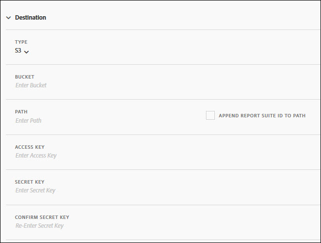

# Destinazione feed

La sezione Feed di feed definisce la modalità di distribuzione del feed.

Esistono quattro canali di distribuzione:

* FTP
* SFTP
* Amazon S 3
* Azure Blob

## FTP {#section_D2B521C49BDE4F91A1999FE222CF306F}

I dati dei feed di dati possono essere inviati a una posizione FTP in hosting su Adobe o cliente.

Se selezionate dei dati caricati sul server FTP, dovete fornire ad Adobe il nome utente, la password e il percorso di caricamento appropriati. È necessario implementare un processo personalizzato per gestire lo spazio su disco sul server, in quanto Adobe non elimina alcun dato dal server.

## SFTP {#section_8D9215E441474D2BBC56228C2BC926E5}

I dati dei feed di dati possono essere inviati a una posizione sftp in hosting su Adobe o cliente.

Se selezionate dei dati caricati sul server FTP, dovete fornire ad Adobe il nome utente e il percorso di caricamento appropriati.

<!-- 

Adobe Customer Care will provide you with a Public key. Verify in recording.

 -->

È necessario implementare un processo personalizzato per gestire lo spazio su disco sul server, in quanto Adobe non elimina alcun dato dal server.

## Amazon S3 {#section_4191CD7B8D3F419EB850B286B542C14A}

Potete caricare i file in un bucket Amazon S 3. Amazon effettua automaticamente la cifratura dei dati rimanenti (sui server Amazon). Quando scaricate i dati, viene decifrato automaticamente.

Se selezionate dei dati caricati tramite Amazon S 3, dovete fornire un Nome Bucket, un ID Key Key, una Chiave segreta e un nome di cartella.

I feed dati comunicano alle seguenti 11 aree AWS standard (utilizzando l'algoritmo di firma appropriato, dove necessario):

* us-east-1
* us-west-1
* us-west-2
* ap-south-1
* ap-northeast-2
* ap-southeast-1
* ap-southeast-2
* ap-northeast-1
* eu-central-1
* eu-west-1
* sa-east-1

Al momento non è supportata l’area AWS di Beijing, Cina (cn-north-1).

## Azure Blob {#section_1E9F1D0E7EAB4189A5D748FCA57D63D1}

Potete caricare i file su un blob Azure.

## Fields {#section_AD54B41BC7C945DC85F5FB8FCD4A4792}

Nella tabella seguente sono visualizzate tutte le opzioni per tutti i canali di distribuzione. Le opzioni disponibili dipendono dal canale di distribuzione selezionato.

<table id="table_F743C620C82349D9943A13B99EA312BA"> 
 <thead> 
  <tr> 
   <th colname="col1" class="entry"> Campo </th> 
   <th colname="col2" class="entry"> Descrizione </th> 
  </tr> 
 </thead>
 <tbody> 
  <tr> 
   <td colname="col1"> 
Chiave di accesso 
 </td> 
   <td colname="col2"> 
Immettete il tasto di accesso Amazon S 3. 
 </td> 
  </tr> 
  <tr> 
   <td colname="col1"> 
Secchio 
 </td> 
   <td colname="col2"> 
Inserire la posizione di Amazon S 3. 
 
Questo valore deve corrispondere al formato corretto di bucket S 3. (See <a href="https://docs.aws.amazon.com/awscloudtrail/latest/userguide/cloudtrail-s3-bucket-naming-requirements.html" format="html" scope="external"> https://docs.aws.amazon.com/awscloudtrail/latest/userguide/cloudtrail-s3-bucket-naming-requirements.html</a>.) 
 
 
Note: See <a href="../../../export/analytics-data-feed/feed-troubleshooting.md#section_6797EBBB7E6D44D4B00C7AEDF4C2EE1D" format="dita" scope="local"> BucketOwnerFullControl setting for Amazon S3 data feeds</a>, below, for details about the Amazon S3 settings. 
 
 </td> 
  </tr> 
  <tr> 
   <td colname="col1"> 
Contenitore 
 </td> 
   <td colname="col2"> 
Immettete il nome del contenitore Azure Blob. 
 </td> 
  </tr> 
  <tr> 
   <td colname="col1"> 
 Host 
 </td> 
   <td colname="col2"> 
Specificate la posizione host FTP o SFTP. 
 
This value must comply to the proper ftp/sftp format, <code> ftp.domain.com/subdomain</code> or <code> sftp.domain.com/subdomain</code>. 
 
 Le porte standard 21 e 22 per FTP e sftp sono obbligatorie. 
 </td> 
  </tr> 
  <tr> 
   <td colname="col1"> 
Password 
 
Conferma password 
 </td> 
   <td colname="col2"> 
Immettete la password FTP. Reenter per confermare 
 </td> 
  </tr> 
  <tr> 
   <td colname="col1"> 
Percorso 
 </td> 
   <td colname="col2"> 
Selezionare il percorso dell'host o del bucket. Questo percorso deve esistere prima della creazione del feed. 
 
 
Note: See <a href="../../../export/analytics-data-feed/feed-troubleshooting.md#section_6797EBBB7E6D44D4B00C7AEDF4C2EE1D" format="dita" scope="local"> BucketOwnerFullControl setting for Amazon S3 data feeds</a>, below, for details about the Amazon S3 settings. 
 
 </td> 
  </tr> 
  <tr> 
   <td colname="col1"> 
Account 
 </td> 
   <td colname="col2"> 
 Immettete l'account archiviazione Azure. 
 </td> 
  </tr> 
  <tr> 
   <td colname="col1"> 
Chiave pubblica 
 </td> 
   <td colname="col2"> 
Fornite la chiave pubblica SFTP. 
 
È necessario scaricare la chiave pubblica per configurare l'archivio SFTP. 
 
 
Nota: Non è necessario scaricare la chiave pubblica per creare il feed. 
 
 
Potete utilizzare una chiave pubblica che è già stata scaricata durante la creazione di un feed precedente. 
 
For more information, see <a href="https://marketing.adobe.com/resources/help/en_US/whitepapers/ftp/ftp_sftp_dw.html" format="html" scope="external"> https://marketing.adobe.com/resources/help/en_US/whitepapers/ftp/ftp_sftp_dw.html</a>. 
 </td> 
  </tr> 
  <tr> 
   <td colname="col1"> 
Chiave 
 
Conferma chiave 
 </td> 
   <td colname="col2"> 
 Inserite il codice di accesso all'archiviazione. Digitate nuovamente per confermare. 
 
 
Note: See <a href="https://docs.microsoft.com/en-us/azure/storage/common/storage-create-storage-account#view-and-copy-storage-access-keys" format="https" scope="external"> https://docs.microsoft.com/en-us/azure/storage/common/storage-create-storage-account#view-and-copy-storage-access-keys</a> for accessing access keys. 
 
 </td> 
  </tr> 
  <tr> 
   <td colname="col1"> 
Chiave segreta 
 
Conferma chiave segreta 
 </td> 
   <td colname="col2"> 
Immettete la chiave segreta Amazon S 3. Reinserite per confermare. 
 </td> 
  </tr> 
  <tr> 
   <td colname="col1"> 
Type (Tipo) 
 </td> 
   <td colname="col2"> 
Selezionate il tipo di destinazione. 
 
 
     <ul id="ul_B893EEDA73A34DE0AEB8570BE9027F21"> 
      <li id="li_325546FCEB404C50AA6829573CCA340B">FTP (predefinito) </li> 
      <li id="li_6A2C03115903484797485D073A610607">AmazonS3 </li> 
      <li id="li_C24540F6FCD24702B7693A515CEBE977">SFTP </li> 
      <li id="li_8E03CA78E7FE427C9F6F8B112BC76266">Azure Blob </li> 
     </ul> 
 
Dopo aver selezionato il tipo di destinazione, l'elenco dei campi cambia in base alle opzioni disponibili per la destinazione selezionata. 
 </td> 
  </tr> 
  <tr> 
   <td colname="col1"> 
Nome utente 
 </td> 
   <td colname="col2"> 
Immettete il nome utente FTP. 
 </td> 
  </tr> 
 </tbody> 
</table>

