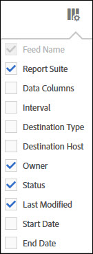

# Ordinare le colonne

Potete determinare quali colonne sono disponibili e ordinarle in base alle vostre esigenze.

1. To determine which columns are visible, click the **[!UICONTROL Columns Configuration]** button.

   

1. Per ordinare una colonna, fai clic sull'intestazione della colonna.

   Le colonne alfabetiche vengono ordinate in ordine alfabetico. Fate clic sull'intestazione per ordinare in ordine alfabetico.

   Le colonne numeriche sono ordinate numericamente. Fate clic sull'intestazione per passare dall'ordinamento basso a quello alto e viceversa.
