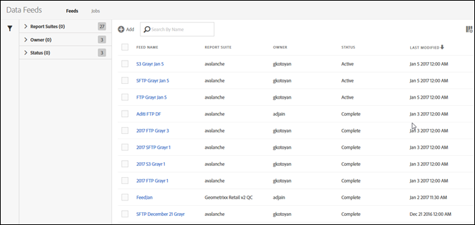

# Aprire l'interfaccia Feed dati

L'interfaccia utente Feed dati è accessibile dalla scheda Admin.

1. Aprite la scheda Admin.
1. Select **[!UICONTROL Data Feeds]**.

   

La pagina di destinazione Feed dati elenca tutti i feed attualmente definiti per la società, per tutte le suite di rapporti accessibili dall'utente amministratore.

If no feeds have been set up, the page shows a **[!UICONTROL Create New Data Feed]** button.

To view your [jobs](../../../export/analytics-data-feed/c-data-feed-actions/t-feed-job-history.md#task_0D05F2D1B41B4E4A95B570DC78014480), click **[!UICONTROL Jobs]**. To return to the feeds view, click **[!UICONTROL Feeds]**.