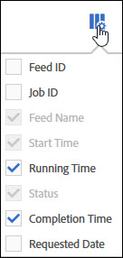

# Processi feed dati - Panoramica

Utilizzate la scheda Processi per visualizzare le istantanee dei processi ed eseguire attività di gestione dei processi.

L'elenco Processi fornisce informazioni quali stato del processo, avvio e completamento dei processi, durata dell'esecuzione del processo e così via.

Fate clic sulle intestazioni delle colonne per attivare e disattivare l'ordine di visualizzazione dei processi.

Per impostare le informazioni da visualizzare nell'elenco Processi, fate clic sull'icona Impostazioni e selezionate i nomi delle colonne desiderati.

Nome feed, Ora di inizio e Stato sono colonne obbligatorie e non possono essere rimosse dall'elenco Processi.

| Colonna | Descrizione |
|---|---|
| ID feed | Identificatore univoco del feed. |
| ID processo | Identificatore univoco del processo. |
| Nome feed | Nome del feed. |
| Ora di inizio | Nome iniziale del processo, visualizzato nel fuso orario. |
| Tempo esecuzione | Il tempo necessario per eseguire il processo. Visualizzato come gg hh: mm: ss. |
| Stato | [Lo stato](../../../export/analytics-data-feed/c-df-jobs/r-job-status.md#reference_7A39A327F643447F9B5AE3A2502C72BA) corrente del processo. |
| Tempo completamento | L'ora in cui il processo è terminato. Visualizzato nel fuso orario. |
| Data richiesta | Timbro dati per i dati contenuti nel processo. |

