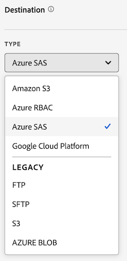

# Creare un feed di dati

Durante la creazione di un feed di dati, fornisci ad Adobe:

* Informazioni sulla destinazione in cui si desidera inviare i file di dati non elaborati
* Dati da includere in ciascun file

Prima di creare un feed di dati, è importante avere una conoscenza di base dei feed di dati e assicurarsi di soddisfare tutti i prerequisiti. Per ulteriori informazioni, consulta [Panoramica sui feed di dati](data-feed-overview.md).

## Creare e configurare un feed dati {#create-and-configure-data-feed}

<!-- markdownlint-disable MD034 -->

>[!CONTEXTUALHELP]
>id="aa_datafeed_os_strings"
>title="Sostituire le stringhe del sistema operativo"
>abstract="Questa opzione consente di pulire l&#39;output dei dati rilevando le seguenti sequenze di stringhe incorporate nei dati del cliente e sostituendole con uno spazio:  Windows: CRLF, CR o TAB Mac e Linux: \n, \r o \t"

<!-- markdownlint-enable MD034 -->

<!-- markdownlint-disable MD034 -->

>[!CONTEXTUALHELP]
>id="aa_datafeed_export_file"
>title="Manifesto"
>abstract="Scegli se includere un file manifesto con ogni consegna di feed di dati. I file manifesto contengono informazioni per ciascun file incluso nel feed di dati. Quando si inviano dati di feed dati in un singolo pacchetto, è anche possibile scegliere di includere un file finale, ma si consiglia di utilizzare i file manifest. "

<!-- markdownlint-enable MD034 -->

<!-- markdownlint-disable MD034 -->

>[!CONTEXTUALHELP]
>id="aa_datafeed_notify"
>title="Notifica al completamento"
>abstract="Specifica uno o più indirizzi e-mail a cui inviare una notifica dopo l’invio del feed di dati. È necessario separare più indirizzi e-mail con una virgola."

<!-- markdownlint-enable MD034 -->

<!-- added help for Dynamic lookups to this page: help/export/analytics-data-feed/c-df-contents/dynamic-lookups.md -->

1. Accedi a [experiencecloud.adobe.com](https://experiencecloud.adobe.com) utilizzando le credenziali Adobe ID.

1. Seleziona l&#39;icona a 9 quadrati in alto a destra, quindi seleziona [!UICONTROL **Analytics**].

1. Nella barra di navigazione superiore, passa a [!UICONTROL **Amministratore**] > [!UICONTROL **Feed dati**].

1. Selezionare [!UICONTROL **Crea feed dati**].

   Viene visualizzata una pagina con le seguenti categorie: [!UICONTROL **Dettagli**], [!UICONTROL **Formattazione dati**], [!UICONTROL **Struttura dati**], [!UICONTROL **Pianificazione**] e [!UICONTROL **Destinazione**].

   

1. Nella sezione [!UICONTROL **Dettagli**], completa i campi seguenti:

   | Campo | Funzione |
   |---------|----------|
   | [!UICONTROL **Nome**] | Nome del feed dati. I nomi devono essere univoci nella suite di rapporti selezionata e possono contenere fino a 255 caratteri. [Ulteriori informazioni](/help/export/analytics-data-feed/df-faq.md#must-feed-names-be-unique) |
   | [!UICONTROL **Tag**] | Applica eventuali tag al feed dati per facilitarne la classificazione. Puoi filtrare i tag come descritto in [Filtrare e cercare nell&#39;elenco dei feed di dati](/help/export/analytics-data-feed/df-manage-feeds.md#filter-and-search-the-list-of-data-feeds) in [Gestire i feed di dati](/help/export/analytics-data-feed/df-manage-feeds.md). |
   | [!UICONTROL **Descrizione**] | Specifica una descrizione per il feed dati. La descrizione aggiunta è visibile quando si modifica il feed dati. |

1. Nella sezione [!UICONTROL **Formattazione dati**], specificare le informazioni seguenti:

   | Campo | Funzione |
   |---------|----------|
   | [!UICONTROL **Formato di compressione**] | Tipo di compressione utilizzata. **Gzip** restituisce i file in formato `.tar.gz`. **Zip** restituisce i file in formato `.zip`. |
   | [!UICONTROL **Tipo di pacchetto**] | Selezionare [!UICONTROL **Più file**] per la maggior parte dei feed di dati. Questa opzione impagina i dati in blocchi non compressi da 2 GB. Se l&#39;opzione [!UICONTROL **Più file**] è selezionata e i dati non compressi per la finestra di reporting sono inferiori a 2 GB, viene inviato un file. Se si seleziona **File singolo**, il file `hit_data.tsv` verrà restituito in un unico file, potenzialmente di grandi dimensioni. |
   | [!UICONTROL **Manifesto**] | Scegli se includere un file manifesto con ogni consegna di feed di dati. 
Puoi scegliere tra le seguenti opzioni:
<ul><li>**[!UICONTROL Manifest file]**: contiene informazioni per ogni file incluso nel feed di dati.</li><li>**[!UICONTROL Finish file (Legacy)]**: indica che il feed di dati è stato completato correttamente. Non sono incluse altre informazioni. Questa opzione è adatta per i feed esistenti che originariamente utilizzavano questa opzione e che devono essere rielaborati. È disponibile solo quando si inviano dati di feed dati in un singolo pacchetto. </li><li>**[!UICONTROL None]**: nessun file incluso</li></ul> |
   | [!UICONTROL **Invia manifesto anche se non sono presenti dati**] | Determina se Adobe deve consegnare un [file manifesto](/help/export/analytics-data-feed/c-df-contents/datafeeds-contents.md#feed-manifest) alla destinazione quando non vengono raccolti dati per un intervallo di feed. Se si seleziona **File manifesto**, verrà visualizzato un file manifesto simile al seguente quando non vengono raccolti dati:
`text`

`Datafeed-Manifest-Version: 1.0`

`Lookup-Files: 0`

`Data-Files: 0`

 `Total-Records: 0`
 |
   | [!UICONTROL **Sostituisci stringhe sistema operativo**] | Durante la raccolta dei dati, alcuni caratteri (ad esempio le nuove righe) possono causare problemi. Selezionare questa opzione per rimuovere questi caratteri dai file di feed.
Questa opzione rileva le seguenti sequenze di stringhe incorporate nei dati del cliente e le sostituisce con uno spazio:
 <ul><li>**Windows:** CRLF, CR o TAB</li><li>**Mac e Linux:** \n, \r o \t</li></ul> |
   | [!UICONTROL **Abilita ricerche dinamiche**] | Le ricerche dinamiche ti consentono di ricevere nel feed di dati ulteriori file di ricerca che altrimenti non sarebbero disponibili. Questa impostazione consente di inviare le seguenti tabelle di ricerca con ciascun file di feed dati:<ul><li> **Nome gestore**</li><li>**Attributi dispositivi mobili**</li><li>**Tipo di sistema operativo**</li></ul>
Per ulteriori informazioni, vedere [Ricerche dinamiche](/help/export/analytics-data-feed/c-df-contents/dynamic-lookups.md).
 |
   | **Consenti arrivi in ritardo** | I dati storici possono arrivare dopo che un processo di feed dati termina l’elaborazione per una determinata ora o giorno, ad esempio tramite hit con marca temporale o origini dati.
Seleziona questa opzione per includere i dati ricevuti dopo il completamento dell’elaborazione dei dati da parte del processo di feed dati all’interno della frequenza di reporting impostata (in genere giornaliera o oraria). Con questa opzione abilitata, ogni volta che un feed di dati elabora i dati, esamina eventuali hit in ritardo arrivati e li inserisce in batch con il successivo file di feed di dati inviato.

Per ulteriori informazioni, vedi [Hit in arrivo](/help/export/analytics-data-feed/c-df-contents/late-arriving-hits.md).
 |
   | **Intervallo di lookback** (per hit in arrivo) | Questa opzione viene visualizzata quando l&#39;opzione **[!UICONTROL Allow late-arring hits]** è abilitata. Seleziona l’intervallo di lookback per limitare l’intervallo di tempo degli hit in ritardo inclusi. Seleziona **[!UICONTROL Unlimited]** se vuoi consentire tutti gli hit in arrivo in ritardo, indipendentemente da quanto in ritardo. È possibile scegliere un intervallo predefinito, ad esempio **[!UICONTROL 1 hour]**, **[!UICONTROL 2 hours]**, **[!UICONTROL 1 week]**, **[!UICONTROL 2 weeks]** e così via. In alternativa, selezionare **[!UICONTROL Custom lookback window]**, quindi nel campo **[!UICONTROL Custom Lookback]** specificare un intervallo di lookback fino a 26.280 ore. |

1. Nella sezione [!UICONTROL **Data structure**], nel campo **[!UICONTROL Report suite]**, seleziona la suite di rapporti di origine che contiene i dati da esportare. 
Quando selezioni una suite di rapporti, tieni presente quanto segue:
 <ul><li>Se vengono creati più feed di dati per la stessa suite di rapporti, ogni feed di dati deve avere definizioni di colonne diverse.</li><li>Solo le suite di rapporti di origine supportano i feed di dati; le suite di rapporti virtuali non sono supportate.</li><li>L’elenco delle colonne disponibili dipende dalla società di accesso a cui appartiene la suite di rapporti selezionata. Se modifichi la suite di rapporti, l’elenco delle colonne disponibili può cambiare. </li></ul>

1. Per determinare quali colonne di dati includere nel feed, utilizza uno dei metodi seguenti o entrambi:

   * **Aggiungi colonne singolarmente:** Nella sezione **[!UICONTROL Available]** a sinistra, seleziona le colonne da includere, quindi seleziona **[!UICONTROL Include]**. Sono disponibili tutte le colonne di dati in Adobe Analytics. È possibile selezionare più colonne tenendo premuto **[!UICONTROL Shift]** oppure tenendo premuto **[!UICONTROL Command]** (su macOS) o **[!UICONTROL Ctrl]** (su Windows). Fare clic su **[!UICONTROL Add all]** per includere tutte le colonne in un feed di dati.

     Le colonne aggiunte vengono visualizzate nella sezione **[!UICONTROL Included]** a destra.

   * **Aggiungi un modello di colonna:** Nel campo **[!UICONTROL Column templates]**, selezionare un modello di colonna da aggiungere. Un modello di colonna è un gruppo predefinito di colonne e Adobe ne fornisce diverse per impostazione predefinita.

     Tutte le colonne incluse nel modello vengono visualizzate nella sezione **[!UICONTROL Included]** a destra.

1. (Facoltativo) Per creare un modello di colonna basato sul feed di dati che si sta creando, selezionare **[!UICONTROL Save as template]**, specificare un nome per il modello, quindi selezionare **[!UICONTROL Save]**. Questa opzione è utile se prevedi di creare feed di dati aggiuntivi che includono le stesse colonne.

   

1. (Facoltativo) Per scaricare un elenco di colonne incluse in formato .csv, selezionare **[!UICONTROL Download columns]**. Questa opzione può essere utile per i feed di dati con un numero elevato di colonne.

1. Nella sezione [!UICONTROL **Pianifica**], specifica le seguenti informazioni:

   | Campo | Funzione |
   |---------|----------|
   | [!UICONTROL **Frequenza**] | Seleziona la frequenza con cui inviare il feed di dati. Le opzioni disponibili vengono compilate in modo dinamico in base alla configurazione della suite di rapporti. 
Sono comunemente disponibili le seguenti opzioni:
<ul><li>**Giornaliero**: i feed contengono dati relativi a un&#39;intera giornata, dalla mezzanotte alla mezzanotte nel fuso orario della suite di rapporti. Utilizza questa opzione per la retrocompilazione o i dati storici o per continuare i feed.</li><li>**Oraria**: i feed contengono dati relativi a una sola ora. Utilizza questa opzione per continuare i feed.</li></ul>
Una frequenza di esportazione di 15 minuti è possibile, ma non è disponibile per impostazione predefinita. Affinché questa opzione sia disponibile nel tuo ambiente, devi prima contattare l&#39;Assistenza clienti Adobe e richiedere che la suite di rapporti sia configurata per supportare le esportazioni della durata di 15 minuti.
 |
   | [!UICONTROL **Ritardo elaborazione**] | Scegli se attendere un determinato periodo di tempo prima di elaborare un file di feed dati. Un ritardo può essere utile per dare alle implementazioni mobili l’opportunità ai dispositivi offline di connettersi e inviare dati. Può essere utilizzato anche per adattarsi ai processi lato server della tua organizzazione nella gestione dei file elaborati in precedenza. Nella maggior parte dei casi, non è necessario attendere. Puoi ritardare un feed fino a 8 ore (480 minuti) o anche di più se selezioni una quantità di tempo personalizzata (9.999 minuti di ritardo o circa 1 settimana). |
   | [!UICONTROL **Feed continuo**] | Se selezionata, questa opzione rimuove la data di fine, consentendo l’esecuzione di un feed per un tempo indefinito. Al termine dell’elaborazione dei dati storici, un feed attende che i dati vengano raccolti per una determinata ora o giorno. Al termine dell’ora o del giorno corrente, l’elaborazione inizia dopo il ritardo specificato. |
   | [!UICONTROL **Data di inizio**] | Specifica la data di inizio del feed di dati. Per iniziare immediatamente a elaborare i feed di dati per i dati storici, imposta questa data su una data nel passato in cui vengono raccolti i dati. La data di inizio è basata sul fuso orario della suite di rapporti. |
   | [!UICONTROL **Data di fine**] | Specifica la data in cui desideri che termini il feed dati. La data di fine si basa sul fuso orario della suite di rapporti. |

1. Nella sezione [!UICONTROL **Destinazione**] configura la destinazione in cui desideri inviare i dati.

   >[!NOTE]
   >
   >Quando configuri la destinazione di rapporto, tieni presente quanto segue:
   >
   >* Adobe consiglia di utilizzare un account cloud per la destinazione del rapporto. [Sono disponibili account FTP e SFTP precedenti](#legacy-destinations), ma non sono consigliati.
   >* Tutti gli account cloud configurati in precedenza sono disponibili per l’utilizzo con i feed di dati. Puoi configurare gli account cloud in uno dei seguenti modi:
   >
   >   * Durante la configurazione degli account cloud per [Data Warehouse](/help/export/data-warehouse/create-request/dw-request-report-destinations.md)
   >   
   >   * Durante l&#39;importazione di [dati di classificazione Adobe Analytics](/help/components/locations/locations-manager.md) (non è possibile utilizzare le posizioni configurate per l&#39;importazione dei dati di classificazione).
   >   
   >   * Dal gestore Percorsi, in [Componenti > Percorsi](/help/components/locations/configure-import-accounts.md)
   >
   >* Gli account cloud sono associati al tuo account utente di Adobe Analytics. Gli altri utenti non possono utilizzare o visualizzare gli account cloud configurati, a meno che non vengano resi disponibili a tutti gli utenti dell’organizzazione.
   >
   >* È possibile modificare qualsiasi posizione creata dalla gestione delle posizioni in [Componenti > Posizioni](/help/components/locations/configure-import-accounts.md)

   Completa i campi seguenti:

   | Campo | Funzione |
   |---------|----------|
   | [!UICONTROL **Account**] | Esegui una delle operazioni seguenti:<ul><li>**Utilizza un account esistente:** Seleziona il menu a discesa accanto al campo **[!UICONTROL Account]**. In alternativa, inizia a digitare il nome dell’account, quindi selezionalo dal menu a discesa. 
Gli account sono disponibili solo se sono stati configurati o se sono condivisi con un&#39;organizzazione di cui fai parte.
</li><li>**Crea un nuovo account:** Seleziona **[!UICONTROL Add new]** sotto il campo **[!UICONTROL Account]**. Per informazioni su come configurare l&#39;account, vedere [Configurare un account di percorso](/help/components/locations/configure-import-accounts.md#configure-a-location-account) in [Configurare account di importazione ed esportazione cloud](/help/components/locations/configure-import-accounts.md).</li></ul> |
   | [!UICONTROL **Posizione**] | Esegui una delle operazioni seguenti:<ul><li>**Usa una posizione esistente:** Selezionare il menu a discesa accanto al campo **[!UICONTROL Location]**. In alternativa, inizia a digitare il nome della posizione, quindi selezionalo dal menu a discesa.</li><li>**Crea un nuovo percorso:** Seleziona **[!UICONTROL Add new]** sotto il campo **[!UICONTROL Location]**. Per informazioni su come configurare il percorso, vedere [Configurare un percorso](/help/components/locations/configure-import-locations.md#configure-a-location) in [Configurare i percorsi di importazione ed esportazione cloud](/help/components/locations/configure-import-locations.md). |
   | [!UICONTROL **Notifica quando completato**] | Specifica uno o più indirizzi e-mail a cui inviare una notifica dopo che il feed di dati è stato inviato correttamente o non è stato inviato. È necessario separare più indirizzi e-mail con una virgola. |

1. Seleziona **[!UICONTROL Save]**.

## Gestisci modelli di colonna

I modelli consentono di riutilizzare le stesse colonne per i feed di dati futuri creati.

Durante la gestione dei modelli è possibile creare nuovi modelli, utilizzare modelli già creati, copiarli, modificarli ed eliminarli.

[!UICONTROL **Amministratore**] > [!UICONTROL **Feed dati**] > **[!UICONTROL Manage templates]**

### Creare un modello di colonna

Quando crei più feed di dati che utilizzano le stesse colonne, Adobe consiglia di creare modelli di colonna. Qualsiasi modello di colonna creato può essere utilizzato da chiunque nell’organizzazione.

Per creare un modello di colonna:

1. In Adobe Analytics, vai a [!UICONTROL **Amministratore**] > [!UICONTROL **Feed dati**] > **[!UICONTROL Manage templates]**.

1. Selezionare **[!UICONTROL Create new template]** per creare un nuovo modello di colonna.

   

1. Nel campo **[!UICONTROL Template name]**, specificare un nome per il modello.

1. Nella sezione **[!UICONTROL Available]** a sinistra, selezionare le colonne da includere, quindi selezionare **[!UICONTROL Include]**. Sono disponibili tutte le colonne di dati disponibili in Adobe Analytics. È possibile selezionare più colonne tenendo premuto **[!UICONTROL Shift]** oppure tenendo premuto **[!UICONTROL Command]** (su macOS) o **[!UICONTROL Ctrl]** (su Windows). Fare clic su **[!UICONTROL Add all]** per includere tutte le colonne in un feed di dati.

   Le colonne aggiunte vengono visualizzate nella sezione **[!UICONTROL Included]** a destra.

1. Seleziona **[!UICONTROL Save]**.

### Modificare un modello di colonna

1. In Adobe Analytics, vai a [!UICONTROL **Amministratore**] > [!UICONTROL **Feed dati**] > **[!UICONTROL Manage templates]**.

1. Selezionare il modello da modificare, quindi selezionare **[!UICONTROL Edit]**.

1. Apportare eventuali modifiche, quindi selezionare **[!UICONTROL Save]**.

### Copiare un modello di colonna

1. In Adobe Analytics, vai a [!UICONTROL **Amministratore**] > [!UICONTROL **Feed dati**] > **[!UICONTROL Manage templates]**.

1. Selezionare il modello da copiare, quindi selezionare **[!UICONTROL Copy]**.

1. Nel campo **[!UICONTROL Template name]**, specificare un nome per il modello.

1. Apportare ulteriori modifiche, quindi selezionare **[!UICONTROL Save]**.

### Eliminare i modelli di colonna

1. In Adobe Analytics, vai a [!UICONTROL **Amministratore**] > [!UICONTROL **Feed dati**] > **[!UICONTROL Manage templates]**.

1. Selezionare uno o più modelli da eliminare, quindi selezionare **[!UICONTROL Delete]**.

<!-- why would you want to do this? -->

<!-- I don't think we need anything after this, but saving here just in case:

1. In the [!UICONTROL **Feed Information**] section, complete the following fields:
   
   | Field | Function |
   |---------|----------|
   | [!UICONTROL **Name**] | The name of the data feed. Must be unique within the selected report suite, and can be up to 255 characters in length. [Learn more](/help/export/analytics-data-feed/df-faq.md#must-feed-names-be-unique) |
   | [!UICONTROL **Report suite**] | The report suite that the data feed is based on. If multiple data feeds are created for the same report suite, they must have different column definitions. Only source report suites support data feeds; virtual report suites are not supported. |
   | [!UICONTROL **Email when complete**] | The email address to be notified when a feed finishes processing. The email address must be properly formatted. |
   | [!UICONTROL **Feed interval**] | Select **Daily** for backfill or historical data. Daily feeds contain a full day's worth of data, from midnight to midnight in the report suite's time zone. Select **Hourly** for continuing data (Daily is also available for continuing feeds if you prefer). Hourly feeds contain a single hour's worth of data. |
   | [!UICONTROL **Delay processing**] | Wait a given amount of time before processing a data feed file. A delay can be useful to give mobile implementations an opportunity for offline devices to come online and send data. It can also be used to accommodate your organization's server-side processes in managing previously processed files. In most cases, no delay is needed. A feed can be delayed by up to 120 minutes. |
   | [!UICONTROL **Start & end dates**] | The start date indicates the date when you want the data feed to begin. To immediately begin processing data feeds for historical data, set this date to any date in the past when data is being collected. The start and end dates are based on the report suite's time zone. |
   | [!UICONTROL **Continuous feed**] | This checkbox removes the end date, allowing a feed to run indefinitely. When a feed finishes processing historical data, a feed waits for data to finish collecting for a given hour or day. Once the current hour or day concludes, processing begins after the specified delay. |
   
1. In the [!UICONTROL **Destination**] section, in the [!UICONTROL **Type**] drop-down menu, select the destination where you want the data to be sent. 

   >[!NOTE]
   >
   >Consider the following when configuring a report destination:
   >
   >* We recommend using a cloud account for your report destination. [Legacy FTP and SFTP accounts](#legacy-destinations) are available, but are not recommended.
   >* Any cloud accounts that you previously configured are available to use for Data Feeds. You can configure cloud accounts in any of the following ways:
   >
   >   * When configuring cloud accounts for [Data Warehouse](/help/export/data-warehouse/create-request/dw-request-report-destinations.md) 
   >   
   >   * When [importing Adobe Analytics classification data](/help/components/locations/locations-manager.md) (Any locations that are configured for importing classification data cannot be used.)
   >   
   >   * From the Locations manager, in [Components > Locations](/help/components/locations/configure-import-accounts.md) 
   >
   >* Cloud accounts are associated with your Adobe Analytics user account. Other users cannot use or view cloud accounts that you configure.
   >
   >* You can edit any locations that you create from the Locations manager in [Components > Locations](/help/components/locations/configure-import-accounts.md)

   

   Use any of the following destination types when creating a data feed. For configuration instructions, expand the destination type. (Additional [legacy destinations](#legacy-destinations) are also available, but are not recommended.)

   +++Amazon S3

   You can send feeds directly to Amazon S3 buckets. This destination type requires only your Amazon S3 account and the location (bucket). 

   Adobe Analytics uses cross-account authentication to upload files from Adobe Analytics to the specified location in your Amazon S3 instance.

   When using Amazon S3 with Data Feeds, only SSE-S3 encryption is supported.

   To configure an Amazon S3 bucket as the destination for a data feed:

   1. Begin creating a data feed as described in [Create and configure a data feed](#create-and-configure-a-data-feed).
   
   1. In the [!UICONTROL **Destination**] section, in the [!UICONTROL **Type**] drop-down menu, select [!UICONTROL **Amazon S3**].

      

   1. Select [!UICONTROL **Select location**].

      The Amazon S3 Export Locations page is displayed.

   1. (Conditional) If an Amazon S3 account (and a location on that account) has already been configured in Adobe Analytics, you can use it as your data feed destination: 

      >[!NOTE]
      >
      >Accounts are available to you only if you configured them or if they were shared with an organization you are a part of.
   
      1. Select the account from the [!UICONTROL **Select account**] drop-down menu.

         Any cloud accounts that were configured in any of the following areas of Adobe Analytics are available to use:
      
         * When importing Adobe Analytics classification data, as described in [Schema](/help/components/classifications/sets/manage/schema.md).
      
           However, any locations that are configured for importing classification data cannot be used. Instead, add a new destination as described below.

         * When configuring accounts and locations in the Locations area, as described in [Configure cloud import and export accounts](/help/components/locations/configure-import-accounts.md) and [Configure cloud import and export locations](/help/components/locations/configure-import-locations.md).
   
      1. Select the location from the [!UICONTROL **Select location**] drop-down menu.

      1. Select [!UICONTROL **Save**] > [!UICONTROL **Save**].

      The destination is now configured to send data to the Amazon S3 location that you specified.
   
   1. (Conditional) If you have not previously added an Amazon S3 account:

      1. Select [!UICONTROL **Add account**], then specify the following information:
   
         |Field | Function |
         |---------|----------|
         | [!UICONTROL **Account name**] | A name for the account. This can be any name you choose. |
         | [!UICONTROL **Account description**] | A description for the account. |
         | [!UICONTROL **Role ARN**] | You must provide a Role ARN (Amazon Resource Name) that Adobe can use to gain access to the Amazon S3 account. To do this, you create an IAM permission policy for the source account, attach the policy to a user, and then create a role for the destination account. For specific information, see [this AWS documentation](https://aws.amazon.com/premiumsupport/knowledge-center/cross-account-access-iam/). |
         | [!UICONTROL **User ARN**] | The User ARN (Amazon Resource Name) is provided by Adobe. You must attach this user to the policy you created. |

         {style="table-layout:auto"}

      1. Select [!UICONTROL **Add location**], then specify the following information:
   
         |Field | Function |
         |---------|----------|
         | [!UICONTROL **Name**] | A name for the account.  |
         | [!UICONTROL **Description**] | A description for the account. |
         | [!UICONTROL **Bucket**] | The bucket within your Amazon S3 account where you want Adobe Analytics data to be sent. 
Ensure that the User ARN that was provided by Adobe has the `S3:PutObject` permission in order to upload files to this bucket. This permission allows the User ARN to upload initial files and overwrite files for subsequent uploads.

Bucket names must meet specific naming rules. For example, they must be between 3 to 63 characters long, can consist only of lowercase letters, numbers, dots (.), and hyphens (-), and must begin and end with a letter or number. [A complete list of naming rules are available in the AWS documentation](https://docs.aws.amazon.com/AmazonS3/latest/userguide/bucketnamingrules.html). 
 |
         | [!UICONTROL **Prefix**] | The folder within the bucket where you want to put the data. Specify a folder name, then add a backslash after the name to create the folder. For example, `folder_name/` |

         {style="table-layout:auto"}

      1. Select [!UICONTROL **Create**] > [!UICONTROL **Save**].

         The destination is now configured to send data to the Amazon S3 location that you specified.

      1. (Conditional) If you need to manage the destination (account and location) that you just created, it is available in the [Locations manager](/help/components/locations/locations-manager.md).
   
   +++

   +++Azure RBAC

   You can send feeds directly to an Azure container by using RBAC authentication. This destination type requires an Application ID, Tenant ID, and Secret. 

   To configure an Azure RBAC account as the destination for a data feed:

   1. If you haven't already, create an Azure application that Adobe Analytics can use for authentication, then grant access permissions in access control (IAM). 
   
      For information, refer to the [Microsoft Azure documentation about how to create an Azure Active Directory application](https://learn.microsoft.com/en-us/azure/active-directory/develop/howto-create-service-principal-portal). 
   
   1. In the Adobe Analytics admin console, in the [!UICONTROL **Destination**] section, in the [!UICONTROL **Type**] drop-down menu, select [!UICONTROL **Azure RBAC**].

      

   1. Select [!UICONTROL **Select location**].

      The Azure RBAC Export Locations page is displayed.

   1. (Conditional) If an Azure RBAC account (and a location on that account) has already been configured in Adobe Analytics, you can use it as your data feed destination: 

      >[!NOTE]
      >
      >Accounts are available to you only if you configured them or if they were shared with an organization you are a part of.
   
      1. Select the account from the [!UICONTROL **Select account**] drop-down menu.

      Any cloud accounts that you configured in any of the following areas of Adobe Analytics are available to use:
      
         * When importing Adobe Analytics classification data, as described in [Schema](/help/components/classifications/sets/manage/schema.md).
      
           However, any locations that are configured for importing classification data cannot be used. Instead, add a new destination as described below.

         * When configuring accounts and locations in the Locations area, as described in [Configure cloud import and export accounts](/help/components/locations/configure-import-accounts.md) and [Configure cloud import and export locations](/help/components/locations/configure-import-locations.md).

      1. Select the location from the [!UICONTROL **Select location**] drop-down menu.

      1. Select [!UICONTROL **Save**] > [!UICONTROL **Save**].

         The destination is now configured to send data to the Azure RBAC location that you specified.

   1. (Conditional) If you have not previously added an Azure RBAC account:

      1. Select [!UICONTROL **Add account**], then specify the following information:
   
         |Field | Function |
         |---------|----------|
         | [!UICONTROL **Account name**] | A name for the Azure RBAC account. This name displays in the [!UICONTROL **Select account**] drop-down field and can be any name you choose. |
         | [!UICONTROL **Account description**] | A description for the Azure RBAC account. This description displays in the [!UICONTROL **Select account**] drop-down field and can be any name you choose.  |
         | [!UICONTROL **Application ID**] | Copy this ID from the Azure application that you created. In Microsoft Azure, this information is located on the **Overview** tab within your application. For more information, see the [Microsoft Azure documentation about how to register an application with the Microsoft identity platform](https://learn.microsoft.com/en-us/azure/active-directory/develop/quickstart-register-app). |
         | [!UICONTROL **Tenant ID**] | Copy this ID from the Azure application that you created. In Microsoft Azure, this information is located on the **Overview** tab within your application. For more information, see the [Microsoft Azure documentation about how to register an application with the Microsoft identity platform](https://learn.microsoft.com/en-us/azure/active-directory/develop/quickstart-register-app). |
         | [!UICONTROL **Secret**] | Copy the secret from the Azure application that you created. In Microsoft Azure, this information is located on the **Certificates & secrets** tab within your application. For more information, see the [Microsoft Azure documentation about how to register an application with the Microsoft identity platform](https://learn.microsoft.com/en-us/azure/active-directory/develop/quickstart-register-app). |

         {style="table-layout:auto"}

      1. Select [!UICONTROL **Add location**], then specify the following information: 
   
         |Field | Function |
         |---------|----------|
         | [!UICONTROL **Name**] | A name for the location. This name displays in the [!UICONTROL **Select location**] drop-down field and can be any name you choose. |
         | [!UICONTROL **Description**] | A description for the location. This description displays in the [!UICONTROL **Select location**] drop-down field and can be any name you choose. |
         | [!UICONTROL **Account**] | The Azure storage account. |
         | [!UICONTROL **Container**] | The container within the account you specified where you want Adobe Analytics data to be sent. Ensure that you grant permissions to upload files to the Azure application that you created earlier. |
         | [!UICONTROL **Prefix**] | The folder within the container where you want to put the data. Specify a folder name, then add a backslash after the name to create the folder. For example, `folder_name/`
Make sure the Application ID that you specified when configuring the Azure RBAC account has been granted the `Storage Blob Data Contributor` role in order to access the container (folder).
 
For more information, see [Azure built-in roles](https://learn.microsoft.com/en-us/azure/role-based-access-control/built-in-roles).
 |

         {style="table-layout:auto"}

      1. Select [!UICONTROL **Create**] > [!UICONTROL **Save**].

         The destination is now configured to send data to the Azure RBAC location that you specified.

      1. (Conditional) If you need to manage the destination (account and location) that you just created, it is available in the [Locations manager](/help/components/locations/locations-manager.md).
   
   +++

   +++Azure SAS

   You can send feeds directly to an Azure container by using SAS authentication. This destination type requires an Application ID, Tenant ID, Key vault URI, Key vault secret name, and secret. 

   To configure Azure SAS as the destination for a data feed:

   1. If you haven't already, create an Azure application that Adobe Analytics can use for authentication. 
   
      For information, refer to the [Microsoft Azure documentation about how to create an Azure Active Directory application](https://learn.microsoft.com/en-us/azure/active-directory/develop/howto-create-service-principal-portal). 
   
   1. In the Adobe Analytics admin console, in the [!UICONTROL **Destination**] section, select [!UICONTROL **Azure SAS**].

      

   1. Select [!UICONTROL **Select location**].

      The Azure SAS Export Locations page is displayed.

   1. (Conditional) If an Azure SAS account (and a location on that account) has already been configured in Adobe Analytics, you can use it as your data feed destination: 

      >[!NOTE]
      >
      >Accounts are available to you only if you configured them or if they were shared with an organization you are a part of.
   
      1. Select the account from the [!UICONTROL **Select account**] drop-down menu.

         Any cloud accounts that you configured in any of the following areas of Adobe Analytics are available to use:
      
         * When importing Adobe Analytics classification data, as described in [Schema](/help/components/classifications/sets/manage/schema.md).
      
           However, any locations that are configured for importing classification data cannot be used. Instead, add a new destination as described below.

         * When configuring accounts and locations in the Locations area, as described in [Configure cloud import and export accounts](/help/components/locations/configure-import-accounts.md) and [Configure cloud import and export locations](/help/components/locations/configure-import-locations.md).

      1. Select the location from the [!UICONTROL **Select location**] drop-down menu.

      1. Select [!UICONTROL **Save**] > [!UICONTROL **Save**].

         The destination is now configured to send data to the Azure SAS location that you specified.
   
   1. (Conditional) If you have not previously added an Azure SAS account:

      1. Select [!UICONTROL **Add account**], then specify the following information:
   
         |Field | Function |
         |---------|----------|
         | [!UICONTROL **Account name**] | A name for the Azure SAS account. This name displays in the [!UICONTROL **Select account**] drop-down field and can be any name you choose. |
         | [!UICONTROL **Account description**] | A description for the Azure SAS account. This description displays in the [!UICONTROL **Select account**] drop-down field and can be any name you choose. |
         | [!UICONTROL **Application ID**] | Copy this ID from the Azure application that you created. In Microsoft Azure, this information is located on the **Overview** tab within your application. For more information, see the [Microsoft Azure documentation about how to register an application with the Microsoft identity platform](https://learn.microsoft.com/en-us/azure/active-directory/develop/quickstart-register-app). |
         | [!UICONTROL **Tenant ID**] | Copy this ID from the Azure application that you created. In Microsoft Azure, this information is located on the **Overview** tab within your application. For more information, see the [Microsoft Azure documentation about how to register an application with the Microsoft identity platform](https://learn.microsoft.com/en-us/azure/active-directory/develop/quickstart-register-app). |
         | [!UICONTROL **Key vault URI**] | 
The path to the SAS URI in Azure Key Vault. To configure Azure SAS, you need to store an SAS URI as a secret using Azure Key Vault. For information, see the [Microsoft Azure documentation about how to set and retrieve a secret from Azure Key Vault](https://learn.microsoft.com/en-us/azure/key-vault/secrets/quick-create-portal?source=recommendations).

After the key vault URI is created:<ul><li>Add an access policy on the Key Vault in order to grant permission to the Azure application that you created.
For information, see the [Microsoft Azure documentation about how to assign a Key Vault access policy](https://learn.microsoft.com/en-us/azure/key-vault/general/assign-access-policy?tabs=azure-portal).

Or

If you want to grant an access role directly without creating an access policy, see the [Microsoft Azure documentation about how to assign Azure roles using Azure portal](https://learn.microsoft.com/en-us/azure/role-based-access-control/role-assignments-portal). This adds the role assignment for the application ID to access the key vault URI. 
</li><li>Make sure the Application ID has been granted the `Key Vault Certificate User` built-in role in order to access the key vault URI. 
For more information, see [Azure built-in roles](https://learn.microsoft.com/en-us/azure/role-based-access-control/built-in-roles).
</li></ul> |
         | [!UICONTROL **Key vault secret name**] | The secret name you created when adding the secret to Azure Key Vault. In Microsoft Azure, this information is located in the Key Vault you created, on the **Key Vault** settings pages. For information, see the [Microsoft Azure documentation about how to set and retrieve a secret from Azure Key Vault](https://learn.microsoft.com/en-us/azure/key-vault/secrets/quick-create-portal?source=recommendations). |
         | [!UICONTROL **Secret**] | Copy the secret from the Azure application that you created. In Microsoft Azure, this information is located on the **Certificates & secrets** tab within your application. For more information, see the [Microsoft Azure documentation about how to register an application with the Microsoft identity platform](https://learn.microsoft.com/en-us/azure/active-directory/develop/quickstart-register-app). |

         {style="table-layout:auto"}

      1. Select [!UICONTROL **Add location**], then specify the following information: 
   
         |Field | Function |
         |---------|----------|
         | [!UICONTROL **Name**] | A name for the location. This name displays in the [!UICONTROL **Select location**] drop-down field and can be any name you choose. |
         | [!UICONTROL **Description**] | A description for the location. This description displays in the [!UICONTROL **Select location**] drop-down field and can be any name you choose. |
         | [!UICONTROL **Container**] | The container within the account you specified where you want Adobe Analytics data to be sent. |
         | [!UICONTROL **Prefix**] | The folder within the container where you want to put the data. Specify a folder name, then add a backslash after the name to create the folder. For example, `folder_name/`
Make sure that the SAS URI store that you specified in the Key Vault secret name field when configuring the Azure SAS account has the `Write` permission. This allows the SAS URI to create files in your Azure container. 
If you want the SAS URI to also overwrite files, make sure that the SAS URI store has the `Delete` permission.

For more information, see [Blob storage resources](https://learn.microsoft.com/en-us/azure/storage/blobs/storage-blobs-introduction#blob-storage-resources) in the Azure Blob Storage documentation.
 |

         {style="table-layout:auto"}

      1. Select [!UICONTROL **Create**] > [!UICONTROL **Save**].

         The destination is now configured to send data to the Azure SAS location that you specified.

      1. (Conditional) If you need to manage the destination (account and location) that you just created, it is available in the [Locations manager](/help/components/locations/locations-manager.md).
   
   +++

   +++Google Cloud Platform

   You can send feeds directly to Google Cloud Platform (GCP) buckets. This destination type requires only your GCP account name and the location (bucket) name. 
   
   Adobe Analytics uses cross-account authentication to upload files from Adobe Analytics to the specified location in your GCP instance.

   To configure a GCP bucket as the destination for a data feed:

   1. In the Adobe Analytics admin console, in the [!UICONTROL **Destination**] section, select [!UICONTROL **Google Cloud Platform**].

      

   1. Select [!UICONTROL **Select location**].

      The GCP Export Locations page is displayed.

   1. (Conditional) If a Google Cloud Platform account (and a location on that account) has already been configured in Adobe Analytics, you can use it as your data feed destination: 

      >[!NOTE]
      >
      >Accounts are available to you only if you configured them or if they were shared with an organization you are a part of.
   
      1. Select the account from the [!UICONTROL **Select account**] drop-down menu.

         Any cloud accounts that you configured in any of the following areas of Adobe Analytics are available to use:
      
         * When importing Adobe Analytics classification data, as described in [Schema](/help/components/classifications/sets/manage/schema.md).
      
           However, any locations that are configured for importing classification data cannot be used. Instead, add a new destination as described below.

         * When configuring accounts and locations in the Locations area, as described in [Configure cloud import and export accounts](/help/components/locations/configure-import-accounts.md) and [Configure cloud import and export locations](/help/components/locations/configure-import-locations.md).

      1. Select the location from the [!UICONTROL **Select location**] drop-down menu.

      1. Select [!UICONTROL **Save**] > [!UICONTROL **Save**].

         The destination is now configured to send data to the Google Cloud Platform location that you specified.
   
   1. (Conditional) If you have not previously added a GCP account:

      1. Select [!UICONTROL **Add account**], then specify the following information:
   
         |Field | Function |
         |---------|----------|
         | [!UICONTROL **Account name**] | A name for the account. This can be any name you choose. |
         | [!UICONTROL **Account description**] | A description for the account. |
         | [!UICONTROL **Project ID**] | Your Google Cloud project ID. See the [Google Cloud documentation about getting a project ID](https://cloud.google.com/resource-manager/docs/creating-managing-projects#identifying_projects). |

         {style="table-layout:auto"}

      1. Select [!UICONTROL **Add location**], then specify the following information:
   
         |Field | Function |
         |---------|----------|
         | [!UICONTROL **Principal**] | The Principal is provided by Adobe. You must grant permission to receive feeds to this principal. |
         | [!UICONTROL **Name**] | A name for the account.  |
         | [!UICONTROL **Description**] | A description for the account. |
         | [!UICONTROL **Bucket**] | The bucket within your GCP account where you want Adobe Analytics data to be sent. 
Ensure that you have granted either of the following permissions to the Principal provided by Adobe: (For information about granting permissions, see [Add a principal to a bucket-level policy](https://cloud.google.com/storage/docs/access-control/using-iam-permissions#bucket-add) in the Google Cloud documentation.)<ul><li>`roles/storage.objectCreator`: Use this permission if you  want to limit the Principal to only create files in your GCP account.  **Important:** If you use this permission with scheduled reporting, you must use a unique file name for each new scheduled export. Otherwise, the report generation will fail because the Principal does not have access to overwrite existing files.</li><li>(Recommended) `roles/storage.objectUser`: Use this permission if you want the Principal to have access to view, list, update, and delete files in your GCP account. This permission allows the Principal to overwrite existing files for subsequent uploads, without the need to auto-generate unique file names for each new scheduled export.</li></ul>
If your organization is using [Organization policy constraints](https://cloud.google.com/storage/docs/org-policy-constraints) to allow only the Google Cloud Platform account in your allow list, you need the following Adobe-owned Google Cloud Platform organization ID: <ul><li>`DISPLAY_NAME`: `adobe.com`</li><li>`ID`: `178012854243`</li><li>`DIRECTORY_CUSTOMER_ID`: `C02jo8puj`</li></ul> 
 |
         | [!UICONTROL **Prefix**] | The folder within the bucket where you want to put the data. Specify a folder name, then add a backslash after the name to create the folder. For example, `folder_name/` |

         {style="table-layout:auto"}

      1. Select [!UICONTROL **Create**] > [!UICONTROL **Save**].

         The destination is now configured to send data to the GCP location that you specified.

      1. (Conditional) If you need to manage the destination (account and location) that you just created, it is available in the [Locations manager](/help/components/locations/locations-manager.md).
   
   +++

1. In the  [!UICONTROL **Data Column Definitions**] section, select the latest [!UICONTROL **All Adobe Columns**] template in the drop-down menu, then complete the following fields:
   
   |Field | Function |
   |---------|----------|
   | [!UICONTROL **Remove escaped characters**] | When collecting data, some characters (such as newlines) can cause issues. Check this box if you would like these characters removed from feed files. |
   | [!UICONTROL **Compression format**] | The type of compression used. **Gzip** outputs files in `.tar.gz` format. **Zip** outputs files in `.zip` format. |
   | [!UICONTROL **Packaging type**] | Select [!UICONTROL **Multiple files**] for most data feeds. This option paginates your data into uncompressed 2GB chunks. (If the [!UICONTROL **Multiple files**] option is selected and uncompressed data for the reporting window is less than 2GB, one file is sent.) Selecting **Single file** outputs the `hit_data.tsv` file in a single, potentially massive file. |
   | [!UICONTROL **Manifest**] | Determines whether Adobe should deliver a [manifest file](c-df-contents/datafeeds-contents.md#feed-manifest) to the destination when no data is collected for a feed interval. If you select **Manifest File**, you receive a manifest file similar to the following when no data is collected:
`text`

`Datafeed-Manifest-Version: 1.0`

`Lookup-Files: 0`

`Data-Files: 0`

 `Total-Records: 0`
 |
   | [!UICONTROL **Column templates**] | When creating many data feeds, Adobe recommends creating a column template. Selecting a column template automatically includes the specified columns in the template. Adobe also provides several templates by default. |
   | [!UICONTROL **Available columns**] | All available data columns in Adobe Analytics. Click [!UICONTROL Add all] to include all columns in a data feed. |
   | [!UICONTROL **Included columns**] | The columns to include in a data feed. Click [!UICONTROL Remove all] to remove all columns from a data feed. |
   | [!UICONTROL **Download CSV**] | Downloads a CSV file containing all included columns. |

1. Select [!UICONTROL **Save**] in the top-right.

    Historical data processing begins immediately. When data finishes processing for a day, the file is sent to the destination that you configured.

    For information about how to access the data feed and to get a better understanding of its contents, see [Data feed contents - overview](/help/export/analytics-data-feed/c-df-contents/datafeeds-contents.md).

## Legacy destinations

>[!IMPORTANT]
>
>The destinations described in this section are legacy, and are not recommended. Instead, use one of the following destinations when creating a data feed: Amazon S3, Google Cloud Platform, Azure RBAC, or Azure SAS. See [Create and configure a data feed](#create-and-configure-a-data-feed) for detailed information about each of these recommended destinations. 

The following information provides configuration information for each of the legacy destinations:

### FTP

Data feed data can be delivered to an Adobe or customer-hosted FTP location. Requires an FTP host, username, and password. Use the path field to place feed files in a folder. Folders must already exist; feeds throw an error if the specified path does not exist.

Use the following information when completing the available fields:

* [!UICONTROL **Host**]: Enter the desired FTP destination URL. For example, `ftp://ftp.omniture.com`.
* [!UICONTROL **Path**]: Can be left blank
* [!UICONTROL **Username**]: Enter the username to log in to the FTP site.
* [!UICONTROL **Password and confirm password**]: Enter the password to log in to the FTP site.

### SFTP

SFTP support for data feeds is available. Requires an SFTP host, username, and the destination site to contain a valid RSA or DSA public key. You can download the appropriate public key when creating the feed.

### S3

You can send feeds directly to Amazon S3 buckets. This destination type requires a Bucket name, an Access Key ID, and a Secret Key. See [Amazon S3 bucket naming requirements](https://docs.aws.amazon.com/awscloudtrail/latest/userguide/cloudtrail-s3-bucket-naming-requirements.html) within the Amazon S3 docs for more information.

The user you provide for uploading data feeds must have the following [permissions](https://docs.aws.amazon.com/AmazonS3/latest/API/API_Operations_Amazon_Simple_Storage_Service.html):

* s3:GetObject
* s3:PutObject
* s3:PutObjectAcl

  >[!NOTE]
  >
  >For each upload to an Amazon S3 bucket, [!DNL Analytics] adds the bucket owner to the BucketOwnerFullControl ACL, regardless of whether the bucket has a policy that requires it. For more information, see "[What is the BucketOwnerFullControl setting for Amazon S3 data feeds?](df-faq.md#BucketOwnerFullControl)"

The following 16 standard AWS regions are supported (using the appropriate signature algorithm where necessary):

* us-east-2
* us-east-1
* us-west-1
* us-west-2
* ap-south-1
* ap-northeast-2
* ap-southeast-1
* ap-southeast-2
* ap-northeast-1
* ca-central-1
* eu-central-1
* eu-west-1
* eu-west-2
* eu-west-3
* eu-north-1
* sa-east-1

>[!NOTE]
>
>The cn-north-1 region is not supported.

### Azure Blob

Data feeds support Azure Blob destinations. Requires a container, account, and a key. Amazon automatically encrypts the data at rest. When you download the data, it gets decrypted automatically. See [Create a storage account](https://docs.microsoft.com/en-us/azure/storage/common/storage-quickstart-create-account?tabs=azure-portal#view-and-copy-storage-access-keys) within the Microsoft Azure docs for more information.

>[!NOTE]
>
>You must implement your own process to manage disk space on the feed destination. Adobe does not delete any data from the server.

-->
