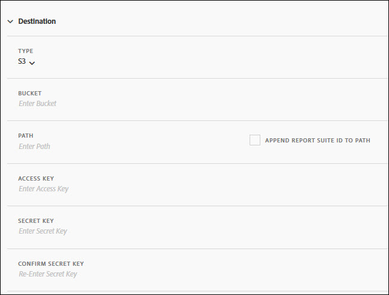

# Creare o modificare un feed dati

La creazione di un feed dati consente ad Adobe di sapere dove inviare i file di dati non elaborati e cosa si desidera includere in ciascun file. In questa pagina sono elencate le singole impostazioni che è possibile personalizzare durante la creazione di un feed di dati.

Prima di leggere questa pagina, è consigliabile conoscere i feed di dati. Consulta [Panoramica sui feed dati](data-feed-overview.md) per essere certo di soddisfare i requisiti per la creazione di un feed di dati.

## Campi Informazioni feed

* **Nome**: nome del feed di dati. Deve essere univoco all’interno della suite di rapporti selezionata e può contenere fino a 255 caratteri.
* **Suite di rapporti:** La suite di rapporti su cui si basa il feed di dati. Se vengono creati più feed di dati per la stessa suite di rapporti, devono avere definizioni di colonne diverse. Solo le suite di rapporti di origine supportano i feed di dati; le suite di rapporti virtuali non sono supportate.
* **E-mail al termine**: indirizzo e-mail da notificare al termine dell’elaborazione di un feed. L’indirizzo e-mail deve essere formattato correttamente.
* **Intervallo feed**: i feed orari contengono dati relativi a una sola ora. I feed giornalieri contengono dati relativi a un’intera giornata; includono dati da mezzanotte a mezzanotte nel fuso orario della suite di rapporti.
* **Ritarda elaborazione**: attendi un determinato periodo di tempo prima di elaborare un file di feed dati. Un ritardo può essere utile per dare alle implementazioni mobili l’opportunità ai dispositivi offline di connettersi e inviare dati. Può essere utilizzato anche per adattarsi ai processi lato server della tua organizzazione nella gestione dei file elaborati in precedenza. Nella maggior parte dei casi, non è necessario attendere. Un feed può essere ritardato fino a 120 minuti.
* **Date di inizio e fine**: la data di inizio indica la prima data in cui desideri un feed di dati. Imposta questa data nel passato per iniziare immediatamente a elaborare i feed di dati per i dati storici. I feed continuano l’elaborazione fino a raggiungere la data di fine. Le date di inizio e fine si basano sul fuso orario della suite di rapporti.
* **Alimentazione continua**: questa casella di controllo rimuove la data di fine, consentendo l’esecuzione indefinita di un feed. Al termine dell’elaborazione dei dati storici, un feed attende che i dati vengano raccolti per una determinata ora o giorno. Al termine dell’ora o del giorno corrente, l’elaborazione inizia dopo il ritardo specificato.

## Campi di destinazione

I campi disponibili nei campi di destinazione dipendono dal tipo di destinazione.

### FTP

I dati del feed dati possono essere inviati a un Adobe o a una posizione FTP ospitata dal cliente. Richiede un host FTP, un nome utente e una password. Utilizza il campo percorso per inserire i file di feed in una cartella. Le cartelle devono già esistere. I feed generano un errore se il percorso specificato non esiste.


### SFTP

È disponibile il supporto SFTP per i feed di dati. Richiede un host SFTP, un nome utente e il sito di destinazione per contenere una chiave pubblica RSA o DSA valida. Puoi scaricare la chiave pubblica adatta al momento della creazione del feed.


### S3

Puoi inviare feed direttamente ai bucket di Amazon S3. Questo tipo di destinazione richiede un nome bucket, un ID chiave di accesso e una chiave segreta. Consulta [Requisiti di denominazione del bucket Amazon S3](https://docs.aws.amazon.com/awscloudtrail/latest/userguide/cloudtrail-s3-bucket-naming-requirements.html) nella documentazione di Amazon S3 per ulteriori informazioni.



L’utente fornito per il caricamento dei feed di dati deve disporre dei seguenti elementi [autorizzazioni](https://docs.aws.amazon.com/AmazonS3/latest/API/API_Operations_Amazon_Simple_Storage_Service.html):

* s3:GetObject
* s3:PutObject
* s3:PutObjectAcl

   >[!NOTE]
   >
   >Per ogni caricamento in un bucket Amazon S3, [!DNL Analytics] aggiunge il proprietario del bucket all’ACL BucketOwnerFullControl, indipendentemente dal fatto che il bucket disponga di un criterio che lo richieda. Per ulteriori informazioni, consulta la sezione &quot;[Qual è l’impostazione BucketOwnerFullControl per i feed di dati Amazon S3?](df-faq.md#BucketOwnerFullControl)&quot;

Sono supportate le seguenti 16 aree geografiche standard di AWS (utilizzando l’algoritmo di firma appropriato, se necessario):

* us-east-2
* us-east-1
* us-west-1
* us-west-2
* ap-south-1
* ap-northeast-2
* ap-southeast-1
* ap-southeast-2
* ap-northeast-1
* ca-central-1
* eu-central-1
* eu-west-1
* eu-west-2
* eu-west-3
* eu-north-1
* sa-east-1

>[!NOTE]
>
>L&#39;area cn-north-1 non è supportata.

### BLOB di Azure

I feed di dati supportano le destinazioni BLOB di Azure. Richiede un contenitore, un account e una chiave. Amazon crittografa automaticamente i dati inattivi. Quando scarichi i dati, questi vengono decrittografati automaticamente. Consulta [Creare un account di archiviazione](https://docs.microsoft.com/en-us/azure/storage/common/storage-quickstart-create-account?tabs=azure-portal#view-and-copy-storage-access-keys) nei documenti di Microsoft Azure per ulteriori informazioni.


>[!NOTE]
>
>È necessario implementare un processo personalizzato per gestire lo spazio su disco nella destinazione del feed. Adobe non elimina dati dal server.

## Definizioni delle colonne dati

Sono disponibili tutte le colonne, indipendentemente dal fatto che contengano dati. Un feed di dati deve includere almeno una colonna.

* **Rimuovi caratteri di escape**: durante la raccolta dei dati, alcuni caratteri (come le nuove righe) possono causare problemi. Selezionare questa casella se si desidera rimuovere questi caratteri dai file di feed.
* **Formato di compressione**: tipo di compressione utilizzato. Gzip restituisce i file in `.tar.gz` formato. File di output Zip in `.zip` formato.
* **Tipo di imballaggio**: file singolo restituisce il `hit_data.tsv` file in un unico file, potenzialmente di grandi dimensioni. Più file impaginano i dati in blocchi da 2 GB (non compressi). Se sono selezionati più file e i dati non compressi per la finestra di reporting sono inferiori a 2 GB, viene inviato un file. L’Adobe consiglia di utilizzare più file per la maggior parte dei feed di dati.
* **Manifesto**: indica se Adobe deve consegnare o meno un [file manifesto](c-df-contents/datafeeds-contents.md#feed-manifest) alla destinazione quando non vengono raccolti dati per un intervallo di feed. Se selezioni File manifesto, riceverai un file manifesto simile al seguente quando non vengono raccolti dati:

```text
   Datafeed-Manifest-Version: 1.0
    Lookup-Files: 0
    Data-Files: 0
    Total-Records: 0
```

* **Modelli di colonna**: durante la creazione di molti feed di dati, l’Adobe consiglia di creare un modello di colonna. Quando si seleziona un modello di colonna, le colonne specificate vengono incluse automaticamente nel modello. Per impostazione predefinita, in Adobe sono inoltre disponibili diversi modelli.
* **Colonne disponibili**: tutte le colonne di dati disponibili in Adobe Analytics. Clic [!UICONTROL Add all] per includere tutte le colonne in un feed di dati.
* **Colonne incluse**: colonne da includere in un feed di dati. Clic [!UICONTROL Remove all] per rimuovere tutte le colonne da un feed di dati.
* **Scarica CSV**: scarica un file CSV contenente tutte le colonne incluse.
