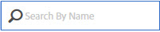

# Gestire i feed dati

La gestione dei feed di dati ti consente di creare, modificare ed eliminare feed di dati per la tua organizzazione. Se disponi delle autorizzazioni per accedere alla gestione dei feed di dati, puoi gestire i feed di dati per tutte le suite di rapporti visibili.

Ecco un video sull’interfaccia utente di gestione dei feed di dati:

>[!VIDEO](https://video.tv.adobe.com/v/25452/?quality=12)

Accedi alla gestione dei feed di dati seguendo questi passaggi:

1. Accedi a [experiencecloud.adobe.com](https://experiencecloud.adobe.com).
2. Fai clic sul menu a 9 griglia in alto a destra, quindi fai clic su [!UICONTROL Analytics].
3. Nel menu principale, fai clic su [!UICONTROL Admin] > [!UICONTROL Data Feeds].

## Navigazione nell’interfaccia

Quando si arriva alla pagina di gestione dei feed di dati, l’interfaccia è simile alla seguente:

Se non sono stati impostati feed, la pagina mostra un [!UICONTROL Create New Data Feed] pulsante .

### Filtri e ricerca

Utilizza i filtri e cerca per individuare il feed esatto che stai cercando.

All’estrema sinistra, fai clic sull’icona del filtro per mostrare o nascondere le opzioni di filtro. I filtri sono organizzati per categoria. Fare clic sulla freccia per comprimere o espandere le categorie di filtro. Fai clic sulla casella di controllo per applicare il filtro.

Utilizza la ricerca per individuare un feed in base al nome.

### Feed e processi

Fai clic sulla scheda Processi per visualizzare i singoli processi creati da ciascuno dei feed. Vedi [Gestire i processi di feed dati](df-manage-jobs.md).

### Add

Fai clic su + nelle schede dei feed e dei processi [!UICONTROL Add] per creare un nuovo feed. Vedi [Aggiungere un feed](create-feed.md) per ulteriori informazioni.

### Colonne

Ogni feed creato mostra diverse colonne che forniscono informazioni al riguardo. Fai clic su un’intestazione di colonna per ordinarla in ordine crescente. Fai nuovamente clic su un&#39;intestazione di colonna per ordinarla in ordine decrescente. Se non è possibile visualizzare una colonna specifica, fai clic sull’icona della colonna in alto a destra.

* **Nome feed**: Colonna obbligatoria. Visualizza il nome del feed.
* **ID feed**: Visualizza l&#39;ID feed, un identificatore univoco.
* **Suite di rapporti**: La suite di rapporti da cui il feed fa riferimento ai dati.
* **ID suite di rapporti**: Identificatore univoco della suite di rapporti.
* **Colonne dati**: Quali colonne di dati sono attive per il feed. Nella maggior parte dei casi, sono presenti troppe colonne da visualizzare in questo formato.
* **Intervallo**: Indica se il feed è a cadenza oraria o giornaliera.
* **Tipo di destinazione**: Il tipo di destinazione del feed. Ad esempio, FTP, Amazon S3 o Azure.
* **Host di destinazione**: Posizione in cui viene posizionato il file. Ad esempio, `ftp.example.com`.
* **Proprietario**: L’account utente che ha creato il feed.
* **Stato**: Lo stato del feed.
   * Attivo: Il feed è operativo.
   * Approvazione in sospeso: In alcuni casi, un feed richiede l’approvazione per Adobe prima di poter iniziare a generare processi.
   * Eliminato: Il feed viene eliminato.
   * Completa: Elaborazione del feed completata. Un feed completato può essere modificato, bloccato o annullato.
   * In sospeso: Il feed viene creato ma non è ancora attivo. I mangimi rimangono in questo stato per un breve periodo transitorio.
   * Inattivo: Equivalente allo stato &quot;sospeso&quot; o &quot;in attesa&quot;. Quando il feed viene riattivato, riprende a distribuire i processi da quando si è arrestato.
* **Ultima modifica**: Data dell’ultima modifica apportata al feed. La data e l’ora vengono visualizzate nel fuso orario della suite di rapporti con l’offset GMT.
* **Data di inizio**: Data del primo processo per questo feed. La data e l’ora vengono visualizzate nel fuso orario della suite di rapporti con l’offset GMT.
* **Data di fine**: Data dell&#39;ultimo processo per questo feed. I feed di dati in corso non hanno una data di fine.

## Azioni feed dati

Fai clic sulla casella di controllo accanto a un feed di dati per visualizzare le azioni disponibili.

* **Storico dei processi**: Visualizza tutti i processi associati ai feed di dati. Passa automaticamente alla [interfaccia gestione processi](df-manage-jobs.md).
* **Elimina**: Elimina il feed di dati, impostandone lo stato su [!UICONTROL Deleted].
* **Copia**: Consente di [creare un nuovo feed](create-feed.md) con tutte le impostazioni del feed corrente. Non è possibile copiare un feed di dati se sono selezionati più di uno.
* **Pausa**: Interrompe l’elaborazione del feed, impostandone lo stato su [!UICONTROL Inactive].
* **Attiva**: Disponibile solo per i feed inattivi. Raccoglie i dati di elaborazione nel punto in cui sono stati interrotti, restituendo eventuali date.
