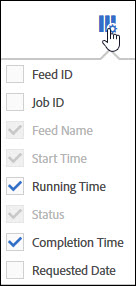

# Gestire i lavori sui feed dati

I processi sono singole attività che producono un file compresso. Vengono creati e gestiti da feed.

Accedi alla gestione dei processi del feed dati seguendo questi passaggi:

1. Accedi a [experiencecloud.adobe.com](https://experiencecloud.adobe.com).
2. Fai clic sul menu a 9 griglia in alto a destra, quindi fai clic su [!UICONTROL Analytics].
3. Nel menu principale, fai clic su [!UICONTROL Admin] > [!UICONTROL Data Feeds].
4. Fai clic sulla scheda Processi nella parte superiore.

## Navigazione nell’interfaccia

Un processo di feed di dati è una singola istanza in cui Adobe elabora e genera un file compresso per un dato intervallo di reporting. Il job manager fornisce una visualizzazione più dettagliata per visualizzare lo stato dei singoli job.

### Filtri e ricerca

Utilizza i filtri e cerca per individuare il lavoro esatto che stai cercando.

All’estrema sinistra, fai clic sull’icona del filtro per mostrare o nascondere le opzioni di filtro. I filtri sono organizzati per categoria. Fare clic sulla freccia per comprimere o espandere le categorie di filtro. Fai clic sulla casella di controllo per applicare il filtro.

Utilizzare la ricerca per individuare un processo in base al nome.

### Feed e processi

Fai clic sulla scheda Feed per visualizzare i feed generali che creano questi processi. Vedi [Gestire i feed dati](df-manage-feeds.md).

### Colonne

Ogni processo mostra diverse colonne che forniscono informazioni su di esso. Fai clic su un’intestazione di colonna per ordinarla in ordine crescente. Fai nuovamente clic su un&#39;intestazione di colonna per ordinarla in ordine decrescente. Se non è possibile visualizzare una colonna specifica, fai clic sull’icona della colonna in alto a destra.

* **ID feed**: Visualizza l&#39;ID feed, un identificatore univoco. I processi creati dallo stesso feed hanno lo stesso ID feed.
* **ID processo**: Identificatore univoco per il processo. Tutti i processi hanno un ID processo diverso.
* **Nome feed**: Colonna obbligatoria. Visualizza il nome del feed. I processi creati dallo stesso feed hanno lo stesso nome feed.
* **Suite di rapporti**: La suite di rapporti da cui il processo fa riferimento ai dati.
* **ID suite di rapporti**: Identificatore univoco della suite di rapporti.
* **Ora di inizio**: Ora di inizio del lavoro. La data e l’ora vengono visualizzate nel fuso orario della suite di rapporti con l’offset GMT. I feed giornalieri in genere iniziano vicino a mezzanotte nel fuso orario della suite di rapporti.
* **Stato**: Lo stato del feed.
   * In attesa di dati: Il processo è operativo e vengono raccolti i dati per l&#39;intervallo di reporting.
   * Elaborazione: Il processo sta creando i file di dati e si sta preparando per inviarli.
   * Completato: Il lavoro è stato completato senza alcun problema.
   * Non riuscito: Il processo non è stato completato. Vedi [Risoluzione dei problemi dei feed dati](troubleshooting.md) per determinare la causa dell&#39;errore.
   * In attesa di esportazione: I dati per l’intervallo di reporting non sono ancora stati elaborati completamente.
   * Nessun dato: Nella suite di rapporti non sono presenti dati per l&#39;intervallo di reporting richiesto.
* **Tempo di completamento**: Il momento in cui il lavoro è finito. La data e l’ora vengono visualizzate nel fuso orario della suite di rapporti con l’offset GMT.
* **Data richiesta**: Intervallo di reporting del file. I feed giornalieri generalmente mostrano dalle 00:00 alle 23:59 con uno scostamento GMT, indicando un giorno completo in base al fuso orario della suite di rapporti. I feed orari mostrano l’ora individuale per cui si svolge il lavoro.
