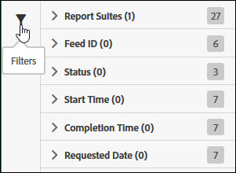

# Gestire i lavori sui feed dati

I processi sono singole attività che producono un file compresso. Vengono creati e gestiti da feed.

Accedi alla gestione dei processi di feed di dati eseguendo la procedura seguente:

1. Effettuate l&#39;accesso a [Experience ecCloud.adobe.com](https://experiencecloud.adobe.com).
2. Fare clic sul menu a 9 griglia in alto a destra, quindi fare clic [!UICONTROL Analytics].
3. In the top menu, click [!UICONTROL Admin] > [!UICONTROL Data Feeds].
4. Fate clic sulla scheda Processi nella parte superiore.

## Navigazione nell’interfaccia

Un processo di feed di dati è una singola istanza in cui Adobe elabora e produce un file compresso per una determinata finestra di reporting. Il manager dell’attività offre una vista più dettagliata per visualizzare lo stato dei singoli processi.

### Filtri e ricerche

Utilizzate i filtri e cercate per individuare esattamente il lavoro che state cercando.

A sinistra, fate clic sull&#39;icona del filtro per mostrare o nascondere le opzioni di filtro. I filtri sono organizzati per categoria. Fate clic sulla freccia per comprimere o espandere le categorie di filtri. Fate clic sulla casella di controllo per applicare il filtro.

Utilizzate la ricerca per individuare un processo in base al nome.

### Feed e processi

Fate clic sulla scheda Feed per visualizzare i feed di livello generale che creano tali processi. See [Manage data feeds](df-manage-feeds.md).

### Colonne

Ogni processo mostra diverse colonne con informazioni al riguardo. Fate clic sull’intestazione di una colonna per ordinarla in ordine crescente. Fate di nuovo clic sull’intestazione di una colonna per ordinarla in ordine decrescente. Se non è possibile visualizzare una colonna specifica, fate clic sull&#39;icona della colonna in alto a destra.

* **ID** feed: Visualizza l&#39;ID feed, un identificatore univoco. I processi creati dallo stesso feed hanno lo stesso ID feed.
* **ID** processo: Un identificatore univoco per il processo. Tutti i processi hanno un ID processo diverso.
* **Nome** feed: Colonna obbligatoria. Visualizza il nome del feed. I processi creati dallo stesso feed hanno lo stesso nome feed.
* **Suite** di rapporti: La suite di rapporti da cui i dati di riferimento del processo sono riportati.
* **ID** suite di rapporti: Identificatore univoco della suite di rapporti.
* **Ora** inizio: Ora di inizio del processo. La data e l&#39;ora sono visualizzate nel fuso orario della suite di rapporti con l&#39;offset GMT. I feed giornalieri in genere iniziano vicino a mezzanotte nel fuso orario della suite di rapporti.
* **Stato**: Stato del feed.
   * In attesa di dati: Il processo è operativo e i dati per la finestra di rapporto vengono raccolti.
   * Elaborazione: Il processo sta creando i file di dati e si sta preparando per inviarli.
   * Completato: Il processo è stato completato senza problemi.
   * Non riuscito: Il processo non è stato completato. Consultate [Risoluzione dei problemi dei processi](jobs-troubleshooting.md) per determinare la causa dell’errore.
   * In attesa di esportazione: I dati per la finestra di rapporto non sono ancora stati elaborati completamente.
   * Nessun dato: Nella suite di rapporti non sono presenti dati per la finestra di reporting richiesta.
* **Tempo** completamento: L&#39;ora in cui il lavoro è finito. La data e l&#39;ora sono visualizzate nel fuso orario della suite di rapporti con l&#39;offset GMT.
* **Data** richiesta: La finestra del rapporto del file. I feed giornalieri generalmente mostrano 00:00 - 23:59 con un offset GMT, indicando un giorno intero in base al fuso orario della suite di rapporti. I feed orari mostrano l’ora individuale per cui il lavoro è destinato.
