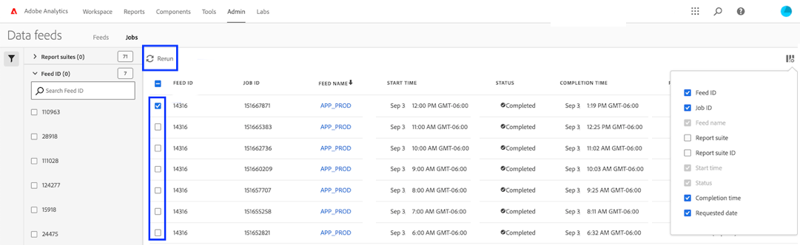

# Risoluzione dei problemi dei feed dati

Determinare i possibili motivi per cui un processo potrebbe non riuscire a elaborare o consegnare.

## Risolvere i problemi relativi a un feed dati esistente

Se un feed di dati funziona correttamente su base oraria o giornaliera ma di recente ha esito negativo, verifica quanto segue:

* Utilizzare lo strumento [Stato Adobe](https://status.adobe.com/en/experience_cloud) per determinare se sono presenti finestre di manutenzione pianificate o problemi di disponibilità. Se al momento è presente un problema noto, Adobe elabora automaticamente i feed di dati pianificati una volta ripristinato il servizio.
* Assicurati che ci sia abbastanza spazio disponibile sul sito FTP. Se lo spazio su disco del sito FTP è insufficiente, eliminare alcuni file dal server per liberare spazio per i nuovi file.
* Se non sono presenti problemi noti e il sito FTP dispone di spazio su disco sufficiente, puoi inviare nuovamente il feed di dati.

   1. Accedi ad Adobe Analytics e passa a **[!UICONTROL Admin]** > **[!UICONTROL Data feeds]**.
   2. Individua i feed di dati desiderati, quindi fai clic sulla casella di controllo accanto a ciascuno di essi che desideri rieseguire.
   3. Fai clic su **[!UICONTROL Rerun]**.

  

Se ancora non ricevi i file dei feed dati dopo averli rieseguiti, contatta l’Assistenza clienti.

## Risolvere i problemi relativi a un nuovo feed dati

Se un nuovo feed di dati genera un errore, risolvi il problema caricando manualmente un file di test sul sito FTP. Nella maggior parte dei casi, è possibile determinare il punto di errore utilizzando questi passaggi.

1. Accedi al tuo sito FTP utilizzando Esplora file (Windows) o Finder (Mac). Assicurarsi di utilizzare il protocollo FTP (`ftp://`) e di consentire [indirizzi IP di Adobe](/help/technotes/ip-addresses.md) tramite il firewall dell&#39;organizzazione. Se non riesci a raggiungere il sito FTP, rivolgiti al proprietario del sito FTP per determinare la destinazione corretta.

   

2. Viene visualizzata una finestra a comparsa che richiede un nome utente e una password. Immetti le credenziali di autenticazione. Se le credenziali vengono accettate, la finestra mostra il contenuto corrente sul sito FTP. Se le credenziali non vengono accettate, rivolgiti al proprietario FTP per assicurarti che il nome utente e la password siano corretti. Se utilizzi SFTP, assicurati di seguire ogni passaggio nella [guida SFTP](../ftp-and-sftp/c-sftp/ftp-sftp.md). Tieni presente che Adobe non supporta tutti i casi di utilizzo di SFTP.
3. Carica un file sul sito FTP trascinandolo nella finestra autenticata. Qualsiasi immagine o documento di testo è adeguato. Se ricevi un errore durante il tentativo di inserire un file nel sito FTP, rivolgiti al proprietario FTP per verificare che lo spazio su disco sia sufficiente e che il nome utente disponga delle autorizzazioni di scrittura per il sito FTP.
4. Dopo aver confermato che il file si trova sul sito FTP, puoi eliminare il file caricato nel passaggio precedente.

Se tutti i passaggi precedenti funzionano e ricevi comunque un errore FTP, contatta l’Assistenza clienti.
