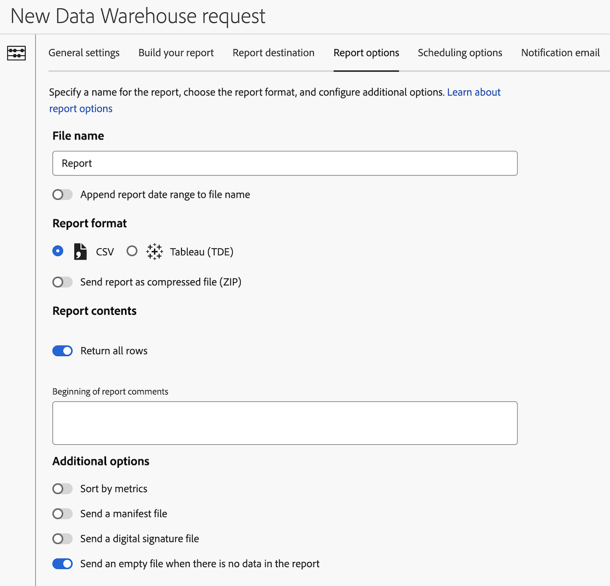

# Configurare le opzioni di rapporto per una richiesta Data Warehouse

Durante la creazione di una richiesta di Data Warehouse, sono disponibili varie opzioni di configurazione. Le informazioni seguenti descrivono come configurare le opzioni di rapporto per la richiesta.

Per informazioni su come iniziare a creare una richiesta, nonché collegamenti ad altre importanti opzioni di configurazione, consulta [Creare una richiesta di Data Warehouse](/help/export/data-warehouse/create-request/t-dw-create-request.md).

Per configurare le opzioni di report per una richiesta Data Warehouse:

1. Se non l’hai ancora fatto, inizia a creare una richiesta in Adobe Analytics selezionando **[!UICONTROL Tools]** > **[!UICONTROL Data Warehouse]** > [!UICONTROL **Aggiungi**].

   Per ulteriori dettagli, consulta [Creare una richiesta di Data Warehouse](/help/export/data-warehouse/create-request/t-dw-create-request.md).

1. Nella pagina Nuova richiesta Data Warehouse, seleziona la scheda [!UICONTROL **Opzioni report**].

    <!-- update screenshot to include Sort by metrics -->

1. Completa i campi seguenti:

   | Opzione | Funzione |
   |---------|----------|
   | [!UICONTROL **Nome file**] | Identifica il rapporto. 
Impossibile salvare la richiesta se nel nome file viene utilizzato uno dei seguenti caratteri speciali: <code>! &quot; # $ &amp; &#39; ( ) * + , / : ; > = &lt; ? @ [ ] \ ^ ` { } \| ~</code> 

Il carattere % può essere utilizzato solo se è seguito da &quot;R&quot;, &quot;rsid&quot; o &quot;id&quot;, come segue: <code>%R</code>, <code>%rsid</code>, e <code>%id</code>.
 |
   | [!UICONTROL **Aggiungi intervallo di date del report al nome file**] | Aggiunge l’intervallo di date al nome del file del rapporto. 
Ad esempio, se richiedi dati dal 1° maggio 2024 al 7 maggio 2024, il nome del file includerà l’intervallo di date 20240501 - 20240507.
 |
   | [!UICONTROL **CSV**] | Fornisce rapporti in formato CSV per la visualizzazione dei dati in un foglio di calcolo. |
   | [!UICONTROL **Tableau (TDE)**] | Fornisce rapporti in formato TDE (Tableau Data Extract), che può essere utilizzato per visualizzare dati e livelli in dati aggiuntivi all’interno di Tableau. |
   | [!UICONTROL **Invia report come file compresso (ZIP)**] | Fornisce rapporti in formato file compresso (ZIP). È consigliabile abilitare questa opzione quando si utilizza la posta elettronica come [destinazione report](/help/export/data-warehouse/create-request/dw-request-report-destinations.md). |
   | [!UICONTROL **Restituisci tutte le righe**] | Quando questa opzione è attivata, tutte le righe vengono incluse nel rapporto. Disattiva questa opzione per specificare il numero di righe da includere. |
   | [!UICONTROL **Inizio dei commenti del report**] | Aggiungere i commenti che si desidera includere nel report. I commenti vengono visualizzati all&#39;inizio del report. |
   | [!UICONTROL **Ordina per metriche**] | Fornisce rapporti con raggruppamenti classificati in Data Warehouse, ordinati per valore di metrica decrescente. L’ordinamento per metrica semplifica l’interpretazione dei rapporti di Data Warehouse e il confronto con altre visualizzazioni di rapporti di suddivisione di Analytics.
Per ulteriori informazioni, vedere [Ordinare per metrica](/help/export/data-warehouse/sorting-by-metric.md).
 |
   | [!UICONTROL **Invia un file manifesto**] | Include metadati sui file inclusi nel report.<!-- What kind of metadata is included in the manifest file? --> |
   | [!UICONTROL **Invia un file di firma digitale**] | Consente ai destinatari dei rapporti di verificare che il file provenga da Adobe e che non sia stato modificato. |
   | [!UICONTROL **Invia un file vuoto quando non sono presenti dati nel report**] | Invia un report anche quando il report non contiene dati. |

   {style="table-layout:auto"}

1. Continua a configurare la richiesta Data Warehouse nella scheda [!UICONTROL **Opzioni di pianificazione**]. Per ulteriori informazioni, vedere [Configurare le opzioni di pianificazione per una richiesta Data Warehouse](/help/export/data-warehouse/create-request/dw-request-scheduling.md).
