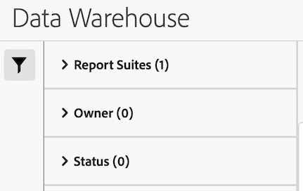

# Gestire le richieste di Data Warehouse

{{release-limited-testing}}

>[!NOTE]
>
>Se la tua organizzazione non dispone ancora della nuova esperienza Data Warehouse, che sarà presto disponibile per tutti i clienti, utilizza le informazioni in [Gestire le richieste Data Warehouse (vecchia esperienza)](#manage-data-warehouse-requests-old-experience) in fondo alla pagina.

Puoi gestire le richieste Data Warehouse che hai effettuato. Le sezioni seguenti descrivono le attività che è possibile eseguire durante la gestione delle richieste. <!-- just those you have made? I think you can see other people's requests (you can filter by them). What can you do with other people's requests? Just view them?-->

## Visualizzare richieste

1. In Adobe Analytics, seleziona [!UICONTROL **Strumenti**] > [!UICONTROL **Data Warehouse**].

   Nella pagina Data Warehouse vengono visualizzate tutte le richieste effettuate. <!-- just those you have made? -->I dati vengono visualizzati in ogni colonna. È possibile [configurare le colonne](#configure-columns) sono visibili.

   <!-- add screenshot of main page -->

<!-- describe columns? -->

1. (Facoltativo) Fai clic sul nome della richiesta per visualizzare una finestra di dialogo contenente le seguenti informazioni: <!-- Check this -->

   * Quando una richiesta ha iniziato l’elaborazione

   * Tariffa limitata: l’organizzazione ha troppe richieste Data Warehouse in esecuzione. La richiesta viene sospesa fino al completamento di altre richieste di dati.

## Modificare le richieste

Quando modifichi le richieste, tieni presente quanto segue:

* È possibile modificare solo le richieste configurate per l’esecuzione in una pianificazione.

* Non tutti i campi associati alla richiesta possono essere modificati. I campi che non possono essere modificati vengono oscurati.

Per modificare una richiesta pianificata:

1. In Adobe Analytics, seleziona [!UICONTROL **Strumenti**] > [!UICONTROL **Data Warehouse**].

1. Nella pagina Data Warehouse, seleziona la richiesta da modificare.

   

1. Seleziona [!UICONTROL **Modifica**].

1. Modifica la richiesta come desideri. Impossibile modificare le opzioni di configurazione disattivate.

   Per informazioni su ciascuna opzione di configurazione, vedi [Creare una richiesta Data Warehouse](/help/export/data-warehouse/create-request/t-dw-create-request.md).

1. Seleziona [!UICONTROL **Salva modifiche**].

## Visualizzare la cronologia di una richiesta

Puoi visualizzare la cronologia di qualsiasi richiesta Data Warehouse effettuata.

1. In Adobe Analytics, seleziona [!UICONTROL **Strumenti**] > [!UICONTROL **Data Warehouse**].

1. Nella pagina Data Warehouse, seleziona la richiesta di cui desideri visualizzare la cronologia.

   

1. Seleziona [!UICONTROL **Visualizza cronologia**].

   Il [!UICONTROL **Visualizza richiesta Data Warehouse**] In questa pagina viene visualizzato un elenco delle singole consegne di rapporti associate alla richiesta.

   Seleziona la **Configura colonna** icona  per nascondere le colonne o visualizzarne altre non visualizzate per impostazione predefinita.

   

   Sono disponibili le seguenti colonne:

   | Colonna | Descrizione |
   |---------|----------|
   | [!UICONTROL **Data di creazione**] | La data e l’ora di creazione del rapporto.
Viene visualizzato nel fuso orario dell’utente che ha avviato la richiesta.
 |
   | [!UICONTROL **Data di inizio**] | Data e ora di inizio del report.
Viene visualizzato nel fuso orario dell’utente che ha avviato la richiesta.
 |
   | [!UICONTROL **Data di completamento**] | La data e l’ora in cui è stato completato il rapporto.
Viene visualizzato nel fuso orario dell’utente che ha avviato la richiesta.
 |
   | [!UICONTROL **Data aggiornamento**] | La data e l’ora dell’ultimo aggiornamento del rapporto.
Viene visualizzato nel fuso orario dell’utente che ha avviato la richiesta.
 |
   | [!UICONTROL **Stato**] | Stato della consegna del rapporto. Gli stati possibili sono:<ul><li>[!UICONTROL **Creato**]: il rapporto è stato creato ma non ancora elaborato.</li><li>[!UICONTROL **In sospeso**]: report in attesa di elaborazione.</li><li>[!UICONTROL **Elaborazione**]: report in fase di elaborazione.</li><li>[!UICONTROL **Completato**]: il rapporto è stato completato ed è ora disponibile.</li><li>[!UICONTROL **Pianificato**]: il rapporto è pianificato ma non è ancora iniziato.</li><li>[!UICONTROL **Annullato**]: rapporto annullato dall’utente.</li><li>[!UICONTROL **Errore: elaborazione**:] Il report ha riscontrato un errore e non è stato possibile elaborarlo.</li><li>[!UICONTROL **Errore - Impossibile Inviare**]: report generato correttamente ma non consegnato. Controlla la [configurazione della destinazione](/help/export/data-warehouse/create-request/dw-request-report-destinations.md), quindi invia nuovamente il rapporto.</li></ul>. |
   | [!UICONTROL **Da**] | Data di inizio dell’intervallo di tempo complessivo incluso nel rapporto.
Viene visualizzato nel fuso orario della suite di rapporti.
 |
   | [!UICONTROL **Su**] | Data di fine dell’intervallo di tempo complessivo incluso nel rapporto. 
Viene visualizzato nel fuso orario della suite di rapporti.
 |
   | [!UICONTROL **ID richiesta legacy**] | ID utilizzato per identificare un report nell&#39;interfaccia Data Warehouse legacy. Questo ID potrebbe essere necessario quando si contatta l’Assistenza clienti Adobe. |
   | [!UICONTROL **ID report**] | ID utilizzato per identificare un report nell&#39;interfaccia Data Warehouse corrente. Questo ID potrebbe essere necessario quando si contatta l’Assistenza clienti Adobe. |

1. Seleziona una consegna di rapporti, quindi seleziona una delle seguenti opzioni:

   | Opzione | Funzione |
   |---------|----------|
   | [!UICONTROL **Dettagli della destinazione**] | Mostra i dettagli dell’account e dell’ubicazione associati alla richiesta. Questo è l’account e la posizione configurati in precedenza, come descritto in [Configurare una destinazione di rapporto per una richiesta Data Warehouse](/help/export/data-warehouse/create-request/dw-request-report-destinations.md). |
   | [!UICONTROL **Annulla rapporto**] | Annulla il report. Non è possibile annullare rapporti con stato [!UICONTROL **Completato**] o [!UICONTROL **Annullato**]. |
   | [!UICONTROL **Riesegui report**] | Esegue nuovamente il report con i dati così come erano quando è stato inviato originariamente. È possibile eseguire nuovamente un report con uno dei seguenti stati: [!UICONTROL **Annullato**], [!UICONTROL **Completato**], [!UICONTROL **Errore: elaborazione**], o [!UICONTROL **Errore - Impossibile Inviare**]. |
   | [!UICONTROL **Invia di nuovo il rapporto**] | Invia nuovamente il file del report generato in precedenza. È possibile inviare nuovamente un report con uno dei seguenti stati: [!UICONTROL **Completato**] o [!UICONTROL **Errore - Impossibile Inviare**]. |

## Copiare le richieste

Quando copi una richiesta, tutte le opzioni di configurazione vengono copiate dalla richiesta originale.

1. In Adobe Analytics, seleziona [!UICONTROL **Strumenti**] > [!UICONTROL **Data Warehouse**].

1. Nella pagina Data Warehouse, seleziona la richiesta da copiare.

   

1. Seleziona [!UICONTROL **Copia**].

   Viene visualizzata la pagina Copia richiesta Data Warehouse. Tutte le opzioni di configurazione vengono copiate dalla richiesta originale.

1. Aggiorna le opzioni di configurazione associate alla richiesta.

   Per informazioni su ciascuna opzione di configurazione, vedi [Creare una richiesta Data Warehouse](/help/export/data-warehouse/create-request/t-dw-create-request.md).

1. Seleziona [!UICONTROL **Salva modifiche**].

## Annulla richieste

È possibile annullare solo le richieste configurate per l’esecuzione secondo una pianificazione.

Per annullare una richiesta pianificata:

1. In Adobe Analytics, seleziona [!UICONTROL **Strumenti**] > [!UICONTROL **Data Warehouse**].

1. Nella pagina Data Warehouse, seleziona la richiesta da modificare.

   

1. Seleziona [!UICONTROL **Annulla**].

   La richiesta non verrà più eseguita all&#39;ora pianificata.

## Configurare le colonne

Puoi configurare le informazioni visualizzate per ogni richiesta aggiungendo o rimuovendo colonne.

1. Seleziona la **Configurare le colonne** in alto a destra nella pagina Data Warehouse.

   

   Sono disponibili le seguenti colonne:

   | Colonna disponibile | Descrizione |
   |---------|----------|
   | Nome richiesta | Nome della persona che ha creato la richiesta. |
   | Suite di rapporti | La suite di rapporti associata alla richiesta. |
   | Richiesto da | Utente che ha creato la richiesta. |
   | Data richiesta | Data in cui è stata effettuata la richiesta. |
   | Stato | Sono disponibili i seguenti stati:<ul><li>
**Completato**: richiesta eseguita correttamente.
</li><li>
**Annullato**: la richiesta è stata annullata dall’utente.
</li><li>
**Pianificato**: la richiesta è configurata per l’esecuzione su una pianificazione.
</li><!-- Are there other statuses? Failed? --> |

   {style="table-layout:auto"}

1. Assicurati che tutte le colonne che desideri visualizzare siano selezionate. Le colonne selezionate vengono visualizzate nella pagina Data Warehouse e le relative informazioni.

## Filtrare e ordinare le richieste

1. Seleziona la **Filtro** nella barra a sinistra della pagina Data Warehouse.

   

1. Espandi [!UICONTROL **Suite di rapporti**], [!UICONTROL **Proprietario**], o [!UICONTROL **Stato**] , quindi seleziona come filtrare le richieste.

## Cercare le richieste

1. Nel campo di ricerca nella parte superiore della pagina Data Warehouse, specifica il nome della richiesta da visualizzare.

   Le richieste vengono filtrate durante la digitazione.

## Gestire le richieste Data Warehouse (vecchia esperienza)

>[!NOTE]
>
>Le informazioni seguenti si applicano solo se l’organizzazione non dispone ancora della nuova esperienza Data Warehouse, che sarà presto disponibile per tutti i clienti Analytics.

La gestione richieste consente di visualizzare, duplicare e ridefinire le priorità delle richieste.

In Data Warehouse, seleziona la **[!UICONTROL Request Manager]** scheda.

Questa scheda consente di:

* Visualizza le richieste di rapporti recenti per nome rapporto, segmento applicato, richiedente, data richiesta e stato.
* Richieste duplicate. Clic **[!UICONTROL Duplicate]** accanto alla richiesta.

  >[!NOTE]
  >
  >Questa azione duplica solo la richiesta, non la pianificazione o i dettagli di consegna.

* Cerca i report per nome report o per nome di accesso del richiedente.
* Riassegna la priorità ai rapporti trascinandoli e rilasciandoli in una nuova posizione all’interno della coda.
* Per vedere quando ha iniziato l’elaborazione di una richiesta, fai clic su un ID di richiesta pianificato ed esamina il pop-up che si apre.

Fai clic su un processo per visualizzarne le singole richieste.

* Tariffa limitata: l’organizzazione ha troppe richieste Data Warehouse in esecuzione. La richiesta viene sospesa fino al completamento di altre richieste di dati.